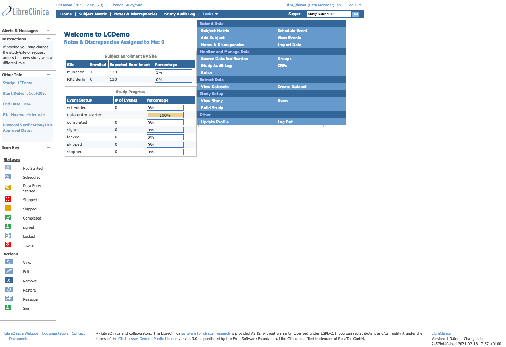
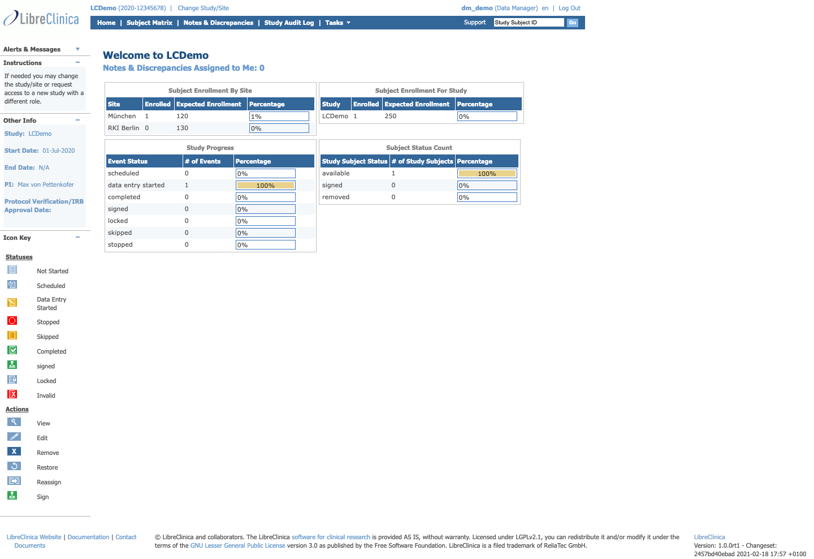
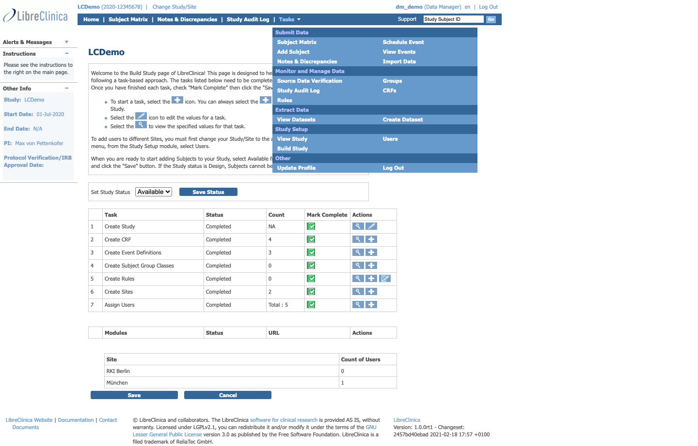
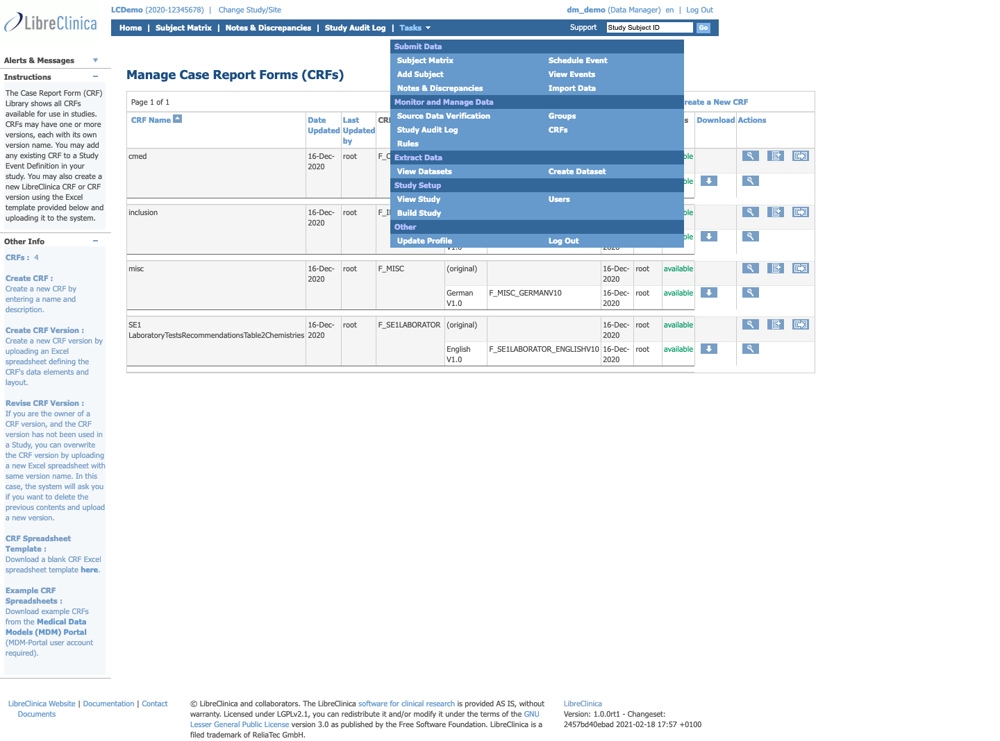
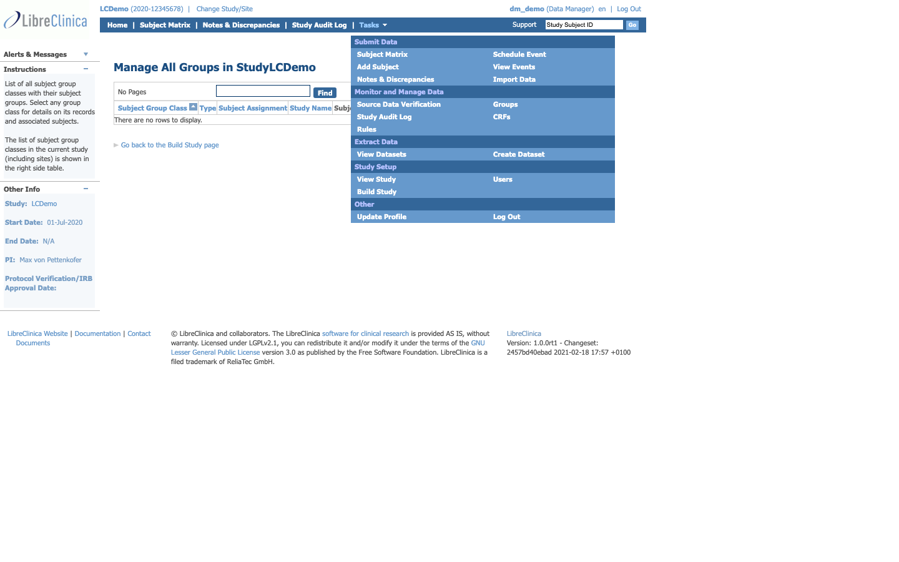
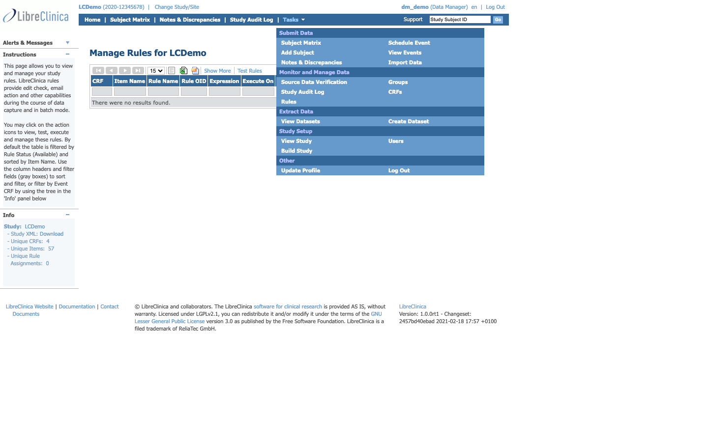
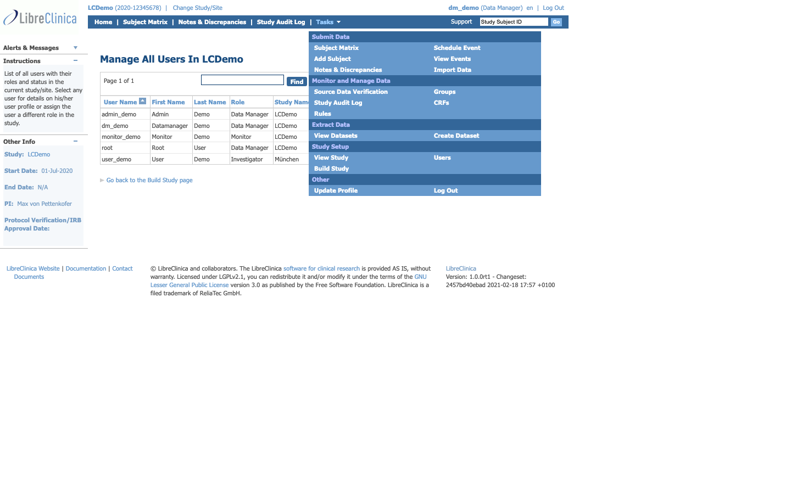
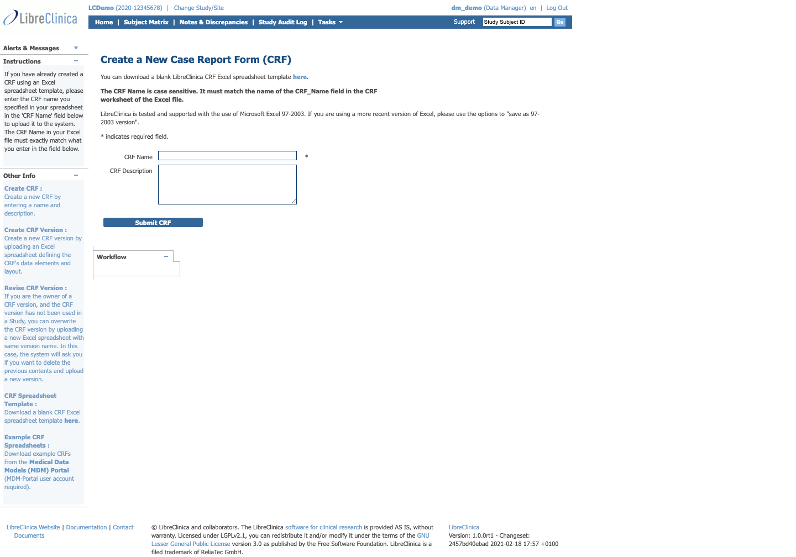
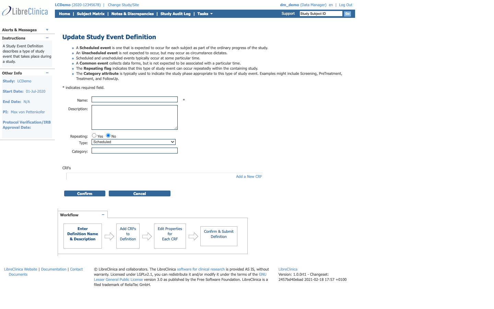
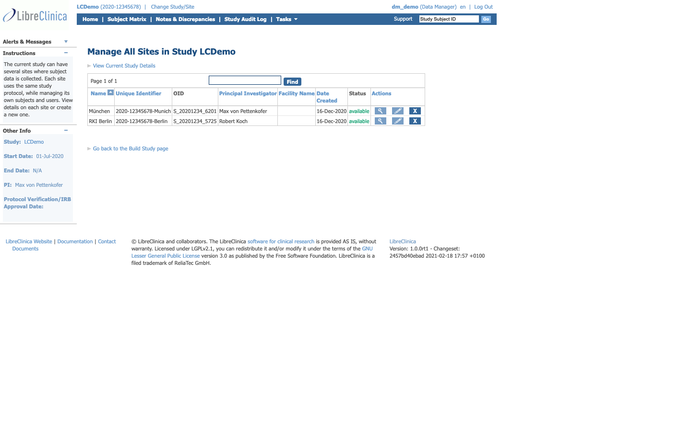

# Phase E — Data Manager role UI feature catalogue

**Source:** live walkthrough of `libreclinica.reliatec.de/lc-demo01` as `dm_demo` (role: Data Manager), 2026-05-28, cross-referenced with [web.xml](../../../../web/src/main/webapp/WEB-INF/web.xml) servlet mappings and the existing — much thinner — [administrator manual](../../../manuals/administrator-manual.md).

**Purpose:** baseline inventory for the Phase E SPA rewrite. The Data Manager role has **the broadest surface area** in LibreClinica: study setup, CRF design upload, event definitions, rules, user/role assignment, plus everything the Investigator and Monitor can do. The official upstream manuals only thinly cover this role — most of the catalogue below is derived from the live walk and the source code.

> The **Data Manager** is not the same as the **Administrator** (system role). System Administration (datainfo.properties, 2FA, LDAP) is documented in [administrator-manual.md](../../../manuals/administrator-manual.md). The Data Manager role described here operates **inside a study** and does not configure the system itself.

---

## 1. Authentication

Same flow as the other roles — see [investigator-features.md §1](investigator-features.md#1-authentication--profile).

---

## 2. Top navigation (Data Manager)

Captured live for `dm_demo`:

| Position | Label | URL | Backing servlet |
|---|---|---|---|
| Header-left | Study "LCDemo" | `/ViewStudy?id=3&viewFull=yes` | `control.admin.ViewStudyServlet` |
| Header-left | Change Study/Site | `/ChangeStudy` | `control.login.ChangeStudyServlet` |
| Header-right | `dm_demo (Data Manager) en` | `/UpdateProfile` | `control.login.UpdateProfileServlet` |
| Header-right | Log Out | `/j_spring_security_logout` | Spring Security |
| Top nav | Home | `/MainMenu` | `control.MainMenuServlet` |
| Top nav | Subject Matrix | `/ListStudySubjects` | `control.submit.ListStudySubjectsServlet` |
| Top nav | Notes & Discrepancies | `/ViewNotes?module=submit` | `control.managestudy.ViewNotesServlet` |
| Top nav | **Study Audit Log** | `/StudyAuditLog` | `control.managestudy.StudyAuditLogServlet` |
| Top nav | Tasks ▾ | — | (rendered client-side) |
| Top nav | Subject Subject ID search | `/ListStudySubjects` (GET) | same servlet |

**Differences vs Monitor / Investigator top nav:**

- ➕ **Study Audit Log** elevated to primary nav (Monitor reaches it via Tasks)
- ➖ **SDV** removed from primary nav (still in Tasks dropdown — DM oversees but doesn't drive day-to-day SDV)
- ➖ **Add Subject** removed from primary nav (still in Tasks dropdown — DM rarely adds subjects directly)

### Tasks dropdown (Data Manager — the complete menu)

All five sections — this is the full menu visible only at this role:

- **Submit Data** — Subject Matrix · Add Subject · Notes & Discrepancies · Schedule Event · View Events · Import Data
- **Monitor and Manage Data** — Source Data Verification · Study Audit Log · Groups · CRFs · Rules
- **Extract Data** — View Datasets · Create Dataset
- **Study Setup** — View Study · Build Study · Users
- **Other** — Update Profile · Log Out

**Data-Manager-exclusive items** (not visible to Investigator or Monitor):

- Build Study, Users (Study Setup section)
- Groups, CRFs, Rules (Monitor and Manage Data section)

---

## 3. Home dashboard

- **URL:** `/MainMenu`
- **Same sidebar as other roles** plus a more prominent Study/Site context (no site since `dm_demo` operates at study level)
- **Main area:** Welcome message, "Notes & Discrepancies Assigned to Me: N", embedded Subject Matrix
- **Critical observation:** the home does **not** automatically surface Build Study progress, despite that being the DM's primary workflow. The SPA could improve this — see §14.

---

## 4. Build Study — the primary DM workflow

The Build Study page is the **central study-setup task tracker**. It's the page upstream documentation refers to most when describing study creation, but it's barely covered in the existing institutional manual.

- **URL:** `/pages/studymodule`
- **Controller:** Spring MVC (configured in [pages-servlet.xml](../../../../web/src/main/webapp/WEB-INF/pages-servlet.xml))
- **POST endpoint:** `studymodule` (form action)
- **Form fields captured:** `studyStatus`, `saveStudyStatus`, `study`, `crf`, `eventDefinition`, `subjectGroup`, `rule`, `site`, `users`, `submitEvent`, `cancel`
- **H1:** the study name (e.g. "LCDemo")
- **Welcome instruction text:** "Welcome to the Build Study page of LibreClinical. This page is designed to walk you through the process of building a study following a task-based approach. The tasks listed below need to be completed before you can start using the Study..."

### 4.1 The 7-task workflow (observed on LCDemo)

| # | Task | Status | Count | Mark Complete | Per-task Actions (icons) |
|---|---|---|---|---|---|
| 1 | Create Study | Completed | NA | ✓ | Edit / View |
| 2 | Create CRF | Completed | 4 | ✓ | Edit / View / Add CRF |
| 3 | Create Event Definitions | Completed | 3 | ✓ | Edit / View / Add Event Def |
| 4 | Create Subject Group Classes | Completed | 0 | ✓ | Edit / View / Add Group |
| 5 | Create Rules | Completed | 0 | ✓ | Edit / View / Add Rule |
| 6 | Create Sites | Completed | 2 | ✓ | Edit / View / Add Site |
| 7 | Assign Users | Completed | Total: 5 | ✓ | Edit / View / Assign |

- Each task's row has the "Mark Complete" checkbox + Actions column with edit / view / add icons
- Tasks 2–5 also link out to the dedicated Manage views (CRFs, Event Definitions, Groups, Rules — covered below)
- **Set Study Status dropdown** at the top: Available, Pending, Frozen, Locked (etc.) → "Save Status" button updates `study.status`

### 4.2 Sites sub-section (within Build Study)

The lower portion of Build Study shows site-level configuration:

| Site | Status | URL | Count of Users |
|---|---|---|---|
| RKI Berlin | (status) | (link) | 0 |
| München | (status) | (link) | 1 |

Sites can also be reached via View Study → Sites tab; but **creating** sites happens here.

---

## 5. View Study (read + edit)

- **URL:** `/ViewStudy?id=<n>&viewFull=yes`
- **Servlet:** `control.admin.ViewStudyServlet`
- **Sections observed (collapsible):** Study Details, Eligibility, Status & Status History, Parameter Configuration, Event Definitions (per CRF), Sites, Users, Study XML download
- **Edit:** pencil icons in each section → individual servlet endpoints, e.g.:
  - `control.admin.UpdateStudyServlet` (study core details)
  - `control.managestudy.UpdateEventDefinitionServlet` (event definitions)
  - `control.admin.UpdateStudyUserRoleServlet` (per-user role assignment)
- **Parameter Configuration** includes: `studyEvaluator`, `discrepancyManagement`, `genderRequired`, `subjectIdGeneration`, `subjectIdPrefix`, `personIdRequired`, `secondaryIdRequired`, etc. — full enumeration via `study_parameter_value` table

---

## 6. CRF management (Data-Manager-only)

### 6.1 List CRFs

- **URL:** `/ListCRF?module=manage`
- **Servlet:** `control.admin.ListCRFServlet`
- **H1:** "Manage Case Report Forms (CRFs)"
- **Columns observed:** CRF Name · Date Created · Owner · Date Updated · Last Updated By · Versions · Status · Actions
- **Per-CRF nested versions table** with version name, type, OID, created date, status (Available / Invalid / Locked), Actions
- **Per-CRF actions:** Edit (CRF metadata), View (versions list), Restore (if soft-deleted), Add Version
- **Filter and sort:** column-header filters, status filter, owner filter

### 6.2 Create CRF (Excel template upload)

- **URL:** `/CreateCRF` (servlet `control.admin.CreateCRFServlet`)
- **Workflow:**
  1. Provide CRF Name and optionally a Description
  2. Upload Excel template (multi-sheet `.xls` matching the LibreClinica CRF schema)
  3. Server validates the workbook → preview of items, groups, validations
  4. Persist as a CRF Version (default) with `status='Available'`

### 6.3 Create CRF Version

- **URL:** `/CreateCRFVersion` — declared with the `compressFilter` ([web.xml:142](../../../../web/src/main/webapp/WEB-INF/web.xml))
- **Servlet:** `control.admin.CreateCRFVersionServlet`
- **Purpose:** add a new version of an existing CRF (Excel re-upload, retaining the parent `crf_id`)

### 6.4 Create CRF Version from XForm (newer alternative path)

- **URL:** `/CreateXformCRFVersion` ([web.xml:146](../../../../web/src/main/webapp/WEB-INF/web.xml))
- **Servlet:** likely `control.admin.CreateXformCRFVersionServlet`
- **Purpose:** upload an XForm (XForms 1.0 + OpenRosa) — used by Enketo integration. Less common in MUW context but present in the codebase.

### 6.5 Per-CRF / per-version operations

- **View CRF Version detail** — `/CRFVersionMetadataServlet` (lists items, sections, groups, validations)
- **Download CRF Version (Excel)** — `/DownloadCRFVersion`
- **Set CRF status / lock / unlock** — `/SetCRFStatus`, `/LockCRFServlet`, `/UnlockCRFServlet` (some hidden depending on study state)
- **Remove CRF Version** — soft-delete via `/RemoveCRFVersion` (Data Manager can also restore)

---

## 7. Event Definitions

Reached via:

1. Build Study → row 3 → Edit / Add icons
2. View Study → Event Definitions section → Edit
3. (No direct top-nav or Tasks-menu shortcut)

- **List / Update:** `/UpdateEventDefinition?id=<n>` (servlet `control.managestudy.UpdateEventDefinitionServlet`)
- **Create:** `/CreateEventDefinition` (servlet `control.managestudy.CreateEventDefinitionServlet`)
- **Fields:** name, OID, repeating (boolean), type (Scheduled / Unscheduled / Common), category, ordinal, CRF assignments (which CRFs and at what *SDV requirement* per CRF)
- **CRF assignment sub-form:** crucial — this is where the SDV requirement that the Monitor sees gets configured (Not Required, Partial Required, 100% Required)

---

## 8. Subject Group Classes

- **URL:** `/ListSubjectGroupClass?read=true`
- **Servlet:** `control.managestudy.ListSubjectGroupClassServlet`
- **H1:** "Manage All Groups in Study LCDemo"
- **Columns:** Subject Group Class · Type · Subject Assignment · Study Name · (Action icons)
- **Empty in LCDemo** — text "There are no rows to display."
- **Action:** "Go back to the Build Study page" link (always present, ties back to the 7-task workflow)
- **Create:** `/CreateSubjectGroupClass` (servlet `control.managestudy.CreateSubjectGroupClassServlet`)
- **Purpose:** group subjects for analysis stratification (e.g. randomization arms); when present, the Subject Matrix gets group-by-class filtering
- **Configuration fields:** Group Class name, Type (Arm / Cohort / Treatment / Other), Subject Assignment (Default / Optional / Required)

---

## 9. Rules engine

- **URL:** `/ViewRuleAssignment?read=true`
- **Servlet:** `control.submit.ViewRuleAssignmentNewServlet`
- **H1:** "Manage Rules for LCDemo"
- **Columns:** CRF · Item Name · Rule Name · Rule OID · Expression · Execute On
- **Default filter:** Rule Status = *Available*
- **Sidebar Info panel observed on LCDemo:**
  - Study XML: Download link (full study + rules definition)
  - Unique CRFs: 4
  - Unique Items: 57
  - Unique Rule Assignments: 0
- **Buttons:** Show More, **Test Rules** (dry-run a rule against existing data)
- **CRUD endpoints (from web.xml):**
  - Upload rule definition XML: `/RulesXMLUpload`
  - View a single rule: `/ViewRule`
  - Edit rule assignment: `/UpdateRuleAssignment`
  - Run rule check / batch: `/ExecuteRule`
- **Underlying entity:** `RuleSetBean`, `RuleBean` (see `core/src/main/java/org/akaza/openclinica/domain/rule/`)
- **Rule expression language:** Spring SpEL-like, evaluated server-side; supports show/hide actions, dynamic discrepancy generation, email notification

---

## 10. User & role management

- **URL:** `/ListStudyUser`
- **Servlet:** `control.managestudy.ListStudyUserServlet`
- **H1:** "Manage All Users In LCDemo"
- **Columns:** User Name · First Name · Last Name · Role · Study Name
- **Observed on LCDemo (5 users):**

| User | Role | Site |
|---|---|---|
| admin_demo | Data Manager | LCDemo |
| dm_demo | Data Manager | LCDemo |
| monitor_demo | Monitor | LCDemo |
| root | Data Manager | LCDemo |
| user_demo | Investigator | München |

- **Per-user actions:** View (magnifier) · Edit (pencil) · Set Role (`/EditStudyUserRole`) · Remove (`/RemoveStudyUserRole`) · Restore · Reset Password (sends new auto-generated password)
- **Create user (system-level, not just study assignment):** `/CreateUserAccount` (servlet `control.admin.CreateUserAccountServlet`) — needs DM or admin global role
- **Assign existing user to study with a specific role:** `/AddStudyUserRole` (servlet `control.managestudy.AddStudyUserRoleServlet`)
- **Possible roles (from `core/UserType.java` and `Role.java`):**
  - Investigator
  - Clinical Research Coordinator (CRC)
  - Study Director
  - Study Coordinator
  - Monitor
  - Data Manager (study scope)
  - Data Specialist
  - Admin (system)
  - Technical Admin

The catalogue here lists roles **at the study level** — the Data Manager assigns these. The system-level **Administrator** role is created via global Configure (different servlet).

---

## 11. Source Data Verification (Data Manager perspective)

Data Manager **can** see SDV (Tasks → Monitor and Manage Data → Source Data Verification) and **can** mark CRFs as SDV'd, but it's not part of their primary role. Same surface as Monitor's view:

- `/pages/viewAllSubjectSDVtmp?studyId=<n>` (View By Event CRF)
- `/pages/viewSubjectAggregate?studyId=<n>` (View By Study Subject ID)

See [monitor-features.md §4](monitor-features.md#4-source-data-verification-sdv--primary-workflow) for the full SDV catalogue.

The Data Manager's interest in SDV is mostly:

- Configuring SDV requirement per CRF × Event (in Event Definitions / CRF assignment)
- Reviewing overall SDV progress for an upcoming monitoring visit

---

## 12. Study Audit Log (Data Manager — top-nav)

Same servlet and pages as Monitor's view — see [monitor-features.md §7](monitor-features.md#7-study-audit-log). Data Manager has unrestricted access plus the ability to filter the per-subject view by event type and action type via additional query parameters (`/StudyAuditLog?eventType=...&action=...`).

---

## 13. Data extraction (Data Manager scope)

Same surface as the other roles, with one extra:

- View Datasets / Create Dataset — identical UI
- **Background extract jobs** — Data Manager can view `/ViewAllJobs` and `/ViewJob` (other roles can only see their own)
- **Schedule recurring extracts** — `/ScheduleCRFData` (servlet `control.admin.ScheduleCRFDataServlet`) — Quartz-backed, runs ODM/CSV exports on a cron schedule
- **Triggered extract** — `/CreateSubjectGroupClass`'s data extraction kicks off via Quartz

---

## 14. Phase E design notes for the Data Manager SPA

The Data Manager surface is **easily the most disjointed legacy area** because features were added across many years. Design observations from the walk:

- **Build Study is a workflow tracker, not just a feature page** — it's the closest thing LibreClinica has to a guided onboarding flow. The SPA should keep this concept and may want to extend it (e.g. surface upcoming monitoring visits, SDV progress, open discrepancies).
- **Three separate paths to "Edit Event Definition"** (Build Study row 3, View Study sections, Tasks → menu) — collapse to a single source of truth.
- **CRF upload is Excel-based** — the SPA needs to preserve Excel upload at minimum, and should also expose XForm upload (already present, less surfaced).
- **Rules UI is a power-user feature** with thin tooling. Phase E might consider keeping rules as XML-uploaded but improving the Rules dashboard.
- **User management is split across at least three pages** (Manage Users list, Edit Study User Role, Create User Account) and across two role scopes (system admin vs study DM). This split is confusing — flatten in the SPA.
- **"Go back to the Build Study page"** appears on many DM-only pages — a back-navigation hint baked into the page. The SPA can use proper breadcrumbs instead.

---

## 15. Features NOT visible to Data Manager

Surprisingly few — the Data Manager sees most of LibreClinica. Things this role does NOT see:

- **System Configuration** (`/Configure`, `/ConfigurePasswordRequirements`, `/AuditDatabase`, `/SystemStatus`, `/ViewLogMessage`) — these need the **system Administrator** role (see [administrator-manual.md](../../../manuals/administrator-manual.md))
- **Per-system jobs / job queue** (`/ViewAllJobsServlet`, `/ViewSingleJobServlet`) — partly DM-visible, fully Admin-visible
- **LDAP / SSO bind config** — system-level
- **Force first-login password change** as a target of an action — DM can reset a user's password, but only Admin can mass-reset

The MUW-customised role matrix may differ — verify in the [security-config.xml](../../../../web/src/main/webapp/WEB-INF/security-config.xml) for current bindings.

---

## 16. Deep-crawl additions (one click deeper)

A targeted second-pass crawl drilled into the Data-Manager-specific create/edit/list pages that aren't reachable from the surface walk. **9 of 19 targets succeeded fully; 6 redirected to home (URL convention mismatch or context required); 3 returned 404.** The failures are themselves informative — see §16.10.

### 16.1 Create CRF — initial metadata form (Excel upload is a separate step)

- **URL:** `/CreateCRF`
- **Servlet:** `control.admin.CreateCRFServlet`
- **H1:** "Create a New Case Report Form (CRF)"
- **POST `/CreateCRF` form fields captured:** `action`, `name`, `description`, `Submit`
- **Important nuance:** this page **only creates the CRF metadata** (name + description). Excel template upload happens at the *next* step (Add CRF Version → `/CreateCRFVersion`). Make sure the SPA preserves this two-step flow OR consolidates it intentionally.

### 16.2 View CRF Details

- **URL:** `/ViewCRF?crfId=<n>`
- **Servlet:** `control.admin.ViewCRFServlet`
- **H1:** "View CRF Details"
- **Sections rendered:** CRF metadata (name, owner, date created), Versions table (per-version status, OID, date, last updated by), Items × Sections tree, Validation rules per item

### 16.3 Manage All Event Definitions

- **URL:** `/ListEventDefinition`
- **Servlet:** `control.managestudy.ListEventDefinitionServlet`
- **H1:** "Manage All Event Definitions in Study LCDemo"
- **Columns observed:** Name · OID · Type (Scheduled/Unscheduled/Common) · Repeating · Category · Ordinal · Status · CRF count · Actions
- **Per-row actions:** View · Edit · Add CRF · Reorder · Remove/Restore

### 16.4 Update Study Event Definition — *high-value form*

- **URL:** `/UpdateEventDefinition?id=<n>`
- **Servlet:** `control.managestudy.UpdateEventDefinitionServlet`
- **H1:** "Update Study Event Definition"
- **Workflow diagram rendered at the bottom of the page:** Enter Definition Name → Add CRFs to Definition → Edit Properties for Each CRF → Confirm & Submit Definition (a 4-step breadcrumb-style guide — well-suited to Phase E SPA wizard pattern)
- **Instructions panel content:** explains Scheduled vs Unscheduled vs Common event types, Repeating flag semantics, Category attribute usage
- **POST `/UpdateEventDefinition` form fields:** `action`, `name`, `description`, `repeating` (Yes/No radio), `type` (Scheduled/Unscheduled/Common dropdown), `category`, `Submit`, `Cancel`
- **CRFs sub-section:** "Add a New CRF" link → next step in wizard where the **SDV requirement per CRF×Event** is set (the value the Monitor sees in the SDV table column)

### 16.5 Manage All Sites

- **URL:** `/ListSite`
- **Servlet:** `control.managestudy.ListSiteServlet`
- **H1:** "Manage All Sites in Study LCDemo"
- **Columns:** Site Name · Unique ID · OID · Principal Investigator · Status · Actions (View/Edit/Restore)

### 16.6 View Site Details

- **URL:** `/ViewSite?id=<n>`
- **Servlet:** `control.managestudy.ViewSiteServlet`
- **H1:** "View Site Details: München"
- **Sections:** Site metadata (name, OID, unique ID, PI, contacts), Protocol Verification dates, IRB info, Status & Status History, Subjects at this site, Users with roles at this site

### 16.7 Create Site (a.k.a. CreateSubStudy)

- **URL:** `/CreateSubStudy?parentId=<studyId>`
- **Servlet:** `control.managestudy.CreateSubStudyServlet`
- **H1:** "Create a New Site"
- **Naming oddity:** the servlet is `CreateSubStudy` because LibreClinica originally used "sub-study" terminology; the UI label is now "Site". MUW should consider renaming both URL and class in Phase B.

### 16.8 Test Rule (rules engine sandbox)

- **URL:** `/TestRule`
- **Servlet:** `control.rule.action.TestRuleServlet` (under `control.rule.*` package)
- **H1:** "Test Rule"
- **Purpose:** dry-run a rule expression against an existing CRF + subject to see what discrepancies / actions it would trigger, without persisting anything
- **Form fields (estimated from servlet hierarchy):** Rule XML upload, Target CRF, Target Subject, Run → result rendered inline

### 16.9 Create Subject Group Class

- **URL:** `/CreateSubjectGroupClass`
- **Servlet:** `control.managestudy.CreateSubjectGroupClassServlet`
- **H1:** "Create a Subject Group Class"
- **Form fields:** Group Class Name, Type (Arm / Cohort / Treatment / Other), Subject Assignment (Default / Optional / Required), Subjects-table

### 16.10 Deep-crawl URLs that did NOT work as expected

These probes revealed inconsistencies in the legacy URL conventions:

| URL tried | Result | Likely correct route |
|---|---|---|
| `/UpdateStudy?studyId=3` | Redirected to home | Missing `action` or `parentId` param, or only reachable via `/ViewStudy → Edit` |
| `/EditStudy?studyId=3` | 404 | Not a real endpoint — edit happens from `ViewStudy` |
| `/CreateEventDefinition` | 404 | Likely needs query params; or reached only through Build Study task 3 |
| `/EditStudyUserRole?userName=user_demo` | Redirected to home | Param is probably `userId`, not `userName` |
| `/RulesXMLUpload` | 404 | Real endpoint is `/RulesXMLUploadServlet` or accessed via `/ViewRuleAssignment` → "Upload" |
| `/CreateUserAccount` | Redirected to home | DM may need `studyRole` param, or this is Admin-only |

**Phase E significance:** these URL inconsistencies are an argument for **flat, predictable API routes** in the SPA. The current legacy URLs evolved organically — replacement should not preserve every quirk.

---

## 17. JSP file map (for Phase E rewrite scoping)

Data-Manager-reachable JSPs span every subdirectory:

- [web/src/main/webapp/WEB-INF/jsp/admin/](../../../../web/src/main/webapp/WEB-INF/jsp/admin/) — CRF management, View Study (edit mode), View Log Message, system actions
- [web/src/main/webapp/WEB-INF/jsp/managestudy/](../../../../web/src/main/webapp/WEB-INF/jsp/managestudy/) — Notes & Discrepancies, ViewStudyEvents, ListStudyUser, ListSubjectGroupClass, Event Definitions, Audit Log
- [web/src/main/webapp/WEB-INF/jsp/](../../../../web/src/main/webapp/WEB-INF/jsp/) (root + Spring MVC) — `studymodule` (Build Study), SDV pages
- [web/src/main/webapp/WEB-INF/jsp/submit/](../../../../web/src/main/webapp/WEB-INF/jsp/submit/) — Rules (`ViewRuleAssignment*`), Subject Matrix
- [web/src/main/webapp/WEB-INF/jsp/extract/](../../../../web/src/main/webapp/WEB-INF/jsp/extract/) — datasets, scheduled extracts
- [web/src/main/webapp/WEB-INF/jsp/login/](../../../../web/src/main/webapp/WEB-INF/jsp/login/) — auth, profile, ChangeStudy
- [web/src/main/webapp/WEB-INF/jsp/techadmin/](../../../../web/src/main/webapp/WEB-INF/jsp/techadmin/) — partial DM access; mostly Admin

---

## 18. Open follow-ups / known gaps in this catalogue

- **Sub-pages not yet drilled** (one click deeper from the surface walk):
  - Edit Study (full sub-form set, including Parameter Configuration)
  - Edit Event Definition (CRF assignment with SDV requirement matrix)
  - Add CRF / Add CRF Version (Excel upload form + preview)
  - Add / Edit Rule (form structure, expression editor if any)
  - Add / Edit Study User Role (per-user permissions detail)
  - Per-CRF version detail page (item list)
- **Site creation and configuration** — only the inline Build Study sites table observed; full Edit Site form not captured
- **Schedule recurring data extracts** — Quartz job UI not exercised
- **Study state transitions** (Available → Pending → Frozen → Locked) — workflow rules not captured
- **Import Data wizard** (CDISC ODM XML import) — landing page captured, multi-step wizard not walked
- **The MUW-specific role matrix** — per [DR-003](../decision-record.md#dr-003) we hard-fork upstream, so MUW may have additional or modified role bindings in `security-config.xml`. Verify before SPA implementation.

Recommended next pass: drill one level deeper specifically from Build Study (click each of the 7 task rows in turn) and from Manage Users (click Edit on a user) — these two flows alone capture ~80% of the DM workflow's actual detail.
