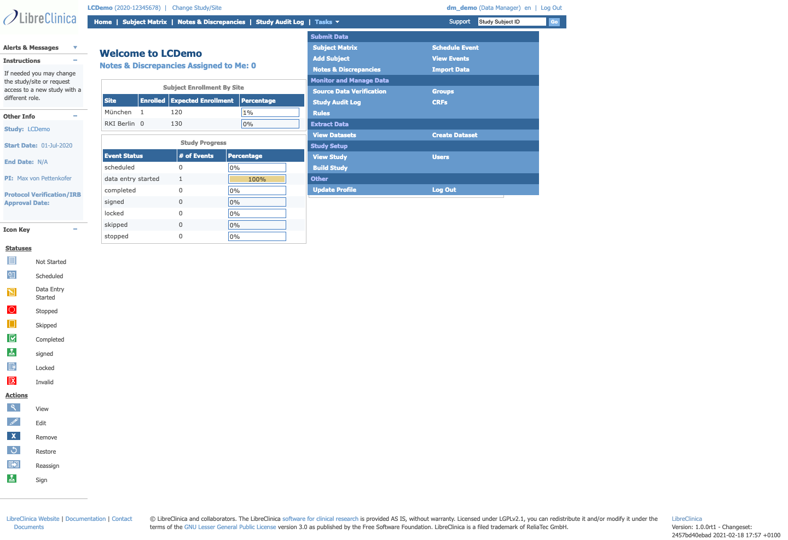
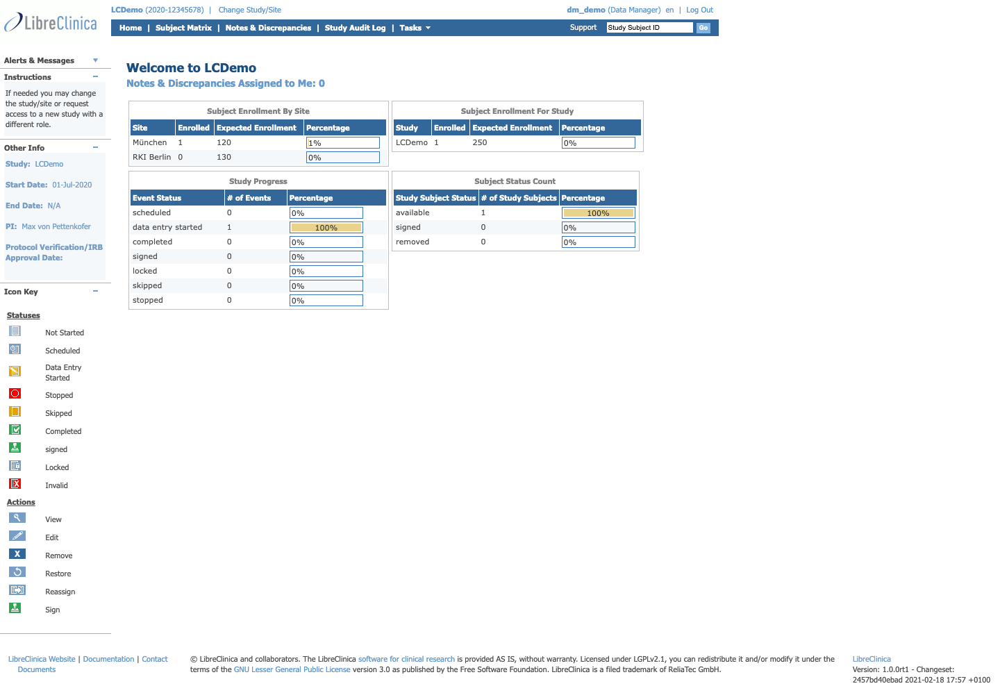
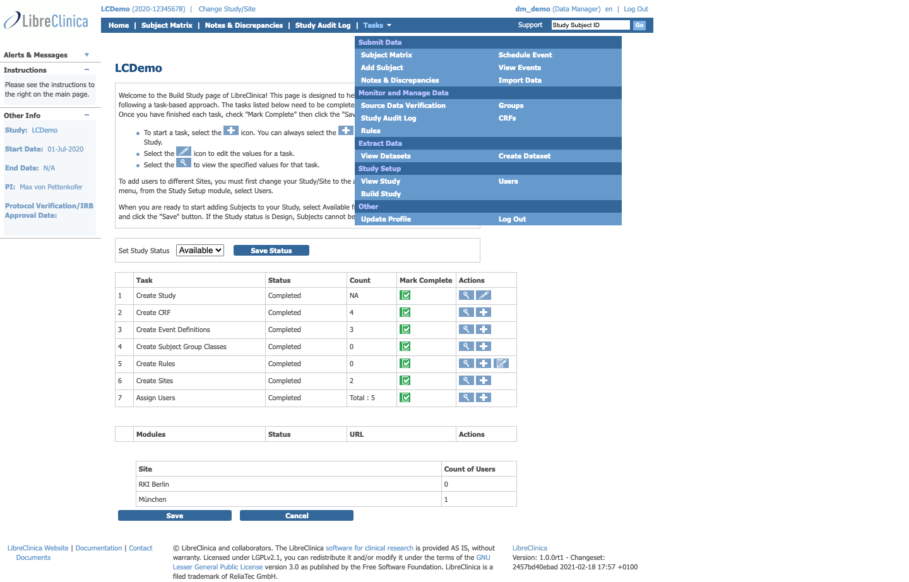
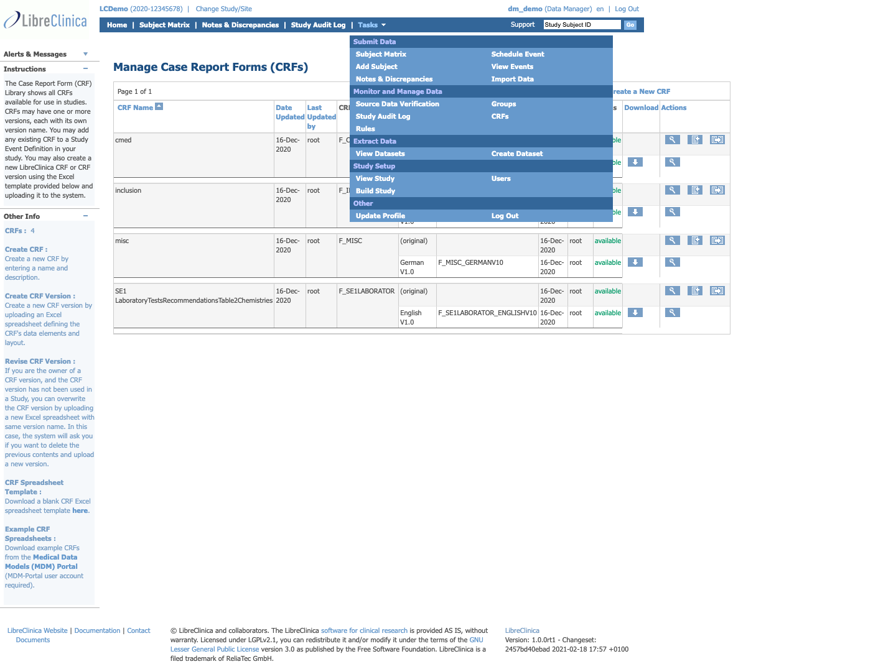
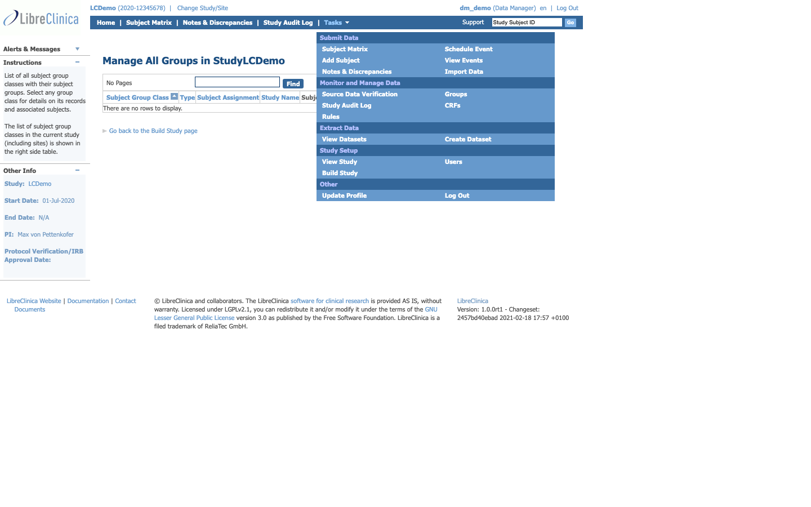
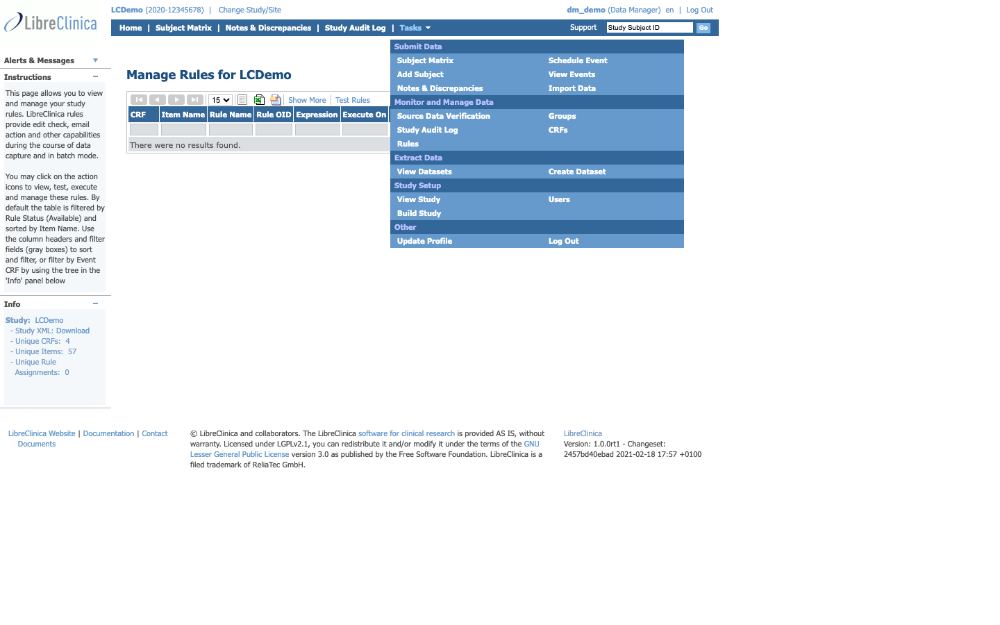
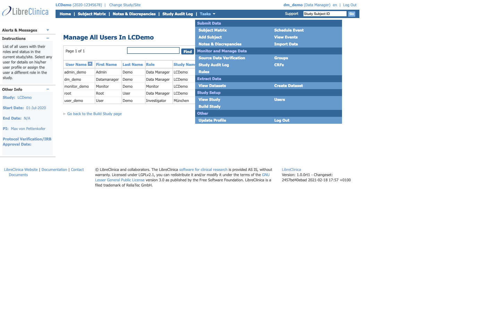
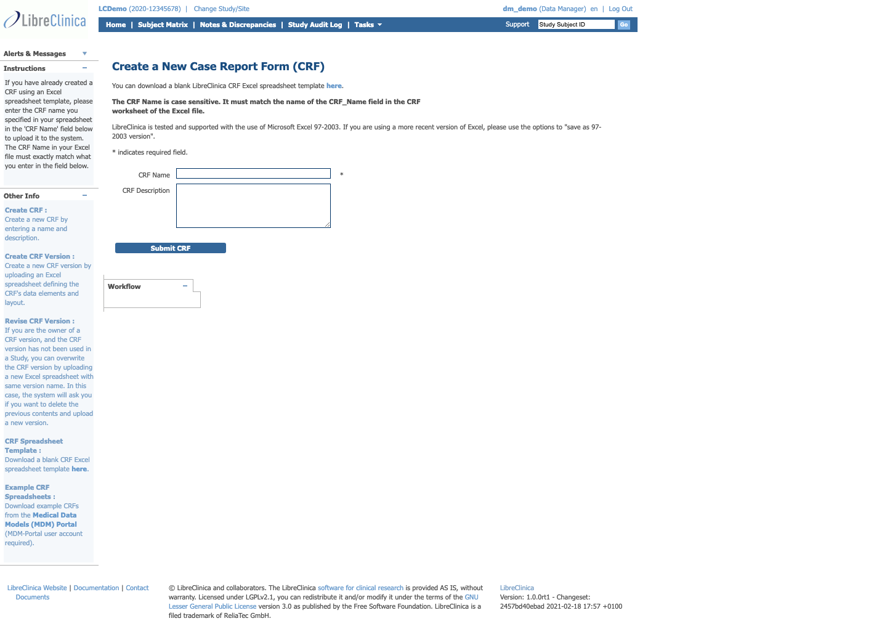
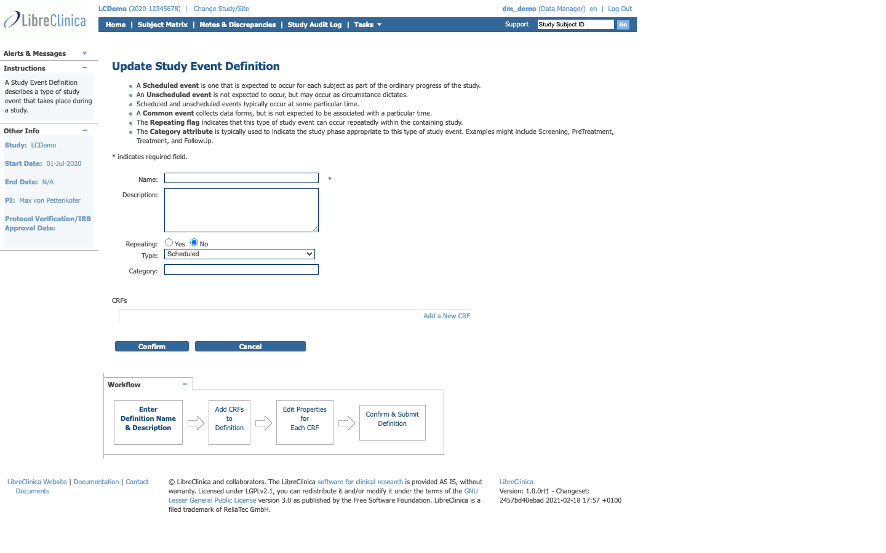
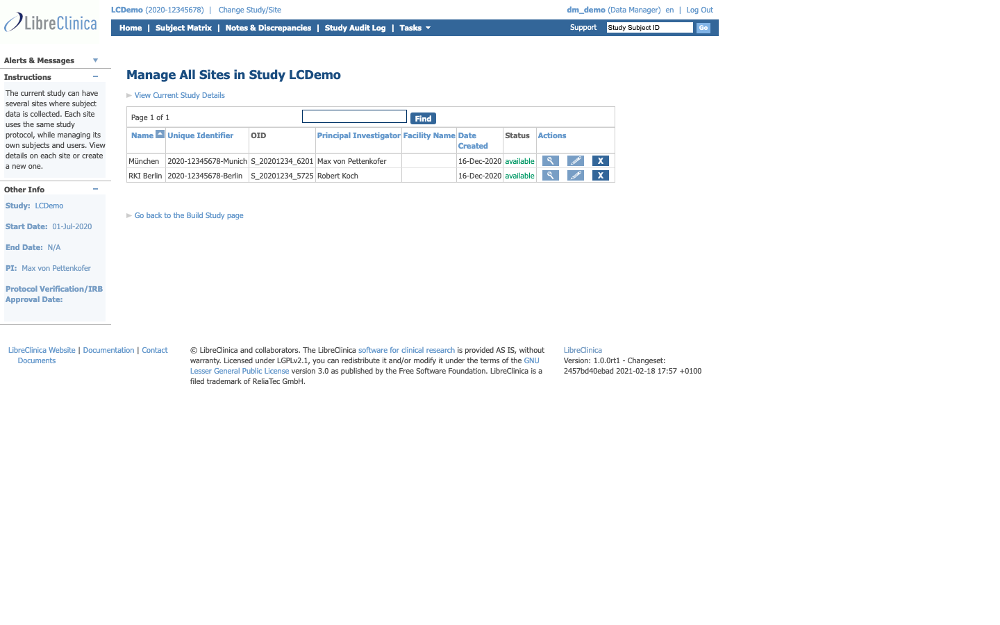

# Phase E — Data Manager role UI feature catalogue

**SPA coverage (added 2026-09-30):** a live, read-only walk of the local dev stack as `manual_dm` on 2026-09-30.

- The legacy UI ran at `http://127.0.0.1:8080/LibreClinica/` and the SPA at `http://127.0.0.1:8081/`, build `1.5.0-beta.15-muw` of 2026-09-30 08:51 UTC.
- Every screen was fetched with GET and its HTML or JSON read. No form was submitted and no action link was followed.
- A few read-only `SELECT`s against the dev database and a read of the application log explain what some pages showed. Nothing on the stack was changed.

It was cross-referenced with:

- [LegacyServletRegistry.java](../../../../web/src/main/java/at/ac/meduniwien/ophthalmology/libreclinica/config/LegacyServletRegistry.java), which has held every legacy URL mapping since Phase C.16 (the `web.xml` line references below predate it);
- the servlets under `control/managestudy/`, `control/submit/`, `control/extract/` and `control/admin/`, their JSPs, and the Spring MVC controllers that render study pages (`StudyModuleController`, `SDVController`, `ChangeCRFVersionController`, `BatchCRFMigrationController`, `ExtractController`);
- the SPA [router](../../../../web/src/spa/src/router/index.ts), views, stores and `/pages/api/v1/**` controllers (the endpoints were also read live with GET);
- [administrator-features.md](administrator-features.md), which catalogues the administrator-only screens. They are referenced here, not repeated.

**Original source (legacy features):** live walkthrough of `libreclinica.reliatec.de/lc-demo01` as `dm_demo` (role: Data Manager), 2026-05-28, cross-referenced with [web.xml](../../../../web/src/main/webapp/WEB-INF/web.xml) servlet mappings and the existing — much thinner — [administrator manual](../../../manuals/administrator-manual.md).

**Purpose:** baseline inventory for the Phase E SPA rewrite. The Data Manager role has **the broadest surface area** in LibreClinica: study setup, CRF design upload, event definitions, rules, user/role assignment, plus everything the Investigator and Monitor can do. The official upstream manuals only thinly cover this role — most of the catalogue below is derived from the live walk and the source code.

> The **Data Manager** is not the same as the **Administrator** (system role). System Administration (datainfo.properties, 2FA, LDAP) is documented in [administrator-manual.md](../../../manuals/administrator-manual.md). The Data Manager role described here operates **inside a study** and does not configure the system itself.

**New in this revision: an *SPA coverage* column on every feature table,** in the format of [administrator-features.md](administrator-features.md). It names the SPA route and view that replace each feature (or `—`) and gives a verdict. [DR-018](../decision-record.md#dr-018--the-legacy-jsp-layer-is-retired-in-full-admin-screens-included) retires screens against this column, so it is the part to keep current. Where a verdict is PARTIAL, the notes under the table say which fields or actions are missing.

The 2026-05-28 text is kept, under *Legacy description* where a section now opens with its SPA table; where it is wrong for this build, §25.5 says so. New sections:

- §19 Notes & discrepancies, §20 Data import and §21 Subject & event administration: Data Manager areas the first walk did not catalogue;
- §22 screens catalogued elsewhere that a Data Manager also uses, and §23 SPA surfaces with no legacy counterpart;
- §24 the coverage summary and the gaps most likely to cost clinical or regulatory capability;
- §25 findings, and §26 what this pass could not verify.

> **Which role is "Data Manager"**
>
> - The legacy Data Manager menu (§2) is shown to two study roles, `coordinator` (2) and `director` (3). This build labels them *Data Manager* and *Study Director*; the 2026-05-28 walk's `dm_demo` held the one labelled *Data Manager*.
> - The SPA maps `director` to **Data Manager** and `coordinator` to **CRC** (`RoleMapper.toSpaRole`). A CRC passes the Investigator routes only, so none of the SPA routes below admit a legacy coordinator (§25.3).
> - `manual_dm` holds `director` on Default Study (`S_DEFAULTS1`, status *available*) and has no other binding. The legacy header reads "manual_dm (Study Director)"; `GET /pages/api/v1/me` reports `Data Manager`.
> - The verdicts below are for the SPA role **Data Manager**.

> **Verdicts**
>
> - **COVERED**: an SPA route does the same job for a Data Manager, checked in the view and in its API.
> - **PARTIAL**: an SPA route does part of the job; the notes say what is missing.
> - **NOT COVERED**: no SPA route does the job for a Data Manager. This includes features the backend offers but no view calls ("API only"), and views on routes that refuse the Data Manager role.
>
> Where the evidence was thin, the verdict is NOT COVERED rather than COVERED. Features marked *(obsolete)* or *(broken)* are unreachable, refused or failing in the legacy UI itself on this build. They are counted, as in the admin catalogue.

---

## 1. Authentication

Same flow as the other roles — see [investigator-features.md §1](investigator-features.md#1-authentication--profile).

On this build `GET /pages/login/login` redirects to the SPA sign-in, `/LibreClinica/app/login`. The sign-in still posts to `j_spring_security_check`, and a successful sign-in lands on the legacy `/MainMenu` (plan R1.3).

---

## 2. Top navigation (Data Manager)

Captured live for `dm_demo`:

| Position | Label | URL | Backing servlet | SPA coverage (Data Manager) |
|---|---|---|---|---|
| Header-left | Study "LCDemo" | `/ViewStudy?id=3&viewFull=yes` | `control.admin.ViewStudyServlet` | — see §5 (the legacy page answers HTTP 500) |
| Header-left | Change Study/Site | `/ChangeStudy` | `control.login.ChangeStudyServlet` | `/pick-study` → `StudyPickerView.vue` |
| Header-right | `dm_demo (Data Manager) en` | `/UpdateProfile` | `control.login.UpdateProfileServlet` | see [investigator-features.md §1.3](investigator-features.md#13-update-profile--change-password) |
| Header-right | Log Out | `/j_spring_security_logout` | Spring Security | `TopBar.vue` sign-out |
| Top nav | Home | `/MainMenu` | `control.MainMenuServlet` | `/` → `HomeView.vue` (§3) |
| Top nav | Subject Matrix | `/ListStudySubjects` | `control.submit.ListStudySubjectsServlet` | `/subjects` → `SubjectMatrixView.vue` (§22) |
| Top nav | Notes & Discrepancies | `/ViewNotes?module=submit` | `control.managestudy.ViewNotesServlet` | `/notes` (§19) |
| Top nav | **Study Audit Log** | `/StudyAuditLog` | `control.managestudy.StudyAuditLogServlet` | `/audit-log` (§12) |
| Top nav | Tasks ▾ | — | (rendered client-side) | `TopBar.vue` |
| Top nav | Subject Subject ID search | `/ListStudySubjects` (GET) | same servlet | `/subjects` |

**Differences vs Monitor / Investigator top nav:**

- ➕ **Study Audit Log** elevated to primary nav (Monitor reaches it via Tasks)
- ➖ **SDV** removed from primary nav (still in Tasks dropdown — DM oversees but doesn't drive day-to-day SDV)
- ➖ **Add Subject** removed from primary nav (still in Tasks dropdown — DM rarely adds subjects directly)

**Live on this build (`manual_dm`, 2026-09-30).** The header read *Default Study (default-study)* · *Change Study/Site* · *manual_dm (Study Director) en* · *Log Out*. The top nav and the Tasks menu matched the 2026-05-28 capture item for item.

### Tasks dropdown (Data Manager — the complete menu)

All five sections — this is the full menu visible only at this role:

- **Submit Data** — Subject Matrix · Add Subject · Notes & Discrepancies · Schedule Event · View Events · Import Data
- **Monitor and Manage Data** — Source Data Verification · Study Audit Log · Groups · CRFs · Rules
- **Extract Data** — View Datasets · Create Dataset
- **Study Setup** — View Study · Build Study · Users
- **Other** — Update Profile · Log Out

**Data-Manager-exclusive items** (not visible to Investigator or Monitor):

- Build Study, Users (Study Setup section)
- Groups, CRFs, Rules (Monitor and Manage Data section)

| Tasks entry | URL | SPA coverage (Data Manager) |
|---|---|---|
| Subject Matrix | `/ListStudySubjects` | `/subjects` (§22) |
| Add Subject | `/AddNewSubject` | `/subjects/new` refuses a Data Manager (§22) |
| Notes & Discrepancies | `/ViewNotes?module=submit` | `/notes` — see §19 |
| Schedule Event | `/CreateNewStudyEvent` | scheduling lives on `/subjects/:subjectId`, which refuses a Data Manager (§22) |
| View Events | `/ViewStudyEvents` | — nearest: `/due-visits` (§22) |
| Import Data | `/ImportCRFData` | `/import-crf-data` — see §20 |
| Source Data Verification | `/pages/viewAllSubjectSDVtmp?sdv_restore=true&studyId=<n>` | `/sdv` refuses a Data Manager — see §11 |
| Study Audit Log | `/StudyAuditLog` | `/audit-log` — see §12 |
| Rules | `/ViewRuleAssignment?read=true` | `/rules` — see §9 |
| Groups | `/ListSubjectGroupClass?read=true` | `/group-classes` — see §8 |
| CRFs | `/ListCRF?module=manage` | `/crf-library` — see §6 |
| View Datasets | `/ViewDatasets` | `/export` — see §13 |
| Create Dataset | `/CreateDataset` | `/datasets/new` — see §13 |
| View Study | `/ViewStudy?id=<n>&viewFull=yes` | — see §5 |
| Build Study | `/pages/studymodule` | `/build-study` — see §4 |
| Users | `/ListStudyUser` | `/manage-users` refuses a Data Manager — see §10 |
| Update Profile | `/UpdateProfile` | see [investigator-features.md §1.3](investigator-features.md#13-update-profile--change-password) |

At site level (`study.parentStudyId > 0`), `navBar.jsp` drops Rules, Groups, CRFs and Build Study for both roles.

### SPA navigation for the Data Manager

- **Top bar** (`TopBar.vue`, `lib/primaryNav.ts`): Home · Build Study · Inbox · Data Export · Notes & Discrepancies.
- **Home cards** (`HomeView.vue`): Notes (open-query count) · Inbox · Due visits · Build Study · Import CRF Data · Rules · Data Export · Audit Trail · Sites · Patients overview · Switch study.
- **Build Study rail** (`BuildStudyRail.vue`): Build Study · Study · Parameters · CRF library · Event definitions · Group classes · Rules · Sites · Modalities · Manage users. Study, Parameters, Modalities and Manage users are Administrator-only routes, so for a Data Manager those four entries lead back to Home (§25.3).

The navigation rows in this section are not counted in §24; the features they lead to are.

---

## 3. Home dashboard

**SPA coverage (2026-09-30).**

| Label | URL | Backing servlet | SPA coverage |
|---|---|---|---|
| Home page: welcome line and *Notes & Discrepancies Assigned to Me: N* | `/MainMenu` | `control.MainMenuServlet` → `menu.jsp` | **PARTIAL** — `/` → `HomeView.vue` |
| Study statistics: subject enrolment by site and for the study (against expected enrolment), events by status, subjects by status | `/MainMenu` | `menu.jsp` (coordinator and director branch) | **NOT COVERED** — — |

- **Live.** For `manual_dm` the main area showed the welcome line, *Notes & Discrepancies Assigned to Me: 0*, and four statistics tables:
  - subject enrolment by site, and for the study (7 enrolled, expected enrolment 0);
  - events by status (scheduled 1, data entry started 4, completed 8, signed 4; locked, skipped and stopped 0);
  - study subjects by status (available 5, signed 2, removed 0).
- It did **not** embed the Subject Matrix. `menu.jsp` shows the matrix to investigators and data-entry persons, the statistics to coordinators and directors, and the SDV table to monitors.
- Three of the four table headings render as `???subject_enrollment_for_site???`, `???event_status_statistics???` and `???study_subject_status_statistics???`. No properties file defines those keys.
- **SPA.** The Home cards (§2) give counts and entry points. The *Notes* card counts every open query in the study, not those assigned to the user; *assigned to me* is a filter on `/notes`.
- *Missing in the SPA:* the four tables. Build Study shows the numbers of sites and enrolled subjects, and the Subject Matrix's statistics modal (`StudyMetricsModal.vue`) shows sex, age and follow-up. Neither shows enrolment against the target, or events and subjects by status.

*Legacy description (2026-05-28):*

- **URL:** `/MainMenu`
- **Same sidebar as other roles** plus a more prominent Study/Site context (no site since `dm_demo` operates at study level)
- **Main area:** Welcome message, "Notes & Discrepancies Assigned to Me: N", embedded Subject Matrix
- **Critical observation:** the home does **not** automatically surface Build Study progress, despite that being the DM's primary workflow. The SPA could improve this — see §14.

---

## 4. Build Study — the primary DM workflow

**SPA coverage (2026-09-30).**

| Label | URL | Backing servlet | SPA coverage |
|---|---|---|---|
| Task tracker: seven tasks with status, count and View / Edit / Add links | `/pages/studymodule` | `controller.StudyModuleController` → `studymodule.jsp` | **PARTIAL** — `/build-study` → `BuildStudyView.vue` |
| Mark a task complete and save | `POST /pages/studymodule` | `StudyModuleController.processSubmit` (`study_module_status`) | **PARTIAL** — *Mark as complete* on zero-count Groups, Rules and Sites only |
| Set the study status: Design, Available, Frozen, Locked (cascades to the sites) | `POST /pages/studymodule` (`saveStudyStatus`) | `StudyModuleController.processSubmit` | **NOT COVERED** — the status menu on `/build-study` is Administrator-only |
| Users per site (shown when the study has sites) | `/pages/studymodule` | `studymodule.jsp` (`childStudyUserCount`) | **NOT COVERED** — — |
| Participant portal and randomization module status and switches (shown when `portalURL` or `moduleManager` is set) | `/pages/studymodule`, `POST /pages/studymodule/{study}/{register, deactivate, reactivate, …}` | `StudyModuleController` | **NOT COVERED** — — *(obsolete: not configured on this stack; the participant-form chain is proposed for removal, R0.6)* |

- **Tracker.** The SPA shows the seven tasks with counts, a progress bar and the numbers of sites and enrolled subjects. It differs from the legacy page in four ways:
  - Task status follows the counts. CRF, events and users are *complete* once their count is above 0; groups, rules and sites stay *optional* until acknowledged.
  - The SPA does not read the legacy `study_module_status`, so a task marked complete on one page is not complete on the other.
  - The CRF count is install-wide: 3 on this stack, where the legacy page counts the CRFs the study uses (1).
  - For a Data Manager the *Create Study* tile reads *Administrator only*, and the *Users* tile links to `/manage-users`, which the router refuses for this role.
- **Mark complete.** The SPA acknowledgement (`POST /studies/{oid}/build-status/acknowledge`, table `study_build_task_ack`) exists for groups, rules and sites only, and the API has no way to withdraw one. The role gate on it is fixed in #392 (§25.3).
- **Study status.** `StudyAdminAuthorization.roleMayLifecycleStudy` is sysadmin-only by design; its comment gives the audit-of-record weight of LOCKED and FROZEN as the reason. The legacy Build Study lets a study-level admin, director or coordinator set any of the four statuses. In the SPA, freezing or locking a study at database lock therefore needs a system administrator.
- **Users per site** appears in `studymodule.jsp` only when the study has sites; Default Study has none. The SPA shows the site count only, and `/sites` shows no users.

*Legacy description (2026-05-28):*

The Build Study page is the **central study-setup task tracker**. It's the page upstream documentation refers to most when describing study creation, but it's barely covered in the existing institutional manual.

- **URL:** `/pages/studymodule`
- **Controller:** Spring MVC (configured in [pages-servlet.xml](../../../../web/src/main/webapp/WEB-INF/pages-servlet.xml))
- **POST endpoint:** `studymodule` (form action)
- **Form fields captured:** `studyStatus`, `saveStudyStatus`, `study`, `crf`, `eventDefinition`, `subjectGroup`, `rule`, `site`, `users`, `submitEvent`, `cancel`
- **H1:** the study name (e.g. "LCDemo")
- **Welcome instruction text:** "Welcome to the Build Study page of LibreClinical. This page is designed to walk you through the process of building a study following a task-based approach. The tasks listed below need to be completed before you can start using the Study..."

### 4.1 The 7-task workflow (observed on LCDemo)

| # | Task | Status | Count | Mark Complete | Per-task Actions (icons) | SPA tile (Data Manager) |
|---|---|---|---|---|---|---|
| 1 | Create Study | Completed | NA | ✓ | Edit / View | reads *Administrator only*; no link |
| 2 | Create CRF | Completed | 4 | ✓ | Edit / View / Add CRF | → `/crf-library` |
| 3 | Create Event Definitions | Completed | 3 | ✓ | Edit / View / Add Event Def | → `/event-definitions` |
| 4 | Create Subject Group Classes | Completed | 0 | ✓ | Edit / View / Add Group | → `/group-classes`; *Mark as complete* while the count is 0 |
| 5 | Create Rules | Completed | 0 | ✓ | Edit / View / Add Rule | → `/rules`; *Mark as complete* while the count is 0 |
| 6 | Create Sites | Completed | 2 | ✓ | Edit / View / Add Site | → `/sites`; *Mark as complete* while the count is 0 |
| 7 | Assign Users | Completed | Total: 5 | ✓ | Edit / View / Assign | → `/manage-users`, which refuses a Data Manager |

- Each task's row has the "Mark Complete" checkbox + Actions column with edit / view / add icons
- Tasks 2–5 also link out to the dedicated Manage views (CRFs, Event Definitions, Groups, Rules — covered below)
- **Set Study Status dropdown** at the top: Available, Pending, Frozen, Locked (etc.) → "Save Status" button updates `study.status`

**Live on this build (`manual_dm`, Default Study, 2026-09-30):**

| # | Task | Status | Count | Legacy links |
|---|---|---|---|---|
| 1 | Create Study | In Progress | NA | View `/ViewStudy?id=1&viewFull=yes` (HTTP 500), Edit `/UpdateStudyNew?id=1` |
| 2 | Create CRF | In Progress | 1 | View `/ListCRF`, Add `/CreateCRFVersion` |
| 3 | Create Event Definitions | In Progress | 3 | View `/ListEventDefinition`, Add `/DefineStudyEvent` |
| 4 | Create Subject Group Classes | Not Started | 0 | Add `/CreateSubjectGroupClass` |
| 5 | Create Rules | Not Started | 0 | Add `/ImportRule` |
| 6 | Create Sites | Not Started | 0 | Add `/CreateSubStudy` |
| 7 | Assign Users | In Progress | Total : 8 | View `/ListStudyUser`, Add `/AssignUserToStudy` |

- *Set Study Status* offered Design, Available (selected), Frozen and Locked. The page text says a study in Design cannot take subjects.
- For the same study, `GET /pages/api/v1/studies/S_DEFAULTS1/build-status` returned CRFs 3, events 3, groups 0, rules 0, sites 0 (the last three *optional*), users 8 and enrolled subjects 5.

### 4.2 Sites sub-section (within Build Study)

The lower portion of Build Study shows site-level configuration:

| Site | Status | URL | Count of Users |
|---|---|---|---|
| RKI Berlin | (status) | (link) | 0 |
| München | (status) | (link) | 1 |

Sites can also be reached via View Study → Sites tab; but **creating** sites happens here.

On this build the section lists users per site, and appears only when the study has sites. The site features and their SPA coverage are in §16.5.

---

## 5. View Study (read + edit)

**SPA coverage (2026-09-30).**

| Label | URL | Backing servlet | SPA coverage |
|---|---|---|---|
| View Study: full record, sites, event definitions, users, metadata link | `/ViewStudy?id=<n>&viewFull=yes` | `control.admin.ViewStudyServlet` → `admin/viewFullStudy.jsp` | **NOT COVERED** — no read-only study view admits a Data Manager *(broken in legacy: HTTP 500 on this build)* |
| Update the study: description, status and dates, design, conditions and eligibility, facility, related information | `/UpdateStudyNew?id=<n>` | `control.managestudy.UpdateStudyServletNew` | **NOT COVERED** — `/studies/:oid/edit` → `StudyIdentityEditView.vue` admits Administrator only |
| Study parameter configuration | `/UpdateStudyNew?id=<n>` (last section) | `UpdateStudyServletNew` | **NOT COVERED** — `/studies/:oid/parameters` → `StudyParametersEditView.vue` admits Administrator only |
| Download the study metadata (ODM *Study XML*) | `/DownloadStudyMetadata?studyId=<n>` (View Study; Rules sidebar) | `control.admin.DownloadStudyMetadataServlet` | **NOT COVERED** — — |

- **Live.** `/UpdateStudyNew?id=1` opened for `manual_dm` with the same 60 inputs an administrator sees (admin catalogue §4); it was not submitted. `/ViewStudy?id=1&viewFull=yes` answered HTTP 500, as it does for every role.
- **SPA.** The backend would accept a director or coordinator for identity edits (`StudyAdminAuthorization.userMayEditStudy`). The router admits only Administrator on `/studies/:oid/edit` and `/studies/:oid/parameters`, and `BuildStudyView.vue` shows their links only to that role. The field gaps of those two views are listed in [admin §4](administrator-features.md#4-studies-tasks--administration--studies).
- `DownloadStudyMetadataServlet` admits anyone who may view data (`SubmitDataServlet.mayViewData`), so the *Study XML* link on the Rules page is open to a Data Manager. It was not fetched (file download).

*Legacy description (2026-05-28):*

- **URL:** `/ViewStudy?id=<n>&viewFull=yes`
- **Servlet:** `control.admin.ViewStudyServlet`
- **Sections observed (collapsible):** Study Details, Eligibility, Status & Status History, Parameter Configuration, Event Definitions (per CRF), Sites, Users, Study XML download
- **Edit:** pencil icons in each section → individual servlet endpoints, e.g.:
  - `control.admin.UpdateStudyServlet` (study core details)
  - `control.managestudy.UpdateEventDefinitionServlet` (event definitions)
  - `control.admin.UpdateStudyUserRoleServlet` (per-user role assignment)
- **Parameter Configuration** includes: `studyEvaluator`, `discrepancyManagement`, `genderRequired`, `subjectIdGeneration`, `subjectIdPrefix`, `personIdRequired`, `secondaryIdRequired`, etc. — full enumeration via `study_parameter_value` table

---

## 6. CRF management (Data-Manager-only)

**SPA coverage (2026-09-30).**

| Label | URL | Backing servlet | SPA coverage |
|---|---|---|---|
| List CRFs with their versions | `/ListCRF?module=manage` | `control.admin.ListCRFServlet` | **COVERED** — `/crf-library` → `CrfLibraryView.vue` |
| Create a CRF (name, description) | `/CreateCRF` | `control.admin.CreateCRFServlet` | **COVERED** — *Create* on `/crf-library` |
| Create a new CRF from a spreadsheet (the list's *Create a New CRF*) | `/CreateCRFVersion?module=manage` (crfId 0) | `control.admin.CreateCRFVersionServlet` | **PARTIAL** — create on `/crf-library`, then author the first version in `/crf-authoring-canvas/:crfOid`; no spreadsheet upload |
| Add a version from a spreadsheet (upload, preview, confirm) | `/InitCreateCRFVersion?crfId=<n>` → `/CreateCRFVersion` | `InitCreateCRFVersionServlet`, `CreateCRFVersionServlet` | **PARTIAL** — `/crf-authoring-canvas/:crfOid` → `CrfAuthoringCanvasView.vue` (blank, or forked from a version); no spreadsheet upload |
| View a CRF: metadata, versions, items, studies using it, rules links | `/ViewCRF?module=manage&crfId=<n>` | `control.admin.ViewCRFServlet` | **PARTIAL** — `/crf-library` |
| View a version: metadata and rendered form | `/ViewCRFVersion?id=<n>`, `/ViewSectionDataEntry?crfVersionId=<n>&tabId=1` | `ViewCRFVersionServlet`, `ViewSectionDataEntryServlet` | **PARTIAL** — only by forking the version into the canvas builder (preview pane) |
| Print a blank CRF (per version, per definition, all) | `rest/metadata/html/print/…` | unregistered Jersey resource | **NOT COVERED** — — *(broken: dead link in legacy)* |
| Edit a CRF's name and description (owner or sysadmin) | `/InitUpdateCRF?crfId=<n>` → `/UpdateCRF` | `InitUpdateCRFServlet`, `UpdateCRFServlet` | **NOT COVERED** — — |
| Remove a CRF (owner or sysadmin; cascades) | `/RemoveCRF?action=confirm&id=<n>` | `control.admin.RemoveCRFServlet` | **PARTIAL** — *Disable* on `/crf-library` (status only) |
| Restore a CRF | `/RestoreCRF?action=confirm&id=<n>` | `control.admin.RestoreCRFServlet` | **NOT COVERED** — — |
| Remove or restore a version (owner or sysadmin; removal cascades) | `/RemoveCRFVersion`, `/RestoreCRFVersion` | `RemoveCRFVersionServlet`, `RestoreCRFVersionServlet` | **PARTIAL** — *Disable* / *Restore* per version (status only) |
| Archive (lock) or unlock a version | `/LockCRFVersion?id=<n>` (admin module, sysadmin), `/UnlockCRFVersion?id=<n>` | `LockCRFVersionServlet`, `UnlockCRFVersionServlet` | **COVERED** — *Lock* / *Unlock* on `/crf-library` |
| Download a version's spreadsheet | `/DownloadVersionSpreadSheet?crfId=<n>&crfVersionId=<m>` | `control.admin.DownloadVersionSpreadSheetServlet` | **COVERED** — *.xls* per version on `/crf-library` |
| Download the blank CRF template | `/DownloadVersionSpreadSheet?template=1` | `DownloadVersionSpreadSheetServlet` | **NOT COVERED** — — |
| Batch CRF version migration (move existing event CRFs to another version) | `/BatchCRFMigration?module=manage&crfId=<n>` + `/pages/api/v1/forms/migrate/{preview,run}` | `BatchCRFMigrationServlet`, `controller.BatchCRFMigrationController` | **NOT COVERED** — — |
| Change the CRF version of one event CRF | `/pages/managestudy/chooseCRFVersion?…` → `confirmCRFVersionChange` → `changeCRFVersion` | `controller.ChangeCRFVersionController` | **NOT COVERED** — — |
| Create a version from an XForm | `/CreateXformCRFVersion` | `control.admin.CreateXformCRFVersionServlet` | **NOT COVERED** — — *(obsolete: refused while `xform.enabled` is unset; proposed for removal, R0.6)* |

- **No spreadsheet upload.** `CrfLibraryView.vue` keeps the upload dialog in its source, but nothing opens it; its comment records that the XLSX upload UI was removed on 2026-06-21. `POST /crfs/{oid}/versions` (multipart) still exists, API only. New versions are authored in the canvas builder, from a blank form or forked from an existing version.
- **No version migration.** `stores/crfLibrary.ts` wraps `POST /crfs/{oid}/versions/{from}/migrate-to/{to}`, but no view calls it. The *CRFs* dialog of an event definition (§7) can change the default version for new event CRFs; nothing moves existing event CRFs to another version, in bulk or one at a time.
- **Disable is status only.** It sets the CRF's or the version's status and nothing else. Legacy `RemoveCRFServlet` and `RemoveCRFVersionServlet` also auto-remove the versions, event-definition CRFs, event CRFs and item data below them (§25.4).
- **View CRF.** `/crf-library` shows name, description and the versions (name, OID, description, status) with their actions. *Missing in the SPA:* the item table, the studies using the CRF, and the two rules links (*Run All Rules for this CRF*, *View Rules for this CRF*).
- **View a version.** The SPA has no read-only view of a published version. Forking it into the canvas builder shows its contents in the preview pane, from `GET /crfs/{oid}/versions/{v}/contents`.
- **Lock.** The SPA offers *Lock* and *Unlock* to a Data Manager (`userMayManageCrfLibrary`). Legacy shows *Lock* only to a system administrator in the admin module, and *Unlock* on any locked version.
- **Legacy, live (`manual_dm`, who owns none of the three CRFs):**
  - per CRF: View, Create New Version, Batch CRF Version Migration; per version: View;
  - *Edit* and *Remove* appear only for the CRF's owner or a sysadmin (`showCRFRow.jsp`);
  - in the `manage` module, *Studies Using This CRF* on `/ViewCRF` is never filled (the servlet loads it only for `module=admin`), so it always reads `???no_data???`;
  - the item tables on `/ViewCRF` and `/ViewCRFVersion`, and the rendered form, were empty for all three CRFs on this stack (§26);
  - `/BatchCRFMigration?module=manage&crfId=1` opened: current and new version, sites, events, *Preview* and *Migrate*. Not submitted.

*Legacy description (2026-05-28):*

### 6.1 List CRFs

- **URL:** `/ListCRF?module=manage`
- **Servlet:** `control.admin.ListCRFServlet`
- **H1:** "Manage Case Report Forms (CRFs)"
- **Columns observed:** CRF Name · Date Created · Owner · Date Updated · Last Updated By · Versions · Status · Actions
- **Per-CRF nested versions table** with version name, type, OID, created date, status (Available / Invalid / Locked), Actions
- **Per-CRF actions:** Edit (CRF metadata), View (versions list), Restore (if soft-deleted), Add Version
- **Filter and sort:** column-header filters, status filter, owner filter

### 6.2 Create CRF (Excel template upload)

- **URL:** `/CreateCRF` (servlet `control.admin.CreateCRFServlet`)
- **Workflow:**
  1. Provide CRF Name and optionally a Description
  2. Upload Excel template (multi-sheet `.xls` matching the LibreClinica CRF schema)
  3. Server validates the workbook → preview of items, groups, validations
  4. Persist as a CRF Version (default) with `status='Available'`

### 6.3 Create CRF Version

- **URL:** `/CreateCRFVersion` — declared with the `compressFilter` ([web.xml:142](../../../../web/src/main/webapp/WEB-INF/web.xml))
- **Servlet:** `control.admin.CreateCRFVersionServlet`
- **Purpose:** add a new version of an existing CRF (Excel re-upload, retaining the parent `crf_id`)

### 6.4 Create CRF Version from XForm (newer alternative path)

- **URL:** `/CreateXformCRFVersion` ([web.xml:146](../../../../web/src/main/webapp/WEB-INF/web.xml))
- **Servlet:** likely `control.admin.CreateXformCRFVersionServlet`
- **Purpose:** upload an XForm (XForms 1.0 + OpenRosa) — used by Enketo integration. Less common in MUW context but present in the codebase.

### 6.5 Per-CRF / per-version operations

- **View CRF Version detail** — `/CRFVersionMetadataServlet` (lists items, sections, groups, validations)
- **Download CRF Version (Excel)** — `/DownloadCRFVersion`
- **Set CRF status / lock / unlock** — `/SetCRFStatus`, `/LockCRFServlet`, `/UnlockCRFServlet` (some hidden depending on study state)
- **Remove CRF Version** — soft-delete via `/RemoveCRFVersion` (Data Manager can also restore)

---

## 7. Event Definitions

**SPA coverage (2026-09-30).**

| Label | URL | Backing servlet | SPA coverage |
|---|---|---|---|
| List the event definitions: order, name, OID, repeating, type, category, populated, created and updated, CRFs, default versions | `/ListEventDefinition` | `control.managestudy.ListEventDefinitionServlet` | **PARTIAL** — `/event-definitions` → `EventDefinitionsView.vue` |
| View a definition with its CRFs and their properties | `/ViewEventDefinition?id=<n>`, `/ViewEventDefinitionReadOnly?id=<n>` | `ViewEventDefinitionServlet`, `ViewEventDefinitionReadOnlyServlet` | **PARTIAL** — *CRFs* dialog (`EventCrfAssignmentsDialog.vue`) |
| Create a definition: name, description, repeating, type, category; then its CRFs and their properties | `/DefineStudyEvent` (four steps) | `DefineStudyEventServlet` | **COVERED** — *Create* on `/event-definitions`, then *CRFs* |
| Update a definition: name, description, repeating, type, category | `/InitUpdateEventDefinition?id=<n>` → `/UpdateEventDefinition` | `InitUpdateEventDefinitionServlet`, `UpdateEventDefinitionServlet` | **COVERED** — *Edit* on `/event-definitions` |
| Add, remove and restore a CRF in a definition | `/AddCRFToDefinition`, `/RemoveCRFFromDefinition?id=<n>`, `/RestoreCRFFromDefinition?id=<n>` (inside the update flow) | `AddCRFToDefinitionServlet`, `RemoveCRFFromDefinitionServlet`, `RestoreCRFFromDefinitionServlet` | **COVERED** — *CRFs* dialog: attach and remove; a removed CRF is attached again |
| Per-CRF properties: required, double data entry, password required, default version, hide CRF, SDV requirement, null values; participant-form fields when the portal is on | `/UpdateEventDefinition`, `/DefineStudyEvent` | `UpdateEventDefinitionServlet`, `DefineStudyEventServlet` | **PARTIAL** — *CRFs* dialog → *Edit* |
| Reorder the definitions | `/ChangeDefinitionOrdinal?current=<a>&previous=<b>` | `ChangeDefinitionOrdinalServlet` | **COVERED** — up and down arrows (`POST …/event-definitions/reorder`) |
| Reorder the CRFs within a definition | `/ChangeDefinitionCRFOrdinal?…` (View Event Definition, View Site) | `ChangeDefinitionCRFOrdinalServlet` | **NOT COVERED** — — |
| Remove a definition (cascades to its CRFs, events, event CRFs and item data) | `/RemoveEventDefinition?action=confirm&id=<n>` | `RemoveEventDefinitionServlet` | **PARTIAL** — *Disable* on `/event-definitions` (status only) |
| Restore a definition | `/RestoreEventDefinition?action=confirm&id=<n>` | `RestoreEventDefinitionServlet` | **COVERED** — *Restore* under *show removed* (restores the auto-removed rows below it) |
| Lock or unlock a definition | `/LockEventDefinition?action=confirm&id=<n>`, `/UnlockEventDefinition?…` | `LockEventDefinitionServlet`, `UnlockEventDefinitionServlet` | **NOT COVERED** — *Lock* / *Unlock* are Administrator-only *(obsolete in legacy: the links are commented out)* |

- **List.** `/event-definitions` shows order, name, description, type, repeating and actions. *Missing in the SPA:* OID, category, the *populated* flag, created and updated dates and users, and the CRF column (the CRFs are in the dialog).
- **View.** The *CRFs* dialog lists each CRF with its OID, default version, required, double data entry, electronic signature, hide-CRF, participant-form and SDV settings. *Missing:* the definition's OID and the null-value flags.
- **Per-CRF properties.** The SPA sets default version, SDV requirement, required, double data entry, electronic signature (legacy *Password Required*), hide CRF, decision condition and the participant-form fields. *Missing in the SPA:* the twelve null-value flags (NI, NA, UNK, NASK, ASKU, NAV, OTH, PINF, NINF, MSK, NP, NPE). Decision condition is new: its field is commented out in `updateEventDefinition1.jsp`.
- **Disable is status only.** `EventDefinitionsApiController` leaves the cascade to "the existing DB trigger pattern", but the dev database has no trigger on `study_event_definition`. After an SPA disable, the definition's events, event CRFs and item data stay as they were; legacy removal marks them auto-removed. The SPA's *Restore* does cascade (§25.4).
- **Reorder.** The SPA posts the new order; legacy reorders with GET links (§25.2).
- **Legacy, live (`manual_dm`):**
  - `/ListEventDefinition` listed V1 Inclusion, V2 Day 30 and V3 Day 90, each with View, Edit, Remove and the reorder arrows. *Print All Available CRFs* is a dead link.
  - `/InitUpdateEventDefinition?id=1` showed name, description, repeating, type and category, and per CRF: required, double data entry, password required, default version, hide CRF, SDV (100% required, partial required, not required, not applicable) and the twelve null-value flags.
  - `/DefineStudyEvent` showed step 1 of 4: name, description, repeating, type, category.
  - The lock and unlock links are commented out in `showStudyEventDefinitionRow.jsp`, so `/LockEventDefinition` is not reachable from the UI.

*Legacy description (2026-05-28):*

Reached via:

1. Build Study → row 3 → Edit / Add icons
2. View Study → Event Definitions section → Edit
3. (No direct top-nav or Tasks-menu shortcut)

- **List / Update:** `/UpdateEventDefinition?id=<n>` (servlet `control.managestudy.UpdateEventDefinitionServlet`)
- **Create:** `/CreateEventDefinition` (servlet `control.managestudy.CreateEventDefinitionServlet`)
- **Fields:** name, OID, repeating (boolean), type (Scheduled / Unscheduled / Common), category, ordinal, CRF assignments (which CRFs and at what *SDV requirement* per CRF)
- **CRF assignment sub-form:** crucial — this is where the SDV requirement that the Monitor sees gets configured (Not Required, Partial Required, 100% Required)

---

## 8. Subject Group Classes

**SPA coverage (2026-09-30).**

| Label | URL | Backing servlet | SPA coverage |
|---|---|---|---|
| List the group classes: type, subject assignment, study, groups, status | `/ListSubjectGroupClass?read=true` | `control.managestudy.ListSubjectGroupClassServlet` | **COVERED** — `/group-classes` → `GroupClassesView.vue` |
| Create a group class: name, type, subject assignment, groups with descriptions | `/CreateSubjectGroupClass` | `CreateSubjectGroupClassServlet` | **COVERED** — *Create* on `/group-classes` |
| View a group class: its groups and the subjects in each | `/ViewSubjectGroupClass?id=<n>` | `ViewSubjectGroupClassServlet` | **PARTIAL** — the list shows each class's groups, not their subjects |
| Update a group class | `/UpdateSubjectGroupClass?id=<n>` | `UpdateSubjectGroupClassServlet` | **NOT COVERED** — API only (`PUT …/group-classes/{id}`) |
| Remove a group class (cascades to its groups and subject assignments) | `/RemoveSubjectGroupClass?action=confirm&id=<n>` | `RemoveSubjectGroupClassServlet` | **PARTIAL** — *Disable* on `/group-classes` (status only) |
| Restore a group class | `/RestoreSubjectGroupClass?action=confirm&id=<n>` | `RestoreSubjectGroupClassServlet` | **COVERED** — *Restore* on `/group-classes` |

- **Live.** Default Study has no group classes, so only the list and the create form were seen. The form offers Type *Arm*, *Family/Pedigree*, *Demographic* or *Other*, Subject Assignment *Required* or *Optional* (default Optional), and ten group rows with name and description. The SPA's create form carries the same fields.
- *Missing in the SPA:* editing (`PUT …/group-classes/{id}` is API only), and the subjects in each group.
- **Disable is status only.** Legacy `RemoveSubjectGroupClassServlet` also removes the class's groups and subject-group assignments.
- Randomising a subject into a group (`POST …/group-classes/{id}/randomize`) is used only from `/subjects/new` (`AddSubjectView.vue`), a route that refuses a Data Manager. Legacy has no randomisation screen.

*Legacy description (2026-05-28):*

- **URL:** `/ListSubjectGroupClass?read=true`
- **Servlet:** `control.managestudy.ListSubjectGroupClassServlet`
- **H1:** "Manage All Groups in Study LCDemo"
- **Columns:** Subject Group Class · Type · Subject Assignment · Study Name · (Action icons)
- **Empty in LCDemo** — text "There are no rows to display."
- **Action:** "Go back to the Build Study page" link (always present, ties back to the 7-task workflow)
- **Create:** `/CreateSubjectGroupClass` (servlet `control.managestudy.CreateSubjectGroupClassServlet`)
- **Purpose:** group subjects for analysis stratification (e.g. randomization arms); when present, the Subject Matrix gets group-by-class filtering
- **Configuration fields:** Group Class name, Type (Arm / Cohort / Treatment / Other), Subject Assignment (Default / Optional / Required)

---

## 9. Rules engine

**SPA coverage (2026-09-30).**

| Label | URL | Backing servlet | SPA coverage |
|---|---|---|---|
| Manage rules: list, filters, info panel | `/ViewRuleAssignment?read=true` (+ `/ViewRuleAssignmentData`) | `control.submit.ViewRuleAssignmentNewServlet`, `ViewRuleAssignmentDataServlet` | **COVERED** — `/rules` → `RulesView.vue` |
| View a rule set: target, rules, actions | `/ViewRuleSet?ruleSetId=<n>` | `ViewRuleSetServlet` | **COVERED** — detail pane on `/rules` |
| Import rules from XML (upload, verify, save) | `/ImportRule` → `/VerifyImportedRule` | `ImportRuleServlet`, `VerifyImportedRuleServlet` | **COVERED** — *Import* dialog (`RulesImportDialog.vue`: preview, then commit) |
| Download a rules template | `/ImportRule?action=downloadtemplate` | `ImportRuleServlet` | **COVERED** — annotated template in the *Import* dialog |
| Test a rule: target, expression, action, test values | `/TestRule` | `control.submit.TestRuleServlet` | **COVERED** — test panel on `/rules` (`POST /rules/test-expression`) |
| Run a rule set: dry run, then apply its actions to existing data | `/RunRuleSet?ruleSetId=<n>` → *Submit* | `RunRuleSetServlet` | **PARTIAL** — *Dry run* on `/rules`; applying the actions is not offered |
| Run all rules for one CRF | `/RunRule?crfId=<n>&action=dryRun` (from View CRF) | `RunRuleServlet` | **NOT COVERED** — — |
| Remove or restore one rule in a set | `/UpdateRuleSetRule?action=remove&ruleSetRuleId=<n>` (and `action=restore`) | `UpdateRuleSetRuleServlet` | **COVERED** — *Disable* / *Restore* per rule |
| Remove or restore a rule set | `/UpdateRuleSetRule?action=remove&ruleSetId=<n>`, `/RemoveRuleSet`, `/RestoreRuleSet` | `UpdateRuleSetRuleServlet`, `RemoveRuleSetServlet`, `RestoreRuleSetServlet` | **COVERED** — *Disable* / *Restore* per rule set; the SPA can also delete one |
| Download rules as XML | `/DownloadRuleSetXml?ruleSetRuleIds=…` | `DownloadRuleSetXmlServlet` | **COVERED** — *Export XML* on `/rules` |
| Rule-set audit: status changes, by whom, when | `/ViewRuleSetAudit?ruleSetId=<n>` | `ViewRuleSetAuditServlet` | **NOT COVERED** — — |

- **Live.** Default Study has no rules; the info panel read Unique CRFs 3, Unique Items 50, Unique Rule Assignments 0. The list, `/ImportRule` (XML upload plus a template link) and `/TestRule` (target, rule expression, action on true or false, *Validate & Test*) were seen. The rule-set, run and audit pages are described from source.
- **Running rules.** `RulesApiController` has `POST /rule-sets/{id}/dry-run` and no real run. In legacy, *Submit* on the dry-run result applies the actions to existing data: discrepancy notes, e-mails, inserted values, show and hide. Nothing in the SPA does that on demand. The SPA does edit the run schedule (§23); whether a scheduled run applies the actions was not checked.
- **Rule-set audit.** Legacy reads `rule_set_audit` and `rule_set_rule_audit`. The SPA writes its own lifecycle changes to `audit_log_event` and shows none of them on `/rules`. Its *run log* is the action-run log, a different record.

*Legacy description (2026-05-28):*

- **URL:** `/ViewRuleAssignment?read=true`
- **Servlet:** `control.submit.ViewRuleAssignmentNewServlet`
- **H1:** "Manage Rules for LCDemo"
- **Columns:** CRF · Item Name · Rule Name · Rule OID · Expression · Execute On
- **Default filter:** Rule Status = *Available*
- **Sidebar Info panel observed on LCDemo:**
  - Study XML: Download link (full study + rules definition)
  - Unique CRFs: 4
  - Unique Items: 57
  - Unique Rule Assignments: 0
- **Buttons:** Show More, **Test Rules** (dry-run a rule against existing data)
- **CRUD endpoints (from web.xml):**
  - Upload rule definition XML: `/RulesXMLUpload`
  - View a single rule: `/ViewRule`
  - Edit rule assignment: `/UpdateRuleAssignment`
  - Run rule check / batch: `/ExecuteRule`
- **Underlying entity:** `RuleSetBean`, `RuleBean` (see `core/src/main/java/org/akaza/openclinica/domain/rule/`)
- **Rule expression language:** Spring SpEL-like, evaluated server-side; supports show/hide actions, dynamic discrepancy generation, email notification

---

## 10. User & role management

**SPA coverage (2026-09-30).**

| Label | URL | Backing servlet | SPA coverage |
|---|---|---|---|
| List the users in the current study: role, status; View, Set Role, Remove, Restore | `/ListStudyUser` | `control.managestudy.ListStudyUserServlet` | **NOT COVERED** — API only (`GET /users` returns the study's users to a Data Manager); `/manage-users` admits Administrator only |
| Assign users to the current study, with a role each | `/AssignUserToStudy` | `AssignUserToStudyServlet` | **NOT COVERED** — — |
| View a user's role in the study | `/ViewStudyUser?name=<u>&studyId=<n>` | `ViewStudyUserServlet` | **NOT COVERED** — — |
| Change a user's role in the study | `/SetStudyUserRole?action=confirm&name=<u>&studyId=<n>` | `SetStudyUserRoleServlet` | **NOT COVERED** — — |
| Remove or restore a user's study role | `/RemoveStudyUserRole?action=confirm&…`, `/RestoreStudyUserRole?action=confirm&…` | `RemoveStudyUserRoleServlet`, `RestoreStudyUserRoleServlet` | **NOT COVERED** — — |

- **Legacy gate.** All five servlets admit a system administrator, or a study director or coordinator in the current study.
- **SPA.** User administration is sysadmin-only on purpose. `UserAdminAuthorization` states that the Data Manager role "does not grant user administration in the legacy model", citing the `control.admin.*` servlets (`CreateUserAccount`, `EditUserAccount`, `SetUserRole`, `EditStudyUserRole`, …). That holds for those servlets, but not for the five `control.managestudy.*` servlets above. Whether study-level user management stays with the Data Manager is a decision to record.
- **Live (`manual_dm`):**
  - `/ListStudyUser` listed 9 role rows for 8 users, with View, Set Role and Remove, and Restore on the one auto-removed row. Legacy labels: `manual_crc` *Data Manager* (coordinator); `manual_dm` and `datamanager` *Study Director*; `manual_investigator` and `physician` *Data Specialist*; `manual_monitor` and `monitor` *Monitor*; `root` *System Administrator*.
  - `/AssignUserToStudy` listed every account with a role select: Data Manager, Study Director, Data Specialist, Monitor and two *Data Entry Person* entries (`ra`, `ra2`).
  - `/CreateUserAccount` fell through to the home page: it is sysadmin-only.
- The label mismatch between the two UIs (legacy *Data Manager* is SPA *CRC*) is tabulated in [admin §5](administrator-features.md#5-users--accounts-tasks--administration--users).

*Legacy description (2026-05-28):*

- **URL:** `/ListStudyUser`
- **Servlet:** `control.managestudy.ListStudyUserServlet`
- **H1:** "Manage All Users In LCDemo"
- **Columns:** User Name · First Name · Last Name · Role · Study Name
- **Observed on LCDemo (5 users):**

| User | Role | Site |
|---|---|---|
| admin_demo | Data Manager | LCDemo |
| dm_demo | Data Manager | LCDemo |
| monitor_demo | Monitor | LCDemo |
| root | Data Manager | LCDemo |
| user_demo | Investigator | München |

- **Per-user actions:** View (magnifier) · Edit (pencil) · Set Role (`/EditStudyUserRole`) · Remove (`/RemoveStudyUserRole`) · Restore · Reset Password (sends new auto-generated password)
- **Create user (system-level, not just study assignment):** `/CreateUserAccount` (servlet `control.admin.CreateUserAccountServlet`) — needs DM or admin global role
- **Assign existing user to study with a specific role:** `/AddStudyUserRole` (servlet `control.managestudy.AddStudyUserRoleServlet`)
- **Possible roles (from `core/UserType.java` and `Role.java`):**
  - Investigator
  - Clinical Research Coordinator (CRC)
  - Study Director
  - Study Coordinator
  - Monitor
  - Data Manager (study scope)
  - Data Specialist
  - Admin (system)
  - Technical Admin

The catalogue here lists roles **at the study level** — the Data Manager assigns these. The system-level **Administrator** role is created via global Configure (different servlet).

---

## 11. Source Data Verification (Data Manager perspective)

**SPA coverage (2026-09-30).**

| Label | URL | Backing servlet | SPA coverage |
|---|---|---|---|
| SDV by event CRF: list, filters, verify and unverify | `/pages/viewAllSubjectSDVtmp?studyId=<n>` | `controller.SDVController` | **NOT COVERED** — `/sdv` → `SdvView.vue` admits Monitor and Administrator only |
| SDV by study subject | `/pages/viewSubjectAggregate?studyId=<n>` | `controller.SDVController` | **NOT COVERED** — same route, same restriction |

- Legacy `SDVController.mayProceed` admits a director, coordinator or monitor. Live, `/pages/viewAllSubjectSDVtmp?studyId=1` opened for `manual_dm`; no SDV action was followed.
- The SDV requirement per event-definition CRF is set in §7 (per-CRF properties).
- `HomeView.vue` loads the SDV store for a Data Manager but shows no SDV card; that card is for Monitor.

*Legacy description (2026-05-28):*

Data Manager **can** see SDV (Tasks → Monitor and Manage Data → Source Data Verification) and **can** mark CRFs as SDV'd, but it's not part of their primary role. Same surface as Monitor's view:

- `/pages/viewAllSubjectSDVtmp?studyId=<n>` (View By Event CRF)
- `/pages/viewSubjectAggregate?studyId=<n>` (View By Study Subject ID)

See [monitor-features.md §4](monitor-features.md#4-source-data-verification-sdv--primary-workflow) for the full SDV catalogue.

The Data Manager's interest in SDV is mostly:

- Configuring SDV requirement per CRF × Event (in Event Definitions / CRF assignment)
- Reviewing overall SDV progress for an upcoming monitoring visit

---

## 12. Study Audit Log (Data Manager — top-nav)

**SPA coverage (2026-09-30).**

| Label | URL | Backing servlet | SPA coverage |
|---|---|---|---|
| Study audit log: the study's subjects, each linked to its log | `/StudyAuditLog` (+ `/StudyAuditLogData`) | `control.managestudy.StudyAuditLogServlet`, `StudyAuditLogDataServlet` | **PARTIAL** — `/audit-log` → `StudyAuditLogView.vue` |
| Per-subject audit log: subject, events, event CRFs, item-level changes, deletions | `/ViewStudySubjectAuditLog?id=<n>` | `ViewStudySubjectAuditLogServlet` | **PARTIAL** — subject filter on `/audit-log` |
| Export a subject's audit log to Excel | `/ExportExcelStudySubjectAuditLog?id=<n>` | `ExportExcelStudySubjectAuditLogServlet` | **PARTIAL** — *.xlsx* export on `/audit-log` |

- **The SPA log is capped.** `AuditApiController` reads the newest 500 `audit_log_event` rows of the study (`LIMIT 500`) and applies the actor, variant and subject filters afterwards; the `.xlsx` export uses the same rows. A subject whose history lies behind the newest 500 study events gets an incomplete or empty log. Legacy `/ViewStudySubjectAuditLog` shows the subject's whole trail. The dev stack holds 201 audit events, so the cap was not reached here.
- **Different shapes.** Legacy lists the study's subjects (study subject ID, secondary ID, OID, date of birth, person ID, creator, status) and opens one subject's log. The SPA shows a single timeline with filters.
- **Live.** `/StudyAuditLog` listed 7 subjects. `/ViewStudySubjectAuditLog?id=1` (M-001) showed the subject record, its three events and their event CRFs with item-level changes, and an Excel export button.
- `StudyAuditLogServlet` reads no request parameters (§25.5).

*Legacy description (2026-05-28):*

Same servlet and pages as Monitor's view — see [monitor-features.md §7](monitor-features.md#7-study-audit-log). Data Manager has unrestricted access plus the ability to filter the per-subject view by event type and action type via additional query parameters (`/StudyAuditLog?eventType=...&action=...`).

---

## 13. Data extraction (Data Manager scope)

**SPA coverage (2026-09-30).**

| Label | URL | Backing servlet | SPA coverage |
|---|---|---|---|
| View datasets (with *Show only my datasets*) | `/ViewDatasets` | `control.extract.ViewDatasetsServlet` | **COVERED** — `/export` → `DatasetListView.vue` |
| View a dataset's definition | `/ViewDatasets?action=details&datasetId=<n>` | `ViewDatasetsServlet` → `viewDatasetDetails.jsp` | **PARTIAL** — only through the edit wizard, which is disabled once the dataset has been exported |
| Create a dataset: pick events, CRFs and items | `/CreateDataset` → `/SelectItems` (step 2) | `CreateDatasetServlet`, `SelectItemsServlet` | **COVERED** — `/datasets/new` → `CreateDatasetView.vue` (`CreateDatasetWizard.vue`), step *Scope* |
| Create a dataset: subject, event, CRF, group and discrepancy-note attributes | attribute pages of step 2 | `CreateDatasetServlet` | **COVERED** — step *Inclusion flags* (18 flags in five groups) |
| Create a dataset: longitudinal scope (first and last month and year) | `/CreateDataset` step 3 | `CreateDatasetServlet` | **NOT COVERED** — — |
| Create a dataset: name, description, status, item status, ODM MetaDataVersion OID and name, prior study and version | `/CreateDataset` step 4 | `CreateDatasetServlet` | **PARTIAL** — name and description only |
| Filter a dataset by item values | `/CreateFiltersOne` … `Three`, `/ApplyFilter`, `/EditFilter`, `/RemoveFilter` | `control.extract.*Filter*Servlet` | **COVERED** — step *Filters* (`FilterBuilder.vue`, with a test run) *(obsolete in legacy: the entry points are commented out)* |
| Edit a dataset | `/EditDataset?dsId=<n>` | `EditDatasetServlet` | **PARTIAL** — `/datasets/:datasetId/edit`, disabled once the dataset has been exported |
| Remove or restore a dataset | `/RemoveDataset?dsId=<n>`, `/RestoreDataset?dsId=<n>` | `RemoveDatasetServlet`, `RestoreDatasetServlet` | **COVERED** — *Remove* / *Restore* on `/export` |
| Export a dataset in a chosen format | `/ExportDataset?datasetId=<n>` → `/pages/extract?id=<f>&datasetId=<n>` | `ExportDatasetServlet`, `controller.ExtractController` | **PARTIAL** — *Export* on `/export` (queued job) |
| Archived export files: list, download, delete | `/ExportDataset?datasetId=<n>`, `/AccessFile?fileId=<n>`, `/ExportDataset?action=delete&…` | `ExportDatasetServlet`, `AccessFileServlet` | **PARTIAL** — file list and download on `/export`; no delete |

- **List.** `/export` shows name, description, owner and file count, with *show removed*; it has no *only mine* filter.
- **Formats.** Legacy offers ten, from `extract.properties`: ODM 1.3 full with OpenClinica extensions; ODM 1.3 clinical data with extensions; ODM 1.3 clinical data; ODM 1.2 clinical data with extensions; ODM 1.2 clinical data; HTML; Excel; tab-delimited; SPSS; SAS. The SPA offers ODM (1.3 with extensions, `oc1.3`), CSV, TSV, Excel, SAS, SPSS and the multimodal bundle, which is off unless the study enables it. *Missing in the SPA:* the two ODM 1.3 clinical-data variants, both ODM 1.2 variants, and HTML.
- **Dataset definition.** The SPA wizard (scope, inclusion flags, filters, review) has no date scope, no dataset or item status and no ODM MetaDataVersion fields. Once a dataset has been exported its *Edit* button is disabled (`editDisabledHasRun`), and no read-only view of its definition remains.
- **Archived files.** The SPA lists and downloads them; nothing deletes one. In legacy, delete is a GET link (§25.2).
- **Legacy, live.** Default Study has no datasets, so only `/ViewDatasets` (empty, with *Show only My Datasets* and *Create Dataset*) and step 1 of `/CreateDataset` were seen. The *Apply Filter* buttons in `createDatasetStep3.jsp` and the filter menu in `extractDatasetsMain.jsp` are commented out, so the filter servlets are unreachable from the UI.
- The empty state of `/export` links to the legacy `/CreateDataset` (plan R1.3).
- Scheduled exports and the job screens are sysadmin-only in legacy ([admin §9](administrator-features.md#9-jobs--scheduling-tasks--administration--jobs)). The SPA's export schedules exist in the API only: no view calls `/datasets/{id}/schedules` (§25.5).

*Legacy description (2026-05-28):*

Same surface as the other roles, with one extra:

- View Datasets / Create Dataset — identical UI
- **Background extract jobs** — Data Manager can view `/ViewAllJobs` and `/ViewJob` (other roles can only see their own)
- **Schedule recurring extracts** — `/ScheduleCRFData` (servlet `control.admin.ScheduleCRFDataServlet`) — Quartz-backed, runs ODM/CSV exports on a cron schedule
- **Triggered extract** — `/CreateSubjectGroupClass`'s data extraction kicks off via Quartz

---

## 14. Phase E design notes for the Data Manager SPA

The Data Manager surface is **easily the most disjointed legacy area** because features were added across many years. Design observations from the walk:

- **Build Study is a workflow tracker, not just a feature page** — it's the closest thing LibreClinica has to a guided onboarding flow. The SPA should keep this concept and may want to extend it (e.g. surface upcoming monitoring visits, SDV progress, open discrepancies).
- **Three separate paths to "Edit Event Definition"** (Build Study row 3, View Study sections, Tasks → menu) — collapse to a single source of truth.
- **CRF upload is Excel-based** — the SPA needs to preserve Excel upload at minimum, and should also expose XForm upload (already present, less surfaced).
- **Rules UI is a power-user feature** with thin tooling. Phase E might consider keeping rules as XML-uploaded but improving the Rules dashboard.
- **User management is split across at least three pages** (Manage Users list, Edit Study User Role, Create User Account) and across two role scopes (system admin vs study DM). This split is confusing — flatten in the SPA.
- **"Go back to the Build Study page"** appears on many DM-only pages — a back-navigation hint baked into the page. The SPA can use proper breadcrumbs instead.

**Where the SPA stands on these notes (2026-09-30):**

- Build Study stayed a tracker, now with a progress bar; task status follows the counts (§4).
- Event definitions have one editing path, `/event-definitions` (§7).
- Excel upload was **not** preserved: the upload dialog is hidden, and versions are authored in the canvas builder (§6).
- Rules gained an authoring wizard, editing and a run log; XML import stays (§9).
- User management was not flattened for this role: it is Administrator-only (§10).
- The *Go back to the Build Study page* links became the Build Study rail (§2).

---

## 15. Features NOT visible to Data Manager

Surprisingly few — the Data Manager sees most of LibreClinica. Things this role does NOT see:

- **System Configuration** (`/Configure`, `/ConfigurePasswordRequirements`, `/AuditDatabase`, `/SystemStatus`, `/ViewLogMessage`) — these need the **system Administrator** role (see [administrator-manual.md](../../../manuals/administrator-manual.md))
- **Per-system jobs / job queue** (`/ViewAllJobsServlet`, `/ViewSingleJobServlet`) — partly DM-visible, fully Admin-visible
- **LDAP / SSO bind config** — system-level
- **Force first-login password change** as a target of an action — DM can reset a user's password, but only Admin can mass-reset

The MUW-customised role matrix may differ — verify in the [security-config.xml](../../../../web/src/main/webapp/WEB-INF/security-config.xml) for current bindings.

**On this build (2026-09-30):** every job screen (`/ViewAllJobs`, `/ViewJob`, `/ViewSingleJob`, `/CreateJobExport`) is sysadmin-only; the director and coordinator branch in their `mayProceed` is commented out, so none is "partly DM-visible". Account creation and password resets are sysadmin-only as well (§10). The study-role checks live in each servlet's `mayProceed`; `security-config.xml` holds only generic URL patterns.

---

## 16. Deep-crawl additions (one click deeper)

A targeted second-pass crawl drilled into the Data-Manager-specific create/edit/list pages that aren't reachable from the surface walk. **9 of 19 targets succeeded fully; 6 redirected to home (URL convention mismatch or context required); 3 returned 404.** The failures are themselves informative — see §16.10.

### 16.1 Create CRF — initial metadata form (Excel upload is a separate step)

- **URL:** `/CreateCRF`
- **Servlet:** `control.admin.CreateCRFServlet`
- **H1:** "Create a New Case Report Form (CRF)"
- **POST `/CreateCRF` form fields captured:** `action`, `name`, `description`, `Submit`
- **Important nuance:** this page **only creates the CRF metadata** (name + description). Excel template upload happens at the *next* step (Add CRF Version → `/CreateCRFVersion`). Make sure the SPA preserves this two-step flow OR consolidates it intentionally.

*SPA coverage (2026-09-30):* §6, *Create a CRF* (COVERED) and *Create a new CRF from a spreadsheet* (PARTIAL). On this build the list's *Create a New CRF* opens `/CreateCRFVersion?module=manage`, the spreadsheet upload, not `/CreateCRF`.

### 16.2 View CRF Details

- **URL:** `/ViewCRF?crfId=<n>`
- **Servlet:** `control.admin.ViewCRFServlet`
- **H1:** "View CRF Details"
- **Sections rendered:** CRF metadata (name, owner, date created), Versions table (per-version status, OID, date, last updated by), Items × Sections tree, Validation rules per item

*SPA coverage (2026-09-30):* §6, *View a CRF* (PARTIAL).

### 16.3 Manage All Event Definitions

- **URL:** `/ListEventDefinition`
- **Servlet:** `control.managestudy.ListEventDefinitionServlet`
- **H1:** "Manage All Event Definitions in Study LCDemo"
- **Columns observed:** Name · OID · Type (Scheduled/Unscheduled/Common) · Repeating · Category · Ordinal · Status · CRF count · Actions
- **Per-row actions:** View · Edit · Add CRF · Reorder · Remove/Restore

*SPA coverage (2026-09-30):* §7, *List the event definitions* (PARTIAL). On this build the row actions are View, Edit and Remove (Restore once removed) plus the reorder arrows; adding a CRF happens inside Edit.

### 16.4 Update Study Event Definition — *high-value form*

- **URL:** `/UpdateEventDefinition?id=<n>`
- **Servlet:** `control.managestudy.UpdateEventDefinitionServlet`
- **H1:** "Update Study Event Definition"
- **Workflow diagram rendered at the bottom of the page:** Enter Definition Name → Add CRFs to Definition → Edit Properties for Each CRF → Confirm & Submit Definition (a 4-step breadcrumb-style guide — well-suited to Phase E SPA wizard pattern)
- **Instructions panel content:** explains Scheduled vs Unscheduled vs Common event types, Repeating flag semantics, Category attribute usage
- **POST `/UpdateEventDefinition` form fields:** `action`, `name`, `description`, `repeating` (Yes/No radio), `type` (Scheduled/Unscheduled/Common dropdown), `category`, `Submit`, `Cancel`
- **CRFs sub-section:** "Add a New CRF" link → next step in wizard where the **SDV requirement per CRF×Event** is set (the value the Monitor sees in the SDV table column)

*SPA coverage (2026-09-30):* §7, rows *Update a definition*, *Add, remove and restore a CRF* and *Per-CRF properties*.

### 16.5 Manage All Sites

**SPA coverage (2026-09-30).** Default Study has no sites, so only `/ListSite` (empty) and the create form were seen; the rest comes from source.

| Label | URL | Backing servlet | SPA coverage |
|---|---|---|---|
| List the sites | `/ListSite` | `control.managestudy.ListSiteServlet` | **PARTIAL** — `/sites` → `SitesView.vue` |
| View a site: identity, dates, facility, status, site parameters, site event definitions and their CRF settings | `/ViewSite?id=<n>` | `ViewSiteServlet` | **NOT COVERED** — — |
| Create a site | `/CreateSubStudy` | `CreateSubStudyServlet` | **PARTIAL** — *Create* on `/sites` |
| Update a site | `/InitUpdateSubStudy?id=<n>` → `/UpdateSubStudy` | `InitUpdateSubStudyServlet`, `UpdateSubStudyServlet` | **NOT COVERED** — API only (`PUT …/sites/{siteOid}`) |
| Remove a site (cascades to its roles, groups, subjects, events, event CRFs, item data and datasets) | `/RemoveSite?action=confirm&id=<n>` | `RemoveSiteServlet` | **NOT COVERED** — *Disable* is shown to a Data Manager, but its endpoint is sysadmin-only |
| Restore a site | `/RestoreSite?action=confirm&id=<n>` | `RestoreSiteServlet` | **NOT COVERED** — *Restore* is shown, but its endpoint is sysadmin-only |

- **List.** `/sites` shows name, OID, status, brief summary and principal investigator. *Missing:* unique identifier, facility name and date created.
- **Create.** The live form (not submitted) had site name, unique protocol ID, secondary IDs, principal investigator, brief summary, protocol verification / IRB approval date, start date, estimated completion date, expected total enrollment, nine facility fields, site status, the four interviewer-name and interview-date settings, and, per event definition and CRF: required, double data entry, password required, default version, available versions, hide CRF and SDV.
  - `SitesView.vue` binds name, unique protocol ID, principal investigator, brief summary, facility name, facility city and facility contact e-mail. `CreateSiteRequest` also takes facility state, ZIP, country, contact name, degree and phone (API only).
  - *Missing in the SPA:* secondary IDs, the three dates, expected enrollment, status, the site parameters and the per-site event-definition settings.
- **Remove and restore.** `SitesView.vue` shows *Disable* and *Restore* to a Data Manager, but `POST …/sites/{oid}/disable` and `/restore` are sysadmin-only (`roleMayLifecycleStudy`), so the click ends in HTTP 403. Legacy `RemoveSiteServlet` admits a director or coordinator, and cascades to the site's roles, groups, subjects, events, event CRFs, item data and datasets.

*Legacy description (2026-05-28):*

- **URL:** `/ListSite`
- **Servlet:** `control.managestudy.ListSiteServlet`
- **H1:** "Manage All Sites in Study LCDemo"
- **Columns:** Site Name · Unique ID · OID · Principal Investigator · Status · Actions (View/Edit/Restore)

### 16.6 View Site Details

- **URL:** `/ViewSite?id=<n>`
- **Servlet:** `control.managestudy.ViewSiteServlet`
- **H1:** "View Site Details: München"
- **Sections:** Site metadata (name, OID, unique ID, PI, contacts), Protocol Verification dates, IRB info, Status & Status History, Subjects at this site, Users with roles at this site

*SPA coverage (2026-09-30):* §16.5, *View a site* (NOT COVERED).

### 16.7 Create Site (a.k.a. CreateSubStudy)

- **URL:** `/CreateSubStudy?parentId=<studyId>`
- **Servlet:** `control.managestudy.CreateSubStudyServlet`
- **H1:** "Create a New Site"
- **Naming oddity:** the servlet is `CreateSubStudy` because LibreClinica originally used "sub-study" terminology; the UI label is now "Site". MUW should consider renaming both URL and class in Phase B.

*SPA coverage (2026-09-30):* §16.5, *Create a site* (PARTIAL); the live form is listed there.

### 16.8 Test Rule (rules engine sandbox)

- **URL:** `/TestRule`
- **Servlet:** `control.rule.action.TestRuleServlet` (under `control.rule.*` package)
- **H1:** "Test Rule"
- **Purpose:** dry-run a rule expression against an existing CRF + subject to see what discrepancies / actions it would trigger, without persisting anything
- **Form fields (estimated from servlet hierarchy):** Rule XML upload, Target CRF, Target Subject, Run → result rendered inline

*SPA coverage (2026-09-30):* §9, *Test a rule* (COVERED). On this build the servlet is `control.submit.TestRuleServlet`. Its form (live) takes a target, a rule expression and the action to run when the expression is true or false; it takes no rule XML, CRF or subject.

### 16.9 Create Subject Group Class

- **URL:** `/CreateSubjectGroupClass`
- **Servlet:** `control.managestudy.CreateSubjectGroupClassServlet`
- **H1:** "Create a Subject Group Class"
- **Form fields:** Group Class Name, Type (Arm / Cohort / Treatment / Other), Subject Assignment (Default / Optional / Required), Subjects-table

*SPA coverage (2026-09-30):* §8, *Create a group class* (COVERED). Live options: Type *Arm*, *Family/Pedigree*, *Demographic*, *Other*; Subject Assignment *Required* or *Optional*.

### 16.10 Deep-crawl URLs that did NOT work as expected

These probes revealed inconsistencies in the legacy URL conventions:

| URL tried | Result | Likely correct route | This build (2026-09-30) |
|---|---|---|---|
| `/UpdateStudy?studyId=3` | Redirected to home | Missing `action` or `parentId` param, or only reachable via `/ViewStudy → Edit` | Registered (`UpdateStudyServlet`, the older multi-page edit); not fetched. The Build Study edit link is `/UpdateStudyNew?id=<n>` (§5) |
| `/EditStudy?studyId=3` | 404 | Not a real endpoint — edit happens from `ViewStudy` | Not registered; the edit page is `/UpdateStudyNew?id=<n>` |
| `/CreateEventDefinition` | 404 | Likely needs query params; or reached only through Build Study task 3 | Not registered; create is `/DefineStudyEvent` |
| `/EditStudyUserRole?userName=user_demo` | Redirected to home | Param is probably `userId`, not `userName` | An admin servlet, sysadmin-only. A Data Manager changes a role with `/SetStudyUserRole?action=confirm&name=<u>&studyId=<n>` (§10) |
| `/RulesXMLUpload` | 404 | Real endpoint is `/RulesXMLUploadServlet` or accessed via `/ViewRuleAssignment` → "Upload" | Not registered; the upload is `/ImportRule` |
| `/CreateUserAccount` | Redirected to home | DM may need `studyRole` param, or this is Admin-only | Sysadmin-only (`CreateUserAccountServlet.mayProceed`); live, `manual_dm` landed on the home page |

**Phase E significance:** these URL inconsistencies are an argument for **flat, predictable API routes** in the SPA. The current legacy URLs evolved organically — replacement should not preserve every quirk.

---

## 17. JSP file map (for Phase E rewrite scoping)

Data-Manager-reachable JSPs span every subdirectory:

- [web/src/main/webapp/WEB-INF/jsp/admin/](../../../../web/src/main/webapp/WEB-INF/jsp/admin/) — CRF management, View Study (edit mode), View Log Message, system actions
- [web/src/main/webapp/WEB-INF/jsp/managestudy/](../../../../web/src/main/webapp/WEB-INF/jsp/managestudy/) — Notes & Discrepancies, ViewStudyEvents, ListStudyUser, ListSubjectGroupClass, Event Definitions, Audit Log
- [web/src/main/webapp/WEB-INF/jsp/](../../../../web/src/main/webapp/WEB-INF/jsp/) (root + Spring MVC) — `studymodule` (Build Study), SDV pages
- [web/src/main/webapp/WEB-INF/jsp/submit/](../../../../web/src/main/webapp/WEB-INF/jsp/submit/) — Rules (`ViewRuleAssignment*`), Subject Matrix
- [web/src/main/webapp/WEB-INF/jsp/extract/](../../../../web/src/main/webapp/WEB-INF/jsp/extract/) — datasets, scheduled extracts
- [web/src/main/webapp/WEB-INF/jsp/login/](../../../../web/src/main/webapp/WEB-INF/jsp/login/) — auth, profile, ChangeStudy
- [web/src/main/webapp/WEB-INF/jsp/techadmin/](../../../../web/src/main/webapp/WEB-INF/jsp/techadmin/) — partial DM access; mostly Admin

JSPs behind the features catalogued in the 2026-09-30 pass:

- Build Study and home: `studymodule.jsp`, `menu.jsp`
- Event definitions (`managestudy/`): `studyEventDefinitionList.jsp`, `showStudyEventDefinitionRow.jsp`, `defineStudyEvent1..4.jsp`, `defineStudyEventConfirm.jsp`, `updateEventDefinition1..2.jsp`, `updateEventDefinitionConfirm.jsp`, `viewEventDefinition*.jsp`, `removeDefinition.jsp`, `restoreDefinition.jsp`
- Sites (`managestudy/`): `siteList.jsp`, `createSubStudy.jsp`, `updateSubStudy.jsp`, `viewSite.jsp`, `removeSite.jsp`, `restoreSite.jsp`
- Group classes (`managestudy/`): `subjectGroupClassList.jsp`, `createSubjectGroupClass.jsp`, `updateSubjectGroupClass.jsp`, `viewSubjectGroupClass.jsp`, `removeSubjectGroupClass.jsp`, `restoreSubjectGroupClass.jsp`
- Rules (`submit/`): `importRules.jsp`, `verifyImportRule.jsp`, `testRules.jsp`, `viewRules.jsp`, `viewExecutedRules.jsp`, `viewExecutedRulesFromCrf.jsp`, `viewRuleSetAudits.jsp`, `removeRuleSet.jsp`, `restoreRuleSet.jsp`; `include/viewRuleAssignmentTable.jsp`
- Users in the study (`managestudy/`): `studyUserList.jsp`, `setUserRoleInStudy.jsp`, `removeStudyUserRole.jsp`, `restoreStudyUserRole.jsp`, `viewUserInStudy.jsp`
- CRFs: `admin/listCRF.jsp`, `showCRFRow.jsp`, `createCRFVersion*.jsp`, `viewCRF.jsp`, `batchCRFMigration.jsp`; `managestudy/viewCRFVersion.jsp`, `chooseCRFVersion.jsp`, `confirmCRFVersionChange.jsp`
- Notes: `managestudy/viewNotes.jsp`, `submit/viewDiscrepancyNote.jsp`, `submit/discrepancyNote.jsp`
- Import: `submit/import.jsp`, `submit/verifyImport.jsp`
- Audit: `admin/studyAuditLog.jsp`, `managestudy/viewStudySubjectAudit.jsp`
- Subject and event administration (`managestudy/`): `reassignStudySubject*.jsp`, `removeStudySubject.jsp`, `restoreStudySubject.jsp`, `removeStudyEvent.jsp`, `restoreStudyEvent.jsp`, `deleteStudyEvent.jsp`, `removeEventCRF.jsp`, `restoreEventCRF.jsp`, `updateStudySubject*.jsp`
- SDV: `viewAllSubjectSDVtmp.jsp`, `viewSubjectAggregate.jsp`

---

## 18. Open follow-ups / known gaps in this catalogue

- **Sub-pages not yet drilled** (one click deeper from the surface walk):
  - Edit Study (full sub-form set, including Parameter Configuration)
  - Edit Event Definition (CRF assignment with SDV requirement matrix)
  - Add CRF / Add CRF Version (Excel upload form + preview)
  - Add / Edit Rule (form structure, expression editor if any)
  - Add / Edit Study User Role (per-user permissions detail)
  - Per-CRF version detail page (item list)
- **Site creation and configuration** — only the inline Build Study sites table observed; full Edit Site form not captured
- **Schedule recurring data extracts** — Quartz job UI not exercised
- **Study state transitions** (Available → Pending → Frozen → Locked) — workflow rules not captured
- **Import Data wizard** (CDISC ODM XML import) — landing page captured, multi-step wizard not walked
- **The MUW-specific role matrix** — per [DR-003](../decision-record.md#dr-003) we hard-fork upstream, so MUW may have additional or modified role bindings in `security-config.xml`. Verify before SPA implementation.

Recommended next pass: drill one level deeper specifically from Build Study (click each of the 7 task rows in turn) and from Manage Users (click Edit on a user) — these two flows alone capture ~80% of the DM workflow's actual detail.

**Status after the 2026-09-30 pass:**

- Read live: the Edit Study form (§5), the Edit Event Definition form with its CRF properties (§7), the CRF and version upload forms (§6), the study user list and *Assign Users* (§10), and the create forms for sites and group classes (§16.5, §8).
- From source: the study status transitions (§4), the import steps (§20), and the site, group-class, rule-set, run and dataset pages that need data Default Study does not have.
- Legacy has no rule editor: rules arrive as XML (§9).
- The role matrix lives in each servlet's `mayProceed` (§15); the SPA's lives in the router's `meta.role` and the `*Authorization` classes.
- This pass's own open points are in §26.

---

## 19. Notes & discrepancy management (Data Manager)

Not catalogued in the 2026-05-28 walk. The Investigator and Monitor catalogues cover the same screens for their roles ([investigator §7](investigator-features.md#7-notes--discrepancies), [monitor §6](monitor-features.md#6-notes--discrepancies--monitor-specific-powers)).

| Label | URL | Backing servlet | SPA coverage |
|---|---|---|---|
| Notes list: 21 columns with filters, and a summary by type and status | `/ViewNotes?module=submit` (+ `/ViewNotesData`) | `control.managestudy.ViewNotesServlet`, `ViewNotesDataServlet` | **PARTIAL** — `/notes` → `NotesDiscrepanciesView.vue` |
| Notes assigned to me | `/ViewNotes?module=submit&listNotes_f_discrepancyNoteBean.user=<me>` (home link) | `ViewNotesServlet` | **COVERED** — *assigned to me* filter on `/notes` |
| View a note's thread | `/ViewDiscrepancyNote?…`, `/ViewNote?…` | `control.submit.ViewDiscrepancyNoteServlet`, `control.managestudy.ViewNoteServlet` | **COVERED** — the thread expands on `/notes` |
| Reply and set the status (for this role: New, Updated, Resolution Proposed, Closed) | `/ViewDiscrepancyNote` → `/CreateDiscrepancyNote` | `ViewDiscrepancyNoteServlet`, `CreateDiscrepancyNoteServlet` | **PARTIAL** — *Respond* and *Close* on `/notes` |
| Assign a note to a user, optionally e-mailing them | thread form on `/ViewDiscrepancyNote` | `CreateDiscrepancyNoteServlet` | **NOT COVERED** — API only (`assignedTo` on `POST /discrepancies/{id}/thread`) |
| Raise a note on an item | flag icon in a CRF view → `/CreateDiscrepancyNote?…` | `CreateDiscrepancyNoteServlet` | **NOT COVERED** — `NewNoteDialog.vue` is used only in `CrfEntryView.vue`, whose routes refuse a Data Manager |
| Open a note in its record | *View within record* → `/ResolveDiscrepancy?…` | `control.managestudy.ResolveDiscrepancyServlet` | **NOT COVERED** — the subject and item links on `/notes` lead to routes that refuse a Data Manager |
| Download notes as CSV or PDF | `/DiscrepancyNoteOutputServlet?…` | `control.extract.DiscrepancyNoteOutputServlet` | **PARTIAL** — CSV export on `/notes` (audited); no PDF |

- **The two UIs list different notes.** Live, the legacy list (`/ViewNotesData`) returned **0 rows**, while `GET /pages/api/v1/discrepancies` returned 8 open queries for the same study.
  - The legacy list reads `view_discrepancy_note`, which joins `view_dn_stats`. That view lists a parent note only if it has at least one child row.
  - The 8 seeded notes have none. `POST /discrepancies`, the SPA's create, also writes the parent without a child row (`DiscrepancyNoteDAO.create` plus the mapping).
  - So a query raised in the SPA stays off the legacy Notes page, its summary and its downloads until someone replies to it.
- **Status rights differ.** Legacy gives a director or coordinator every status except *Not Applicable* (`ViewDiscrepancyNoteServlet`), including closing a note from *New* or *Updated*. `NoteTransitionMatrix` lets a Data Manager:
  - set *Updated* or *Not Applicable* on a *New* or *Updated* note;
  - close or reopen a note only from *Resolution Proposed*.

  *Resolution Proposed* is for Investigator and CRC only, and no button on `/notes` offers *Not Applicable*.
- **List.** `/notes` shows type, status, subject, item (with its current value), description, assigned user and days open, with search, status, type and *assigned to me* filters. *Missing in the SPA:* site, dates created and updated, event name and date, CRF and CRF status, entity type, detailed notes, the number of notes in the thread, owner, days since updated, and the type-by-status summary.
- **Links.** The subject link opens `/subjects/:subjectId` and the item link `/event-crfs/:eventCrfOid`. Both routes refuse a Data Manager, so the router sends the user home.
- The legacy thread pages were not seen, because the legacy list was empty (§26).

---

## 20. Data import (ODM)

The Tasks menu's *Import Data* (§2). Legacy import is also open to investigators and data-entry persons ([investigator §8](investigator-features.md#8-data-import-limited-investigator-scope)).

| Label | URL | Backing servlet | SPA coverage |
|---|---|---|---|
| Import CRF data from ODM XML: upload, validate, review, save | `/ImportCRFData` → `/VerifyImportedCRFData` | `control.submit.ImportCRFDataServlet`, `VerifyImportedCRFDataServlet` | **NOT COVERED** — `/import-crf-data` → `ImportCrfDataView.vue` uploads and previews, but its commit always answers HTTP 501 |

- **Live.** `/ImportCRFData` showed its upload form (an XML file and *Continue*); it was not submitted.
- **SPA.** `/import-crf-data` has four steps: upload, map, preview, commit. Upload and preview work: `POST /import` validates the ODM file and returns counts and rows. `POST /import/commit` (`ImportApiController.commitImport`):
  - stops at a placeholder ("persistence extraction is not yet implemented");
  - writes a `BULK_IMPORT_ATTEMPTED` audit row;
  - answers HTTP 501 with status `PENDING_PERSISTENCE_EXTRACTION`, which the view shows.
- No SPA path therefore imports clinical data; `/ImportCRFData` is the only one.

---

## 21. Subject & event administration (Data Manager)

Data-changing actions the legacy UI gives a Data Manager on the Subject Matrix and on View Subject (`/ViewStudySubject`). The Investigator catalogue covers these screens, but not these actions.

| Label | URL | Backing servlet | SPA coverage |
|---|---|---|---|
| Reassign a subject to another site | `/ReassignStudySubject?…` | `control.managestudy.ReassignStudySubjectServlet` | **NOT COVERED** — — |
| Remove or restore a study subject (removal cascades to its events, event CRFs and item data) | `/RemoveStudySubject?action=confirm&…`, `/RestoreStudySubject?…` | `RemoveStudySubjectServlet`, `RestoreStudySubjectServlet` | **NOT COVERED** — offered in `SubjectDetailView.vue`, whose route refuses a Data Manager |
| Remove, restore or delete a study event | `/RemoveStudyEvent?…`, `/RestoreStudyEvent?…`, `/DeleteStudyEvent?…` | `RemoveStudyEventServlet`, `RestoreStudyEventServlet`, `DeleteStudyEventServlet` | **NOT COVERED** — the cancel dialog is in `SubjectDetailView.vue` (route refuses a Data Manager); event restore is API only |
| Remove an event CRF (cascades to its item data and closes its notes) | `/RemoveEventCRF?action=confirm&…` | `RemoveEventCRFServlet` | **NOT COVERED** — — |
| Restore an event CRF | `/RestoreEventCRF?action=confirm&…` | `RestoreEventCRFServlet` | **COVERED** — *Restore* on `/events/:eventId` → `EventDetailView.vue` |
| Edit a study subject's record: IDs, enrolment date, group assignments | `/UpdateStudySubject?…` | `UpdateStudySubjectServlet` | **NOT COVERED** — `SubjectDetailView.vue`, whose route refuses a Data Manager |

- **Legacy gates.** Reassign, the three event actions and the two event-CRF actions: sysadmin, director or coordinator. Subject remove and restore: also investigator. Subject edit: also investigator and data-entry persons.
- **Live (`manual_dm`).** The legacy matrix data (`/FindSubjectsData`) gave M-001 and M-002 *view, remove, reassign*, and M-003 *view, remove*. View Subject for M-001 linked *Remove* per event and per event CRF, *Update* per event, the event-CRF version change, *Update* for the subject, *Schedule event* and the subject's audit log. None was followed.
- **SPA.** The backend admits a Data Manager for several of these:
  - subject remove and restore (`SubjectLifecycleAuthorization`: director or study admin);
  - event cancel (`DELETE /events/{id}`, "DM/Admin only");
  - event-CRF restore (`EventCrfRestoreAuthorization`).

  `SubjectDetailView.vue` even shows remove, restore, lock and event cancel to a Data Manager, but its route (`/subjects/:subjectId`) admits only Investigator and Administrator (§25.3). Only the event-CRF restore is reachable, on `/events/:eventId`.
- No role can remove an event CRF in the SPA; plan R1.3 already lists it.

---

## 22. Study-scoped screens catalogued elsewhere that a Data Manager also uses

These screens are catalogued for the Investigator or the Monitor and are not counted in §24. They are listed because DR-018 point 4 needs the Data Manager role recorded against them. The last column says whether the SPA route admits a Data Manager.

| Screen | Legacy URL | Catalogued in | SPA route | Admits Data Manager |
|---|---|---|---|---|
| Subject Matrix | `/ListStudySubjects` | [Investigator §3.1](investigator-features.md#31-subject-matrix-dedicated-page), [Monitor §8](monitor-features.md#8-subject-matrix-monitor-view--read-only) | `/subjects` → `SubjectMatrixView.vue` | yes; its subject links go to `/subjects/:subjectId` (no) |
| View Subject | `/ViewStudySubject?id=<n>` | [Investigator §13.1](investigator-features.md#131-view-subject-detail-m-001) | `/subjects/:subjectId` → `SubjectDetailView.vue` | **no** |
| Add Subject | `/AddNewSubject` | [Investigator §4.1](investigator-features.md#41-add-subject) | `/subjects/new` → `AddSubjectView.vue` | **no** |
| Schedule and update events | `/CreateNewStudyEvent`, `/UpdateStudyEvent` | [Investigator §5](investigator-features.md#5-event-management) | `ScheduleEventDialog.vue` on `/subjects/:subjectId`; `/events/:eventId` | subject page no; event page yes |
| View Events | `/ViewStudyEvents` | [Investigator §5.2](investigator-features.md#52-view-events-cross-subject), [Monitor §9](monitor-features.md#9-view-events-study-wide-list) | — (nearest: `/due-visits`, due and overdue visits) | `/due-visits` yes |
| Data entry, administrative editing, double data entry | `/InitialDataEntry`, `/AdministrativeEditing`, `/DoubleDataEntry` | [Investigator §6](investigator-features.md#6-crf-data-entry) | `/event-crfs/:eventCrfOid` | **no**; `/event-crfs/:eventCrfOid/dde-reconcile` yes |
| View CRF data read-only | `/ViewSectionDataEntry` | [Monitor §13.1](monitor-features.md#131-read-only-crf-render--the-key-monitor-primitive) | `/event-crfs/:eventCrfOid/readonly` | **no** |
| Print CRF data | `/PrintDataEntry`, `/PrintAllEventCRF`, … | Investigator | `/event-crfs/:eventCrfOid/print` | yes |
| Sign a subject | `/SignStudySubject` | [Investigator §6.7](investigator-features.md#67-sign-crfs-electronic-signature) | `/subjects/:subjectId/sign` | **no** |
| Change study or site, profile | `/ChangeStudy`, `/UpdateProfile` | [Investigator §1, §10.3](investigator-features.md#103-change-studysite) | `/pick-study`, profile | yes |
| Study audit log | `/StudyAuditLog` | [Monitor §7](monitor-features.md#7-study-audit-log) | `/audit-log` | yes (counted in §12) |
| Source data verification | `/pages/viewAllSubjectSDVtmp` | [Monitor §4](monitor-features.md#4-source-data-verification-sdv--primary-workflow) | `/sdv` | **no** (counted in §11) |

Live, the legacy View Events page (`/ViewStudyEvents`) failed for `manual_dm` with the generic error page (§25.1).

---

## 23. SPA Data Manager surfaces with no legacy counterpart

These retire nothing. They are listed because they are part of the surface that replaces the legacy one:

- `/build-study`: a progress bar and completion percentage, and explicit acknowledgement of zero-count optional tasks.
- `/crf-authoring-canvas/:crfOid`: authoring a CRF version in the browser, or forking one from an earlier version, instead of the spreadsheet round-trip.
- `/event-definitions`: a per-visit imaging plan (modality, required or optional, eye, inference tasks) with a catch-up run for existing scans; the decision-condition switch.
- `/rules`: a rule authoring wizard, editing of rules and actions, editing of the run schedule, the action run log, and deleting a rule set.
- `/export`: a quick ODM export of the whole study, asynchronous export jobs with status, CSV and the multimodal bundle, and item-value filters with a test run.
- `/audit-log`: a variant filter (signed, reason for change, SDV, admin, data, query, group change) and an `.xlsx` export.
- `/notes`: a CSV export that writes an audit row.
- `/ingest-inbox`, `/ingest-inbox/upload`, `/due-visits`, `/patients`: MUW imaging intake, due and overdue visits, and the patient register.

---

## 24. Coverage summary

Counted over the feature tables in §3–§13, §16.5 and §19–§21. The navigation rows in §2, the observation tables in §4.1, §4.2 and §10, and the pointer rows in §22 are not counted.

| Section | Features | COVERED | PARTIAL | NOT COVERED |
|---|---:|---:|---:|---:|
| §3 Home dashboard | 2 | 0 | 1 | 1 |
| §4 Build Study | 5 | 0 | 2 | 3 |
| §5 View Study | 4 | 0 | 0 | 4 |
| §6 CRF management | 17 | 4 | 6 | 7 |
| §7 Event definitions | 11 | 5 | 4 | 2 |
| §8 Subject group classes | 6 | 3 | 2 | 1 |
| §9 Rules | 11 | 8 | 1 | 2 |
| §10 User & role management (study level) | 5 | 0 | 0 | 5 |
| §11 Source data verification | 2 | 0 | 0 | 2 |
| §12 Study audit log | 3 | 0 | 3 | 0 |
| §13 Data extraction | 11 | 5 | 5 | 1 |
| §16.5 Sites | 6 | 0 | 2 | 4 |
| §19 Notes & discrepancies | 8 | 2 | 3 | 3 |
| §20 Data import | 1 | 0 | 0 | 1 |
| §21 Subject & event administration | 6 | 1 | 0 | 5 |
| **Total** | **98** | **28** | **29** | **41** |

5 of the 41 NOT COVERED features are marked *(obsolete)* or *(broken)*: they fail or are unreachable in the legacy UI itself. One COVERED feature, the dataset filters, is also unreachable in legacy.

### Gaps most likely to cost clinical or regulatory capability

If a legacy screen were closed too early, these would be lost first:

1. **Data import (§20).** No SPA path imports ODM data: the commit step answers HTTP 501 and imports nothing. `/ImportCRFData` is the only working import.
2. **A Data Manager cannot reach subject-level data in the SPA (§19, §21, §22).** The routes for subject detail, CRF entry and the read-only CRF refuse the role. So a Data Manager cannot:
   - open a subject, a CRF, or a note in its record;
   - raise a query on an item;
   - reassign a subject to another site, remove or restore a subject, remove, restore or delete an event, or remove an event CRF.

   The backend admits the role for several of these, and `SubjectDetailView.vue` offers them to it; only the route blocks.
3. **The study audit trail is capped (§12).** `/audit-log` and its export read the newest 500 events of the study and filter afterwards, so an older subject's history is incomplete there. Legacy `/ViewStudySubjectAuditLog` shows it in full.
4. **Discrepancy notes (§19).**
   - A query raised in the SPA does not appear on the legacy Notes page until it has a reply. That matters while both UIs are in use.
   - A Data Manager can close a query only after a resolution has been proposed. Legacy lets the role close from any open state, and propose a resolution.
   - The SPA cannot reassign a note, print notes to PDF, or open a note in its record.
5. **Study status (§4).** Freezing, locking and unlocking a study are Administrator-only in the SPA; legacy gives them to the study's Data Manager.
6. **Removals that do not cascade (§6, §7, §8).** SPA *Disable* of an event definition, a CRF, a CRF version or a group class changes only that row's status. Legacy removal also removes the events, event CRFs, item data or group assignments below it. The two UIs therefore leave different data behind for the same action.
7. **Study-level user management (§10).** Assigning users, changing their roles, and removing or restoring them are Administrator-only in the SPA; legacy gives them to the Data Manager. The narrowing in `UserAdminAuthorization` is deliberate, but its stated premise covers the admin servlets only. It needs a recorded decision.
8. **SDV by a Data Manager (§11).** Legacy lets the role verify source data; `/sdv` admits Monitor and Administrator only.
9. **Rules (§9).** No on-demand run that applies a rule set's actions to existing data, no per-CRF run, no rule-set audit.
10. **Exports (§13).** Missing: the ODM 1.3 clinical-data variants, both ODM 1.2 variants and HTML; the date scope; the MetaDataVersion fields; editing a dataset after its first export; deleting an archived file.
11. **CRF versions (§6).** No spreadsheet upload, no migration of existing event CRFs to another version (in bulk or one at a time), no edit or restore of a CRF, no blank template.
12. **Sites (§16.5).** No site view or edit; remove and restore are Administrator-only; the site-level event-definition settings and site parameters have no SPA field.
13. **Study record (§5).** No read or edit view for a Data Manager; study parameters are Administrator-only; no metadata download.

---

## 25. Findings that bear on retirement

### 25.1 Legacy screens in the Data Manager area that are broken or inert on this build

| Screen | What happens | Cause |
|---|---|---|
| `/ViewStudy` (header link; Build Study task 1) | HTTP 500 for `manual_dm` too | `ParticipantPortalRegistrar` needs Apache HttpClient 5, which the WAR lacks ([admin §4](administrator-features.md#4-studies-tasks--administration--studies)) |
| `/ViewStudyEvents` (Tasks → View Events) | HTTP 200 with the "Oops! An error has occurred" page | a `NullPointerException` in `ViewStudyEventsServlet.findEventByStatusAndDate` on an event without a start date; 4 of the 30 events on this stack have none |
| `/ViewNotes` | an empty list while 8 open queries exist | `view_dn_stats` requires a child note (§19) |
| `/ViewCRF?module=manage` | *Studies Using This CRF* always reads `???no_data???` | the servlet fills it only for `module=admin` |
| *Print* links (`rest/metadata/html/print/…`) on the event-definition, CRF and site pages | dead | they point at the unregistered Jersey tree |
| `/MainMenu` statistics | three headings render as `???…???` | missing i18n keys (§3) |
| `/LockEventDefinition`, `/UnlockEventDefinition`, the dataset filter servlets | unreachable from the UI | their links and buttons are commented out |
| `/CreateXformCRFVersion` | always refused | `xform.enabled` is not set |

The empty legacy CRF item tables (§6) are a property of this stack's seed data, not of the code (§26).

### 25.2 Actions that changed data on a plain GET

Two kinds occurred in the Data Manager's screens:

- **The link itself committed.**
  - Reordering event definitions (`/ChangeDefinitionOrdinal`) and the CRFs within one (`/ChangeDefinitionCRFOrdinal`).
  - Removing or restoring a rule, or all rules of a set (`/UpdateRuleSetRule`).
  - Applying a rule run (`/RunRuleSet`, `/RunRule`).
  - Starting an export (`/pages/extract`).
  - Deleting an archived export file (`/ExportDataset?action=delete`).
- **The servlet committed on any request that lacked `action=confirm`.** This held for the remove and restore servlets for event definitions, sites, CRFs, study user roles, study subjects, study events and event CRFs; for event-definition lock and unlock; and for `/SetStudyUserRole`, `/UpdateStudyEvent` and `/DeleteStudyEvent`.

Fixed: every legacy action that changes data now takes POST only (#380, #367). The server also checks that a reorder stays within the user's study (#380). The token-free CSRF defence in `SecurityConfig` depends on this property.

### 25.3 Role and route mismatches in the SPA

- **The legacy coordinator loses the whole study-build surface.** `coordinator`, the role labelled *Data Manager* in the legacy UI and held by `dm_demo` in the 2026-05-28 walk, maps to SPA *CRC*. CRC passes the Investigator routes only (`roleSatisfies`), so it reaches none of `/build-study`, `/event-definitions`, `/crf-library`, `/sites`, `/group-classes`, `/rules`, `/export` or `/import-crf-data`. The APIs behind them (`StudyAdminAuthorization`) do accept a coordinator.
- **The Build Study rail lists four pages a Data Manager cannot open.** Study, Parameters, Modalities and Manage users have an empty role list in `BuildStudyRail.vue`, so every role sees them, but their routes are Administrator-only and the router sends a Data Manager home. The rail's own comment says a data manager "does not see the administrator-only pages listed", and its test asserts all four entries for a Data Manager.
- **Views that serve the role behind routes that refuse it.** `SubjectDetailView.vue` gates remove, restore, lock and unlock, event cancel and group edits to Data Manager and Administrator, but `/subjects/:subjectId` admits Investigator and Administrator. The *Users* tile on `/build-study` and the subject and item links on `/notes` lead to routes that refuse a Data Manager as well.
- **Buttons whose API refuses the role.** Site *Disable* and *Restore* are shown to a Data Manager and answered with HTTP 403 (sysadmin-only).
- **The Build Study acknowledgement had no role check.** Fixed in #392: it now follows the legacy *Mark Complete* rule (admin, director or coordinator).

### 25.4 SPA removals do not cascade

SPA *Disable* of an event definition, a CRF, a CRF version or a group class sets that row's status and nothing else. The legacy servlets also mark dependent rows auto-removed:

- event definition → its event-definition CRFs, study events, event CRFs, item data;
- CRF or version → versions, event-definition CRFs, event CRFs, item data;
- group class → groups, subject-group assignments.

`EventDefinitionsApiController` says a database trigger handles the cascade; the dev database has none on `study_event_definition`. The SPA's event-definition *Restore* does restore auto-removed rows, so disable and restore are not inverses. Whether the non-cascading disable is the intended behaviour should be decided and recorded before the legacy removals retire.

### 25.5 Where this catalogue disagrees with earlier claims

| Earlier claim | Where | Finding here |
|---|---|---|
| Add a CRF version: COVERED, "upload on `/crf-library`" | admin §8 | The upload dialog is not rendered (removed 2026-06-21); only the canvas builder adds versions. PARTIAL (§6) |
| The SPA's *Migrate* (`migrate-to`) changes the default version | admin §8 | No view calls it; API only (§6) |
| Remove / restore a version: COVERED | admin §8 | SPA disable does not cascade to event CRFs and item data (§25.4) |
| Export schedules exist on `/export` (`/CreateJobExport`: PARTIAL) | admin §9 | No SPA code calls `/datasets/{id}/schedules`; API only (§13) |
| `/pages/CreateSubStudy` → `/app/studies/new` | `LegacyServletDeprecationCatalog` | `CreateSubStudy` creates a site; its counterpart is `/sites` |
| `/pages/ListStudyUser`, `AssignUserToStudy`, `SetStudyUserRole` → `/app/manage-users` | same | That route refuses a Data Manager (§10) |
| `/pages/RunRule`, `RunRuleSet` → `/app/rules`; `ViewSite` → `/app/sites`; `UpdateSubjectGroupClass` → `/app/group-classes`; `RestoreCRF`, `InitUpdateCRF` → `/app/crf-library` | same | None of these jobs is offered there (§6, §8, §9, §16.5) |
| `/pages/ReassignStudySubject` → `/app/subjects/:subjectId`; `RemoveStudyEvent`, `RestoreStudyEvent`, `DeleteStudyEvent` → `/app/events/:eventId` | same | Neither view offers them to a Data Manager (§21) |
| `/pages/ExportDataset`, `ChooseDownloadFormat` → `/app/datasets/:datasetId/edit` | same | Export is on `/export`; the edit wizard exports nothing |
| Servlet mappings in `web.xml` (lines 142, 146, 285) | this file, intro and §6 | Since Phase C.16 they are in `LegacyServletRegistry.java`; `web.xml` has 3 servlet mappings left |
| The home page embeds the Subject Matrix | §3 | For coordinators and directors it shows four statistics tables (§3) |
| *View CRF Version detail* `/CRFVersionMetadataServlet`; *Download* `/DownloadCRFVersion`; `/SetCRFStatus`, `/LockCRFServlet`, `/UnlockCRFServlet` | §6.5 | `/ViewCRFVersion`, `/DownloadVersionSpreadSheet`, no status servlet, `/LockCRFVersion`, `/UnlockCRFVersion` |
| Event definition list actions include *Add CRF* and *Restore* | §16.3 | View, Edit, Remove and the reorder arrows; Restore only once removed; *Add CRF* is inside Edit |
| Group class types *Arm / Cohort / Treatment / Other*; assignment *Default / Optional / Required* | §8, §16.9 | *Arm, Family/Pedigree, Demographic, Other*; *Required / Optional* |
| Rules at `/RulesXMLUpload`, `/ViewRule`, `/UpdateRuleAssignment`, `/ExecuteRule`; expressions "Spring SpEL-like"; beans under `org/akaza/…` | §9 | `/ImportRule`, `/ViewRuleSet`, `/UpdateRuleSetRule`, `/RunRuleSet` and `/RunRule`; OpenClinica's own expression syntax (`ExpressionProcessor`); packages under `at/ac/meduniwien/…` since DR-010 |
| Test Rule is `control.rule.action.TestRuleServlet` and takes a rule XML, CRF and subject | §16.8 | `control.submit.TestRuleServlet`; target, expression and action (§9) |
| The study users list offers *Reset Password*; users are also managed via `/EditStudyUserRole` and `/AddStudyUserRole`; `/CreateUserAccount` needs "DM or admin global role" | §10 | No reset on that list; `/EditStudyUserRole` and `/CreateUserAccount` are sysadmin-only; `/AddStudyUserRole` does not exist |
| The per-subject audit log filters by event type and action (`/StudyAuditLog?eventType=…&action=…`) | §12 | `StudyAuditLogServlet` reads no parameters |
| A Data Manager sees `/ViewAllJobs` and `/ViewJob`; `/ScheduleCRFData` schedules extracts; `/CreateSubjectGroupClass` triggers an extract | §13, §15 | The job screens are sysadmin-only; `/ScheduleCRFData` does not exist; group classes have nothing to do with extracts |

### 25.6 The legacy-access log cannot show Data Manager use yet

The telemetry filter never fires for legacy servlet URLs ([admin §16.4](administrator-features.md#164-the-legacy-access-log-cannot-show-admin-use-yet)). This applies to every URL in this catalogue, so an empty log is not yet evidence that a Data Manager screen is unused.

---

## 26. Not verified in the 2026-09-30 pass

### Not exercised, because the walk was read-only

- Any form submit: Build Study *Save* and *Save Status*; creating, updating, removing or restoring event definitions, CRFs, sites, group classes, rules, datasets and study roles; the import commit; note replies; SDV actions.
- The former GET-writes (§25.2): reordering, rule removal and restore, applying a rule run, starting an export, deleting an archived file. Fixed in #380 and #367; the fix is covered by tests, not by a walk.
- The SPA side of every write. The verdicts rest on the views and the API source, not on a completed action.

### Not reachable with this data or account

- Default Study has no sites, group classes, rules or datasets. So the site view, update, remove and restore pages; the group-class view and update; the rule-set, run, dry-run and audit pages; and the dataset details, export and archive pages were read from source only.
- The legacy note thread pages: the legacy list was empty (§19).
- The legacy CRF item tables, metadata view and rendered form showed no items for any of the three CRFs. This stack's seed has no `item_group_metadata` or `versioning_map` rows, which those screens join on; the SPA reads `item_form_metadata` and shows the items. Whether CRFs authored in the canvas builder write those rows was not checked.
- Only `director` was walked. A `coordinator` gets the same legacy menu (`navBar.jsp`); its SPA reach (CRC) comes from source.
- Only study level was walked. At site level, `navBar.jsp` hides Rules, Groups, CRFs and Build Study; the SPA's per-site behaviour for a Data Manager was not traced.

### Checked from source and API GETs, not in a browser

- The SPA at `:8081` was not loaded. Its behaviour was read from the router, the views, the stores and the API responses to `manual_dm`'s session.
- Router redirects for refused routes, and the four dead rail entries, follow from `router/index.ts` and `BuildStudyRail.vue`, not from a click.

### Not checked

- Whether a scheduled rule run applies the rules' actions (§9).
- Whether the SPA's filters and SAS, SPSS and Excel outputs give the same rows and values as legacy exports (§13).
- Whether the SPA's CRF-assignment *Remove* cascades the way the legacy update flow does (§7).
- Whether the legacy import completes end to end on this build (§20).
- The notes-PDF download (`DiscrepancyNoteOutputServlet`).

### Build provenance

The stack was built at 2026-09-30 08:51 UTC from a tree this walk did not identify. Source references are to the `wt-catalogue` worktree at `6a4f98bf7`, which is `lc-develop` plus the DR-018 documents.

### Keeping it current

When a verdict here changes, update this file before the entry in `phase-e-retirement-log.md`.
