# Phase E — Investigator role UI feature catalogue

**Source:** live walkthrough of `libreclinica.reliatec.de/lc-demo01` as `user_demo` (role: Investigator), 2026-05-28, cross-referenced with [web.xml](../../../../web/src/main/webapp/WEB-INF/web.xml) servlet mappings and existing [investigator manual](../../../manuals/investigator-manual.md).

**Purpose:** baseline inventory so the Phase E SPA rewrite has a complete checklist of features to preserve. See [README](README.md) for methodology.

> Per [DR-003](../decision-record.md#dr-003--hard-fork-from-upstream-reliateclibreclinica) the demo runs the same upstream code that's vendored into this repo, so URLs and servlet classes are authoritative for our codebase too. The `user_demo` account on the demo is assigned role **Investigator** at site **München** within study **LCDemo**.

---

## 1. Authentication & profile

### 1.1 Login

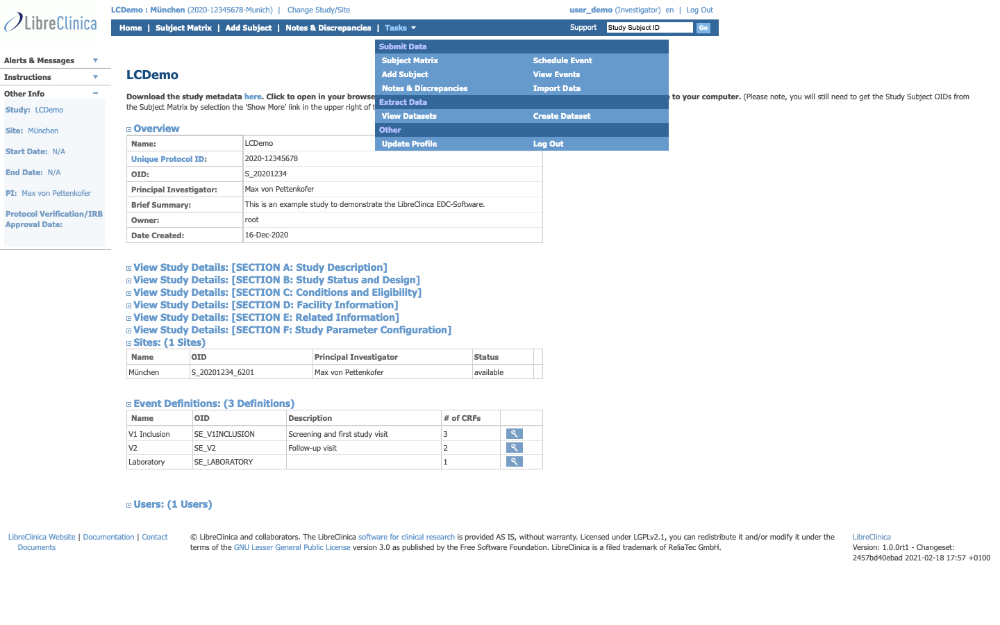

- **URL:** `/pages/login/login` (Spring MVC) → submits to `/j_spring_security_check`
- **Spring Security config:** [web/src/main/webapp/WEB-INF/security-config.xml](../../../../web/src/main/webapp/WEB-INF/security-config.xml)
- **Inputs:** `j_username`, `j_password`, plus a 2FA code when `2fa.activated=true` (see [administrator manual](../../../manuals/administrator-manual.md))
- **Buttons:** Login, Submit Password Request, Cancel
- **Side flows reachable from login:** "Forgot Password?" → `RequestPassword` form (7 inputs: username, email, challenge Q/A, new password, etc.)

### 1.2 Forced password change on first login

- **Trigger:** `password_reset` flag on `user_account` after admin creation/reset
- **Servlet:** `org.akaza.openclinica.control.login.ResetPasswordServlet` (see [web.xml](../../../../web/src/main/webapp/WEB-INF/web.xml))
- **Required:** old password, new password ×2, password challenge question + answer

### 1.3 Update profile / change password

- **URL:** `/UpdateProfile`
- **Servlet:** `org.akaza.openclinica.control.login.UpdateProfileServlet`
- **Captured form fields:** name, email, phone, language, password (required for any change), 2FA toggle, password challenge Q/A
- **Confirmation step:** posts to `ConfirmUserProfileUpdates` before persisting

### 1.4 Logout

- **URL:** `/j_spring_security_logout` (Spring Security)

---

## 2. Top navigation (Investigator)

Captured live for `user_demo`:

| Position | Label | URL | Backing servlet |
|---|---|---|---|
| Header-left | Study name "LCDemo" | `/ViewStudy?id=3&viewFull=yes` | `control.admin.ViewStudyServlet` |
| Header-left | Site "München" | `/ViewSite?id=4` | `control.managestudy.ViewSiteServlet` |
| Header-left | Change Study/Site | `/ChangeStudy` | `control.login.ChangeStudyServlet` |
| Header-right | `user_demo (Investigator) en` | `/UpdateProfile` | `control.login.UpdateProfileServlet` |
| Header-right | Log Out | `/j_spring_security_logout` | Spring Security |
| Top nav | Home | `/MainMenu` | `control.MainMenuServlet` |
| Top nav | Subject Matrix | `/ListStudySubjects` | `control.submit.ListStudySubjectsServlet` |
| Top nav | Add Subject | `/AddNewSubject` | `control.submit.AddNewSubjectServlet` |
| Top nav | Notes & Discrepancies | `/ViewNotes?module=submit` | `control.managestudy.ViewNotesServlet` |
| Top nav | **Tasks ▾** (dropdown) | — | (rendered client-side) |
| Top nav | Subject Subject ID search | `/ListStudySubjects` (GET, `findSubjects_f_studySubject.label`) | same servlet |

### Tasks dropdown (Investigator)

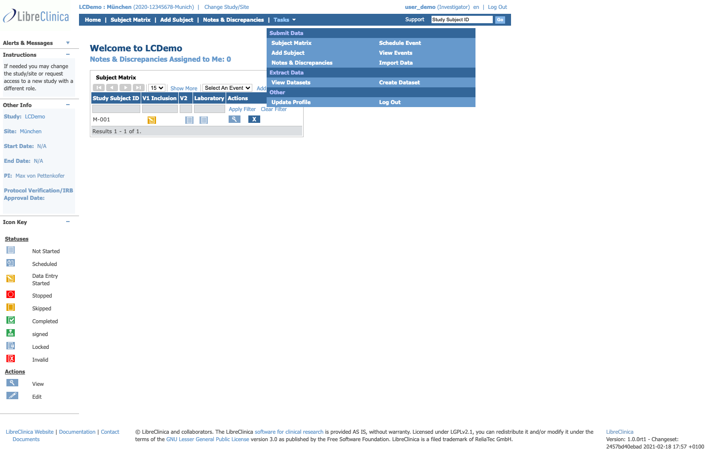

Grouped sections — **Investigator sees fewer sections than Data Manager**:

- **Submit Data** — Subject Matrix · Add Subject · Notes & Discrepancies · Schedule Event · View Events · Import Data
- **Extract Data** — View Datasets · Create Dataset
- **Other** — Update Profile · Log Out

Sections **not visible** to Investigator (visible to Data Manager): Monitor and Manage Data, Study Setup.

---

## 3. Home / Subject Matrix dashboard

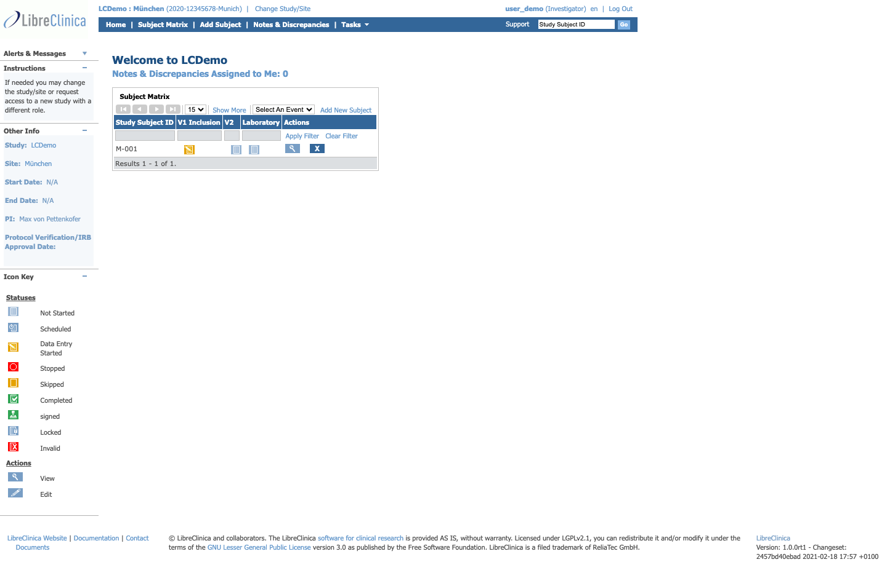

- **URL:** `/MainMenu`
- **Servlet:** `org.akaza.openclinica.control.MainMenuServlet`
- **JSP:** `web/src/main/webapp/WEB-INF/jsp/MainMenu.jsp` (or under `jsp/include/`)
- **Page sections observed:**
  - Left sidebar: *Alerts & Messages*, *Instructions* ("If needed you may change the study/site..."), *Other Info* (Study/Site/Start/End/PI/Protocol Verification IRB date), *Icon Key* (status legend)
  - Main: "Welcome to LCDemo", `Notes & Discrepancies Assigned to Me: N` link, **Subject Matrix** table
  - Footer: version + changeset, LGPL notice, links to Documentation/Contact/Documents
- **Subject Matrix in this view:** small embedded table per-site (M-001 visible for München)

### 3.1 Subject Matrix (dedicated page)

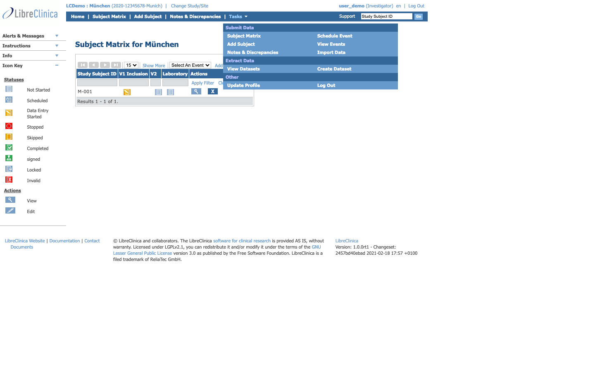

- **URL:** `/ListStudySubjects`
- **Servlet:** `control.submit.ListStudySubjectsServlet`
- **H1 observed:** "Subject Matrix for München"
- **Columns observed:** Study Subject ID · V1 Inclusion · V2 · Laboratory · Actions
- **Per-row controls:** View (magnifier), Edit (pencil), event status icons per scheduled event
- **Header controls:** Show More (reveals Secondary ID + other filterable columns), Select An Event (switches the matrix view to per-CRF columns for one event), Add New Subject, Apply Filter, Clear Filter
- **Pagination:** 15/25/50 per page

---

## 4. Subject management

### 4.1 Add Subject

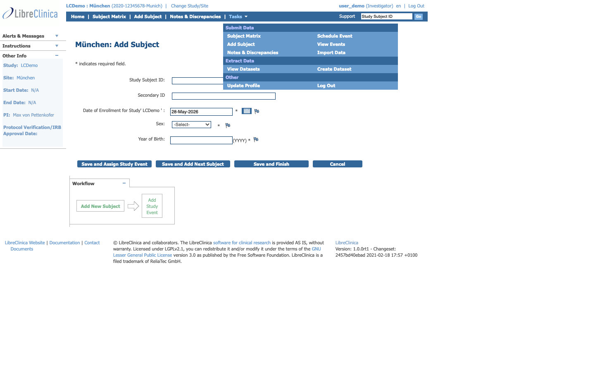

- **URL:** `/AddNewSubject`
- **Servlet:** `control.submit.AddNewSubjectServlet`
- **Form fields captured (`POST AddNewSubject`):** `label` (Study Subject ID), `uniqueIdentifier`, `secondaryLabel`, `enrollmentDate`, `gender`, `yob` (year of birth, when enabled), `submitted`, plus the three save modes
- **Save buttons:**
  - **Save and Assign Study Event** — chains to `/CreateNewStudyEvent` after persisting
  - **Save and Add Next Subject** — keeps user on the form
  - **Save and Finish** — returns to Subject Matrix
- **Date picker:** legacy `Calendar.setup()` widget (jscalendar) — flagged for replacement in Phase E
- **Three entry points** documented in manual: Subject Matrix "Add New Subject" link, top-nav "Add Subject", Tasks → Submit Data → Add Subject

### 4.2 Subject Matrix filtering & search

- **Quick search:** input "Study Subject ID" + Go button (top-right of every page) → `/ListStudySubjects?findSubjects_f_studySubject.label=…`
- **Column filters:** per-column input row in the matrix, with `findSubjects_f_*` query parameters
- **Show More:** reveals additional filterable columns (Secondary ID, Status, etc.)
- **Sorting:** any blue column header

### 4.3 Subject details / view

- **Trigger:** clicking the View (magnifier) icon in the Subject Matrix row
- **URL pattern:** `/ViewStudySubject?id=<n>` (servlet `control.submit.ViewStudySubjectServlet`)
- **Sign Subject (electronic signature):** green pen icon in the Actions column → `/SignStudySubject?id=<n>` (servlet `control.submit.SignStudySubjectServlet`) — requires re-entering username + password; affects all CRFs of the subject

---

## 5. Event management

### 5.1 Schedule Event

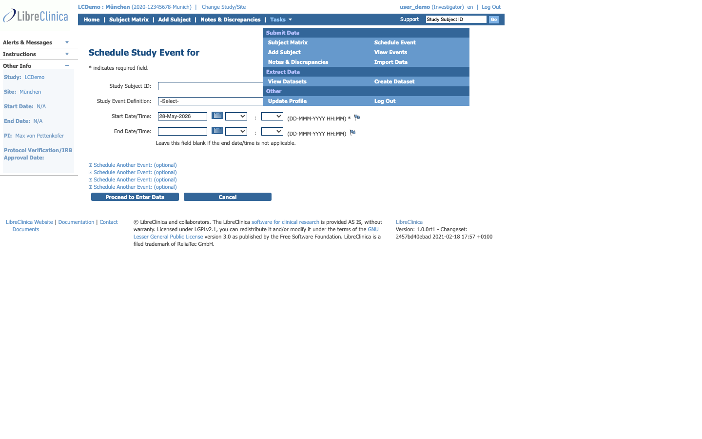

- **URL:** `/CreateNewStudyEvent`
- **Servlet:** `control.submit.CreateNewStudyEventServlet`
- **Three entry points:** Tasks → Submit Data → Schedule Event · Subject Matrix cell pop-up "Schedule" · "Save and Assign Study Event" on Add Subject
- **Form fields:** Study Subject ID (required if reached via menu), Event Definition selector, Location, Start Date, End Date
- **Required marker:** red asterisk
- **Outcome:** "Proceed to Enter Data" button forwards to `/EnterDataForStudyEvent?eventId=<n>`

### 5.2 View Events (cross-subject)

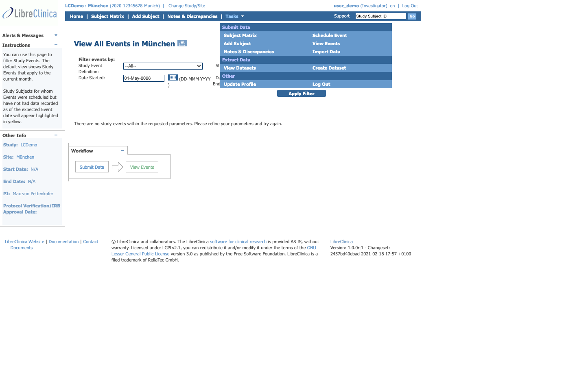

- **URL:** `/ViewStudyEvents`
- **Servlet:** `control.managestudy.ViewStudyEventsServlet`
- **Purpose:** site-wide list of scheduled events with status, sortable/filterable
- **Columns:** Subject ID, Event, Location, Start/End, Status

### 5.3 Edit Event attributes

- **Trigger:** Subject Matrix → click event cell → pop-up → "View/Enter Data" → "Edit Study Event" (pencil icon in upper-right)
- **URL pattern:** `/UpdateStudyEvent?eventId=<n>` (servlet `control.managestudy.UpdateStudyEventServlet`)
- **Editable:** Location, Start/End dates, **status** (Skipped, Stopped — manual override)

### 5.4 Enter or Validate Data (per-event CRF list)

- **URL:** `/EnterDataForStudyEvent?eventId=<n>`
- **Servlet:** `control.submit.EnterDataForStudyEventServlet`
- **Page lists:** all CRFs in the event, each with version selector, status, three actions (pencil = enter, magnifier = view, printer = print PDF)

---

## 6. CRF data entry

The data-entry pages are the **most performance-critical and most JSP-heavy** part of the Investigator UX.

### 6.1 Initial data entry

- **URL:** `/InitialDataEntry?ecId=<n>`
- **Servlet:** `control.submit.InitialDataEntryServlet`
- **Filter mapping:** has dedicated `compressFilter` for response gzip ([web.xml:118](../../../../web/src/main/webapp/WEB-INF/web.xml))
- **UI elements:**
  - Header: CRF name + version, Subject ID, *CRF Header Info* collapsible (Event date, Study, Site, Subject Sex/Age, Discrepancy totals)
  - Tabs (Sections): clicked to switch, "– Select to Jump --" dropdown alt nav, per-tab item-count "answered/total"
  - Per-item: input field + flag icon (discrepancy/note), red asterisk if required
  - Bottom: Save, Save and Exit, Mark CRF Complete checkbox, Exit
- **Unsaved-changes warning:** JS confirm before navigation

### 6.2 Double data entry

- **URL:** `/DoubleDataEntry`
- **Servlet:** `control.submit.DoubleDataEntryServlet`
- **Filter mapping:** compressFilter ([web.xml:130](../../../../web/src/main/webapp/WEB-INF/web.xml))
- **Purpose:** independent second-pass data entry by a different user, with reconciliation; reaches the same JSP layout as Initial Data Entry

### 6.3 Administrative editing

- **URL:** `/AdministrativeEditing`
- **Servlet:** `control.submit.AdministrativeEditingServlet`
- **Purpose:** edit data on a CRF that is already marked complete — triggers automatic *Reason for Change* discrepancy

### 6.4 View Section Data Entry (read-only)

- **URL:** `/ViewSectionDataEntry?ecId=<n>`
- **Servlet:** `control.managestudy.ViewSectionDataEntryServlet`
- **Purpose:** view-only render of a CRF section (also used by Monitor; see [monitor catalogue](monitor-features.md))

### 6.5 Section preview

- **URL:** `/SectionPreview`
- **Servlet:** `control.managestudy.ViewSectionDataEntryPreview`
- **Purpose:** preview CRF section without entering DE flow (used during CRF design too)

### 6.6 Mark CRF Complete

- **Mechanism:** checkbox on the last section + Save → JS confirm pop-up → status transitions to Completed (must be saved, the checkbox alone does nothing if Cancel is pressed)
- **Status icon flow:** Not Started → Data Entry Started → Completed (per [investigator manual §status](../../../manuals/investigator-manual.md))
- **Print CRF:** printer-icon on the CRF list → `/PrintCRFForm` (servlet `control.submit.PrintCRFFormServlet`)

### 6.7 Sign CRFs (electronic signature)

- **Trigger:** Subject Matrix → green pen icon in Actions column for a fully-Completed subject
- **URL:** `/SignStudySubject?id=<n>`
- **Servlet:** `control.submit.SignStudySubjectServlet`
- **Legal text observed in manual:** "As the investigator or designated member of the investigator's staff, I confirm that the electronic case report forms for this subject are a full, accurate, and complete record of the observations recorded. I intend for this electronic signature to be the legally binding equivalent of my written signature."
- **Requires:** username + password re-entry; resets to *Completed* status (un-signed) if any data is later changed

---

## 7. Notes & Discrepancies

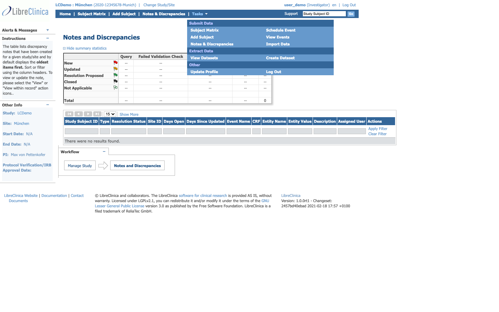

### 7.1 List / matrix view

- **URL:** `/ViewNotes?module=submit`
- **Servlet:** `control.managestudy.ViewNotesServlet`
- **Summary matrix:** counts per type × status at top of page
- **Columns (with column-filters):** Subject ID, CRF, Item, Description, Type, Resolution Status, Days Open, Days Since Updated, Assigned User
- **Sortable on:** Subject ID, Days Open, Days Since Updated
- **Numeric filters support comparators:** `<7`, `>0` (string in input box)
- **Actions per row:** View (magnifier — new window with discrepancy only), View Within Record (right-arrow — CRF + discrepancy)

### 7.2 Notes Assigned to Me (shortcut)

- **URL:** `/ViewNotes?module=submit&listNotes_f_discrepancyNoteBean.user=user_demo`
- Same servlet, pre-filtered to current user
- **Home page link:** "Notes & Discrepancies Assigned to Me: N"

### 7.3 Discrepancy types & statuses (Investigator perspective)

| Type | Created by | Statuses Investigator can set |
|---|---|---|
| Failed Validation Check | LibreClinica (auto, when validation fails) | New, Updated, Resolution Proposed |
| Annotation | Investigator (free-form note) | Not Applicable (only) |
| Query | Monitor | Updated, Resolution Proposed (cannot Close — Monitor-only) |
| Reason for Change | LibreClinica (auto, when changing a completed CRF) | Not Applicable (only) |

- **Flag colours:** blue = new, yellow = updated, green = resolution proposed, black = closed, white = annotation / reason for change
- **Investigator cannot:** Close a discrepancy (Monitor-only), assign discrepancies to other users

### 7.4 Add / update discrepancy

- **Trigger:** flag icon next to any CRF input field, or "Begin New Thread" on an existing annotation
- **Servlet:** `control.managestudy.UpdateSubjectDiscrepancyNoteServlet` (POST), `control.managestudy.CreateDiscrepancyNoteServlet` (GET)
- **Form fields observed (from manual):** Description (required), Detailed Note, Type, Set to Status, Email Assigned User (checkbox)

### 7.5 Download discrepancies

- **Trigger:** down-arrow icon above the matrix
- **Formats:** PDF, CSV
- **Servlet:** `control.extract.DiscrepancyNoteOutputServlet` ([web.xml:285](../../../../web/src/main/webapp/WEB-INF/web.xml))

---

## 8. Data import (limited Investigator scope)

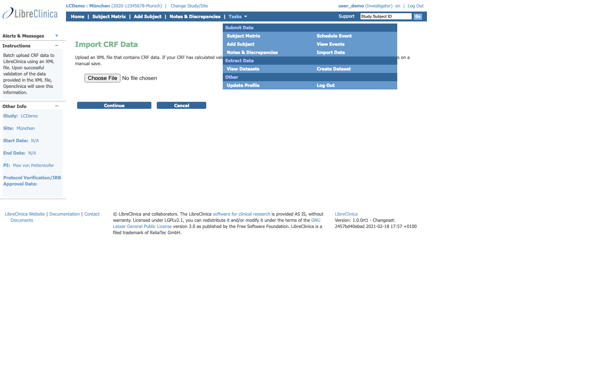

- **URL:** `/ImportCRFData`
- **Servlet:** `control.submit.ImportCRFDataServlet`
- **Visible to Investigator** in the Tasks menu (per crawl) — full design intent and access matrix should be verified for MUW deployment
- **Workflow:** upload CDISC ODM XML → preview → confirm import → background job
- **Job tracking:** `/ViewImportJob` (`control.admin.ViewImportJobServlet`) — listed in web.xml but not surfaced in Investigator Tasks menu in the demo

---

## 9. Data extraction

### 9.1 View Datasets

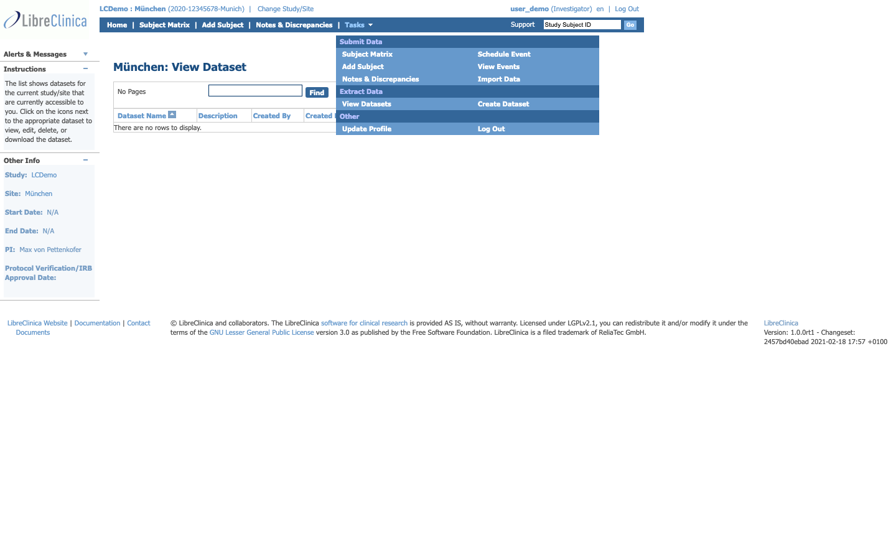

- **URL:** `/ViewDatasets`
- **Servlet:** `control.extract.ViewDatasetsServlet`
- **Listing:** dataset name, owner, last-updated, download formats

### 9.2 Create Dataset

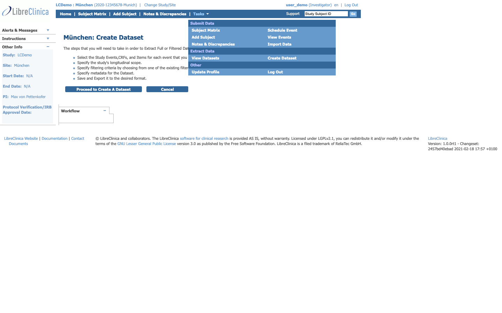

- **URL:** `/CreateDataset`
- **Servlet:** `control.extract.CreateDatasetServlet`
- **Wizard steps observed:** event/CRF/item selection → filter → output formats (ODM 1.2/1.3, SPSS, Excel, CSV, Tab-delimited) → preview → save
- **Background job system:** Quartz; jobs visible via `/ViewJob` and `/ViewAllJobs`

---

## 10. Study / site context

### 10.1 View Study

- **URL:** `/ViewStudy?id=<n>` (header link to current study, accessible from anywhere)
- **Servlet:** `control.admin.ViewStudyServlet`
- **Sections observed:** Study Details, Eligibility, Status, Parameter Configuration, Event Definitions, CRF Assignment per Event, Sites, Users (read-only for Investigator)

### 10.2 View Site

- **URL:** `/ViewSite?id=<n>`
- **Servlet:** `control.managestudy.ViewSiteServlet`
- **Sections:** Site Details, Site Status, Investigator/Coordinator users, subjects at site, event status summary

### 10.3 Change Study/Site

- **URL:** `/ChangeStudy`
- **Servlet:** `control.login.ChangeStudyServlet`
- **UI:** radio-button list of studies/sites the user has any role in → Confirm step
- **Active study persisted on:** `user_account.active_study`

---

## 11. Footer & ancillary

- **Documents** → `/DocumentList` — *not mapped via web.xml*, likely a static directory or pages-servlet route; check [pages-servlet.xml](../../../../web/src/main/webapp/WEB-INF/pages-servlet.xml)
- **Contact** → `/Contact` (servlet `control.login.ContactServlet`)
- **Support** → external link (LibreClinica community)
- **Documentation** → external link (`libreclinica.org/documentation`)
- **Version + changeset** rendered from build properties (observed: `1.0.0rt1 - Changeset: 2457bd40ebad 2021-02-18`)

---

## 12. Features NOT visible to Investigator (but exist for other roles)

Captured by comparing the three role walks. The Investigator does **not** see:

- Tasks → Monitor and Manage Data (SDV, Study Audit Log, Groups, CRFs, Rules)
- Tasks → Study Setup (View Study edit mode, Build Study, Users)
- Top-nav "SDV" button (Monitor)
- Top-nav "Study Audit Log" (Data Manager, Monitor)
- Any CRF creation, study definition, or user management UI

See [monitor-features.md](monitor-features.md) and [data-manager-features.md](data-manager-features.md) for cross-role gaps to design around.

---

## 13. Deep-crawl additions (one click deeper)

A second-pass crawl drilled into the most important workflow sub-pages. All screens still read-only.

### 13.1 View Subject detail (M-001)

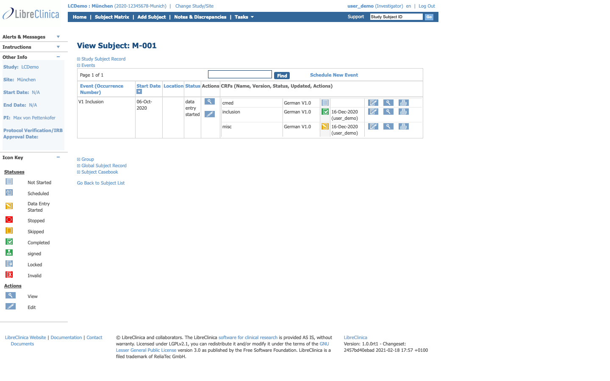

- **URL:** `/ViewStudySubject?id=<n>`
- **Servlet:** `control.submit.ViewStudySubjectServlet`
- **H1:** "View Subject: M-001"
- **Collapsible sections observed:** Study Subject Record · **Events** (expanded by default) · Group · Global Subject Record · Subject Casebook
- **Events table columns:** Event (Occurrence Number) · Start Date · Location · Status · Actions · CRFs (Name, Version, Status, Updated, Actions)
- **Events table data for M-001:**
  - V1 Inclusion · 06-Oct-2020 · (no location) · data entry started · with 3 CRFs: `cmed`, `inclusion`, `misc` (all German V1.0)
  - Per-CRF: last-updated date + user + per-CRF actions (Edit pencil, View magnifier, Print printer)
- **Page-level controls:** "Schedule New Event" link, "Find" filter input over events, "Go Back to Subject List" link
- **Extra buttons captured:** Get Link, Open — opens **Subject Casebook** (PDF render of all completed CRFs for one subject — useful for paper audit trails)

### 13.2 Enter or Validate Data for CRFs in V1 Inclusion

- **URL:** `/EnterDataForStudyEvent?eventId=<n>`
- **Servlet:** `control.submit.EnterDataForStudyEventServlet`
- **H1:** "Enter or Validate Data for CRFs in V1 Inclusion"
- **What's on this page:** the actual per-event CRF list with pencil (data entry), magnifier (view), printer (PDF) icons per CRF — this is the page the manual refers to as "Enter or Validate Data for CRFs in [Event Name]"
- **Per-CRF version selector:** dropdown if multiple versions exist; default version preselected
- **"Edit Study Event" link** (upper-right pencil) → `/UpdateStudyEvent` — Investigator can edit event status here (Skipped, Stopped)

### 13.3 Schedule Study Event with subject + definition context

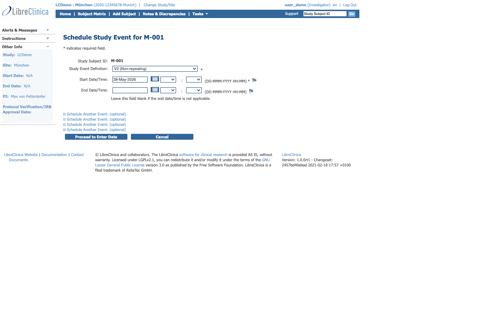

- **URL:** `/CreateNewStudyEvent?studySubjectId=<n>&studyEventDefinition=<n>`
- **Servlet:** `control.submit.CreateNewStudyEventServlet`
- **H1:** "Schedule Study Event for M-001"
- **Form fields:** Event Definition (pre-selected when query params present, otherwise dropdown), Location (text), Start Date (date picker), End Date (date picker)
- **Validation:** Start Date required (red asterisk), End Date may be required depending on event def configuration
- **Outcome:** redirects to `/EnterDataForStudyEvent` upon save

### 13.4 Notes & Discrepancies filtered to current user

- **URL:** `/ViewNotes?module=submit&listNotes_f_discrepancyNoteBean.user=user_demo`
- Same servlet; pre-filtered to the logged-in user's assigned notes
- **Same matrix layout** as the unfiltered view — useful pre-built shortcut

### 13.5 Subject Matrix grouped by event (`Select An Event`)

- **URL:** `/ListStudySubjects?event=<eventDefId>`
- Same `ListStudySubjectsServlet`
- **Layout changes:** columns become per-CRF for that event (instead of per-event) — investigator can see at a glance which CRFs of one specific event are at which status across all subjects
- **Use case:** the page-level "Show More" expansion exposes Secondary ID + extra filterable columns when in this view

---

## 14. JSP file map (for Phase E rewrite scoping)

JSPs for Investigator-reachable servlets live primarily under:

- [web/src/main/webapp/WEB-INF/jsp/submit/](../../../../web/src/main/webapp/WEB-INF/jsp/submit/) — data entry, subject management, event scheduling, signing
- [web/src/main/webapp/WEB-INF/jsp/managestudy/](../../../../web/src/main/webapp/WEB-INF/jsp/managestudy/) — Notes & Discrepancies, View Site
- [web/src/main/webapp/WEB-INF/jsp/extract/](../../../../web/src/main/webapp/WEB-INF/jsp/extract/) — datasets, downloads
- [web/src/main/webapp/WEB-INF/jsp/login/](../../../../web/src/main/webapp/WEB-INF/jsp/login/) — login, profile, password reset, ChangeStudy
- [web/src/main/webapp/WEB-INF/jsp/managestudy/studySubject/](../../../../web/src/main/webapp/WEB-INF/jsp/managestudy/studySubject/) — Subject Matrix templates

Exact JSP per servlet can be recovered from `RequestDispatcher.forward(...)` calls inside each servlet `processRequest()` — out of scope for this catalogue but mechanical to extract per-feature when needed.

---

## 15. Open follow-ups / known gaps in this catalogue

- **Sub-pages not yet drilled** (one click deeper from the surface walk):
  - Subject detail (click subject M-001)
  - Event detail pop-up + "View/Enter Data"
  - Full CRF data entry view of one CRF
  - Add Discrepancy Note modal (rendered in a child window)
  - Create Dataset wizard step screenshots
- **2FA flows** (APPLICATION and LETTER) not exercised — see [administrator-manual.md](../../../manuals/administrator-manual.md)
- **Force-password-change first-login screen** not observed (demo users already past first login)
- **Multi-language UI** — `en` shown; LibreClinica supports many locales (de, fr, es, pt, zh — see [web/src/main/webapp/images/](../../../../web/src/main/webapp/images/)) — locale switching not exercised

Recommended next pass: run the crawler from each role's home, but click **one level deeper** from each table row (Subject Matrix → subject detail; CRF list → one CRF; Notes list → one note → "View Within Record"). Doing so doubles the screen count but covers the actual day-to-day workflow.
