# Phase E — Investigator role UI feature catalogue

**Source:** live walkthrough of `libreclinica.reliatec.de/lc-demo01` as `user_demo` (role: Investigator), 2026-05-28, cross-referenced with [web.xml](../../../../web/src/main/webapp/WEB-INF/web.xml) servlet mappings and existing [investigator manual](../../../manuals/investigator-manual.md).

**SPA coverage, added 2026-09-30:** a second walkthrough, of the local dev stack (`http://127.0.0.1:8081`, build `1.5.0-beta.15-muw` of 2026-09-30 08:51 UTC), as `manual_investigator` on 2026-09-30, with `manual_crc` for the CRC differences (§17). The walk was read-only: every screen was fetched with GET and its HTML read, no form was submitted and no action link was followed. It was cross-referenced with:

- [LegacyServletRegistry.java](../../../../web/src/main/java/at/ac/meduniwien/ophthalmology/libreclinica/config/LegacyServletRegistry.java), which has held every legacy URL mapping since Phase C.16;
- the servlet and JSP source under `control/submit/`, `control/managestudy/`, `control/extract/`, `control/login/` and the matching `jsp/` folders;
- the SPA [router](../../../../web/src/spa/src/router/index.ts), views, stores and `/pages/api/v1/**` controllers (the endpoints the Investigator's views call were also read live with GET);
- [administrator-features.md](administrator-features.md), whose method and verdicts this revision follows, and R1.0 of [the retirement plan](../jsp-retirement-plan-2026-09-30.md).

**Purpose:** baseline inventory so the Phase E SPA rewrite has a complete checklist of features to preserve. See [README](README.md) for methodology.

**New in this revision: an *SPA coverage* column on every feature table.** It names the SPA route and view that replace each feature (or `—`) and gives a verdict. The notes that go with it sit under each feature, in paragraphs marked **2026-09-30**; where a verdict is PARTIAL, they say which fields or actions are missing. [DR-018](../decision-record.md#dr-018--the-legacy-jsp-layer-is-retired-in-full-admin-screens-included) retires screens against this column, so it is the part to keep current.

The 2026-05-28 text is kept as recorded. Its servlet names use the pre-DR-010 `org.akaza.openclinica` packages and `web.xml`; the tables use the current `control.*` names under `at.ac.meduniwien.ophthalmology.libreclinica` and the registry.

> Per [DR-003](../decision-record.md#dr-003--hard-fork-from-upstream-reliateclibreclinica) the demo runs the same upstream code that's vendored into this repo, so URLs and servlet classes are authoritative for our codebase too. The `user_demo` account on the demo is assigned role **Investigator** at site **München** within study **LCDemo**.

> **Verdicts**
>
> - **COVERED**: an SPA route does the same job, checked in the view and in its API.
> - **PARTIAL**: an SPA route does part of the job; the notes say what is missing.
> - **NOT COVERED**: no SPA route does the job. This includes features the backend offers to the Investigator but no view the Investigator can open calls ("API only").
>
> Where the evidence was thin, the verdict is NOT COVERED rather than COVERED. A feature that no longer exists on this build is marked *obsolete*, and a legacy screen that fails on this build is marked **broken on this build**. Both still get a verdict, so the counts in §18 stay mechanical.

> **The 2026-09-30 account.** `manual_investigator` holds `study_user_role.role_name = Investigator` (role 4) on Default Study itself, not on a site.
>
> - The legacy UI labels role 4 "Data Specialist" at study level and "Investigator" at site level (`terms.properties`). This build therefore shows "manual_investigator (Data Specialist)" where the demo showed "user_demo (Investigator)".
> - The SPA reports the role as `Investigator` (`GET /pages/api/v1/me`). Default Study enrols the nAMD study module.
> - No study on the stack has sites, so the site-level screens (§10.2) were not seen.

---

## 1. Authentication & profile

| Label | URL | Backing servlet | SPA coverage |
|---|---|---|---|
| Login with user name and password (§1.1) | `/pages/login/login` → POST `/j_spring_security_check` | `webmvc.WebMvcConfig` bean `/login/login` (a 302 to `/app/login` since 2026-06-20) + `web.filter.OpenClinicaUsernamePasswordAuthenticationFilter` | **COVERED** — `/login` → `LoginView.vue` |
| Two-factor code at login, when `2fa.activated=true` (§1.1) | `j_factor` on the same POST | the same filter + `service.otp.TwoFactorService` | **NOT COVERED** — `LoginView.vue` sends no code; dropped by decision (plan §3.1) |
| Forgot password (Request Password form) (§1.1) | `/RequestPassword` | `control.login.RequestPasswordServlet` | **NOT COVERED** — — |
| Forced password change on first login or expiry (§1.2) | `/ResetPassword` | `control.login.ResetPasswordServlet` | **PARTIAL** — `/change-password` → `ChangePasswordView.vue` |
| Update profile (§1.3) | `/UpdateProfile`, then a confirmation page | `control.login.UpdateProfileServlet` | **NOT COVERED** — API only (`PUT /me/profile`) |
| Change password on demand (§1.3) | `/UpdateProfile` | `control.login.UpdateProfileServlet` | **NOT COVERED** — API only (`POST /me/password`) |
| Logout (§1.4) | `/j_spring_security_logout`; `/Logout` | Spring Security; `control.login.LogoutServlet` | **COVERED** — sign-out in `TopBar.vue` |

### 1.1 Login

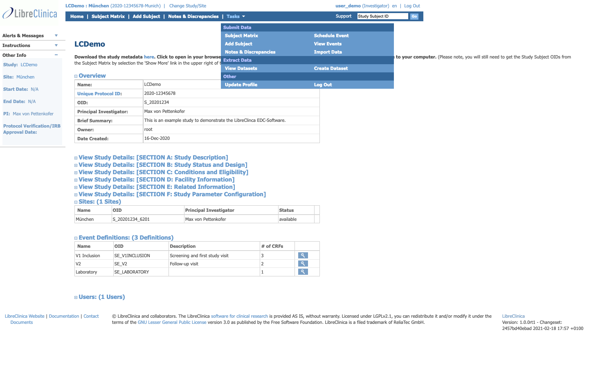

- **URL:** `/pages/login/login` (Spring MVC) → submits to `/j_spring_security_check`
- **Spring Security config:** [web/src/main/webapp/WEB-INF/security-config.xml](../../../../web/src/main/webapp/WEB-INF/security-config.xml)
- **Inputs:** `j_username`, `j_password`, plus a 2FA code when `2fa.activated=true` (see [administrator manual](../../../manuals/administrator-manual.md))
- **Buttons:** Login, Submit Password Request, Cancel
- **Side flows reachable from login:** "Forgot Password?" → `RequestPassword` form (7 inputs: username, email, challenge Q/A, new password, etc.)

**2026-09-30:**

- **The legacy login page is retired.** Every GET of `/pages/login/login` answers 302 to `/LibreClinica/app/login` (`WebMvcConfig.loginLoginRedirectController`, Phase E.8 slice L1). The POST to `/j_spring_security_check` is unchanged, and the SPA's `LoginView.vue` posts `j_username` and `j_password` to it.
- **Login still lands on `/MainMenu`.** The filter redirects there, and that request binds the session's study.
  - Before it ran, `GET /pages/api/v1/me` for `manual_crc` reported `activeStudy: null` and the role `Investigator`; afterwards it reported `CRC`.
  - The SPA follows the redirect, so its login depends on the legacy home page. Plan R1.3 tracks this.
- **Two-factor.** With `2fa.activated=true`, the filter requires a `j_factor` code from every user who has two-factor on.
  - `LoginView.vue` has no field for it.
  - For an outdated LETTER set-up, the SPA tells the user to "Sign in via the legacy UI to enroll", and the legacy login page now redirects back to the SPA.
  - Two-factor is off on this stack, so this was read from source. The plan (§3.1) drops two-factor, which closes the gap.
- **Forgot password.** `/RequestPassword` still renders by URL: User Name, Email, Password Challenge Question and Answer, *Submit Password Request*. It e-mails a new password. Nothing links to it any more: the SPA login has no forgotten-password link, and the legacy page that had one redirects. The form was not submitted.

### 1.2 Forced password change on first login

- **Trigger:** `password_reset` flag on `user_account` after admin creation/reset
- **Servlet:** `org.akaza.openclinica.control.login.ResetPasswordServlet` (see [web.xml](../../../../web/src/main/webapp/WEB-INF/web.xml))
- **Required:** old password, new password ×2, password challenge question + answer

**2026-09-30:** `SecureController` still forwards to `/ResetPassword` while a change is due. The SPA mirrors that: the router sends every navigation to `/change-password` while `mustChangePassword` is true. `ChangePasswordView.vue` asks for the current password and the new one twice.

*Missing in the SPA:* the password challenge question and answer. The legacy page requires them, and only the legacy forgotten-password page (§1.1) uses them.

Not exercised: neither account was due for a change.

### 1.3 Update profile / change password

- **URL:** `/UpdateProfile`
- **Servlet:** `org.akaza.openclinica.control.login.UpdateProfileServlet`
- **Captured form fields:** name, email, phone, language, password (required for any change), 2FA toggle, password challenge Q/A
- **Confirmation step:** posts to `ConfirmUserProfileUpdates` before persisting

**2026-09-30, live form for `manual_investigator`:**

- First Name*, Last Name*, Email*, Institutional Affiliation*, Default Active Study, Password Challenge Question* and Answer*, Old Password*, New Password and Confirm New Password (blank to keep), Phone*; *Confirm Profile Changes*.
- The display language is shown as text, with no selector. The 2FA toggle appears only when two-factor is on.

*Missing in the SPA:* all of it, for a user whose profile is complete.

- `PUT /pages/api/v1/me/profile` and `POST /pages/api/v1/me/password` exist.
- `/first-login` (`FirstLoginView.vue`: display name, locale, terms) opens only while the profile is incomplete.
- `/change-password` sends the user home unless a change is forced.
- The profile menu in `TopBar.vue` has the roles, the manual, *Report a bug*, sign-out and the version, but no profile or password entry.

### 1.4 Logout

- **URL:** `/j_spring_security_logout` (Spring Security)

**2026-09-30:** the SPA's sign-out calls the legacy `GET /Logout` (`stores/auth.ts`). `LogoutServlet` cannot retire before the SPA has its own logout (plan R1.3).

---

## 2. Top navigation (Investigator)

Captured live for `user_demo`:

| Position | Label | URL | Backing servlet | SPA coverage |
|---|---|---|---|---|
| Header-left | Study name "LCDemo" | `/ViewStudy?id=3&viewFull=yes` | `control.admin.ViewStudyServlet` | see §10.1 |
| Header-left | Site "München" | `/ViewSite?id=4` | `control.managestudy.ViewSiteServlet` | see §10.2 |
| Header-left | Change Study/Site | `/ChangeStudy` | `control.login.ChangeStudyServlet` | `/pick-study` → `StudyPickerView.vue`; study switcher in `TopBar.vue` |
| Header-right | `user_demo (Investigator) en` | `/UpdateProfile` | `control.login.UpdateProfileServlet` | see §1.3 |
| Header-right | Log Out | `/j_spring_security_logout` | Spring Security | sign-out in `TopBar.vue` |
| Top nav | Home | `/MainMenu` | `control.MainMenuServlet` | `/` → `HomeView.vue` |
| Top nav | Subject Matrix | `/ListStudySubjects` | `control.submit.ListStudySubjectsServlet` | `/subjects` → `SubjectMatrixView.vue` |
| Top nav | Add Subject | `/AddNewSubject` | `control.submit.AddNewSubjectServlet` | `/subjects/new` → `AddSubjectView.vue` |
| Top nav | Notes & Discrepancies | `/ViewNotes?module=submit` | `control.managestudy.ViewNotesServlet` | `/notes` → `NotesDiscrepanciesView.vue` |
| Top nav | **Tasks ▾** (dropdown) | — | (rendered client-side) | primary navigation in `TopBar.vue` |
| Top nav | Subject Subject ID search | `/ListStudySubjects` (GET, `findSubjects_f_studySubject.label`) | same servlet | none in the top bar; `/subjects` has its own search (§4.2) |

**2026-09-30, captured live for `manual_investigator`:** the same rows, except:

- the header reads "Default Study (default-study)" and "manual_investigator (Data Specialist) en" (see the account note above);
- there is no site link, because the binding is at study level;
- *Add Subject* appears only while the study is available (`navBar.jsp`), as it is here.

The navigation rows are not counted in §18; the features they lead to are.

### Tasks dropdown (Investigator)

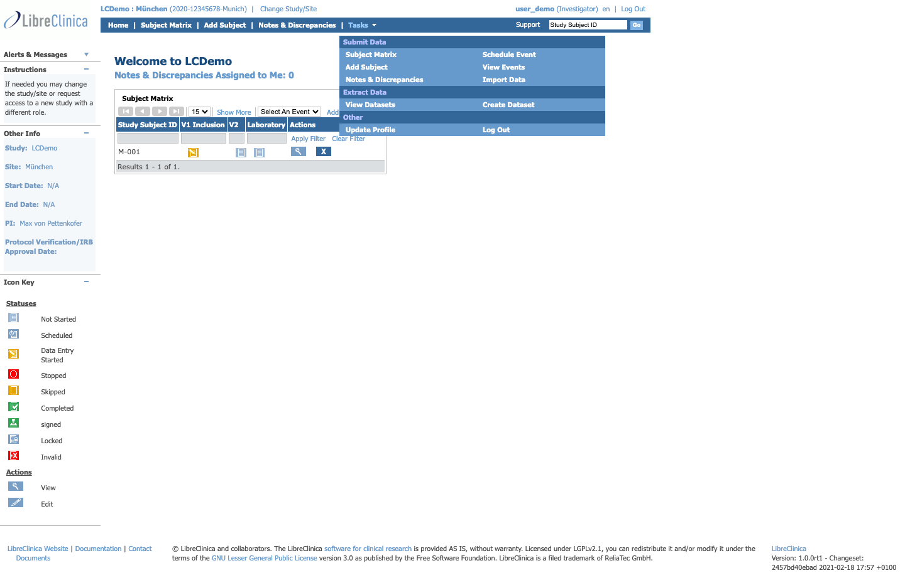

Grouped sections — **Investigator sees fewer sections than Data Manager**:

- **Submit Data** — Subject Matrix · Add Subject · Notes & Discrepancies · Schedule Event · View Events · Import Data
- **Extract Data** — View Datasets · Create Dataset
- **Other** — Update Profile · Log Out

Sections **not visible** to Investigator (visible to Data Manager): Monitor and Manage Data, Study Setup.

**2026-09-30:** captured live, identical to the demo. A *Manual Download* group (the investigator manual PDF) is added when `display.manual=true`; it is off on this stack.

| Tasks entry | URL | SPA coverage |
|---|---|---|
| Subject Matrix · Add Subject · Notes & Discrepancies | as in the top nav | as in the top nav |
| Schedule Event | `/CreateNewStudyEvent` | see §5.1 |
| View Events | `/ViewStudyEvents` | see §5.2 |
| Import Data | `/ImportCRFData` | see §8 |
| View Datasets · Create Dataset | `/ViewDatasets`, `/CreateDataset` | see §9 |
| Update Profile · Log Out | `/UpdateProfile`, `/j_spring_security_logout` | see §1.3, §1.4 |

### SPA navigation for the Investigator (2026-09-30)

- **Top bar** (`TopBar.vue`, `lib/primaryNav.ts`): Home · Subject Matrix · Notes · Due visits · Inbox, the study switcher and the profile menu. A CRC gets Home · Subject Matrix · Notes.
- **Home** (`HomeView.vue`):
  - work queues *Today's CRFs*, *Ready to sign*, *Notes* (open queries), *Image inbox* and *Due visits*;
  - cards *Subject matrix*, *Add subject*, *Patients overview* and *Switch study*;
  - the nAMD workspace card, because Default Study enrols that module.

---

## 3. Home / Subject Matrix dashboard

| Label | URL | Backing servlet | SPA coverage |
|---|---|---|---|
| Home: welcome, notes assigned to me, embedded matrix, study information (§3) | `/MainMenu` | `control.MainMenuServlet` → `menu.jsp` | **PARTIAL** — `/` → `HomeView.vue` |
| Subject Matrix page (§3.1) | `/ListStudySubjects` (+ `/FindSubjectsData` JSON) | `control.submit.ListStudySubjectsServlet`, `FindSubjectsDataServlet` → `managestudy/findSubjects.jsp` | **PARTIAL** — `/subjects` → `SubjectMatrixView.vue` |

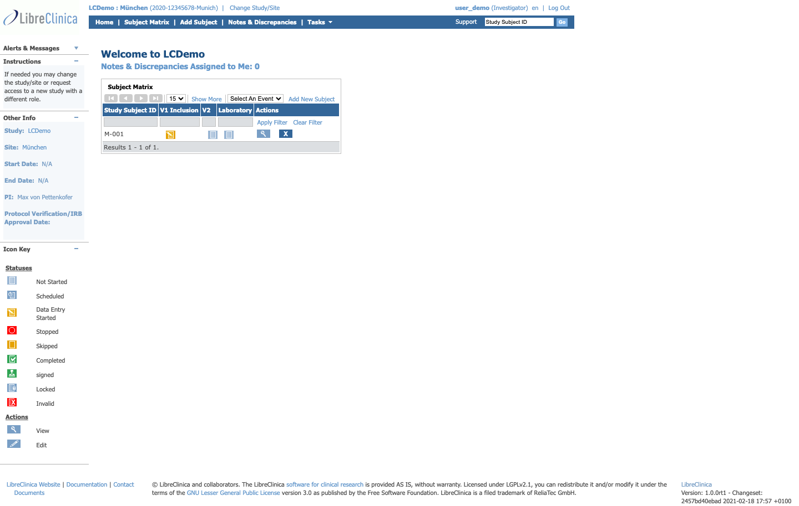

- **URL:** `/MainMenu`
- **Servlet:** `org.akaza.openclinica.control.MainMenuServlet`
- **JSP:** `web/src/main/webapp/WEB-INF/jsp/MainMenu.jsp` (or under `jsp/include/`)
- **Page sections observed:**
  - Left sidebar: *Alerts & Messages*, *Instructions* ("If needed you may change the study/site..."), *Other Info* (Study/Site/Start/End/PI/Protocol Verification IRB date), *Icon Key* (status legend)
  - Main: "Welcome to LCDemo", `Notes & Discrepancies Assigned to Me: N` link, **Subject Matrix** table
  - Footer: version + changeset, LGPL notice, links to Documentation/Contact/Documents
- **Subject Matrix in this view:** small embedded table per-site (M-001 visible for München)

**2026-09-30, `/MainMenu` live:**

- The JSP is `WEB-INF/jsp/menu.jsp`.
- The main area has "Welcome to Default Study", *Notes & Discrepancies Assigned to Me: 0* (→ `ViewNotes?module=submit&listNotes_f_discrepancyNoteBean.user=manual_investigator`, §7.2), and the matrix, drawn by script from `/FindSubjectsData` (§3.1).
- The sidebar has *Other Info* (study, start and end date, PI, protocol verification/IRB approval date) and the icon key.
- The page also carries an *Add New Subject* overlay: Study Subject ID*, Person ID*, Enrollment Date*, Sex*, Date of Birth*, Study Event*, Start Date*. Its script opens it from an element with the id `addSubject`, and no such element is on the page: the link that opened it was in the jmesa toolbar. The overlay cannot be opened.
- Every visit rewrites the caller's own `user_account` row (§19.2).

*Missing in the SPA:*

- **The count of notes assigned to me.** The home page's *Notes* queue counts every open query in the study; the assigned-to-me filter is on `/notes` (§7.2).
- **The study's end date and protocol verification date.** The matrix's study card shows PI, planned start and status.

The SPA adds the work queues: today's CRFs, ready to sign, due visits and the image inbox.

### 3.1 Subject Matrix (dedicated page)

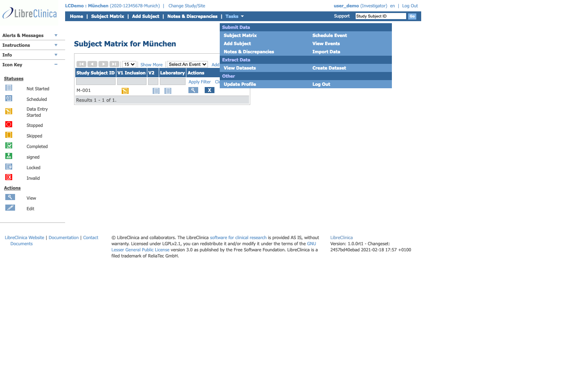

- **URL:** `/ListStudySubjects`
- **Servlet:** `control.submit.ListStudySubjectsServlet`
- **H1 observed:** "Subject Matrix for München"
- **Columns observed:** Study Subject ID · V1 Inclusion · V2 · Laboratory · Actions
- **Per-row controls:** View (magnifier), Edit (pencil), event status icons per scheduled event
- **Header controls:** Show More (reveals Secondary ID + other filterable columns), Select An Event (switches the matrix view to per-CRF columns for one event), Add New Subject, Apply Filter, Clear Filter
- **Pagination:** 15/25/50 per page

**2026-09-30, live:** H1 "Subject Matrix for Default Study", 7 subjects.

- **Columns** (from `/FindSubjectsData`): Study Subject ID · Subject Status · Site ID · OID · Sex · Secondary ID · Person ID · one column per event definition (V1 Inclusion · V2 Day 30 · V3 Day 90) · Actions. A column per group class is added when the study has group classes.
- **No controls.** Since jmesa was evicted, the table is drawn by script from a fixed request (`draw=1&start=0&length=500`), with an empty filter and a fixed sort by label. There are no column filters, no sorting, no paging, no *Show More*, no *Select An Event* and no *Add New Subject* link.
- **Event cells show the wrong icon for every status.**
  - The script's icon map runs 1 → *not scheduled*, 2 → *scheduled*, 3 → *not started* and so on.
  - `SubjectEventStatus` runs 1 = scheduled, 2 = not scheduled, 3 = data entry started, 4 = completed … 8 = signed.
  - So a completed visit shows the *initial data entry* icon, and a signed one the *locked* icon. The tooltip text is correct.
- **Event cells are plain icons.** The pop-up with *Schedule* and *View/Enter Data* is gone.
- **Row actions for the Investigator** (`FindSubjectsDataServlet.availableActions`): View and Remove; Restore on a removed subject; Sign on a signable one. There is no Edit. Live, every row offered View and Remove.

*Missing in the SPA:*

- the Subject Status, Site ID, OID and Person ID columns;
- the Remove, Restore and Sign row actions: Sign is on the subject page (§6.7), and Remove and Restore are not offered to the Investigator (§4.5);
- the per-event view (§13.5).

The SPA adds status filters (today, ready to sign, open events, all complete, signed), *only with queries*, open-query counts per visit, study-eye and group columns, and a CSV export of the filtered rows.

---

## 4. Subject management

| Label | URL | Backing servlet | SPA coverage |
|---|---|---|---|
| Add Subject (§4.1) | `/AddNewSubject` | `control.submit.AddNewSubjectServlet` | **PARTIAL** — `/subjects/new` → `AddSubjectView.vue` |
| Matrix search and filters (§4.2) | `/ListStudySubjects?findSubjects_f_…`; the top-bar search | `control.submit.ListStudySubjectsServlet` | **PARTIAL** — search and filter chips on `/subjects` |
| View Subject: record, events, group, global subject record (§4.3, §13.1) | `/ViewStudySubject?id=<n>` | `control.managestudy.ViewStudySubjectServlet` | **PARTIAL** — `/subjects/:subjectId` → `SubjectDetailView.vue` |
| Edit the study subject record (§4.4) | `/UpdateStudySubject?id=<n>&action=show` | `control.managestudy.UpdateStudySubjectServlet` | **PARTIAL** — *Edit* on `/subjects/:subjectId` |
| Remove / restore a subject (§4.5) | `/RemoveStudySubject?action=confirm&id=<n>`, `/RestoreStudySubject?action=confirm&id=<n>` | `control.managestudy.RemoveStudySubjectServlet`, `RestoreStudySubjectServlet` | **NOT COVERED** — Data Manager and Administrator only in the SPA |
| Subject audit log, with Excel export (§4.6) | `/ViewStudySubjectAuditLog?id=<n>`, `/ExportExcelStudySubjectAuditLog` | `control.managestudy.ViewStudySubjectAuditLogServlet`, `ExportExcelStudySubjectAuditLogServlet` | **NOT COVERED** — API only (`GET /audit?subjectId=`) |
| Subject casebook (§4.7, §13.1) | `rest/clinicaldata/{html/print, json/view, xml/view}/<study>/<subject>/*/*` | Jersey `web.restful.ODMClinicaDataResource` — **broken on this build** | **PARTIAL** — *Download data* (`SubjectExportButton.vue`) on `/subjects/:subjectId` |
| Sign Subject (§4.3) | `/SignStudySubject?id=<n>` | `control.managestudy.SignStudySubjectServlet` | see §6.7 (counted there) |

### 4.1 Add Subject

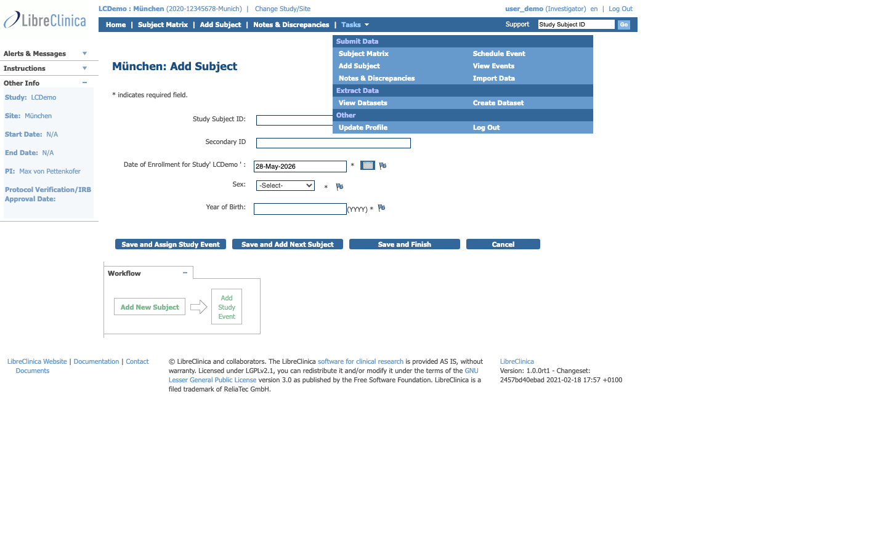

- **URL:** `/AddNewSubject`
- **Servlet:** `control.submit.AddNewSubjectServlet`
- **Form fields captured (`POST AddNewSubject`):** `label` (Study Subject ID), `uniqueIdentifier`, `secondaryLabel`, `enrollmentDate`, `gender`, `yob` (year of birth, when enabled), `submitted`, plus the three save modes
- **Save buttons:**
  - **Save and Assign Study Event** — chains to `/CreateNewStudyEvent` after persisting
  - **Save and Add Next Subject** — keeps user on the form
  - **Save and Finish** — returns to Subject Matrix
- **Date picker:** legacy `Calendar.setup()` widget (jscalendar) — flagged for replacement in Phase E
- **Three entry points** documented in manual: Subject Matrix "Add New Subject" link, top-nav "Add Subject", Tasks → Submit Data → Add Subject

**2026-09-30, live form (Default Study):**

- Study Subject ID*, Person ID*, Secondary ID, Date of Enrollment*, Sex* (Male, Female), Date of Birth*; a discrepancy-note flag on Person ID, the enrolment date, sex and date of birth; the three save buttons and *Cancel*.
- Which fields show, and which are required, follows the study parameters. In Default Study: `subjectPersonIdRequired=required`, `collectDob=1` (full date; `2` gives the demo's year of birth), `genderRequired=true`, `subjectIdGeneration=manual`.
- Group-class selectors appear when the study has group classes; Default Study has none.
- Of the three entry points, the matrix's *Add New Subject* link is gone (§3.1). The top nav and Tasks entries remain.

`AddSubjectView.vue` collects Subject ID*, Secondary ID, Enrolled on*, Sex* (female, male, other, unknown), an arm choice with optional randomisation for Arm-type group classes, study eye and screening date. Its buttons are *Save & add next*, *Save & finish* and *Save & schedule*, which opens the subject page.

*Missing in the SPA:*

- **Person ID and date of birth.** `stores/subjects.ts` and `POST /subjects` accept `personId` and `dateOfBirth`; the view binds neither.
- **The study-parameter rules.** `SubjectsApiController.validateAddSubject` requires ID, sex and enrolment date only. In a study that requires a Person ID or a date of birth, the SPA creates subjects without them.
- **Discrepancy notes on the enrolment fields.**

The SPA adds a live check that the ID is free, randomisation, study eye and screening date.

### 4.2 Subject Matrix filtering & search

- **Quick search:** input "Study Subject ID" + Go button (top-right of every page) → `/ListStudySubjects?findSubjects_f_studySubject.label=…`
- **Column filters:** per-column input row in the matrix, with `findSubjects_f_*` query parameters
- **Show More:** reveals additional filterable columns (Secondary ID, Status, etc.)
- **Sorting:** any blue column header

**2026-09-30:**

- The column filters, *Show More* and sorting are gone from the legacy matrix (§3.1).
- The top-bar search still works for an exact Study Subject ID: `ListStudySubjectsServlet` forwards straight to that subject. Any other text shows the whole matrix.

`SubjectMatrixView.vue` has a search box that matches Subject ID or secondary ID (substring), the status chips and *only with queries*.

*Missing in the SPA:* filters on the other columns, sorting, and jumping to a subject from any page (the SPA top bar has no search).

### 4.3 Subject details / view

- **Trigger:** clicking the View (magnifier) icon in the Subject Matrix row
- **URL pattern:** `/ViewStudySubject?id=<n>` (servlet `control.submit.ViewStudySubjectServlet`)
- **Sign Subject (electronic signature):** green pen icon in the Actions column → `/SignStudySubject?id=<n>` (servlet `control.submit.SignStudySubjectServlet`) — requires re-entering username + password; affects all CRFs of the subject

**2026-09-30, live for M-001** (`ViewStudySubject?action=view&id=1`; the servlet is `control.managestudy.ViewStudySubjectServlet`):

- *Study Subject Record*: Study Subject ID, Person ID, Secondary ID, Date of Birth, OID, Sex, Status, Enrollment Date, Study Name, Site Name, with note flags on Person ID, date of birth, sex and enrolment date. Links: *Audit Logs* (§4.6) and *Edit Record* (§4.4).
- *Events*: keyword filter, sort, *Schedule New Event*.
  - Per event: start date, location, status, *View* (→ §5.4) and *Edit* (→ §5.3).
  - Per CRF: name, version, status, last update, *enter data*, *view* and *print* (§6.6).
  - No event offers the Investigator Remove, Restore or Delete. Those need a study-manager role: `userRole.manageStudy` in `showStudyEventRow.jsp`, which is coordinator or director.
- *Group*, *Global Subject Record* (Person ID, date created, created by, last updated, updated by, status, date of birth, sex) and *Subject Casebook* (§4.7).
- There is no *Sign* link on this page (§6.7).

`SubjectDetailView.vue` shows:

- Subject ID, secondary ID, sex, year of birth, groups, enrolment date, study eye, screening date, open queries, and whether the subject is signed;
- an events table: event, start date, status, data-entry stage, open queries; *Open*; *Edit*, *Sign* and *Cancel*;
- *Schedule event*, *Sign subject* and *Download data*. Lock, unlock and remove are shown to Data Managers and Administrators only.

*Missing in the SPA:*

- Person ID, the full date of birth, OID, study and site name, and the subject status (available, removed);
- the Global Subject Record's created and updated details;
- note flags on the subject fields (§7.4);
- the events' location and their CRF rows, which the SPA shows on the event page (§5.4); filtering and sorting the events.

### 4.4 Edit the study subject record (added 2026-09-30)

- **URL:** `/UpdateStudySubject?id=<n>&action=show` → confirm → submit
- **Servlet:** `control.managestudy.UpdateStudySubjectServlet`
- **Live form for M-001:** Study Subject ID, Secondary ID, Enrollment Date with a note flag; *Assign Subject to Group* when the study has group classes. Sex, date of birth and Person ID are not on it: only an administrator edits them (`/UpdateSubject`, [administrator catalogue §10](administrator-features.md#10-global-subject-registry-tasks--administration--subjects)).

*Edit* on `SubjectDetailView.vue` changes the secondary ID, sex, year of birth and study eye.

*Missing in the SPA:*

- changing the Study Subject ID and the enrolment date;
- group assignment, which the SPA leaves to the Data Manager and Administrator (`canEditCohort`, for trial blinding).

The SPA adds sex and year of birth, which legacy leaves to the administrator.

### 4.5 Remove / restore a subject (added 2026-09-30)

- **URLs:** `/RemoveStudySubject?action=confirm&id=<n>`, `/RestoreStudySubject?action=confirm&id=<n>`: a confirmation page, then a POST.
- **Servlets:** `control.managestudy.RemoveStudySubjectServlet`, `RestoreStudySubjectServlet`. Their `mayProceed` admits the Investigator, the coordinator, the study director and system administrators, and the matrix offers *Remove* on every row (§3.1).
- **SPA:** `POST /subjects/{oid}/remove` and `/restore` exist.
  - `SubjectLifecycleAuthorization.roleMayManageLifecycle` admits the study director and the administrator only.
  - `SubjectDetailView.vue` shows the buttons to Data Managers and Administrators.
  - The Investigator loses this. Whether that is intended is not recorded; it needs a decision before the legacy screens go.
- Not followed: they are removal actions.

### 4.6 Subject audit log (added 2026-09-30)

- **URL:** `/ViewStudySubjectAuditLog?id=<n>` (a pop-up from View Subject), with an Excel export (`/ExportExcelStudySubjectAuditLog`)
- **Servlet:** `control.managestudy.ViewStudySubjectAuditLogServlet`; `mayProceed` admits anyone who may view data.
- **Live for M-001:**
  - a subject header: Study Subject ID, secondary ID, date of birth, Person ID, created by, status;
  - the subject-level audit rows;
  - per event, its audit rows and deleted event CRFs;
  - per event CRF (version, interview date, interviewer, owner), every item change with date and time, user, item, old and new value.
  - The Excel export was not downloaded.
- **SPA:** `/audit-log` admits Monitor, Data Manager and Administrator. `GET /pages/api/v1/audit?subjectId=M-001` answered the Investigator with that subject's rows, but no view the Investigator can open calls it. The Investigator has no audit trail in the SPA, at subject or at item level.

### 4.7 Subject casebook (added 2026-09-30)

- **Legacy: broken on this build.**
  - The *Subject Casebook* box on View Subject offers printable HTML, JSON or CDISC ODM XML, the options notes and discrepancies and audit trail, and *Get Link* and *Open*.
  - It builds `…/rest/clinicaldata/<format>/<study>/<subject>/*/*` (`includes/studySubject/viewStudySubject.js`).
  - All three formats answered **HTTP 404**. The path belongs to the Jersey tree, which does not load on this build (`LegacyServletRegistry` Javadoc).
- **SPA:** *Download data* (`SubjectExportButton.vue`, `POST /studies/{oid}/subjects/{label}/export`) gives an ODM, CSV or PDF snapshot of every event, CRF and item. Where `export.bundle.enabled` is set it also gives a multimodal bundle.
- *Missing in the SPA:*
  - the notes and audit-trail options: `SubjectExportApiController` and `CasebookRenderer` include neither;
  - the HTML and JSON formats;
  - a link to bookmark.
- Not downloaded: each download writes an audit row.

---

## 5. Event management

| Label | URL | Backing servlet | SPA coverage |
|---|---|---|---|
| Schedule Event (§5.1, §13.3) | `/CreateNewStudyEvent` | `control.submit.CreateNewStudyEventServlet` | **PARTIAL** — *Schedule event* (`ScheduleEventDialog.vue`) on `/subjects/:subjectId` |
| View Events across subjects (§5.2) | `/ViewStudyEvents` | `control.managestudy.ViewStudyEventsServlet` — **broken on this build** | **PARTIAL** — `/due-visits` → `DueVisitsView.vue` |
| Edit an event: dates, location, status (§5.3) | `/UpdateStudyEvent?event_id=<n>&ss_id=<n>` | `control.managestudy.UpdateStudyEventServlet` | **PARTIAL** — *Edit* in the events table on `/subjects/:subjectId` |
| Sign an event (§5.5) | status *signed* on `/UpdateStudyEvent` | `control.managestudy.UpdateStudyEventServlet` | **COVERED** — *Sign* (`SignEventDialog.vue`) on `/subjects/:subjectId` |
| Enter or Validate Data: the event's CRF list (§5.4, §13.2) | `/EnterDataForStudyEvent?eventId=<n>` | `control.submit.EnterDataForStudyEventServlet` | **PARTIAL** — `/events/:eventId` → `EventDetailView.vue` |

### 5.1 Schedule Event

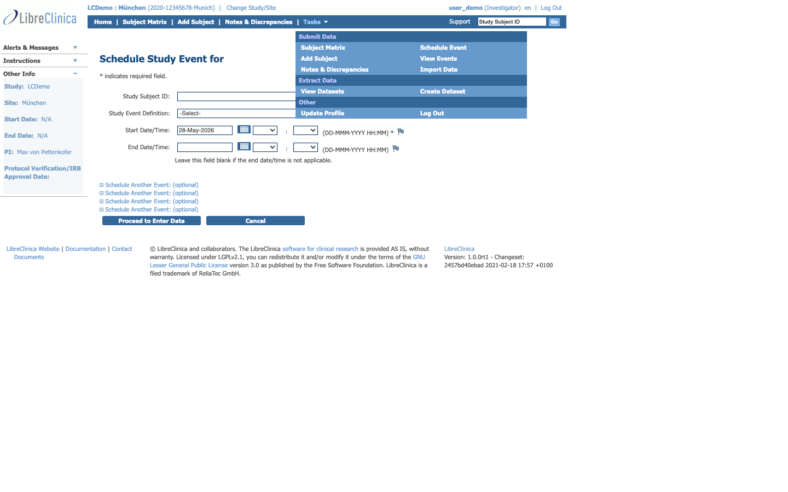

- **URL:** `/CreateNewStudyEvent`
- **Servlet:** `control.submit.CreateNewStudyEventServlet`
- **Three entry points:** Tasks → Submit Data → Schedule Event · Subject Matrix cell pop-up "Schedule" · "Save and Assign Study Event" on Add Subject
- **Form fields:** Study Subject ID (required if reached via menu), Event Definition selector, Location, Start Date, End Date
- **Required marker:** red asterisk
- **Outcome:** "Proceed to Enter Data" button forwards to `/EnterDataForStudyEvent?eventId=<n>`

**2026-09-30, live form:**

- Study Subject ID*, Study Event Definition* (V1 Inclusion, V2 Day 30, V3 Day 90, each *Non-repeating*), Start Date/Time* and End Date/Time, each with a note flag.
- Four optional *Schedule Another Event* blocks (definition, start, end), and *Proceed to Enter Data*.
- Location appears when the study uses it; Default Study does not.
- The matrix cell pop-up entry point is gone (§3.1).

`ScheduleEventDialog.vue` (`POST /events`) takes an event definition, start date, start time and location.

*Missing in the SPA:*

- the end date and time;
- scheduling several events at once;
- note flags on the dates;
- a scheduling page that takes a subject ID: the SPA schedules from the subject's page only;
- going straight on to data entry.

### 5.2 View Events (cross-subject)

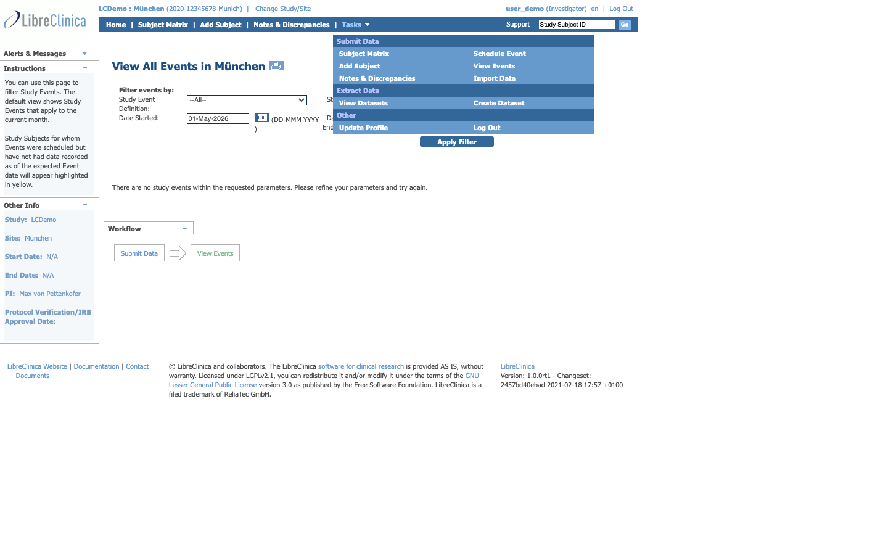

- **URL:** `/ViewStudyEvents`
- **Servlet:** `control.managestudy.ViewStudyEventsServlet`
- **Purpose:** site-wide list of scheduled events with status, sortable/filterable
- **Columns:** Subject ID, Event, Location, Start/End, Status

**2026-09-30: broken on this build.**

- `/ViewStudyEvents` shows the generic "Oops! An error has occurred" page with HTTP 200.
- The application log has a `NullPointerException` in `ViewStudyEventsServlet.findEventByStatusAndDate` (line 451): at least one event in the study has no start date.
- The page therefore fails for every study that has such an event. The log shows it failing for other sessions earlier the same day.

`/due-visits` (`GET /events/due`) lists open visits in a date window, with date, subject, visit, study and status, overdue ones first. The default window runs from two weeks back to two weeks ahead, and the most it allows is 92 days. Live, the default window was empty, and 2020-10-01 to 2020-12-31 returned two overdue visits.

*Missing in the SPA:*

- completed, signed, stopped and skipped events: the SPA lists open visits only;
- filters by event definition and status;
- the per-definition tables and counts;
- the print version.

### 5.3 Edit Event attributes

- **Trigger:** Subject Matrix → click event cell → pop-up → "View/Enter Data" → "Edit Study Event" (pencil icon in upper-right)
- **URL pattern:** `/UpdateStudyEvent?eventId=<n>` (servlet `control.managestudy.UpdateStudyEventServlet`)
- **Editable:** Location, Start/End dates, **status** (Skipped, Stopped — manual override)

**2026-09-30, live forms for M-001** (`UpdateStudyEvent?event_id=<n>&ss_id=<n>`):

- Start Date/Time* and End Date/Time with note flags, and Status. Location appears when the study uses it.
- The status list depends on the event:
  - for the V3 visit, in progress: *data entry started* and *stopped*;
  - for the V1 visit, marked completed while its CRF is still in initial data entry: *data entry started*, *stopped* and *skipped*.
- *Signed* is offered to the Investigator once no CRF is in initial or pending double data entry (§5.5). *Locked* is offered to study managers only.
- The matrix cell pop-up trigger is gone (§3.1); the pencil on View Subject and on Enter Data remains.

*Edit* in `SubjectDetailView.vue` (`PUT /events/{id}`) changes the start date, start time, location and status (*scheduled*, *stopped*, *skipped*).

*Missing in the SPA:*

- the end date and time: `UpdateEventRequest.dateEnded` exists, and the view does not bind it;
- note flags on the dates;
- setting the status back to *data entry started* or *completed*.

The SPA adds *Cancel* with a structured reason (`CancelEventDialog.vue`, `DELETE /events/{id}`). In legacy, removing an event is a study-manager action (§4.3).

### 5.4 Enter or Validate Data (per-event CRF list)

- **URL:** `/EnterDataForStudyEvent?eventId=<n>`
- **Servlet:** `control.submit.EnterDataForStudyEventServlet`
- **Page lists:** all CRFs in the event, each with version selector, status, three actions (pencil = enter, magnifier = view, printer = print PDF)

**2026-09-30, live for event 3 (V3 Day 90, M-001):**

- side panels with the subject's events and their statuses;
- *Edit Study Event*;
- Study Subject ID, event, location, Study Subject OID, start date, end date/time, status and last updated by, with note flags on the location and both dates;
- a CRF table: name, version, status, initial data entry by, double data entry by, with *enter data*, *view data* and *print* (§6.6);
- *View this Subject's Record* and *Exit*.

A version choice appears when a CRF has several versions; none does here.

`EventDetailView.vue` shows the event name, status and start date; *Mark visit complete*, enabled once the required CRFs are complete; a CRF table (name, version, status, required, *Open*, *Start* or *Restore*); and the images filed against the visit.

*Missing in the SPA:*

- the version choice: *Start* always takes the default version, although `POST /events/{id}/crfs/{edc}:start` accepts `crfVersionId`;
- who entered the data, for initial and double entry;
- *view* and *print* per CRF (print is on the CRF page);
- the event's location and end date, and their note flags.

**The two UIs disagree on this CRF's status.** Legacy shows *initial data entry* by root. `GET /events/3` reports `not-started`, because `EventsApiController.statusForEventCrf` maps completion status 1 to *not started*. The SPA's own subject page calls the same visit *in progress*.

### 5.5 Sign an event (added 2026-09-30)

- **Legacy:** *signed* in the status list of `/UpdateStudyEvent`, which leads to `updateStudyEventSigned.jsp` and a password check. `UpdateStudyEventServlet` offers it only to the Investigator, and only when no CRF of the event is in initial data entry or awaiting double entry.
- **SPA:** *Sign* in the event's menu on the subject page, for visits in progress or complete. `SignEventDialog.vue` posts the password and attestation to `POST /events/{id}/sign`. The backend admits the administrator, study director, Investigator and coordinator (`EventEditAuthorization.roleMayEdit`).
- Not exercised: no event was signed.

---

## 6. CRF data entry

The data-entry pages are the **most performance-critical and most JSP-heavy** part of the Investigator UX.

| Label | URL | Backing servlet | SPA coverage |
|---|---|---|---|
| Initial data entry (§6.1) | `/InitialDataEntry?eventCRFId=<n>` | `control.submit.InitialDataEntryServlet` (`DataEntryServlet`) | **PARTIAL** — `/event-crfs/:eventCrfOid` → `CrfEntryView.vue` |
| Double data entry (§6.2) | `/DoubleDataEntry` | `control.submit.DoubleDataEntryServlet` | **COVERED** — second pass in `CrfEntryView.vue`; `/event-crfs/:eventCrfOid/dde-reconcile` → `DdeReconcileView.vue` |
| Administrative editing of a completed CRF (§6.3) | `/AdministrativeEditing` | `control.submit.AdministrativeEditingServlet` | **PARTIAL** — *Reopen* on `CrfEntryView.vue` |
| View a CRF read-only (§6.4) | `/ViewSectionDataEntry?ecId=<n>…` | `control.managestudy.ViewSectionDataEntryServlet` | **COVERED** — `CrfEntryView.vue`, read-only while the CRF is complete or signed |
| Section preview (§6.5) | `/SectionPreview` | `control.managestudy.ViewSectionDataEntryPreview` | **NOT COVERED** — — (*obsolete* for this role) |
| Mark CRF complete (§6.6) | *Mark CRF Complete* + save; `/MarkEventCRFComplete` | `DataEntryServlet`; `control.submit.MarkEventCRFCompleteServlet` | **COVERED** — *Mark complete* on `CrfEntryView.vue`; *Mark visit complete* on `/events/:eventId` |
| Print CRF (§6.6) | printer icon → `rest/clinicaldata/html/print/…` | Jersey `web.restful.ODMClinicaDataResource` — **broken on this build** | **PARTIAL** — `/event-crfs/:eventCrfOid/print` → `PrintableCrfView.vue` |
| Sign the subject's CRFs (§6.7, §4.3) | `/SignStudySubject?id=<n>` | `control.managestudy.SignStudySubjectServlet` | **COVERED** — `/subjects/:subjectId/sign` → `SignSubjectView.vue` |

**2026-09-30: why the entry pages were not opened live.** Opening a legacy data-entry page (initial, double or administrative) puts the CRF on the in-memory list of CRFs being edited, which blocks other users from it until the session leaves. For a CRF with no event-CRF row yet, `DataEntryServlet` also creates that row during the request. The walk used the read-only view (§6.4) and the source instead.

### 6.1 Initial data entry

- **URL:** `/InitialDataEntry?ecId=<n>`
- **Servlet:** `control.submit.InitialDataEntryServlet`
- **Filter mapping:** has dedicated `compressFilter` for response gzip ([web.xml:118](../../../../web/src/main/webapp/WEB-INF/web.xml))
- **UI elements:**
  - Header: CRF name + version, Subject ID, *CRF Header Info* collapsible (Event date, Study, Site, Subject Sex/Age, Discrepancy totals)
  - Tabs (Sections): clicked to switch, "– Select to Jump --" dropdown alt nav, per-tab item-count "answered/total"
  - Per-item: input field + flag icon (discrepancy/note), red asterisk if required
  - Bottom: Save, Save and Exit, Mark CRF Complete checkbox, Exit
- **Unsaved-changes warning:** JS confirm before navigation

**2026-09-30, from source and the read-only view of the same CRF:**

- The header adds date of birth, Person ID and age at enrolment to the *CRF Header Info* recorded above.
- Interviewer Name* and Interview Date*, each with a note flag. Both are required in Default Study (`interviewerNameRequired`, `interviewDateRequired`).
- The CRF's note counts by status appear above the sections.
- Each save runs the study's rules: `DataEntryServlet` calls `RuleSetService.runRulesInDataEntry`. Rules are the study's edit checks; their actions raise notes, send e-mail, insert values and show or hide items.

`CrfEntryView.vue` has:

- a section rail with badges for required, filled, errors and open queries;
- item widgets, including repeating groups and file items, with a note indicator per item;
- *Save draft*, *Mark complete* and *Print*, and unsaved and saving states;
- prefill from the previous visit, and a concurrent-edit banner with a heartbeat lock;
- client-side checks for required items, whole and decimal numbers with minimum and maximum, dates, and allowed codes.

*Missing in the SPA:*

- **The study's rules.** `EventCrfsApiController.saveItems` does not call the rules engine, so edit checks and rule actions do not fire on data entered in the SPA. No rules exist on this stack, so this was read from source.
- **A server-side check of required items at *Mark complete*.** `POST /eventCrfs/{id}/markComplete` states that it trusts the client to have checked them, and enforces only the lock.
- **Interviewer name and interview date.** Starting a CRF in the SPA fills them from the study's defaults (`EventsApiController`, `:start`). No field shows them, and nothing enforces *required*.
- **The CRF header info:** sex, age at enrolment, date of birth, Person ID and site.

### 6.2 Double data entry

- **URL:** `/DoubleDataEntry`
- **Servlet:** `control.submit.DoubleDataEntryServlet`
- **Filter mapping:** compressFilter ([web.xml:130](../../../../web/src/main/webapp/WEB-INF/web.xml))
- **Purpose:** independent second-pass data entry by a different user, with reconciliation; reaches the same JSP layout as Initial Data Entry

**2026-09-30:** not exercised: no CRF on the stack uses double entry.

- The SPA serves the second pass through the same `CrfEntryView.vue` (`GET /eventCrfs/{id}/dde-pass`, `POST …/dde-commit`).
- It serves reconciliation through `DdeReconcileView.vue` (`GET …/dde-conflicts`, `POST …/dde-conflicts/{item}/resolve`).
- The reconcile route admits Data Manager, Administrator and Investigator; its backend refuses other roles.

### 6.3 Administrative editing

- **URL:** `/AdministrativeEditing`
- **Servlet:** `control.submit.AdministrativeEditingServlet`
- **Purpose:** edit data on a CRF that is already marked complete — triggers automatic *Reason for Change* discrepancy

**2026-09-30:** the legacy flow keeps the CRF complete. When the study sets `adminForcedReasonForChange`, every changed item needs a reason, stored as a *Reason for Change* note on the item. Default Study does not set it.

The SPA replaces this flow with *Reopen*:

- A complete CRF is read-only in `CrfEntryView.vue` until the user clicks *Reopen*.
- *Reopen* (`POST /eventCrfs/{id}/markIncomplete`) asks for no reason. It writes an `EVENT_CRF_REOPENED` audit row and sets `event_crf.date_completed` to NULL (`EventCRFDAO.markIncomplete`).
- The reason-for-change requirement is keyed on `date_completed`: `requiresReasonForChange` in `GET /eventCrfs/{id}`, and `postComplete` in `saveItems`. After *Reopen* neither applies.
- So the user edits, saves and marks the CRF complete again without giving any reason, and no Reason for Change note is written.
- The API's reason check and `ReasonForChangeModal` apply only to saves against a CRF that is still complete, which the view never allows.

*Missing in the SPA:* a reason for each change to data that had been marked complete, and honouring `adminForcedReasonForChange`. The audit trail keeps the old and new values and the reopen event, but not why a value changed.

### 6.4 View Section Data Entry (read-only)

- **URL:** `/ViewSectionDataEntry?ecId=<n>`
- **Servlet:** `control.managestudy.ViewSectionDataEntryServlet`
- **Purpose:** view-only render of a CRF section (also used by Monitor; see [monitor catalogue](monitor-features.md))

**2026-09-30, live for Demographics on M-001 V1** (`/ViewSectionDataEntry?ecId=1…`):

- The page shows the header info, the interviewer fields, the CRF's note counts (1 new), the section jump list (S_IDENT, S_VITALS), and the first section's title and instructions — and then no items.
- The seeded CRF versions on this stack have no `item_group_metadata` rows, and the legacy renderer lays out items through them. `GET /eventCrfs/1` returns all five items with their values, and the SPA renders them.
- Versions created through the SPA go through the heritage spreadsheet writer (`CrfsApiController`), which writes those rows. That was not checked live.
- So on this stack the legacy CRF pages cannot be judged live.

In the SPA the Investigator sees a CRF read-only while it is complete or signed; an in-progress CRF opens editable. `/event-crfs/:eventCrfOid/readonly` admits Monitor and Administrator only.

### 6.5 Section preview

- **URL:** `/SectionPreview`
- **Servlet:** `control.managestudy.ViewSectionDataEntryPreview`
- **Purpose:** preview CRF section without entering DE flow (used during CRF design too)

**2026-09-30: obsolete for this role.** `/SectionPreview` is linked only from the CRF-version upload confirmation (`admin/createCRFVersionConfirm.jsp`) and from itself; no Investigator page reaches it. The SPA's form preview is part of the CRF builder, for the Data Manager and Administrator.

### 6.6 Mark CRF Complete

- **Mechanism:** checkbox on the last section + Save → JS confirm pop-up → status transitions to Completed (must be saved, the checkbox alone does nothing if Cancel is pressed)
- **Status icon flow:** Not Started → Data Entry Started → Completed (per [investigator manual §status](../../../manuals/investigator-manual.md))
- **Print CRF:** printer-icon on the CRF list → `/PrintCRFForm` (servlet `control.submit.PrintCRFFormServlet`)

**2026-09-30:**

- **Mark complete.** In the SPA, *Mark complete* completes the CRF. Since 2026-06-21 the visit is completed separately, with *Mark visit complete* on the event page, instead of automatically with its last CRF.
- **Print, legacy: broken on this build.**
  - Every printer icon an Investigator sees builds a `rest/clinicaldata/html/print/…` URL: on View Subject, on Enter Data and in the event pop-up (`eventCrfLayer.jsp`). The blank-form print builds `rest/metadata/html/print/…`.
  - Both belong to the Jersey tree. `rest/clinicaldata/html/print/S_DEFAULTS1/SS_M001/SE_V1_INCLUSION/F_DEMOGRAPHICS_V1` answered HTTP 404.
  - The `/PrintCRFForm` URL recorded above does not exist on this build.
- **Print, SPA.** `PrintableCrfView.vue` renders `GET /eventCrfs/{id}` with print styles and opens the browser's print dialog; it is linked from the CRF page. *Missing in the SPA:* printing a blank form before data entry, because the view needs an event CRF.

### 6.7 Sign CRFs (electronic signature)

- **Trigger:** Subject Matrix → green pen icon in Actions column for a fully-Completed subject
- **URL:** `/SignStudySubject?id=<n>`
- **Servlet:** `control.submit.SignStudySubjectServlet`
- **Legal text observed in manual:** "As the investigator or designated member of the investigator's staff, I confirm that the electronic case report forms for this subject are a full, accurate, and complete record of the observations recorded. I intend for this electronic signature to be the legally binding equivalent of my written signature."
- **Requires:** username + password re-entry; resets to *Completed* status (un-signed) if any data is later changed

**2026-09-30, from source; no subject on the stack is signable.** The servlet is `control.managestudy.SignStudySubjectServlet`.

- The signing page shows the subject, its events, the attestation above, and user name and password fields. Submitting signs every event and the subject.
- **The matrix cannot reach that page.**
  - The matrix's *Sign* action links `SignStudySubject?action=confirm&id=<n>` (`findSubjectsTable.jsp`).
  - `action=confirm` is the branch that checks the credentials and signs. Without credentials, the request ends with "password does not match" on the matrix.
  - The signing page renders only for `SignStudySubject?id=<n>`. No Investigator page links that form: only the row templates of the unlinked `/ListStudySubject` and `/SubmitData` lists do.

`SignSubjectView.vue` shows:

- preflight checks: events complete, CRFs complete, open queries, previous signature, role;
- the subject's events;
- the attestation with an acknowledgement;
- a password field, or SSO re-authentication.

`GET /subjects/SS_M001/preflightForSign` answered with those checks.

The SPA backend admits the Investigator and the study director only: the sign POST refuses when its role check fails (`SubjectsApiController`). Legacy also lets the coordinator sign.

---

## 7. Notes & Discrepancies

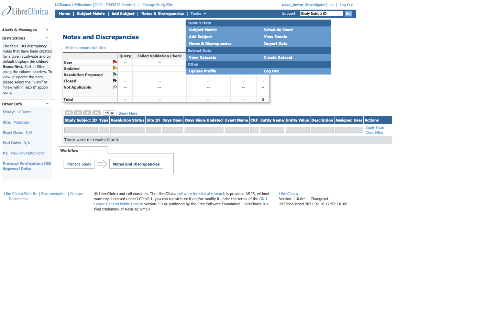

| Label | URL | Backing servlet | SPA coverage |
|---|---|---|---|
| List with summary by type and status (§7.1) | `/ViewNotes?module=submit` (+ `/ViewNotesData` JSON) | `control.managestudy.ViewNotesServlet`, `ViewNotesDataServlet` — **broken on this build** | **PARTIAL** — `/notes` → `NotesDiscrepanciesView.vue` |
| Notes assigned to me (§7.2, §13.4) | `/ViewNotes?module=submit&listNotes_f_discrepancyNoteBean.user=<u>` | `control.managestudy.ViewNotesServlet` — **broken on this build** | **COVERED** — *Assigned to me* on `/notes` |
| View a note's thread (§7.1) | list action → `/CreateDiscrepancyNote?noteId=<n>&viewAction=1`; item flag → `/ViewDiscrepancyNote` | `control.submit.CreateDiscrepancyNoteServlet`, `ViewDiscrepancyNoteServlet` | **COVERED** — row expand on `/notes`; thread dialog in `CrfEntryView.vue` |
| Respond and propose a resolution (§7.3) | the thread pop-up | `control.submit.CreateDiscrepancyNoteServlet` (POST) | **COVERED** — *Respond* and *Resolve* on `/notes` |
| Add a note to a field (§7.4) | flag icon → `/CreateDiscrepancyNote` | `control.submit.CreateDiscrepancyNoteServlet` | **PARTIAL** — `NewNoteDialog.vue`, from the item's note indicator in `CrfEntryView.vue` |
| Download notes as CSV or PDF (§7.5) | `/ChooseDownloadFormat` → `/DiscrepancyNoteOutputServlet` | `control.extract.ChooseDownloadFormat`, `DiscrepancyNoteOutputServlet` | **PARTIAL** — *Export CSV* on `/notes` |
| View within record (§7.1) | `/ResolveDiscrepancy?noteId=<n>` | `control.managestudy.ResolveDiscrepancyServlet` | **COVERED** — item link on `/notes` → `/event-crfs/:eventCrfOid?item=<oid>` |

### 7.1 List / matrix view

- **URL:** `/ViewNotes?module=submit`
- **Servlet:** `control.managestudy.ViewNotesServlet`
- **Summary matrix:** counts per type × status at top of page
- **Columns (with column-filters):** Subject ID, CRF, Item, Description, Type, Resolution Status, Days Open, Days Since Updated, Assigned User
- **Sortable on:** Subject ID, Days Open, Days Since Updated
- **Numeric filters support comparators:** `<7`, `>0` (string in input box)
- **Actions per row:** View (magnifier — new window with discrepancy only), View Within Record (right-arrow — CRF + discrepancy)

**2026-09-30, live: broken on this build.**

- **The page shows no notes.** The summary (Query, Failed Validation Check, Reason for Change, Annotation × New, Updated, Resolution Proposed, Closed, Not Applicable) has "--" in every cell and a total of 0, and the table loads from `/ViewNotesData` with no rows.
- **The study has 8 open queries.** `discrepancy_note` holds 8 item notes from 2020–21, all assigned to root. The SPA lists all 8 (`GET /pages/api/v1/discrepancies`), and the legacy read-only CRF view counts the one on M-001's V1 CRF (§6.4).
- **Cause.**
  - The legacy list reads the database view `view_discrepancy_note`, whose `view_dn_stats` join keeps only parent notes that have at least one child row. `view_discrepancy_note` returned 0 rows.
  - The heritage UI writes a parent and a first child. The SPA's `POST /discrepancies` writes the parent only, and these seeded notes have no children.
  - A note raised in the SPA therefore stays out of every legacy list until someone replies to it.
- **Columns** (from the data feed): Study Subject ID, Site ID, Date Created, Date Updated, Event Name, CRF, CRF Status, Entity Name, Entity Value, Description, Detailed Notes, # of Notes, Assigned User, Resolution Status, Type, Entity Type, Owner, Days Open, Days Since Updated, Event Date, Actions.
- **No controls.** Since jmesa, the filter, sort, print and download links are commented out in `viewNotes.jsp`. `ViewNotesDataServlet` accepts DataTables filters, but the page sends a fixed request.
- **The list's *View* action cannot show a note.** It opens `CreateDiscrepancyNote?noteId=<n>&viewAction=1`. The servlet reads the note's entity from `id` and `name` and ignores both parameters. For note 1 the pop-up said "Your Discrepancy Note for the Item cannot be saved because data entry for this CRF section is not started yet." The item flag in data entry passes the entity and is the working path; it was not opened.
- **View within record** (`ResolveDiscrepancy`) was not followed: for the Investigator it opens a data-entry page (§6).

`NotesDiscrepanciesView.vue` shows:

- the open total and the open count per type;
- search, a status filter (open, all, new, updated, resolution proposed, closed, not applicable), a type filter and *Assigned to me*;
- columns Type, Status, Subject, Item (with its current value), Description, Assigned, Days open and Actions, and a row that expands to the thread;
- *Export CSV*.

*Missing in the SPA:*

- the type × status matrix: the SPA counts open notes per type only;
- the columns site, dates created and updated, CRF, CRF status, detailed notes, number of notes, owner, days since updated and event date;
- sorting by column.

**"Days open" is approximate.** `DiscrepancyApiController` returns `days` from the DAO and derives *last activity* as now minus that. `days` is empty for a note without replies, so the eight queries from 2020–21 show 0 days open and a last activity of "now".

### 7.2 Notes Assigned to Me (shortcut)

- **URL:** `/ViewNotes?module=submit&listNotes_f_discrepancyNoteBean.user=user_demo`
- Same servlet, pre-filtered to current user
- **Home page link:** "Notes & Discrepancies Assigned to Me: N"

**2026-09-30: broken on this build.** The home link passes `listNotes_f_discrepancyNoteBean.user`. The page's script ignores it and requests every note, so the page shows the whole list. `/notes` has *Assigned to me* (`GET /discrepancies?assignedTo=`).

### 7.3 Discrepancy types & statuses (Investigator perspective)

| Type | Created by | Statuses Investigator can set |
|---|---|---|
| Failed Validation Check | LibreClinica (auto, when validation fails) | New, Updated, Resolution Proposed |
| Annotation | Investigator (free-form note) | Not Applicable (only) |
| Query | Monitor | Updated, Resolution Proposed (cannot Close — Monitor-only) |
| Reason for Change | LibreClinica (auto, when changing a completed CRF) | Not Applicable (only) |

- **Flag colours:** blue = new, yellow = updated, green = resolution proposed, black = closed, white = annotation / reason for change
- **Investigator cannot:** Close a discrepancy (Monitor-only), assign discrepancies to other users

**2026-09-30:** the SPA applies the same rules through `NoteTransitionMatrix` on the server and `types/note.ts` in the view.

- The Investigator and the CRC may respond (new → updated) and propose a resolution (updated → resolution proposed).
- They may not close; Monitor, Data Manager and Administrator close.
- Creating a *Reason for Change* note by hand is limited to Data Manager and Administrator. The CRF edit flow writes such notes itself (§6.3).
- Not exercised: no note was answered.

### 7.4 Add / update discrepancy

- **Trigger:** flag icon next to any CRF input field, or "Begin New Thread" on an existing annotation
- **Servlet:** `control.managestudy.UpdateSubjectDiscrepancyNoteServlet` (POST), `control.managestudy.CreateDiscrepancyNoteServlet` (GET)
- **Form fields observed (from manual):** Description (required), Detailed Note, Type, Set to Status, Email Assigned User (checkbox)

**2026-09-30:**

- **Servlets.** `UpdateSubjectDiscrepancyNoteServlet` does not exist on this build. Notes are created and answered through `control.submit.CreateDiscrepancyNoteServlet`, `CreateOneDiscrepancyNoteServlet` and `ViewDiscrepancyNoteServlet`.
- **Legacy.** A flag sits next to every CRF item and next to subject and event fields: Person ID, date of birth, sex and enrolment date (§4), the event's dates and location (§5), and interviewer name and date (§6.1).
- **SPA.** `NewNoteDialog.vue` asks for a description, a type (query, failed validation check, annotation) and an assignee; an assigned user is e-mailed automatically. `POST /discrepancies` always writes `entity_type = itemData`.

*Missing in the SPA:* notes on subject and event fields, the detailed note, and the initial status.

### 7.5 Download discrepancies

- **Trigger:** down-arrow icon above the matrix
- **Formats:** PDF, CSV
- **Servlet:** `control.extract.DiscrepancyNoteOutputServlet` ([web.xml:285](../../../../web/src/main/webapp/WEB-INF/web.xml))

**2026-09-30:** `/ViewNotes` no longer shows the download icon (§7.1). `/ChooseDownloadFormat` still renders by URL and offers comma-separated values or portable document format; nothing was downloaded. The SPA exports CSV (`GET /discrepancies/export.csv`, which writes an audit row).

*Missing in the SPA:* PDF.

---

## 8. Data import (limited Investigator scope)

| Label | URL | Backing servlet | SPA coverage |
|---|---|---|---|
| Import CRF data: upload ODM XML, verify, commit | `/ImportCRFData` → `/VerifyImportedCRFData` | `control.submit.ImportCRFDataServlet`, `VerifyImportedCRFDataServlet` | **NOT COVERED** — API only (`/pages/api/v1/import`) |

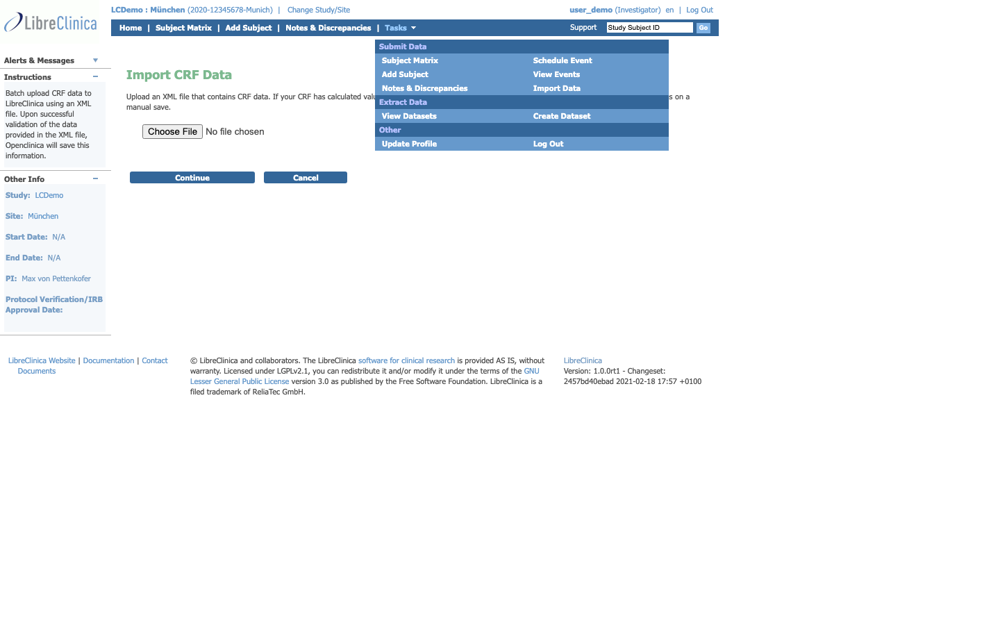

- **URL:** `/ImportCRFData`
- **Servlet:** `control.submit.ImportCRFDataServlet`
- **Visible to Investigator** in the Tasks menu (per crawl) — full design intent and access matrix should be verified for MUW deployment
- **Workflow:** upload CDISC ODM XML → preview → confirm import → background job
- **Job tracking:** `/ViewImportJob` (`control.admin.ViewImportJobServlet`) — listed in web.xml but not surfaced in Investigator Tasks menu in the demo

**2026-09-30:**

- **Legacy.** Live form: an XML file and *Continue*. `ImportCRFDataServlet` admits the study director, coordinator, Investigator and both Data Entry Person roles.
- **SPA.** `/import-crf-data` (`ImportCrfDataView.vue`) admits Data Manager and Administrator. `BulkImportAuthorization.roleMayImport` admits the Investigator, so only the route keeps the role out.
- **Job tracking.** `/ViewImportJob` is an administrator screen ([administrator catalogue §9](administrator-features.md#9-jobs--scheduling-tasks--administration--jobs)), and scheduled imports are dropped (plan §3.1).
- Nothing was uploaded.

---

## 9. Data extraction

| Label | URL | Backing servlet | SPA coverage |
|---|---|---|---|
| View Datasets (§9.1) | `/ViewDatasets` | `control.extract.ViewDatasetsServlet` | **NOT COVERED** — API only (`GET /studies/{oid}/datasets`) |
| Create Dataset wizard (§9.2) | `/CreateDataset` (+ `/SelectItems`, `/CreateFiltersOne`…`Three`, `/ViewSelected`, …) | `control.extract.CreateDatasetServlet` and its companions | **NOT COVERED** — API only |
| Export a dataset and download its files (§9.3) | `/ExportDataset?datasetId=<n>`, `/AccessFile` | `control.extract.ExportDatasetServlet`, `AccessFileServlet` | **NOT COVERED** — API only |

### 9.1 View Datasets

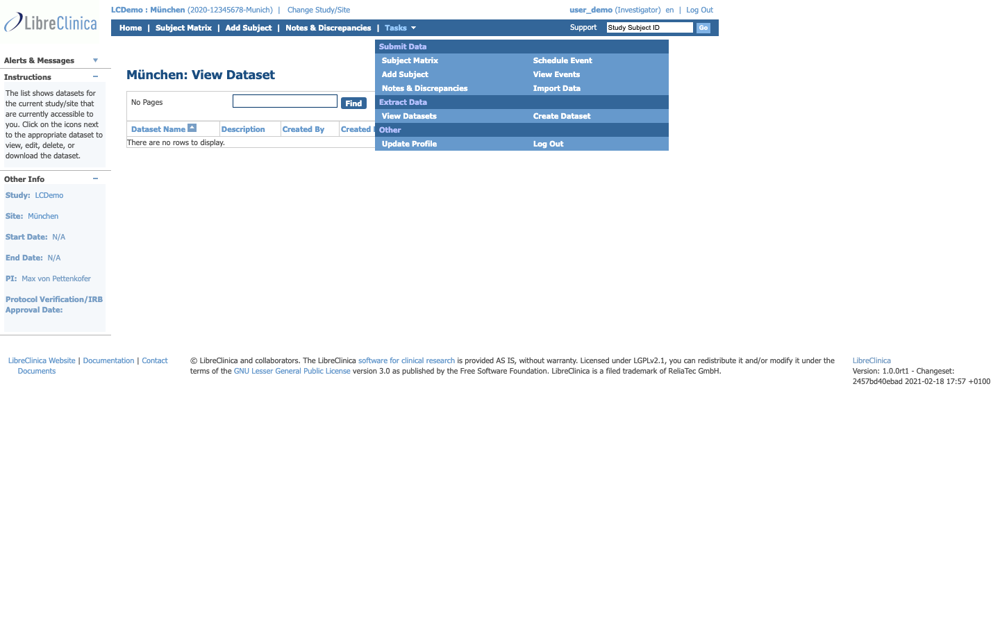

- **URL:** `/ViewDatasets`
- **Servlet:** `control.extract.ViewDatasetsServlet`
- **Listing:** dataset name, owner, last-updated, download formats

**2026-09-30, live:** "Default Study: View Dataset", with no datasets; a keyword filter, *Show only My Datasets*, *Create Dataset*, and columns Dataset Name · Description · Created By · Created Date · Status · Actions.

The SPA's dataset routes (`/export`, `/datasets`, `/datasets/new`, `/datasets/:datasetId/edit`) admit Monitor, Data Manager and Administrator. `DatasetsApiController.roleMayExportData` admits the Investigator: live, `GET /pages/api/v1/studies/S_DEFAULTS1/datasets` answered 200 with `[]`.

### 9.2 Create Dataset

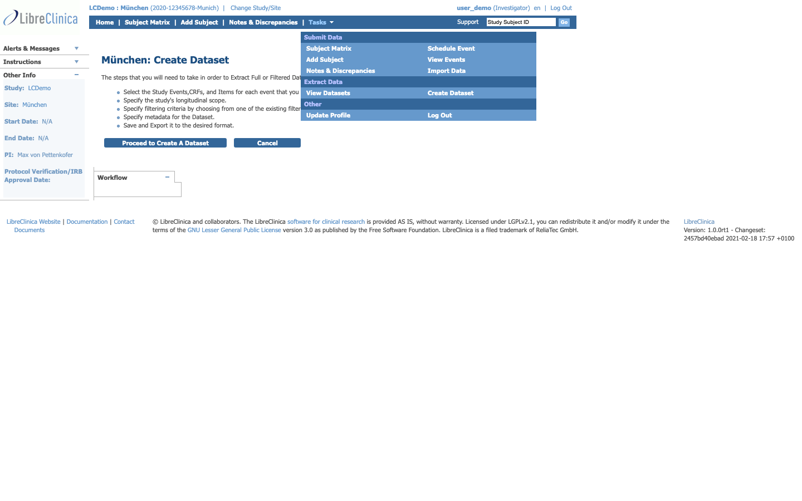

- **URL:** `/CreateDataset`
- **Servlet:** `control.extract.CreateDatasetServlet`
- **Wizard steps observed:** event/CRF/item selection → filter → output formats (ODM 1.2/1.3, SPSS, Excel, CSV, Tab-delimited) → preview → save
- **Background job system:** Quartz; jobs visible via `/ViewJob` and `/ViewAllJobs`

**2026-09-30, live:** the first page lists the steps and offers *Proceed to Create A Dataset*. The later steps were not opened: the wizard ends in a save. The same route and API gap applies as in §9.1.

### 9.3 Export a dataset (added 2026-09-30)

- From the dataset list, *Export* opens the format page, and a run produces archived files for download (`AccessFileServlet`).
- No dataset exists on the stack, so the page was not seen, and no export was run.
- The SPA runs exports and lists their files on `/export` (`DatasetListView.vue`), for the roles its routes admit. The same route and API gap applies as in §9.1.

---

## 10. Study / site context

| Label | URL | Backing servlet | SPA coverage |
|---|---|---|---|
| View Study (§10.1) | `/ViewStudy?id=<n>&viewFull=yes` | `control.admin.ViewStudyServlet` — **broken on this build** | **NOT COVERED** — — |
| View Site (§10.2) | `/ViewSite?id=<n>` | `control.managestudy.ViewSiteServlet` | **NOT COVERED** — — |
| Change Study/Site (§10.3) | `/ChangeStudy` | `control.login.ChangeStudyServlet` | **COVERED** — `/pick-study` → `StudyPickerView.vue` |

### 10.1 View Study

- **URL:** `/ViewStudy?id=<n>` (header link to current study, accessible from anywhere)
- **Servlet:** `control.admin.ViewStudyServlet`
- **Sections observed:** Study Details, Eligibility, Status, Parameter Configuration, Event Definitions, CRF Assignment per Event, Sites, Users (read-only for Investigator)

**2026-09-30: broken on this build.** `/ViewStudy` answered HTTP 500 for the Investigator, as it does for every role on this build: `ViewStudyServlet` needs Apache HttpClient 5, which is not in the WAR ([administrator catalogue §4](administrator-features.md#4-studies-tasks--administration--studies)). The page is the study link in the header of every legacy page and in the sidebar.

The SPA's study views (`/studies/:oid/edit`, `/studies/:oid/parameters`) are Administrator-only. For the Investigator, the matrix's study card shows PI, planned start and status.

### 10.2 View Site

- **URL:** `/ViewSite?id=<n>`
- **Servlet:** `control.managestudy.ViewSiteServlet`
- **Sections:** Site Details, Site Status, Investigator/Coordinator users, subjects at site, event status summary

**2026-09-30:** no study on the stack has sites, so the page was not seen. `/sites` admits Data Manager and Administrator.

### 10.3 Change Study/Site

- **URL:** `/ChangeStudy`
- **Servlet:** `control.login.ChangeStudyServlet`
- **UI:** radio-button list of studies/sites the user has any role in → Confirm step
- **Active study persisted on:** `user_account.active_study`

**2026-09-30, live:** "Your current active study is Default Study, with a role of Data Specialist", a radio list with one entry, and *Change Study*, which posts and then asks for confirmation.

`StudyPickerView.vue` lists the user's bindings, sites included (`GET /studies`). `POST /me/activeStudy` binds the session and stores `user_account.active_study` too. The top bar has a study switcher.

---

## 11. Footer & ancillary

| Label | URL | Backing servlet | SPA coverage |
|---|---|---|---|
| Documents | `/DocumentList` | not mapped | **NOT COVERED** — — (*obsolete*: not on this build's footer) |
| Contact | `/Contact` | `control.login.ContactServlet` | **COVERED** — `/contact` → `ContactView.vue` |
| Support (community link) | external | footer | **NOT COVERED** — — (*obsolete*: not on this build's footer) |
| Documentation | `libreclinica.org/documentation` (external) | `include/footer.jsp` | **COVERED** — `/manual` → `ManualView.vue` |
| Version and changeset | footer | `include/footer.jsp`, build properties | **COVERED** — profile menu in `TopBar.vue` |
| Manual download (Tasks menu, when `display.manual=true`) | `/manuals/investigator-manual.pdf` | static file, `include/navBar.jsp` | **COVERED** — `/manual` → `ManualView.vue` |

- **Documents** → `/DocumentList` — *not mapped via web.xml*, likely a static directory or pages-servlet route; check [pages-servlet.xml](../../../../web/src/main/webapp/WEB-INF/pages-servlet.xml)
- **Contact** → `/Contact` (servlet `control.login.ContactServlet`)
- **Support** → external link (LibreClinica community)
- **Documentation** → external link (`libreclinica.org/documentation`)
- **Version + changeset** rendered from build properties (observed: `1.0.0rt1 - Changeset: 2457bd40ebad 2021-02-18`)

**2026-09-30, live:**

- **The footer** links *LibreClinica Website*, *Documentation* and *Contact*, then the licence text and "Version: 1.5.0-beta.15-muw - Changeset: ${changeSet} 2026-09-30 08:51 +0000". There is no Documents or Support link.
- **The changeset placeholder is not filled in.** `buildnumber-maven-plugin` fills `changeSet` from the source revision, and this build had none.
- **Contact:** Your Name (pre-filled), e-mail, subject and message; it mails the administrator. It was not submitted. `ContactView.vue` posts to `/pages/api/v1/contact`.
- **Documentation and the manual.** The SPA's in-app handbook has an investigator chapter and replaces both the external documentation and the manual PDF, which is off on this stack.
- **Support.** The SPA offers *Report a bug* in the profile menu instead of a community link.

---

## 12. Features NOT visible to Investigator (but exist for other roles)

Captured by comparing the three role walks. The Investigator does **not** see:

- Tasks → Monitor and Manage Data (SDV, Study Audit Log, Groups, CRFs, Rules)
- Tasks → Study Setup (View Study edit mode, Build Study, Users)
- Top-nav "SDV" button (Monitor)
- Top-nav "Study Audit Log" (Data Manager, Monitor)
- Any CRF creation, study definition, or user management UI

See [monitor-features.md](monitor-features.md) and [data-manager-features.md](data-manager-features.md) for cross-role gaps to design around.

**2026-09-30:** unchanged on this build for `manual_investigator`. The legacy role behind the SPA's *CRC* is a different case: it sees most of these (§17).

---

## 13. Deep-crawl additions (one click deeper)

A second-pass crawl drilled into the most important workflow sub-pages. All screens still read-only.

| Label | URL | Backing servlet | SPA coverage |
|---|---|---|---|
| View Subject detail (§13.1) | `/ViewStudySubject?id=<n>` | as §4.3 | see §4.3, §4.6, §4.7 (counted there) |
| Enter or Validate Data (§13.2) | `/EnterDataForStudyEvent?eventId=<n>` | as §5.4 | see §5.4 (counted there) |
| Schedule with subject and definition preset (§13.3) | `/CreateNewStudyEvent?studySubjectId=<n>&studyEventDefinition=<n>` | as §5.1 | see §5.1 (counted there) |
| Notes assigned to me (§13.4) | as §7.2 | as §7.2 | see §7.2 (counted there) |
| Subject Matrix by event, *Select An Event* (§13.5) | `/ListEventsForSubjects?module=submit&defId=<n>` (+ `/ListEventsForSubjectsData`) | `control.managestudy.ListEventsForSubjectsServlet`, `ListEventsForSubjectsDataServlet` | **NOT COVERED** — — |

### 13.1 View Subject detail (M-001)

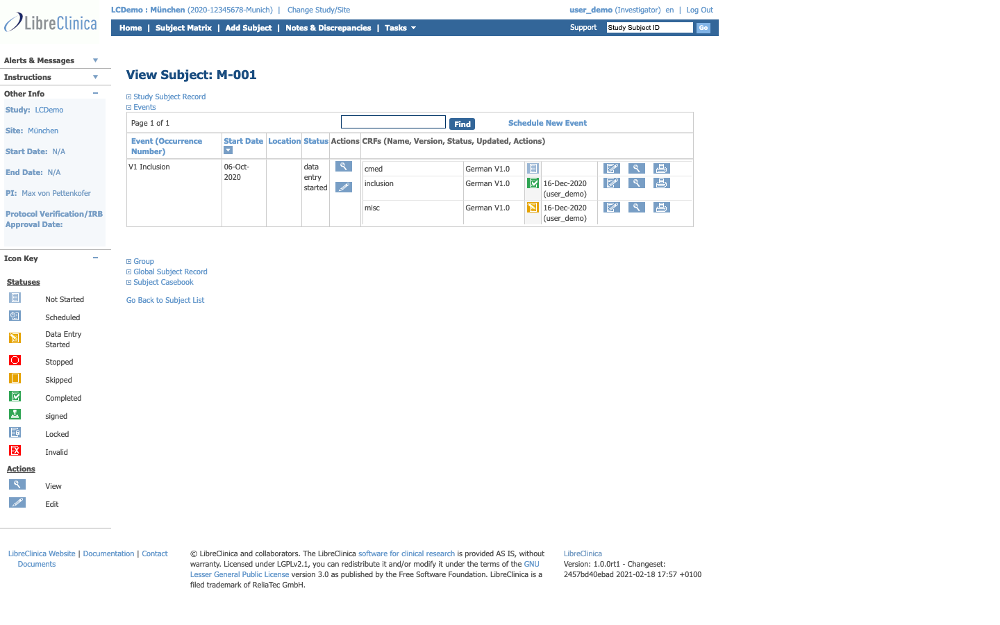

- **URL:** `/ViewStudySubject?id=<n>`
- **Servlet:** `control.submit.ViewStudySubjectServlet`
- **H1:** "View Subject: M-001"
- **Collapsible sections observed:** Study Subject Record · **Events** (expanded by default) · Group · Global Subject Record · Subject Casebook
- **Events table columns:** Event (Occurrence Number) · Start Date · Location · Status · Actions · CRFs (Name, Version, Status, Updated, Actions)
- **Events table data for M-001:**
  - V1 Inclusion · 06-Oct-2020 · (no location) · data entry started · with 3 CRFs: `cmed`, `inclusion`, `misc` (all German V1.0)
  - Per-CRF: last-updated date + user + per-CRF actions (Edit pencil, View magnifier, Print printer)
- **Page-level controls:** "Schedule New Event" link, "Find" filter input over events, "Go Back to Subject List" link
- **Extra buttons captured:** Get Link, Open — opens **Subject Casebook** (PDF render of all completed CRFs for one subject — useful for paper audit trails)

**2026-09-30:** the same sections on this build. See §4.3 for what they show and what the SPA lacks, §4.6 for the audit log, and §4.7 for the casebook, which answers HTTP 404 here.

### 13.2 Enter or Validate Data for CRFs in V1 Inclusion

- **URL:** `/EnterDataForStudyEvent?eventId=<n>`
- **Servlet:** `control.submit.EnterDataForStudyEventServlet`
- **H1:** "Enter or Validate Data for CRFs in V1 Inclusion"
- **What's on this page:** the actual per-event CRF list with pencil (data entry), magnifier (view), printer (PDF) icons per CRF — this is the page the manual refers to as "Enter or Validate Data for CRFs in [Event Name]"
- **Per-CRF version selector:** dropdown if multiple versions exist; default version preselected
- **"Edit Study Event" link** (upper-right pencil) → `/UpdateStudyEvent` — Investigator can edit event status here (Skipped, Stopped)

**2026-09-30:** see §5.4.

### 13.3 Schedule Study Event with subject + definition context

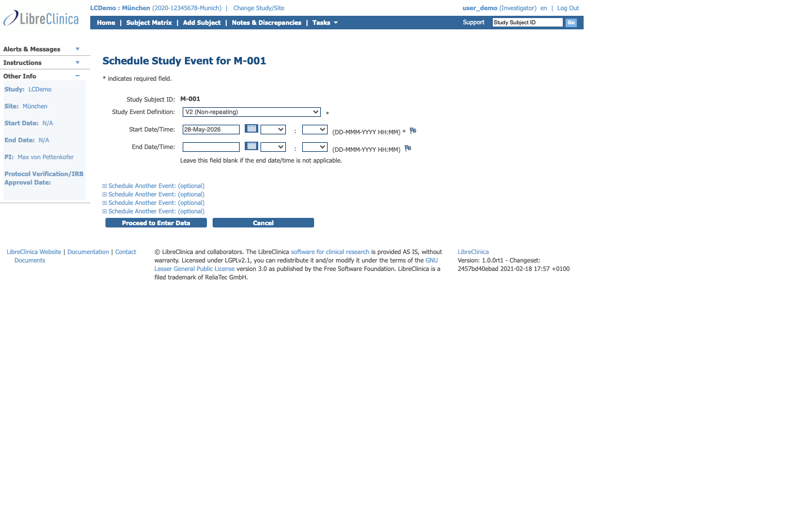

- **URL:** `/CreateNewStudyEvent?studySubjectId=<n>&studyEventDefinition=<n>`
- **Servlet:** `control.submit.CreateNewStudyEventServlet`
- **H1:** "Schedule Study Event for M-001"
- **Form fields:** Event Definition (pre-selected when query params present, otherwise dropdown), Location (text), Start Date (date picker), End Date (date picker)
- **Validation:** Start Date required (red asterisk), End Date may be required depending on event def configuration
- **Outcome:** redirects to `/EnterDataForStudyEvent` upon save

**2026-09-30:** see §5.1. The SPA's dialog always opens from the subject's page, so the subject is always preset; the event definition is not.

### 13.4 Notes & Discrepancies filtered to current user

- **URL:** `/ViewNotes?module=submit&listNotes_f_discrepancyNoteBean.user=user_demo`
- Same servlet; pre-filtered to the logged-in user's assigned notes
- **Same matrix layout** as the unfiltered view — useful pre-built shortcut

**2026-09-30:** the filter is ignored on this build; see §7.2.

### 13.5 Subject Matrix grouped by event (`Select An Event`)

- **URL:** `/ListStudySubjects?event=<eventDefId>`
- Same `ListStudySubjectsServlet`
- **Layout changes:** columns become per-CRF for that event (instead of per-event) — investigator can see at a glance which CRFs of one specific event are at which status across all subjects
- **Use case:** the page-level "Show More" expansion exposes Secondary ID + extra filterable columns when in this view

**2026-09-30:** on this build the view is `/ListEventsForSubjects?module=submit&defId=<n>`, served by `ListEventsForSubjectsServlet`.

- It works when its URL is typed. Live for `defId=1`, it listed one row per subject: status, site, sex, the event's status and start date, and the stage of each of its CRFs.
- Nothing links to it any more. The event selector was in the jmesa toolbar, and no other page or script contains the URL.
- The SPA has no per-event view by CRF. Its matrix shows one status per visit, and the CRF stages are on each event page (§5.4).

---

## 14. JSP file map (for Phase E rewrite scoping)

JSPs for Investigator-reachable servlets live primarily under:

- [web/src/main/webapp/WEB-INF/jsp/submit/](../../../../web/src/main/webapp/WEB-INF/jsp/submit/) — data entry, subject management, event scheduling, signing
- [web/src/main/webapp/WEB-INF/jsp/managestudy/](../../../../web/src/main/webapp/WEB-INF/jsp/managestudy/) — Notes & Discrepancies, View Site
- [web/src/main/webapp/WEB-INF/jsp/extract/](../../../../web/src/main/webapp/WEB-INF/jsp/extract/) — datasets, downloads
- [web/src/main/webapp/WEB-INF/jsp/login/](../../../../web/src/main/webapp/WEB-INF/jsp/login/) — login, profile, password reset, ChangeStudy
- [web/src/main/webapp/WEB-INF/jsp/managestudy/studySubject/](../../../../web/src/main/webapp/WEB-INF/jsp/managestudy/studySubject/) — Subject Matrix templates

Exact JSP per servlet can be recovered from `RequestDispatcher.forward(...)` calls inside each servlet `processRequest()` — out of scope for this catalogue but mechanical to extract per-feature when needed.

**2026-09-30, files named in this revision** (under `web/src/main/webapp/WEB-INF/jsp/` unless noted):

- Home and matrix: `menu.jsp`, `managestudy/findSubjects.jsp`, `managestudy/include/findSubjectsTable.jsp`, `submit/listEventsForSubjects.jsp`
- Subject and events: `managestudy/viewStudySubject.jsp`, `managestudy/showStudyEventRow.jsp`, `managestudy/studySubject/casebookGenerationForm.jsp` (with `webapp/includes/studySubject/viewStudySubject.js`), `submit/enterDataForStudyEvent.jsp`, `submit/eventCrfLayer.jsp`, `managestudy/signStudySubject.jsp`
- Notes: `managestudy/viewNotes.jsp`, `submit/chooseDownloadFormat.jsp`
- Account: `login/updateProfile.jsp`, `login/changeStudy.jsp`, `login/changeStudyConfirm.jsp`, `login/requestPassword.jsp`
- Shared: `include/navBar.jsp`, `include/footer.jsp`

---

## 15. Open follow-ups / known gaps in this catalogue

**2026-09-30:** the SPA-coverage pass drilled most of the sub-pages listed below (§4.3, §5.4, §6.4, §7.1). What it could not verify is in §20.

- **Sub-pages not yet drilled** (one click deeper from the surface walk):
  - Subject detail (click subject M-001)
  - Event detail pop-up + "View/Enter Data"
  - Full CRF data entry view of one CRF
  - Add Discrepancy Note modal (rendered in a child window)
  - Create Dataset wizard step screenshots
- **2FA flows** (APPLICATION and LETTER) not exercised — see [administrator-manual.md](../../../manuals/administrator-manual.md)
- **Force-password-change first-login screen** not observed (demo users already past first login)
- **Multi-language UI** — `en` shown; LibreClinica supports many locales (de, fr, es, pt, zh — see [web/src/main/webapp/images/](../../../../web/src/main/webapp/images/)) — locale switching not exercised

Recommended next pass: run the crawler from each role's home, but click **one level deeper** from each table row (Subject Matrix → subject detail; CRF list → one CRF; Notes list → one note → "View Within Record"). Doing so doubles the screen count but covers the actual day-to-day workflow.

---

## 16. SPA Investigator surfaces with no legacy counterpart

These pages retire nothing. They are listed because they belong to the surface that replaces the legacy one:

- `/due-visits`: open and overdue visits across the studies the session can see; §5.2 lists what it lacks as a View Events replacement.
- `/patients` (`PatientsOverviewView.vue`): the patient behind a study subject, across studies.
- `/ingest-inbox` and `/ingest-inbox/upload`: filing fundus and OCT images against a subject, event and CRF, and uploading them.
- `/studies/:studyOid/modules/namd`: the nAMD treat-and-extend workspace; Default Study enrols the module.
- `/manual`: the in-app handbook, with an investigator chapter.
- On the home page: the *Today's CRFs* and *Ready to sign* queues.
- On the subject and CRF pages:
  - study eye and eye transitions;
  - randomisation at enrolment;
  - prefill from the previous visit and the concurrent-edit warning;
  - the per-subject data download;
  - retinal results, where the study's blinding allows.

---

## 17. The CRC role (`manual_crc`)

`manual_crc` holds `study_user_role.role_name = coordinator` on Default Study. The same account is a study manager in the legacy UI and a data-entry role in the SPA.

**Legacy, live:**

- The header reads "manual_crc (Data Manager)". `terms.properties` labels `coordinator` "Data Manager" at study and at site level.
- The top nav has Home · Subject Matrix · Notes & Discrepancies · Study Audit Log.
- The Tasks menu has:
  - *Submit Data*, as the Investigator's;
  - *Monitor and Manage Data*: Source Data Verification · Study Audit Log · Rules · Groups · CRFs;
  - *Extract Data*;
  - *Study Setup*: View Study · Build Study · Users;
  - *Other*.
- The home page shows enrolment and event-status statistics instead of the matrix. Two of its headings render as `???subject_enrollment_for_site???` and `???event_status_statistics???`.

**SPA:**

- `RoleMapper.toSpaRole` maps `coordinator` to *CRC*.
- The router lets a CRC pass every route that admits the Investigator (`roleSatisfies`), and nothing else. None of the routes behind those legacy menus admits it: not `/sdv`, `/audit-log`, `/rules`, `/group-classes`, `/crf-library`, `/build-study`, `/export` or `/import-crf-data`.
- The sign route opens for a CRC, and the backend then refuses the signature (§6.7); legacy lets the coordinator sign.
- `GET /me` reported `role: Investigator` and `activeStudy: null` until `/MainMenu` had run, and `CRC` afterwards (§1.1).

**The labels cross over.** Legacy's "Clinical Research Coordinator" is the site-level `ra` role, which the SPA shows as *Investigator*. The SPA's *CRC* is the legacy `coordinator`, labelled "Data Manager". A retirement check that matches roles by label will mis-map both; the [administrator catalogue §5](administrator-features.md#study-role-labels-differ-between-the-two-uis) has the full table.

**Consequence for retirement.** Retiring the Data Manager's legacy screens removes them from every `coordinator` holder, not only from Data Managers. Whether that is intended belongs with the role decision in plan §3.2.3, which today covers only `ra` and `ra2`.

The CRC's SPA side was read from the router and `/me`, not walked view by view.

---

## 18. Coverage summary

Counted over the feature tables in §1 and §3–§13. The navigation rows in §2 and the pointer rows ("see §…") are not counted.

| Section | Features | COVERED | PARTIAL | NOT COVERED |
|---|---:|---:|---:|---:|
| §1 Authentication & profile | 7 | 2 | 1 | 4 |
| §3 Home & Subject Matrix | 2 | 0 | 2 | 0 |
| §4 Subject management | 7 | 0 | 5 | 2 |
| §5 Event management | 5 | 1 | 4 | 0 |
| §6 CRF data entry | 8 | 4 | 3 | 1 |
| §7 Notes & Discrepancies | 7 | 4 | 3 | 0 |
| §8 Data import | 1 | 0 | 0 | 1 |
| §9 Data extraction | 3 | 0 | 0 | 3 |
| §10 Study / site context | 3 | 1 | 0 | 2 |
| §11 Footer & ancillary | 6 | 4 | 0 | 2 |
| §13 Deep-crawl additions | 1 | 0 | 0 | 1 |
| **Total** | **50** | **16** | **18** | **16** |

Of the 16 NOT COVERED:

- **7 are API only:** the backend admits the Investigator, but no route does. They are update profile, change password, the subject audit log, import, and the three dataset features.
- **3 are obsolete:** section preview, Documents and Support.
- **1 is dropped by decision:** two-factor authentication (plan §3.1).
- **5 have no SPA surface for the role:** forgot password, removing and restoring a subject, View Study, View Site, and the view by event.

Six of the 50 legacy features are **broken on this build**: View Events, the notes list, notes assigned to me, the casebook, CRF print and View Study. The SPA covers five of them at least in part; View Study it does not.

### Gaps most likely to cost clinical or regulatory capability

If the legacy screens were deleted too early, these would hurt most:

1. **Reasons for change on completed data (§6.3).** In the SPA, *Reopen* clears `date_completed`, so changes to data that had been marked complete need no reason and leave no Reason for Change note. The audit trail records old and new values and the reopen, but not why a value changed. `adminForcedReasonForChange` is not honoured.
2. **Edit checks do not run on SPA data entry (§6.1).**
   - The study's rules and their actions — queries, e-mails, inserted values, shown or hidden items — run only in the legacy data-entry servlet.
   - *Mark complete* relies on the client for required items.
3. **Subjects created without the identifiers the study requires (§4.1).** The SPA does not collect Person ID or date of birth, and its API does not enforce `subjectPersonIdRequired`, `collectDob` or `genderRequired`.
4. **No audit trail for the Investigator (§4.6).** The legacy subject audit log is the Investigator's only view of who changed what. The SPA's API serves it; no route does.
5. **The two note lists disagree (§7.1, §7.4).**
   - A query raised in the SPA stays out of the legacy list until it is answered; on this stack the legacy list is empty.
   - SPA notes attach to CRF items only, so queries on subject or visit fields cannot be raised.
   - "Days open" is wrong for unanswered notes.
6. **Fields this study requires (§6.1, §5.1, §5.3).** Interviewer name and interview date are required in Default Study; the SPA neither shows nor enforces them. A visit's end date and time cannot be entered or changed.
7. **Import and extraction for the Investigator (§8, §9).** The backend admits the role; the routes do not. Either add the role to the routes, or record that the Investigator loses these.
8. **Removing and restoring a subject (§4.5).** Narrowed to the Data Manager and Administrator in the SPA; the change needs a recorded decision.
9. **Account self-service (§1.1, §1.3).** There is no reachable SPA path to change one's own password on demand, e-mail, phone or affiliation, or to recover a forgotten password.
10. **The CRC mapping (§17).** Every legacy `coordinator` holder loses the Data Manager screens in the SPA.
11. **Smaller gaps:**
    - View Study and View Site (§10);
    - the view by event (§13.5), scheduling several events at once (§5.1) and choosing a CRF version (§5.4);
    - the blank-form print (§6.6);
    - the casebook's notes and audit-trail options (§4.7);
    - the notes PDF (§7.5).

---

## 19. Findings that bear on retirement

### 19.1 Legacy Investigator screens that are broken or inert on this build

| Screen | What happens | Cause |
|---|---|---|
| `/ViewStudyEvents` | "Oops! An error has occurred", HTTP 200 | `NullPointerException` in `findEventByStatusAndDate` when an event has no start date (§5.2) |
| `/ViewStudy` | HTTP 500 | HttpClient 5 missing from the WAR (administrator catalogue §4) |
| `/ViewNotes`, list and summary | 0 of 8 open queries | `view_dn_stats` keeps only notes that have a child row; the seeded notes and SPA-created ones have none (§7.1) |
| *Notes Assigned to Me* | shows every note | the page script ignores the filter parameter (§7.2) |
| *View* action in the notes list | the pop-up says the note cannot be saved | the link sends `noteId` and `viewAction`; the servlet reads `id` and `name` (§7.1) |
| Matrix event cells | the wrong icon for every status | the icon map in `findSubjectsTable.jsp` is offset against `SubjectEventStatus` (§3.1) |
| Matrix *Sign* action | never reaches the signing page | it links the credential-checking branch; from source (§6.7) |
| *Add New Subject* overlay on home and matrix | cannot be opened | its trigger went with the jmesa toolbar (§3) |
| *Select An Event* view | works, linked from nowhere | the same (§13.5) |
| CRF print icons, blank-form print, Subject Casebook | HTTP 404 | `rest/clinicaldata/…` and `rest/metadata/…` are Jersey resources, which do not load (§4.7, §6.6) |
| Read-only CRF view, on this stack | header only, no items | the seeded CRF versions have no `item_group_metadata` rows: stack data, not code (§6.4) |
| Footer | `Changeset: ${changeSet}` | the build-number property is not filled in on this build (§11) |
| Matrix, notes list, CRC home | `???no_data???`, `???subject_enrollment_for_site???`, `???event_status_statistics???` | missing i18n keys |

Two heritage list pages still answer by URL and are linked from nowhere: `/ListStudySubject` and `/SubmitData`. The second shows "There are no columns to display."

### 19.2 Data written on a plain GET

- **`/MainMenu` rewrites the caller's own `user_account` row on every visit,** including the landing after login.
  - It writes `date_lastvisit`, and through `UserAccountDAO.update` it sets `update_id` to the caller and `date_updated` to now.
  - The administrator's View User shows "Updated by" and "Date updated" from these columns ([administrator catalogue §5](administrator-features.md#view-user)). After any visit to the home page they name the user, not the last administrative change.
  - This walk updated both accounts that way.
- **Subject signing is accepted on GET.** The matrix links the signing branch with a GET (§6.7), and `SignStudySubjectServlet` signs on GET as well as on POST. The signing form itself posts.
- **More generally,** `SecureController.doGet` and `doPost` run the same `process`, so every legacy form action on these screens is also accepted as a GET. The Investigator's own forms all post. R0.5 of the plan covers the administrator actions that are *linked* as GETs; the sign link is the Investigator's equivalent.

### 19.3 Where the two UIs disagree

- **Which notes exist** (§7.1).
- **An event CRF's status:** initial data entry in legacy, *not started* on the SPA's event page, and *in progress* on the SPA's subject page (§5.4).
- **What a role is called and what it can do** (§17):
  - legacy "Data Specialist" is the SPA's Investigator;
  - legacy "Data Manager" (`coordinator`) is the SPA's CRC;
  - legacy "Clinical Research Coordinator" (`ra`) is the SPA's Investigator.
- **Who may sign:** legacy admits the coordinator; the SPA backend does not (§6.7).
- **Who may remove or restore a subject:** legacy admits the Investigator; the SPA does not (§4.5).
- **What a change to completed data requires:** the SPA requires a reason while a CRF is complete, but its only editing path clears the completion first (§6.3).

### 19.4 SPA weaknesses found in the source

- **The reason-for-change gap after Reopen** (§6.3).
- **The rules engine is not called** from `saveItems` (§6.1).
- **`markComplete` does not check required items** on the server (§6.1).
- **The Reason for Change note is written best-effort.** In a save against a complete CRF, `saveItems` writes the value first, then the note, and logs and swallows a failed note write. The value change then stands without its note, and without the audit row that carries the reason, which is written only after the note succeeds.
- **The SPA login sends no two-factor code** (§1.1).
- **Two SPA flows run through legacy servlets:** the login lands on `/MainMenu`, and sign-out calls `/Logout` (§1.1, §1.4). Both must stay until the SPA has its own (plan R1.3).
- **"Days open" is approximated** for notes without replies (§7.1).
- **Subject creation does not enforce the study parameters** (§4.1).

### 19.5 Where this revision corrects the 2026-05-28 text

| 2026-05-28 text | This build |
|---|---|
| `SignStudySubjectServlet` and `ViewStudySubjectServlet` in `control.submit` | both are in `control.managestudy` |
| Print CRF → `/PrintCRFForm` (`PrintCRFFormServlet`) | no such URL or servlet; the print links go to the Jersey tree (§6.6) |
| `UpdateSubjectDiscrepancyNoteServlet` saves notes | no such servlet; `CreateDiscrepancyNoteServlet` and `CreateOneDiscrepancyNoteServlet` do (§7.4) |
| Login JSP with "Forgot Password?" | retired: a 302 to the SPA login (§1.1) |
| Role label "Investigator" | "Data Specialist" at study level; the demo account was bound at a site |
| Matrix with filters, sort, paging, *Show More* and *Select An Event* | none of these since jmesa (§3.1) |

### 19.6 The legacy-access log still shows nothing

After this walk's some forty legacy GETs, the application log held 0 `legacy-hit` lines. The telemetry filter does not fire for servlet URLs ([administrator catalogue §16.4](administrator-features.md#164-the-legacy-access-log-cannot-show-admin-use-yet)), so an empty log is still not evidence that nobody uses the Investigator screens.

---

## 20. Not verified

### Not exercised, because the walk was read-only

- Any form submit: adding a subject, scheduling or editing an event, profile, study change, contact, forgotten password, import.
- The data-entry pages (initial, double and administrative) and *View within record*. They lock the CRF and, for a new CRF, create the event-CRF row (§6).
- The signing page, and removing and restoring subjects, confirmation pages included.
- Downloads: notes as CSV or PDF, the audit-log Excel, and the SPA's subject export and notes CSV, both of which write audit rows.
- The dataset wizard beyond its first page, and export runs.

### Not reachable as these accounts or on this stack

- **Sites:** no study has one, so View Site and the site-level labels were not seen.
- **Data the stack lacks:** a CRF with double entry, rules, a signable subject, a removed subject, a CRF with several versions, a locked or frozen study.
- **Switches that are off:** two-factor (`2fa.activated=false`) and the manual download (`display.manual=false`).
- **A forced password change:** neither account was due.
- **The legacy CRF pages' items:** the seeded CRF versions lack `item_group_metadata`, so legacy renders no items (§6.4). Whether versions created in the SPA render in legacy was not checked.

### Checked from source and API GETs, not in a browser

- The SPA side, for both accounts: route → view → store → controller, plus the GET endpoints named above.
- The CRC's SPA surface: from the router and `/me` only.

### Not checked

- Whether `func:` and `regexp:` validations defined on CRF items reach the SPA's checks. The SPA checks type, minimum and maximum, dates and codes.
- Whether the SPA's import path runs the import rules.

### Build provenance

- The stack was built at 2026-09-30 08:51 UTC (footer) from a tree this walk did not identify.
- Source references are to the catalogue worktree at `6a4f98bf7`, which is `lc-develop` plus documentation.

### Outside this catalogue, but found on the way

- Unknown `/pages/api/v1/**` paths answered HTTP 404 with the message "Internal server error." (seen twice). The cause was not traced.
- The `SDVController` subject list logged an SQL error ("non-integer constant in ORDER BY") during another role's session the same morning.

### Keeping it current

When a verdict here changes, update this file before the entry in `phase-e-retirement-log.md`.

### Recommended next pass

Repeat the walk on a disposable stack where submits are allowed, with a site, a double-entry CRF, a rule set and a signable subject. That pass would cover what this one could only read from source: data entry and its rules, reasons for change, signing, notes on subject and event fields, and View Site.
