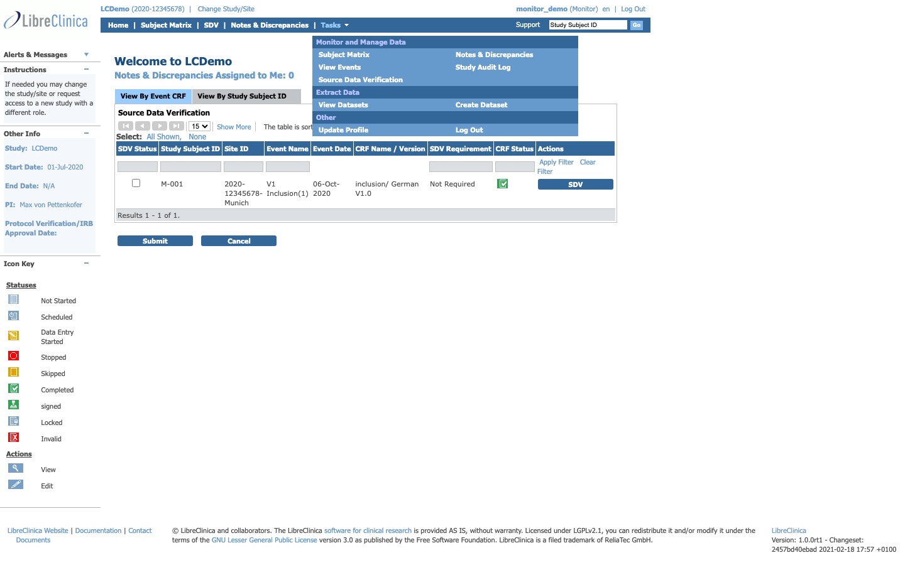
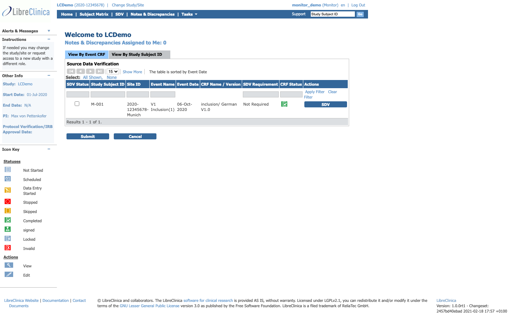
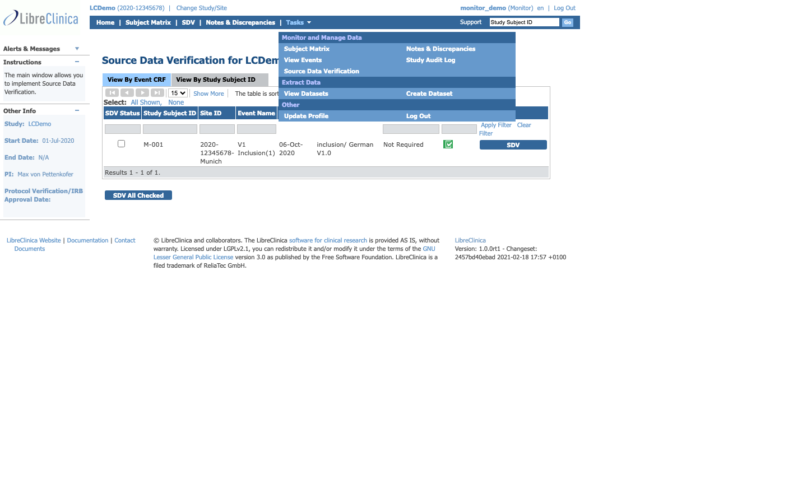
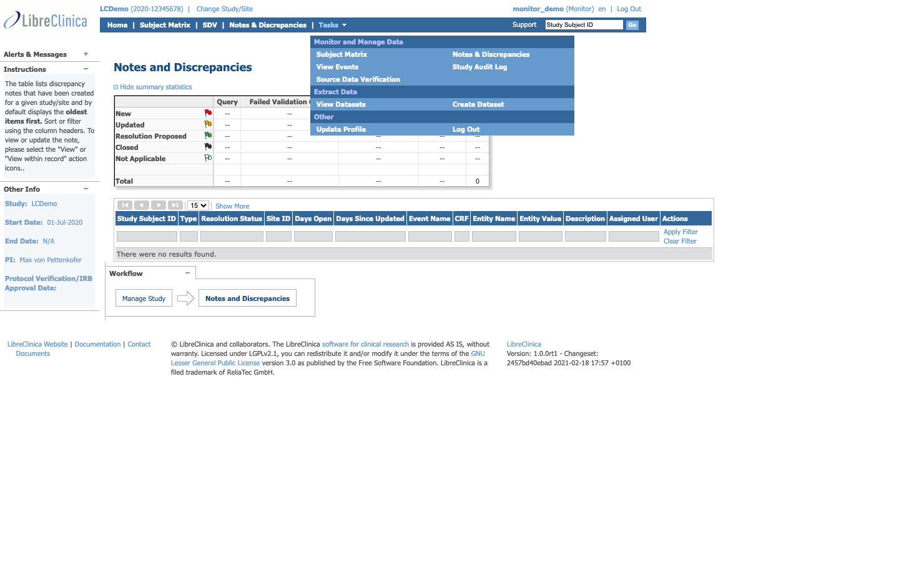
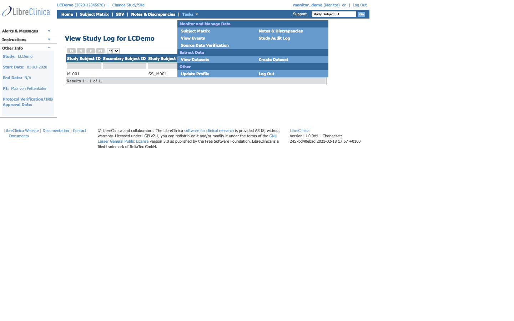
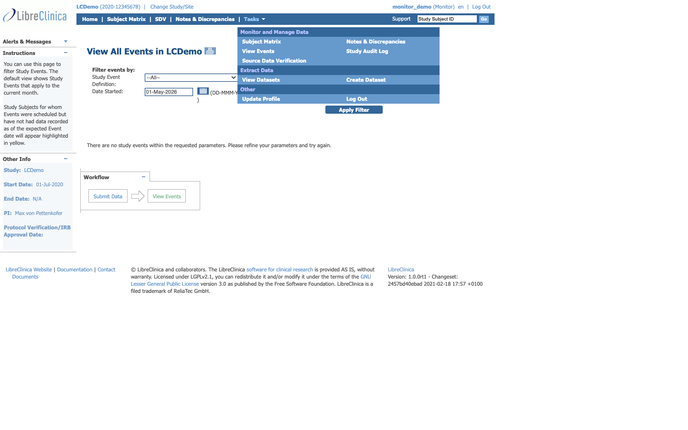
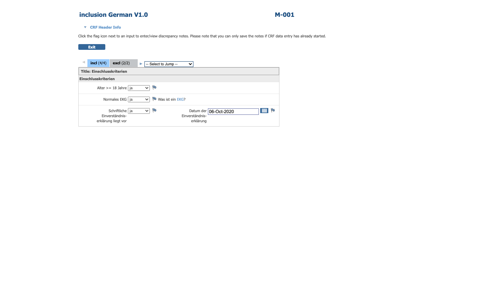

# Phase E — Monitor role UI feature catalogue

**Source:** live walkthrough of `libreclinica.reliatec.de/lc-demo01` as `monitor_demo` (role: Monitor), 2026-05-28, cross-referenced with [web.xml](../../../../web/src/main/webapp/WEB-INF/web.xml) servlet mappings and the existing [monitor manual](../../../manuals/monitor-manual.md).

**Purpose:** baseline inventory so the Phase E SPA rewrite preserves the Monitor's day-to-day workflows: Source Data Verification (SDV), Discrepancy management (Query creation + Close-Note authority), and the Study Audit Log.

> A Monitor **cannot enter or change study data** — they review data, raise Queries, close discrepancies, and audit. The Monitor is also the **only role with authority to close a discrepancy**.

---

## 1. Authentication

Same flow as Investigator — see [investigator-features.md §1](investigator-features.md#1-authentication--profile). The 2FA, password challenge, and Update Profile mechanics are role-agnostic.

- **Login URL:** `/pages/login/login` → POSTs to `/j_spring_security_check`
- **Logout:** `/j_spring_security_logout`
- **Update Profile:** `/UpdateProfile` (`control.login.UpdateProfileServlet`)

---

## 2. Top navigation (Monitor)

Captured live for `monitor_demo`. Compare with [investigator §2](investigator-features.md#2-top-navigation-investigator):

| Position | Label | URL | Backing servlet |
|---|---|---|---|
| Header-left | Study "LCDemo" | `/ViewStudy?id=3&viewFull=yes` | `control.admin.ViewStudyServlet` |
| Header-left | Change Study/Site | `/ChangeStudy` | `control.login.ChangeStudyServlet` |
| Header-right | `monitor_demo (Monitor) en` | `/UpdateProfile` | `control.login.UpdateProfileServlet` |
| Header-right | Log Out | `/j_spring_security_logout` | Spring Security |
| Top nav | Home | `/MainMenu` | `control.MainMenuServlet` |
| Top nav | Subject Matrix | `/ListStudySubjects` | `control.submit.ListStudySubjectsServlet` |
| Top nav | **SDV** | `/pages/viewAllSubjectSDVtmp?sdv_restore=true&studyId=<n>` | Spring MVC (`pages-servlet`) |
| Top nav | Notes & Discrepancies | `/ViewNotes?module=submit` | `control.managestudy.ViewNotesServlet` |
| Top nav | Tasks ▾ | — | (rendered client-side) |
| Top nav | Subject Subject ID search | `/ListStudySubjects` (GET) | same servlet |

**Differences vs Investigator top nav:**

- ➕ **SDV** primary nav button (only Monitor has this in top nav)
- ➖ **Add Subject** removed (Monitor cannot create subjects)
- ➖ "München" site link missing — `monitor_demo` operates across multiple sites, so only the study name is shown
- Notes & Discrepancies present but with Monitor-only powers (see §6)

### Tasks dropdown (Monitor)

Three sections only — no Submit Data, no Study Setup:

- **Monitor and Manage Data** — Subject Matrix · Notes & Discrepancies · View Events · Study Audit Log · Source Data Verification
- **Extract Data** — View Datasets · Create Dataset
- **Other** — Update Profile · Log Out

---

## 3. Home dashboard

- **URL:** `/MainMenu`
- **Servlet:** `org.akaza.openclinica.control.MainMenuServlet`
- **Key observation:** the Monitor home page **embeds the SDV "View By Event CRF" table inline**. The same table is the landing page of `/SDV`. The home is essentially the SDV workspace plus discrepancy-assigned-to-me link.
- **Sidebar:** same as Investigator (Alerts, Instructions, Other Info, Icon Key) but instruction text differs ("see instructions on the right" → SDV instructions)
- **Inline SDV widget columns:** SDV Status · Study Subject ID · Site ID · Event Name · Event Date · CRF Name / Version · SDV Requirement · CRF Status · Actions

---

## 4. Source Data Verification (SDV) — primary workflow

The defining workflow of the Monitor role. Implemented as a Spring MVC controller (under `/pages/*`), **not** a legacy servlet — handled by [`pages-servlet.xml`](../../../../web/src/main/webapp/WEB-INF/pages-servlet.xml).

### 4.1 SDV — View By Event CRF (default tab)

- **URL:** `/pages/viewAllSubjectSDVtmp?studyId=<n>` (or `…&sdv_restore=true` to restore previous filter state)
- **Controller:** Spring MVC bean configured in [pages-servlet.xml](../../../../web/src/main/webapp/WEB-INF/pages-servlet.xml) — likely `org.akaza.openclinica.controller.SDVController` or similar (verify during Phase E)
- **JSP:** under [web/src/main/webapp/WEB-INF/jsp/](../../../../web/src/main/webapp/WEB-INF/jsp/) — naming pattern `viewAllSubjectSDV*.jsp`
- **H1:** "Source Data Verification for LCDemo"
- **Two tabs:** "View By Event CRF" (default), "View By Study Subject ID"
- **Listed:** all CRFs with status *Completed* or *Locked*, sorted by Event Date (default)
- **Per-row controls:**
  - Checkbox for batch SDV
  - View CRF (clicking the CRF Status icon — opens read-only CRF in new window)
  - **SDV** button per row (marks a single CRF as SDV'd)
- **Column filters (applied via "Apply Filter"):**
  - Study Subject ID, Site ID, Event Name, Event Date
  - CRF Name / Version
  - **SDV Requirement** — dropdown: All, Not Required, Partial Required, 100% Required, Partial + 100% Required (per study/CRF SDV config)
  - **SDV Status** — dropdown: All, None (not yet SDV'd), Verified
  - CRF Status (Completed, Locked)
- **Header controls:** Show More (more columns), Select: All Shown / None, Apply Filter, Clear Filter
- **Bulk action:** "SDV All Checked" button → marks every checked CRF as SDV'd in one POST
- **Critical caveat from manual:** if data on an SDV'd CRF is later changed, status flips back to *not SDV'd* automatically (must be re-verified)

### 4.2 SDV — View By Study Subject ID

- **URL:** `/pages/viewSubjectAggregate?studyId=<n>`
- **Controller:** Spring MVC (pages-servlet)
- **Columns observed:** Study Subject ID, Site, # CRFs Completed, # CRFs SDV'd, # CRFs Total, last activity, Action
- **Per-row action:**
  - **SDV** button — marks **all completed CRFs of that subject** as SDV'd in one click (the "two-click SDV-all-for-subject" shortcut)
  - Magnifier icon → switches to View By Event CRF tab, pre-filtered to the chosen subject
- **Subjects without any completed CRF show "SDV N/A"** instead of the button

### 4.3 SDV requirement configuration (set elsewhere, observed here)

The SDV requirement per CRF×Event is **set by the Data Manager during study setup** ([data-manager-features.md §6](data-manager-features.md)), not by the Monitor. Monitor sees the resulting requirement label in the SDV table.

---

## 5. CRF viewing (read-only)

The Monitor reaches a CRF in two ways:

1. From the SDV table → click the CRF Status icon → opens read-only CRF in a new window
2. From Notes & Discrepancies → "View Within Record" arrow → opens CRF + discrepancy together

- **Backing servlet:** `control.managestudy.ViewSectionDataEntryServlet` (`/ViewSectionDataEntry?ecId=<n>`)
- **UI behavior observed in manual:**
  - Same CRF layout as Investigator (header info collapsible, section tabs, items with flags)
  - Inputs **look** editable but cannot save — submit is suppressed
  - "Exit" button redirects to Subject Matrix (instead of closing the window) — manual notes this as a quirk
- **Per-item flag** opens Add / View Discrepancy modal (next section)

---

## 6. Notes & Discrepancies — Monitor-specific powers

### 6.1 List / matrix view

- **URL:** `/ViewNotes?module=submit`
- **Servlet:** `control.managestudy.ViewNotesServlet`
- **Same listing UI as Investigator** ([see §7.1](investigator-features.md#71-list--matrix-view))
- **What's different for Monitor:**
  - Monitor's filter on "Assigned to Me" pre-fills `listNotes_f_discrepancyNoteBean.user=monitor_demo`
  - Monitor sees ALL discrepancies in the study (not just their own), because the role grants study-wide visibility

### 6.2 Create Query (Monitor-only)

- **Servlet:** `control.managestudy.CreateDiscrepancyNoteServlet`
- **Trigger:** flag icon on any item during SDV review
- **Form fields observed in manual:**
  - Description (required, short summary)
  - Detailed Note (long form)
  - Type: **Query** (locked — Monitor cannot create Annotation, Failed Validation Check, or Reason for Change)
  - Set to Status: New, Updated, Closed (Monitor can set Closed at creation if just logging a resolved finding)
  - **Assign to User** dropdown (Monitor-only — other roles cannot reassign)
  - **Email Assigned User** checkbox — triggers auto-generated notification email

### 6.3 Close discrepancy (Monitor-exclusive authority)

- **Trigger:** "Close Note" button on any open discrepancy thread
- **Servlet:** `control.managestudy.UpdateSubjectDiscrepancyNoteServlet` (with `setStatus=Closed`)
- **Required:** Description on the closing note
- **Other roles cannot Close** — they can only set Resolution Proposed / Updated

### 6.4 Discrepancy lifecycle (Monitor perspective)

| Type | Source | Statuses Monitor can set | Final state |
|---|---|---|---|
| Query | Monitor creates | New → Updated → Resolution Proposed → **Closed** | Closed |
| Failed Validation Check | Auto (validation) | (can review and Close) | Closed |
| Annotation | Investigator/CRC | "Not Applicable" — can `Begin New Thread` → spawns a Query | Closed (via spawned Query) |
| Reason for Change | Auto (edit on complete CRF) | Not Applicable — informational only | Not Applicable |

Special rule (manual §RFC): when data is deleted, all discrepancies on the deleted item are auto-closed regardless of type.

### 6.5 Audit history on a discrepancy

- When opening a Reason-for-Change discrepancy as Monitor, the form shows **Audit History** with old and new value side-by-side — observed in manual screenshot

### 6.6 Download discrepancies

- Same down-arrow → PDF / CSV via `control.extract.DiscrepancyNoteOutputServlet`

---

## 7. Study Audit Log

- **URL:** `/StudyAuditLog`
- **Servlet:** `org.akaza.openclinica.control.managestudy.StudyAuditLogServlet`
- **H1:** "View Study Log for LCDemo"
- **Reach:** Tasks → Monitor and Manage Data → Study Audit Log (Monitor + Data Manager only; not visible to Investigator)
- **First screen:** list of all subjects with filterable Study Subject ID column
- **Drill-in:** magnifier icon → per-subject audit page showing:
  - Audit entries grouped by **Subject**, **Events**, **CRFs**, **CRF items**
  - Old value / new value / actor / timestamp / action type
  - **Not filterable on the detail page** (manual confirms)
- **Underlying tables:** `audit_log_event`, `audit_log_subject` (from Liquibase changesets in [core/src/main/resources/migration/](../../../../core/src/main/resources/migration/))

---

## 8. Subject Matrix (Monitor view — read-only)

- **URL:** `/ListStudySubjects`
- **Servlet:** `control.submit.ListStudySubjectsServlet` (same as Investigator)
- **What's different:**
  - No "Add New Subject" link
  - No data-entry pencil icons — only View (magnifier)
  - No "Sign" pen (Investigator-only)
  - Filtering / sorting / search identical
- **Purpose for Monitor:** look-up tool to navigate to a subject's events/CRFs for visual review

---

## 9. View Events (study-wide list)

- **URL:** `/ViewStudyEvents`
- **Servlet:** `control.managestudy.ViewStudyEventsServlet`
- **Purpose:** cross-subject event listing, filterable by status, event definition, date
- **Monitor use:** scheduling oversight, event status review (not editable from here)

---

## 10. Data extraction (Monitor scope)

Same as Investigator:

- **View Datasets** — `/ViewDatasets` → `control.extract.ViewDatasetsServlet`
- **Create Dataset** — `/CreateDataset` → `control.extract.CreateDatasetServlet`

Datasets created by other users in the study are visible to Monitor (cross-user visibility for monitoring purposes).

---

## 11. Study / site context (read-only)

- **View Study** — `/ViewStudy?id=<n>` (clickable from header, same servlet)
- **Change Study/Site** — `/ChangeStudy` (Monitor can be assigned to multiple studies/sites)
- **No site-link** in header for `monitor_demo` because the role is at study level, not site level

---

## 12. Features NOT visible to Monitor

Confirmed by comparing crawls:

- **All "Submit Data" actions:** Add Subject, Schedule Event, Import Data (Monitor cannot create or modify data)
- **All "Study Setup":** Build Study, View Study (edit mode), Users management (visible to Data Manager only)
- **Rules, Groups, CRFs** management (Data Manager only — but Monitor can *see* rule outputs in audit and discrepancies)
- **Sign Subject** (Investigator only)
- **Mark CRF Complete** (Investigator/CRC only — Monitor cannot complete data entry on behalf)

See [data-manager-features.md](data-manager-features.md) for what's beyond Monitor's scope.

---

## 13. Deep-crawl additions (one click deeper)

### 13.1 Read-only CRF render — *the key Monitor primitive*

- **URL:** `/ViewSectionDataEntry?ecId=<n>` (`ecId` = event_crf_id)
- **Servlet:** `control.managestudy.ViewSectionDataEntryServlet`
- **JSP:** under [web/src/main/webapp/WEB-INF/jsp/managestudy/](../../../../web/src/main/webapp/WEB-INF/jsp/managestudy/) (same template family as InitialDataEntry but read-mode flag)
- **H1 captured:** "inclusion German V1.0" — the actual German "Einschlusskriterien" (inclusion criteria) CRF, with M-001 on the right
- **Layout in popup-window mode:** NO top nav rendered (this is the new window opened from the SDV table); only the CRF, tabs, and Exit button
- **Items captured in the screenshot:**
  - `Alter >= 18 Jahre` (Age ≥ 18 years) — Yes/No dropdown
  - `Normales EKG` (Normal ECG) — Yes/No dropdown with inline help link "Was ist ein EKG?"
  - `Schriftliche Einverständniserklärung liegt vor` (Written consent on file) — Yes/No
  - `Datum der Einverständniserklärung` (Date of consent) — date input "06-Oct-2020" with calendar icon
- **Tabs visible:** `incl (4/4)`, `excl (2/2)` — section name + answered/total counts (this section is fully completed)
- **Inputs are rendered as form controls** but the form has only an "Exit" button — no Save action, confirming Monitor cannot persist changes
- **Instruction banner:** "Click the flag icon next to an input to enter/view discrepancy notes. Please note that you can only save the notes if CRF data entry has already started."
- **Form fields captured (POST `ViewSectionDataEntry`):** `action`, `ecId`, `sectionId`, `tab`, `studySubjectId`, `eventDefinitionCRFId`, `interviewer`, `interviewDate`, `exit`, `sectionSelect`, plus per-item `input1`..`input4`
- **Phase E significance:** this is the **single most important Monitor primitive** — the SPA must preserve a deep-linkable, popup-friendly, read-only CRF view that Monitor can open alongside the SDV table

### 13.2 View Subject detail — Monitor read-only mode

- **URL:** `/ViewStudySubject?id=<n>` — same as Investigator, but Monitor sees no edit/sign actions
- **Servlet:** `control.submit.ViewStudySubjectServlet`
- **What Monitor uses this for:** quickly navigate from a discrepancy or audit entry into the subject's full event/CRF list

### 13.3 SDV "View By Study Subject ID" tab

- **URL:** `/pages/viewSubjectAggregate?studyId=<n>` — confirmed and screenshot captured
- **Per-subject row:** number CRFs Completed / Number SDV'd / Total + per-subject "SDV" bulk-mark button

### 13.4 Study Audit Log — per-subject drill-in

- **URL:** `/StudyAuditLog?id=<n>` (where `<n>` is `study_subject_id`)
- **Servlet:** `control.managestudy.StudyAuditLogServlet` with `id` parameter
- **Page shows:** audit entries grouped by Subject record / Events / CRFs / CRF Items, with old value / new value / actor / timestamp columns
- **Critical for compliance:** Monitor uses this for source-data verification and for inspector-readiness during sponsor audits

### 13.5 Notes & Discrepancies filtered to current Monitor

- **URL:** `/ViewNotes?module=submit&listNotes_f_discrepancyNoteBean.user=monitor_demo`
- Same matrix; pre-filtered to discrepancies assigned to the current Monitor

---

## 14. JSP file map (for Phase E rewrite scoping)

Monitor-reachable JSPs cluster in:

- [web/src/main/webapp/WEB-INF/jsp/managestudy/](../../../../web/src/main/webapp/WEB-INF/jsp/managestudy/) — ViewNotes, StudyAuditLog, ViewStudyEvents, ViewSite
- [web/src/main/webapp/WEB-INF/jsp/](../../../../web/src/main/webapp/WEB-INF/jsp/) (top-level) — SDV pages (Spring MVC, look for `viewAllSubjectSDV*.jsp`, `viewSubjectAggregate*.jsp`)
- [web/src/main/webapp/WEB-INF/jsp/extract/](../../../../web/src/main/webapp/WEB-INF/jsp/extract/) — datasets, downloads
- [web/src/main/webapp/WEB-INF/jsp/login/](../../../../web/src/main/webapp/WEB-INF/jsp/login/) — auth, profile, ChangeStudy
- [web/src/main/webapp/WEB-INF/jsp/submit/](../../../../web/src/main/webapp/WEB-INF/jsp/submit/) — Subject Matrix template (shared with Investigator), CRF read-only view

---

## 15. Phase E design notes for the Monitor SPA

These are observations that should shape the SPA design, not just feature checklist items:

- **The Monitor's home page IS the SDV workspace.** Treat SDV as the primary surface, not a feature inside a generic dashboard. Investigator → Subject Matrix, Monitor → SDV table — this should drive the role-conditional landing page.
- **Cross-window CRF + discrepancy editing.** The "View Within Record" workflow opens two windows. The SPA can collapse this to a side-by-side panel or a modal-over-context layout.
- **SDV requirement labels are display-only here** but configured under Build Study → CRFs/Events (Data Manager) — preserve the read-write asymmetry.
- **"SDV All Checked" + "SDV all CRFs of a subject"** are bulk safety-critical actions. The current UI gates them only by user-attention (manual's warning: "Be very careful..."). The SPA should require explicit confirmation including the subject count.
- **Auto status revert when underlying data changes** — the SPA must subscribe to data changes and re-render SDV status, not cache it.

---

## 16. Open follow-ups / known gaps in this catalogue

- **Sub-pages not yet drilled** (single-click deeper from the surface walk):
  - Opening one CRF in read-only mode from the SDV table
  - Add Query modal contents (only described from manual screenshots)
  - Per-subject Study Audit Log drill-in (only listing screen captured)
  - "View Within Record" two-window dance
- **Email notification template** — referenced in manual ("automatically generated") but not exercised
- **SDV requirement matrix** as configured by Data Manager — referenced here, captured under [data-manager-features.md](data-manager-features.md)
- **Locked-CRF behavior** — manual mentions Locked-status icon but no demo subject has a locked CRF; behavior derives from `control.submit.LockCRFServlet`

Recommended next pass: drill one level deeper from SDV → click an actual CRF Status icon to capture the read-only CRF render, then click a flag to capture the Add Query modal.
