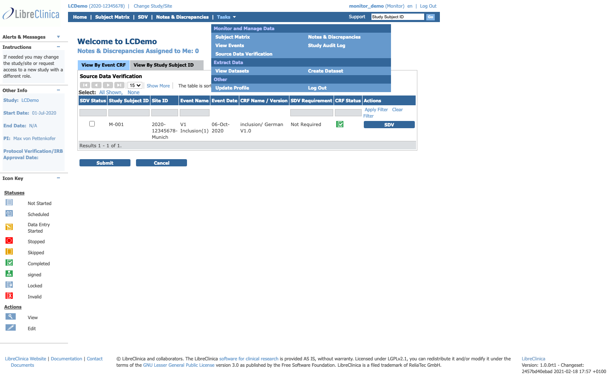
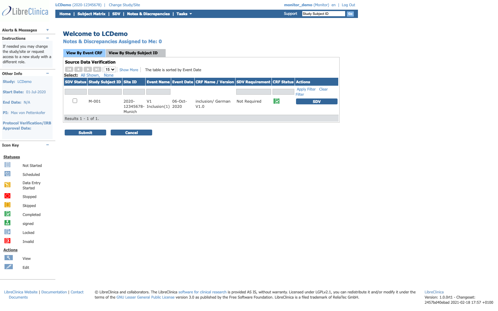
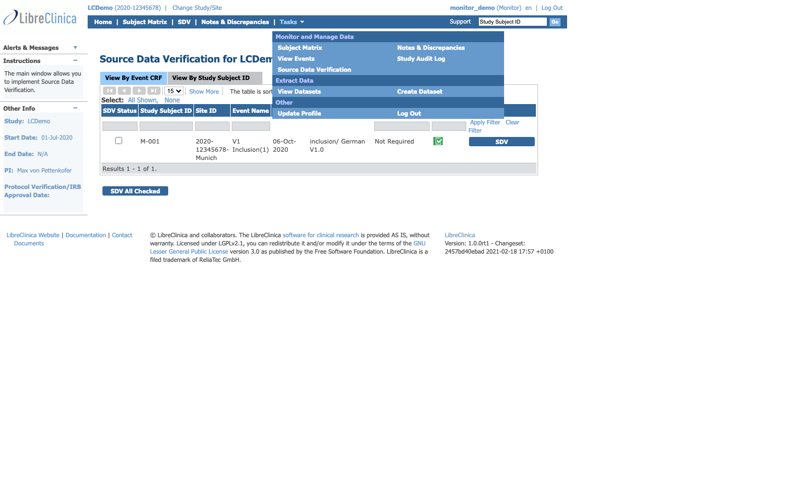
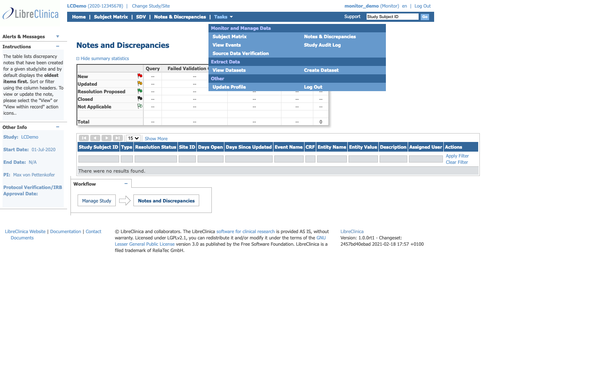
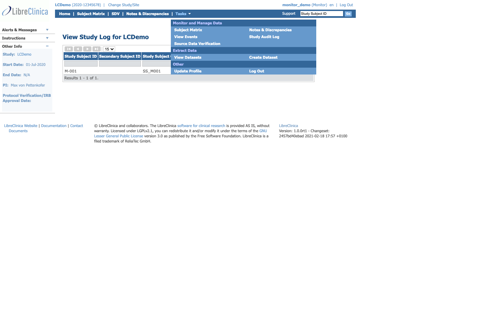
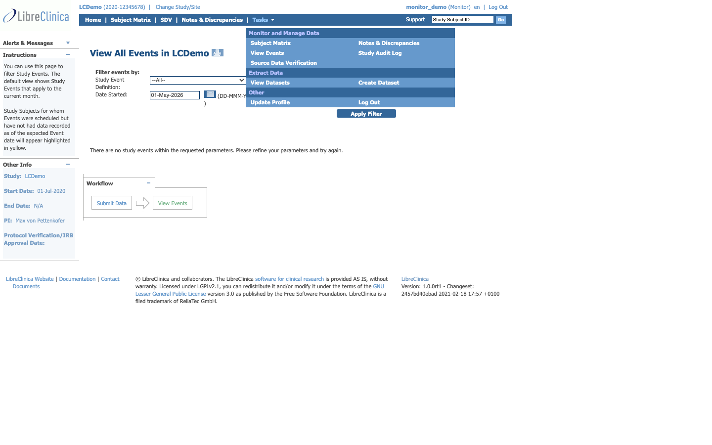
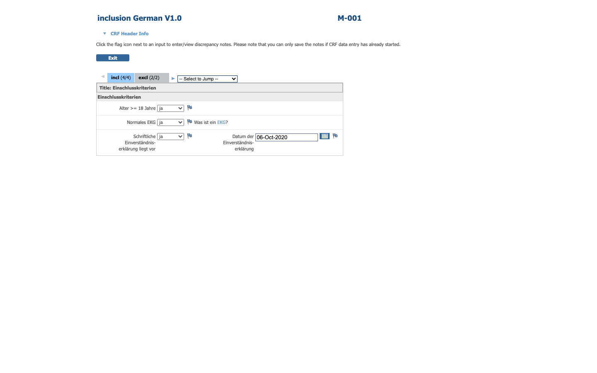

# Phase E — Monitor role UI feature catalogue

**Source:** live walkthrough of `libreclinica.reliatec.de/lc-demo01` as `monitor_demo` (role: Monitor), 2026-05-28, cross-referenced with [web.xml](../../../../web/src/main/webapp/WEB-INF/web.xml) servlet mappings and the existing [monitor manual](../../../manuals/monitor-manual.md).

**SPA coverage source (added 2026-09-30):** a live walkthrough of the local dev stack as `manual_monitor`, a Monitor whose only study binding is Default Study, on 2026-09-30. The legacy UI ran at `http://127.0.0.1:8080/LibreClinica/` (build `1.5.0-beta.15-muw`, footer stamp 2026-09-30 08:51 UTC) and the SPA at `http://127.0.0.1:8081/`. The walk was read-only:

- Every legacy screen was fetched with GET and its HTML read. No form was submitted, no action link was followed and no data was entered.
- The SPA was judged from its source: route → view → store → API controller. Its `/pages/api/v1/**` GET endpoints were read live with the same session, and the served bundle was checked for the code the findings rest on.
- Where a screen showed less than expected, the database was read with SELECT statements in read-only transactions to find out why.

It was cross-referenced with:

- [LegacyServletRegistry.java](../../../../web/src/main/java/at/ac/meduniwien/ophthalmology/libreclinica/config/LegacyServletRegistry.java), which has held the legacy URL mappings since Phase C.16 (they are no longer in `web.xml`);
- the servlet and JSP source under `control/managestudy/`, `control/submit/`, `control/extract/` and `control/login/`, and the Spring MVC [SDVController](../../../../web/src/main/java/at/ac/meduniwien/ophthalmology/libreclinica/controller/SDVController.java) with its JSPs;
- the SPA [router](../../../../web/src/spa/src/router/index.ts), views, stores and `/pages/api/v1/**` controllers;
- the Monitor chapter of the SPA's in-app handbook (`web/src/spa/src/manual/manualData.en.ts`).

The test data shapes several observations. Default Study has 7 subjects, 21 study events, 16 event CRFs (6 already verified) and 8 queries (all New, all assigned to `root`). It has no sites and no datasets.

**Purpose:** baseline inventory so the Phase E SPA rewrite preserves the Monitor's day-to-day workflows: Source Data Verification (SDV), Discrepancy management (Query creation + Close-Note authority), and the Study Audit Log.

**New since 2026-09-30: an *SPA coverage* column on every feature table.** Its model is [administrator-features.md](administrator-features.md). The 2026-05-28 sections were prose. Each now opens with a feature table, keeps its original text, and ends with what the 2026-09-30 walk found on the legacy screen and in the SPA. Where a verdict is PARTIAL, those notes say which fields or actions are missing. [DR-018](../decision-record.md#dr-018--the-legacy-jsp-layer-is-retired-in-full-admin-screens-included) retires screens against this column, so it is the part to keep current.

> A Monitor **cannot enter or change study data** — they review data, raise Queries, close discrepancies, and audit. The Monitor is also the **only role with authority to close a discrepancy**.
>
> On this build the first statement holds for the menus and screens of both UIs, but not for every handler behind them: several SPA endpoints do not check the role, and neither does the legacy initial-data-entry servlet (§12, §19.4). The second statement does not hold in either UI: legacy also offers Close to the study director and coordinator, and the SPA to the Data Manager and Administrator (§19.7).

> **Verdicts**
>
> - **COVERED**: an SPA route does the same job, checked in the view and in its API.
> - **PARTIAL**: an SPA route does part of the job; the notes say what is missing.
> - **NOT COVERED**: no SPA route does the job. This includes features the backend offers but no view calls ("API only"), and SPA features the Monitor cannot reach.
>
> Where the evidence was thin, the verdict is NOT COVERED rather than COVERED.

---

## 1. Authentication

Same flow as Investigator — see [investigator-features.md §1](investigator-features.md#1-authentication--profile). The 2FA, password challenge, and Update Profile mechanics are role-agnostic.

- **Login URL:** `/pages/login/login` → POSTs to `/j_spring_security_check`
- **Logout:** `/j_spring_security_logout`
- **Update Profile:** `/UpdateProfile` (`control.login.UpdateProfileServlet`)

**On this build (2026-09-30).** Not counted in §18; the SPA side belongs to the Investigator catalogue.

- `/pages/login/login` now redirects to the SPA login (`/LibreClinica/app/login`). The form POST to `/j_spring_security_check` still works and lands on `/MainMenu`.
- `GET /pages/api/v1/me` reports `role: Monitor` and Default Study as `activeStudy`, with the study's enabled modules and settings.

---

## 2. Top navigation (Monitor)

Captured live for `monitor_demo`. Compare with [investigator §2](investigator-features.md#2-top-navigation-investigator):

| Position | Label | URL | Backing servlet | SPA coverage |
|---|---|---|---|---|
| Header-left | Study "LCDemo" | `/ViewStudy?id=3&viewFull=yes` | `control.admin.ViewStudyServlet` | see §11 |
| Header-left | Change Study/Site | `/ChangeStudy` | `control.login.ChangeStudyServlet` | `/pick-study` → `StudyPickerView.vue` (§11) |
| Header-right | `monitor_demo (Monitor) en` | `/UpdateProfile` | `control.login.UpdateProfileServlet` | see [investigator-features.md §1](investigator-features.md#1-authentication--profile) |
| Header-right | Log Out | `/j_spring_security_logout` | Spring Security | `TopBar.vue` sign-out |
| Top nav | Home | `/MainMenu` | `control.MainMenuServlet` | `/` → `HomeView.vue` (§3) |
| Top nav | Subject Matrix | `/ListStudySubjects` | `control.submit.ListStudySubjectsServlet` | `/subjects` → `SubjectMatrixView.vue` (§8) |
| Top nav | **SDV** | `/pages/viewAllSubjectSDVtmp?sdv_restore=true&studyId=<n>` | Spring MVC (`pages-servlet`) | `/sdv` → `SdvView.vue` (§4) |
| Top nav | Notes & Discrepancies | `/ViewNotes?module=submit` | `control.managestudy.ViewNotesServlet` | `/notes` → `NotesDiscrepanciesView.vue` (§6) |
| Top nav | Tasks ▾ | — | (rendered client-side) | `TopBar.vue` primary links and the home cards |
| Top nav | Subject Subject ID search | `/ListStudySubjects` (GET) | same servlet | search box on `/subjects` (§8) |

Re-checked live for `manual_monitor` on 2026-09-30: the same entries, with Default Study (`/ViewStudy?id=1&viewFull=yes`) in the header. The Tasks menu is rendered by `include/navBar.jsp` and opened by script.

**Differences vs Investigator top nav:**

- ➕ **SDV** primary nav button (only Monitor has this in top nav)
- ➖ **Add Subject** removed (Monitor cannot create subjects)
- ➖ "München" site link missing — `monitor_demo` operates across multiple sites, so only the study name is shown
- Notes & Discrepancies present but with Monitor-only powers (see §6)

### Tasks dropdown (Monitor)

Three sections only — no Submit Data, no Study Setup:

- **Monitor and Manage Data** — Subject Matrix · Notes & Discrepancies · View Events · Study Audit Log · Source Data Verification
- **Extract Data** — View Datasets · Create Dataset
- **Other** — Update Profile · Log Out

The same three groups were captured live for `manual_monitor` on 2026-09-30:

| Tasks entry | URL | Backing servlet | SPA coverage |
|---|---|---|---|
| Subject Matrix | `/ListStudySubjects` | `control.submit.ListStudySubjectsServlet` | `/subjects` — see §8 |
| Notes & Discrepancies | `/ViewNotes?module=submit` | `control.managestudy.ViewNotesServlet` | `/notes` — see §6 |
| View Events | `/ViewStudyEvents` | `control.managestudy.ViewStudyEventsServlet` | `/due-visits` — see §9 |
| Study Audit Log | `/StudyAuditLog` | `control.managestudy.StudyAuditLogServlet` | `/audit-log` — see §7 |
| Source Data Verification | `/pages/viewAllSubjectSDVtmp?sdv_restore=true&studyId=<n>` | `controller.SDVController` | `/sdv` — see §4 |
| View Datasets | `/ViewDatasets` | `control.extract.ViewDatasetsServlet` | `/export` — see §10 |
| Create Dataset | `/CreateDataset` | `control.extract.CreateDatasetServlet` | `/datasets/new` — see §10 |
| Update Profile | `/UpdateProfile` | `control.login.UpdateProfileServlet` | see [investigator-features.md §1](investigator-features.md#1-authentication--profile) |
| Log Out | `/j_spring_security_logout` | Spring Security | `TopBar.vue` sign-out |

### SPA navigation for the Monitor

- **Top bar** (`TopBar.vue`, `lib/primaryNav.ts`): Home · Subject Matrix · SDV · Notes · Audit Log.
- **Home queue cards** (`HomeView.vue`): Source Data Verification (the number of *pending* rows) · Notes & Discrepancies (the number of open notes) · Due visits.
- **Home destination cards:** Subject Matrix · Data export · Audit log · Patients overview · Switch study.
- Datasets and events have no top-bar entry; they are reached from the home cards.

The navigation rows above are not counted in §18; the features they lead to are.

---

## 3. Home dashboard

| Label | URL | Backing servlet | SPA coverage |
|---|---|---|---|
| Home: alerts, *Notes & Discrepancies Assigned to Me*, inline SDV table with both tabs | `/MainMenu` | `control.MainMenuServlet` → `menu.jsp` | **PARTIAL** — `/` → `HomeView.vue` |

- **URL:** `/MainMenu`
- **Servlet:** `org.akaza.openclinica.control.MainMenuServlet`
- **Key observation:** the Monitor home page **embeds the SDV "View By Event CRF" table inline**. The same table is the landing page of `/SDV`. The home is essentially the SDV workspace plus discrepancy-assigned-to-me link.
- **Sidebar:** same as Investigator (Alerts, Instructions, Other Info, Icon Key) but instruction text differs ("see instructions on the right" → SDV instructions)
- **Inline SDV widget columns:** SDV Status · Study Subject ID · Site ID · Event Name · Event Date · CRF Name / Version · SDV Requirement · CRF Status · Actions

**On this build (2026-09-30).**

- Legacy, live: *Welcome to Default Study*, the link *Notes & Discrepancies Assigned to Me: 0*, and the SDV widget with both tabs. The widget loads `/pages/viewAllSubjectSdvData` and was empty (§4.4). Its columns are now those of the full SDV table.
- SPA: three queue cards and five destination cards (§2).

*Missing in the SPA:*

- The count of notes assigned to the Monitor. The Notes card counts all open notes, and *Assigned to me* on `/notes` does not work (§6.8).
- The inline table. The SDV card links to `/sdv` instead, and its count includes CRFs still in data entry (§4.5).

---

## 4. Source Data Verification (SDV) — primary workflow

The defining workflow of the Monitor role. Implemented as a Spring MVC controller (under `/pages/*`), **not** a legacy servlet — handled by [`pages-servlet.xml`](../../../../web/src/main/webapp/WEB-INF/pages-servlet.xml).

| Label | URL | Backing | SPA coverage |
|---|---|---|---|
| SDV table, View By Event CRF | `/pages/viewAllSubjectSDVtmp?studyId=<n>` (+ `/pages/viewAllSubjectSdvData`) | `controller.SDVController` → `viewAllSubjectSDVtmp.jsp`, `include/viewAllSubjectSdvTable.jsp` | **PARTIAL** — `/sdv` → `SdvView.vue` |
| Column filters and sort | same | jmesa (evicted, §4.4) | **PARTIAL** — search, status, requirement and only-with-queries filters on `/sdv` |
| Select all shown / none | same | jmesa (evicted) | **COVERED** — header checkbox on `/sdv` |
| SDV one CRF (row *SDV* button) | `POST /pages/handleSDVGet` | `SDVController.sdvOneCRFFormHandler` | **COVERED** — row checkbox, then *Mark as verified* (`POST /pages/api/v1/sdv/verify`) |
| SDV All Checked | `POST /pages/handleSDVPost` | `SDVController.sdvAllSubjectsFormHandler` | **COVERED** — bulk bar; the confirmation states the count |
| Remove SDV from one CRF (double-check icon, confirm) | `POST /pages/handleSDVRemove` | `SDVController.changeSDVHandler` | **COVERED** — *Unverify* with a required reason (`POST /pages/api/v1/sdv/unverify`, audited) |
| Open the CRF from an SDV row (CRF-status icon) | `/ViewSectionDataEntry?eventDefinitionCRFId=…&crfVersionId=…&studySubjectId=…` | `control.managestudy.ViewSectionDataEntryServlet` | **NOT COVERED** — *Open CRF* targets `/event-crfs/:oid`, which refuses the Monitor (§5) |
| SDV View By Study Subject ID (per-subject counts) | `/pages/viewSubjectAggregate?studyId=<n>` (+ `/pages/viewSubjectAggregateData`) | `SDVController` → `viewSubjectAggregate.jsp`, `include/viewSubjectAggregateTable.jsp` | **NOT COVERED** — — |
| SDV all CRFs of one or more subjects | `POST /pages/sdvStudySubject`, `POST /pages/sdvStudySubjects` | `SDVController` | **PARTIAL** — search `/sdv` by subject ID, header checkbox, *Mark as verified* |
| Remove SDV from all CRFs of a subject | `POST /pages/unSdvStudySubject` | `SDVController.unSdvStudySubjectHandler` | **NOT COVERED** — un-verify is one row at a time by design |
| SDV requirement per CRF × event (display only) | *SDV Requirement* column | `SDVController`, from `event_definition_crf` | **COVERED** — *Requirement* column and filter on `/sdv` |
| SDV revoked when verified data changes | — | `control.submit.DataEntryServlet` clears `sdv_status` on change | **NOT COVERED** — the SPA's save and re-open paths leave `sdv_status` set |

### 4.1 SDV — View By Event CRF (default tab)

- **URL:** `/pages/viewAllSubjectSDVtmp?studyId=<n>` (or `…&sdv_restore=true` to restore previous filter state)
- **Controller:** Spring MVC bean configured in [pages-servlet.xml](../../../../web/src/main/webapp/WEB-INF/pages-servlet.xml) — likely `org.akaza.openclinica.controller.SDVController` or similar (verify during Phase E)
- **JSP:** under [web/src/main/webapp/WEB-INF/jsp/](../../../../web/src/main/webapp/WEB-INF/jsp/) — naming pattern `viewAllSubjectSDV*.jsp`
- **H1:** "Source Data Verification for LCDemo"
- **Two tabs:** "View By Event CRF" (default), "View By Study Subject ID"
- **Listed:** all CRFs with status *Completed* or *Locked*, sorted by Event Date (default)
- **Per-row controls:**
  - Checkbox for batch SDV
  - View CRF (clicking the CRF Status icon — opens read-only CRF in new window)
  - **SDV** button per row (marks a single CRF as SDV'd)
- **Column filters (applied via "Apply Filter"):**
  - Study Subject ID, Site ID, Event Name, Event Date
  - CRF Name / Version
  - **SDV Requirement** — dropdown: All, Not Required, Partial Required, 100% Required, Partial + 100% Required (per study/CRF SDV config)
  - **SDV Status** — dropdown: All, None (not yet SDV'd), Verified
  - CRF Status (Completed, Locked)
- **Header controls:** Show More (more columns), Select: All Shown / None, Apply Filter, Clear Filter
- **Bulk action:** "SDV All Checked" button → marks every checked CRF as SDV'd in one POST
- **Critical caveat from manual:** if data on an SDV'd CRF is later changed, status flips back to *not SDV'd* automatically (must be re-verified)

### 4.2 SDV — View By Study Subject ID

- **URL:** `/pages/viewSubjectAggregate?studyId=<n>`
- **Controller:** Spring MVC (pages-servlet)
- **Columns observed:** Study Subject ID, Site, # CRFs Completed, # CRFs SDV'd, # CRFs Total, last activity, Action
- **Per-row action:**
  - **SDV** button — marks **all completed CRFs of that subject** as SDV'd in one click (the "two-click SDV-all-for-subject" shortcut)
  - Magnifier icon → switches to View By Event CRF tab, pre-filtered to the chosen subject
- **Subjects without any completed CRF show "SDV N/A"** instead of the button

### 4.3 SDV requirement configuration (set elsewhere, observed here)

The SDV requirement per CRF×Event is **set by the Data Manager during study setup** ([data-manager-features.md §6](data-manager-features.md)), not by the Monitor. Monitor sees the resulting requirement label in the SDV table.

### 4.4 Legacy SDV on this build (2026-09-30)

- **Controller, verified:** `at.ac.meduniwien.ophthalmology.libreclinica.controller.SDVController`. Both pages are shells whose tables load by script from `/pages/viewAllSubjectSdvData` and `/pages/viewSubjectAggregateData` (JSON), since jmesa was evicted in Phase B.4.
- **What the event-CRF table still has:**
  - Columns: SDV Status · Study Subject ID · Site ID · Person ID · Secondary ID · Event Name · Event Date · Enrollment Date · Subject Status · CRF Name / Version · SDV Requirement · CRF Status · Last Updated Date · Last Updated by · Study Event Status · Actions.
  - Controls: a checkbox per unverified row, a per-row *SDV* button, the double-check icon (remove SDV, after a confirm), and *SDV All Checked*, hidden when the study is locked. All four submit by POST.
- **What it lost:** column filters, sort, *Show More* and *Select All Shown / None*. The data endpoint builds an empty `EventCRFSDVFilter`, ignores request parameters, and returns at most 500 rows in creation order.
- **It lists only event CRFs whose `status_id` is 2 (completed) or 6 (locked)**, and excludes SDV code 4 (not applicable).
  - The SPA's *mark complete* sets `date_completed` and leaves `status_id` at 1, so a CRF completed in the SPA never appears here (§19.6).
  - On Default Study the table was empty, although 16 event CRFs exist and 6 of them are verified.
- **The CRF-status icon opens the wrong page.** It links to `/ViewSectionDataEntry` with `eventDefinitionCRFId`, `crfVersionId` and `studySubjectId` but no `ecId`, so the servlet loads no event CRF. Reproduced with the icon's URL for M-001: `ecId` 0, no event, no interview date.
- **View By Study Subject ID is always empty.**
  - The data endpoint sorts on the key `studySubjectId`, which `StudySubjectSDVSort` does not map, so the SQL ends in `order by null asc`.
  - PostgreSQL rejects that ("non-integer constant in ORDER BY"). The DAO swallows the error and returns no rows, while the count query succeeds. Live: `recordsTotal: 7`, `data: []`.
  - Live columns: SDV Status · Study Subject ID · Site ID · Person ID · Study Subject Status · Group · # of CRFs Completed · # of CRFs SDV'd · Total Event CRFs · Actions. The *# of CRFs Completed* count also uses `status_id`, so SPA-completed CRFs count as not completed.
- The subject row's magnifier links to `viewAllSubjectSDVtmp?…&sdv_f_studySubjectId=<label>`, a jmesa-era parameter the controller ignores; the table opens unfiltered.
- The six write handlers accept POST only. They require the study director, coordinator or monitor role on the current study, and refuse event CRFs or subjects outside it.

### 4.5 The SPA SDV page (`/sdv`)

- The route admits `Monitor` and `Administrator`. `stores/sdv.ts` loads `GET /pages/api/v1/sdv`; verify and un-verify POST to `/sdv/verify` and `/sdv/unverify`.
- Live for Default Study: 16 rows, one per event CRF: 6 verified, 5 pending and 5 *query*.
- Row status (`SdvApiController.statusForRow`):
  - *verified* if `sdv_status` is set;
  - else *query* if the CRF has open notes (New, Updated or Resolution Proposed);
  - else *locked* if the data-entry stage is locked;
  - else *pending*. Only *pending* rows can be selected.
- Columns: subject, site, event, event date, CRF (with a fixed "en" language tag), requirement, and status with an open-query count.
- Bulk verify asks for confirmation and states the count, as §15 recommended. Un-verify is one row at a time, requires a reason, and writes an audit row with it.

*Missing in the SPA:*

- **The completion check.** Every event CRF is listed, including CRFs still in data entry, and those are selectable as *pending*.
  - Live: M-001 *V3 Day 90* (data entry started, not completed) is offered for verification.
  - `POST /sdv/verify` does not check completion either. Legacy lists only completed or locked CRFs.
- **The automatic revoke.** Nothing in `EventCrfsApiController` touches `sdv_status`, and no database trigger clears it.
  - A verified, unsigned CRF can be re-opened (`markIncomplete`: Investigator, CRC, Data Manager, Administrator), edited and completed again, and it stays verified in both UIs.
  - The SPA's own verification dialog says the opposite: "If data on a verified CRF is later changed, its SDV status resets to Pending automatically" (§19.5).
- Columns: Person ID, Secondary ID, Enrollment Date, Subject Status, CRF status (data-entry stage), Study Event Status, Last Updated Date and Last Updated by. The API returns `lastUpdatedAt`, but the view does not show it. *Site* shows the study name, not the site identifier.
- Filters: site, event date and CRF status, and the combined *Partial + 100% Required* option. The search box covers subject, CRF and event.
- The subject view: per-subject counts (completed, verified, total), SDV per subject and remove SDV per subject.
  - Searching by subject ID, selecting all and verifying does the same job only when no incomplete CRF is in view.
- A working *Open CRF* link (§5).

Divergences from legacy:

- A CRF with any open note is *query* and cannot be selected; legacy verifies regardless of notes.
  - SPA-created annotations are stored as New (§6.4), so an annotation also blocks SDV.
  - The Monitor cannot close a New note in the SPA (§6.8).
- Two controls do nothing (§19.3):
  - *Export* has no handler.
  - A row's *Add query* raises its open-query counter in the page and saves nothing.

---

## 5. CRF viewing (read-only)

| Label | URL | Backing servlet | SPA coverage |
|---|---|---|---|
| Read-only CRF (header, section tabs, items, no Save) | `/ViewSectionDataEntry?ecId=<n>` | `control.managestudy.ViewSectionDataEntryServlet` → `managestudy/viewSectionDataEntry.jsp` | **PARTIAL** — `/event-crfs/:eventCrfOid/readonly` → `CrfEntryView.vue` (`meta.readOnly`) |
| Open the CRF at a discrepancy (*View Within Record*) | `/ResolveDiscrepancy?noteId=<n>` | `control.managestudy.ResolveDiscrepancyServlet` → `ViewSectionDataEntry` | **NOT COVERED** — the item link on `/notes` targets `/event-crfs/:oid?item=…`, which refuses the Monitor |
| Per-item flag: add or view the item's notes | `/CreateDiscrepancyNote`, `/ViewDiscrepancyNote` popups | `control.submit.CreateDiscrepancyNoteServlet`, `ViewDiscrepancyNoteServlet` | **PARTIAL** — `ItemNoteIndicator` → `NewNoteDialog.vue` / `NoteThreadDialog.vue` |
| Print the CRF | `rest/clinicaldata/html/print/<study>/<subject>/<event>/<form>` (from View Subject) | Jersey tree (not registered) | **PARTIAL** — `/event-crfs/:eventCrfOid/print` → `PrintableCrfView.vue` |

The Monitor reaches a CRF in two ways:

1. From the SDV table → click the CRF Status icon → opens read-only CRF in a new window
2. From Notes & Discrepancies → "View Within Record" arrow → opens CRF + discrepancy together

- **Backing servlet:** `control.managestudy.ViewSectionDataEntryServlet` (`/ViewSectionDataEntry?ecId=<n>`)
- **UI behavior observed in manual:**
  - Same CRF layout as Investigator (header info collapsible, section tabs, items with flags)
  - Inputs **look** editable but cannot save — submit is suppressed
  - "Exit" button redirects to Subject Matrix (instead of closing the window) — manual notes this as a quirk
- **Per-item flag** opens Add / View Discrepancy modal (next section)

**On this build (2026-09-30), legacy:**

- `/ViewSectionDataEntry?ecId=1` renders:
  - the header: study subject ID, person ID, event and date, sex, age at enrolment, date of birth, site, interviewer name and interview date;
  - the CRF's note counts, and note flags on the interviewer name and interview date;
  - the section tabs with answered/total counts.
- The form posts `action=saveNotes`. Its only button is *Exit*, which returns to View Subject.
- **No items render on this stack.** The seeded CRF versions have no `item_group_metadata` rows, which the legacy renderer needs; the sections show 0/2 and 0/3. This is a property of the seed data, and item rendering was not verified (§20).
- `/ResolveDiscrepancy?noteId=1` works: it opens event CRF 1 read-only and carries the popup link to that note's thread.
- The CRF-status icon in the SDV table opens the CRF without the subject's data (§4.4).
- The *Print* link on View Subject answers **HTTP 404**, because `/rest/*` is not registered.

**The SPA:**

- The route works when its URL is typed. `GET /pages/api/v1/eventCrfs/1` returned the schema and the five values.
- In read-only mode, inputs are disabled, save and complete are hidden, and the header shows a *Read-only* tell. *Print* opens `/event-crfs/:oid/print` in a new tab.
- **No SPA link reaches it.**
  - *Open CRF* on `/sdv`, the item link on `/notes` and *Open* on `/events/:eventId` all target `/event-crfs/:oid`.
  - That route admits Investigator and Administrator only; the router guard sends the Monitor home.
  - Nothing links to the read-only route. The handbook says *CRF öffnen* opens it (§19.5).
- **Existing notes never show on items or sections.**
  - `GET /eventCrfs/{id}/notes` finds the CRF's notes but cannot map them to items: `findAllParentItemNotesByEventCRF` does not resolve the item mapping, so `byItemOid` is always empty.
  - `section-status` reports `openQueries: 0`.
  - Live: event CRF 9 has three open queries. The rollup answered `openCount: 3, byItemOid: {}`, and both sections reported 0.
  - Every item therefore shows only the *+* (new note) control, and no thread can be opened from an item.

*Missing in the SPA:*

- A link to the read-only CRF from anywhere the Monitor can go.
- The item-level note indicators, as above.
- Header fields: person ID, sex, age at enrolment, date of birth, site, interviewer name and interview date, and notes on the last two.
- *View Within Record*: opening the CRF at the item of a given note.

---

## 6. Notes & Discrepancies — Monitor-specific powers

| Label | URL | Backing servlet | SPA coverage |
|---|---|---|---|
| Notes list, study-wide | `/ViewNotes?module=submit` (+ `/ViewNotesData`) | `control.managestudy.ViewNotesServlet`, `ViewNotesDataServlet` → `managestudy/viewNotes.jsp` | **PARTIAL** — `/notes` → `NotesDiscrepanciesView.vue` |
| Summary statistics (type × status) | same | same | **PARTIAL** — summary cards on `/notes` |
| Filter and sort the list | same | `ViewNotesDataServlet` | **PARTIAL** — search, status and type filters on `/notes` |
| Notes assigned to me (filter, and the home link) | `/ViewNotes?module=submit&listNotes_f_discrepancyNoteBean.user=<me>` | same | **NOT COVERED** — *Assigned to me* on `/notes` matches a fixed user name |
| View a note thread | row *View* icon; `/ViewDiscrepancyNote?…` | `control.submit.ViewDiscrepancyNoteServlet` → `submit/viewDiscrepancyNote.jsp` | **PARTIAL** — row expand → `ThreadTimeline.vue`; `NoteThreadDialog.vue` |
| Create a Query on an item | `/CreateDiscrepancyNote?…` (CRF flag) | `control.submit.CreateDiscrepancyNoteServlet` → `submit/addDiscrepancyNote.jsp` | **PARTIAL** — `NewNoteDialog.vue` in the read-only CRF (`POST /pages/api/v1/discrepancies`) |
| Query on a subject, event or CRF-header field | `/CreateDiscrepancyNote?name=…` (subject, study subject, study event or event CRF) | same | **NOT COVERED** — the API attaches notes to item data only |
| Close a note | `/CreateOneDiscrepancyNote` (status Closed) | `control.submit.CreateOneDiscrepancyNoteServlet` | **PARTIAL** — *Close* on `/notes` and in `NoteThreadDialog.vue`, from Resolution Proposed only |
| Update a thread: re-query, reply, reassign | `/CreateOneDiscrepancyNote` (status Updated) | same | **NOT COVERED** — *Respond* is hidden from the Monitor |
| Re-open a closed note | `/CreateOneDiscrepancyNote` (*Update Note* on a Closed thread) | same | **NOT COVERED** — Closed is terminal in the SPA and its API |
| Item audit history and data dictionary in the note view | `/ViewDiscrepancyNote` (*Audit History*, *Data Dictionary*) | `control.submit.ViewDiscrepancyNoteServlet` | **NOT COVERED** — — |
| Download notes (CSV or PDF) | `/ChooseDownloadFormat` → `/DiscrepancyNoteOutputServlet` | `control.extract.ChooseDownloadFormat`, `DiscrepancyNoteOutputServlet` | **PARTIAL** — *Export CSV* on `/notes` (`GET /pages/api/v1/discrepancies/export.csv`) |

### 6.1 List / matrix view

- **URL:** `/ViewNotes?module=submit`
- **Servlet:** `control.managestudy.ViewNotesServlet`
- **Same listing UI as Investigator** ([see §7.1](investigator-features.md#71-list--matrix-view))
- **What's different for Monitor:**
  - Monitor's filter on "Assigned to Me" pre-fills `listNotes_f_discrepancyNoteBean.user=monitor_demo`
  - Monitor sees ALL discrepancies in the study (not just their own), because the role grants study-wide visibility

### 6.2 Create Query (Monitor-only)

- **Servlet:** `control.managestudy.CreateDiscrepancyNoteServlet`
- **Trigger:** flag icon on any item during SDV review
- **Form fields observed in manual:**
  - Description (required, short summary)
  - Detailed Note (long form)
  - Type: **Query** (locked — Monitor cannot create Annotation, Failed Validation Check, or Reason for Change)
  - Set to Status: New, Updated, Closed (Monitor can set Closed at creation if just logging a resolved finding)
  - **Assign to User** dropdown (Monitor-only — other roles cannot reassign)
  - **Email Assigned User** checkbox — triggers auto-generated notification email

### 6.3 Close discrepancy (Monitor-exclusive authority)

- **Trigger:** "Close Note" button on any open discrepancy thread
- **Servlet:** `control.managestudy.UpdateSubjectDiscrepancyNoteServlet` (with `setStatus=Closed`)
- **Required:** Description on the closing note
- **Other roles cannot Close** — they can only set Resolution Proposed / Updated

### 6.4 Discrepancy lifecycle (Monitor perspective)

| Type | Source | Statuses Monitor can set | Final state | SPA, as the Monitor (2026-09-30) |
|---|---|---|---|---|
| Query | Monitor creates | New → Updated → Resolution Proposed → **Closed** | Closed | Creates it (always New). Closes it from Resolution Proposed only; cannot set Updated. |
| Failed Validation Check | Auto (validation) | (can review and Close) | Closed | The Monitor can also create one, which legacy does not allow. Closes it from Resolution Proposed only. |
| Annotation | Investigator/CRC | "Not Applicable" — can `Begin New Thread` → spawns a Query | Closed (via spawned Query) | The Monitor can create one. The API stores every new note as New, annotations included (legacy: Not Applicable), so an SPA annotation counts as open and keeps its CRF out of SDV (§4.5). |
| Reason for Change | Auto (edit on complete CRF) | Not Applicable — informational only | Not Applicable | Not offered to the Monitor; the API allows it to the Data Manager and Administrator. |

Special rule (manual §RFC): when data is deleted, all discrepancies on the deleted item are auto-closed regardless of type.

The lifecycle rows describe behaviour and are not counted in §18.

### 6.5 Audit history on a discrepancy

- When opening a Reason-for-Change discrepancy as Monitor, the form shows **Audit History** with old and new value side-by-side — observed in manual screenshot

### 6.6 Download discrepancies

- Same down-arrow → PDF / CSV via `control.extract.DiscrepancyNoteOutputServlet`

### 6.7 Legacy notes on this build (2026-09-30)

- **The list shows none of the study's eight notes.**
  - `/ViewNotesData` reads `view_discrepancy_note`, which joins `view_dn_stats`. That view includes a parent note only if it has at least one child row.
  - The heritage UI wrote a child copy with every new thread. The eight seeded notes have none.
  - **Notes created through the SPA are parent-only too** (`DiscrepancyApiController.add`). They stay out of the list, the summary and the CSV/PDF download until someone replies (§19.6).
  - Live: `recordsTotal: 0` and a summary of all "--", while `GET /pages/api/v1/discrepancies` returned 8.
- **No filtering from the page.** The data endpoint accepts DataTables column filters, but the page sends none: it fetches a fixed first page of 500 rows, newest first.
  - The *Assigned to Me* link on the home page adds `listNotes_f_discrepancyNoteBean.user`, which the page does not pass on.
- **The row *View* icon is broken.** It opens `/CreateDiscrepancyNote?noteId=<id>&viewAction=1`; the servlet reads neither parameter and shows an empty *Add Discrepancy Note* popup ("cannot be saved because data entry for this CRF section is not started yet").
- The row's *View within record* (`/ResolveDiscrepancy`) works.
- **The download is unlinked.** The chooser (`/ChooseDownloadFormat`, CSV or PDF) still works when typed, but no link on the list page reaches it: it was in the jmesa toolbar. It reads the same view as the list.
- **The thread view works.** Reached through *View within record* for note 1 (`/ViewDiscrepancyNote?name=itemData&id=3&…&monitor=1`), it shows:
  - the item's properties: subject, event, event date, CRF, current value and a data-dictionary link;
  - the note: description, last update, assignee, ID, type, status and number of child notes;
  - the item's **audit history** with old and new values;
  - a respond form: description, detailed note, status (New, Updated or Closed), assignee and *Email Assigned User*;
  - *Begin New Thread*, whose type list for the Monitor holds Query only.
- For the Monitor, `ViewDiscrepancyNoteServlet` offers the statuses New, Updated and Closed. The Monitor can therefore close any open thread and update a closed one back to Updated.
- *Close Note* and the other thread actions post to `/CreateOneDiscrepancyNote`. `UpdateSubjectDiscrepancyNoteServlet`, named in §6.3, does not exist in the code base.

### 6.8 The SPA notes page (`/notes`)

- Live: `GET /pages/api/v1/discrepancies` returned all eight notes.
- Summary cards: open notes in total, and per type.
- Filters: search over subject ID, item OID and description; status (open only by default, all, or a single status); type; *Assigned to me*.
- Columns: type, status, subject (link), item (label, OID, event and current value; link), description, assignee, days open, actions.
- Monitor actions: expand the thread, and *Close* on Resolution Proposed rows. *Respond* and *Mark resolved* are hidden, because `canRespondToNote` returns false for the Monitor.
- *Export CSV*: ID, type, status, subject, item OID, description, assignee, days open and last activity. Each download writes an audit row (type 56).
- Notes are created from the read-only CRF: the item's *+* opens `NewNoteDialog.vue` with description, type and assignee.

*Missing in the SPA:*

- **A working *Assigned to me*.** `stores/notes.ts` sets `me` to the literal `monitor_demo`, and nothing replaces it; the served bundle carries the same literal.
  - For every other user the filter hides every note.
  - The CSV export then sends `assignedTo=monitor_demo`.
- **Correct ages.** `findAllParentsByStudy` reads the base table, which has no `days` column, so every note reports 0 days open ("—" on screen) and a *last activity* equal to the time of the request.
  - Live: notes created in 2020 and 2021 all showed 0 and `2026-09-30T10:21:32Z`.
  - The CSV carries the same values.
- **Usable links.** The subject and item links go to `/subjects/:id` and `/event-crfs/:oid`, which both refuse the Monitor (§5, §8).
- **Monitor transitions:**
  - Close only from Resolution Proposed; legacy allows it from New, Updated or Resolution Proposed.
  - No re-query, reply or reassign, although the API allows the Monitor Resolution Proposed → Updated and Updated → Updated.
  - No re-open of a closed note.
- **Note creation:**
  - No detailed note, and no initial status: every new note is New.
  - No *Email Assigned User* choice; the API e-mails whenever an assignee is set.
  - Notes on item data only, not on subject, event or CRF-header fields.
  - The dialog offers the Monitor Query, Failed Validation Check and Annotation; legacy offers the Monitor Query only.
- List columns: site, date created, date updated, event date, CRF, CRF status, entity type, detailed notes, number of notes, owner and days since updated.
- The type × status matrix: the cards show open counts only.
- Filters on site, event, CRF, dates, owner and entity type, and sorting.
- The thread view's item properties, audit history and data dictionary. The thread shows each entry's status, text, author and date.
- The PDF download.

---

## 7. Study Audit Log

| Label | URL | Backing servlet | SPA coverage |
|---|---|---|---|
| Study log: the subject list | `/StudyAuditLog` (+ `/StudyAuditLogData`) | `control.managestudy.StudyAuditLogServlet`, `StudyAuditLogDataServlet` → `admin/studyAuditLog.jsp` | **PARTIAL** — `/audit-log` → `StudyAuditLogView.vue` |
| Per-subject audit log | `/ViewStudySubjectAuditLog?id=<n>` | `control.managestudy.ViewStudySubjectAuditLogServlet` → `managestudy/viewStudySubjectAudit.jsp` | **PARTIAL** — *Subject* filter on `/audit-log` |
| Per-subject audit spreadsheet | `/ExportExcelStudySubjectAuditLog?id=<n>` | `control.managestudy.ExportExcelStudySubjectAuditLogServlet` | **PARTIAL** — *Export .xlsx* on `/audit-log` (`GET /pages/api/v1/audit/export.xlsx`) |

- **URL:** `/StudyAuditLog`
- **Servlet:** `org.akaza.openclinica.control.managestudy.StudyAuditLogServlet`
- **H1:** "View Study Log for LCDemo"
- **Reach:** Tasks → Monitor and Manage Data → Study Audit Log (Monitor + Data Manager only; not visible to Investigator)
- **First screen:** list of all subjects with filterable Study Subject ID column
- **Drill-in:** magnifier icon → per-subject audit page showing:
  - Audit entries grouped by **Subject**, **Events**, **CRFs**, **CRF items**
  - Old value / new value / actor / timestamp / action type
  - **Not filterable on the detail page** (manual confirms)
- **Underlying tables:** `audit_log_event`, `audit_log_subject` (from Liquibase changesets in [core/src/main/resources/migration/](../../../../core/src/main/resources/migration/))

**On this build (2026-09-30), legacy:**

- `/StudyAuditLog` works. The subject list loads from `/StudyAuditLogData` (7 subjects, first 500 rows, no filter control): Study Subject ID, Secondary Subject ID, Study Subject OID, Date of Birth, Person ID, Created By, Status and a view action.
- The drill-in is `/ViewStudySubjectAuditLog?id=<study_subject_id>`, a popup. `StudyAuditLogServlet` reads no `id` parameter (§13.4).
- For M-001 the drill-in shows:
  - the subject record and its audit rows;
  - the study events, each with location, start date, status and occurrence number;
  - each event's CRFs (version, interview date, interviewer, owner), with the item changes and their old and new values;
  - a block for deleted event CRFs;
  - a *Download SpreadSheet* button (`/ExportExcelStudySubjectAuditLog?id=1`).
- There is no `audit_log_subject` table. Both UIs read `audit_log_event`; the legacy per-subject queries have no row limit.

**The SPA:**

- `/audit-log` admits the Monitor, Data Manager and Administrator. It reads `GET /pages/api/v1/audit`; live, 75 events for Default Study.
- Events are grouped by day. Each shows a title, the subject, the item or visit, the actor and role, and, where present, a before/after diff and the reason.
- Filters: actor; variant (data, query, SDV, signed, reason for change, administrative, group change); subject. *Export .xlsx* sends the same filters and writes an audit row (type 55).

*Missing in the SPA:*

- **History beyond the newest 500 rows.**
  - The query takes the newest 500 `audit_log_event` rows of the study, then filters by actor, variant and subject. The export uses the same rows.
  - On a study with more than 500 rows, a subject's older history can be neither shown nor exported. The legacy per-subject page shows it in full.
  - The whole database holds 201 audit rows, so the cap was not reached here.
- The subject list itself. The subject filter offers only subjects that appear in the loaded events.
- The grouping by event and CRF, the event and CRF metadata, and the deleted-CRF block.

---

## 8. Subject Matrix (Monitor view — read-only)

| Label | URL | Backing servlet | SPA coverage |
|---|---|---|---|
| Subject Matrix (read-only) | `/ListStudySubjects` (+ `/FindSubjectsData`) | `control.submit.ListStudySubjectsServlet` → `managestudy/findSubjects.jsp` | **PARTIAL** — `/subjects` → `SubjectMatrixView.vue` |
| Find a subject by ID (top-bar box) | `/ListStudySubjects?findSubjects_f_studySubject.label=<id>` | same | **PARTIAL** — search box on `/subjects` |
| View Subject: subject record, events, CRFs, audit and note links | `/ViewStudySubject?id=<n>` | `control.submit.ViewStudySubjectServlet` → `managestudy/viewStudySubject.jsp` | **NOT COVERED** — `/subjects/:subjectId` admits Investigator and Administrator only |
| View an event (from View Subject) | `/EnterDataForStudyEvent?eventId=<n>` | `control.submit.EnterDataForStudyEventServlet` → `submit/enterDataForStudyEvent.jsp` | **PARTIAL** — `/events/:eventId` → `EventDetailView.vue` |

- **URL:** `/ListStudySubjects`
- **Servlet:** `control.submit.ListStudySubjectsServlet` (same as Investigator)
- **What's different:**
  - No "Add New Subject" link
  - No data-entry pencil icons — only View (magnifier)
  - No "Sign" pen (Investigator-only)
  - Filtering / sorting / search identical
- **Purpose for Monitor:** look-up tool to navigate to a subject's events/CRFs for visual review

**On this build (2026-09-30), legacy:**

- `/ListStudySubjects` loads `/FindSubjectsData`, a fixed first page of 500 rows with no filter or sort control.
  - Columns: Study Subject ID (link to View Subject), Subject Status, Site ID, OID, Sex, Secondary ID, Person ID, one status cell per event definition, and Actions (View only).
- The top-bar search opens View Subject for an exact ID (M-001) and shows the unfiltered matrix for a partial one (M-00).
- The page also renders the hidden *Add New Subject* overlay form for the Monitor. `AddNewSubjectServlet` refuses a Monitor, so it is inert.
- `/ViewStudySubject?id=1` works. It shows the subject record with note flags, an *Audit Logs* popup (§7), and per event:
  - *View* (`EnterDataForStudyEvent`, which admits the Monitor);
  - *Edit* (`UpdateStudyEvent`, which refuses the Monitor; the link is shown anyway);
  - a view-CRF link (`ViewSectionDataEntry?ecId=…`);
  - *Print* (HTTP 404, §5).

**The SPA:**

- `/subjects` admits the Monitor. Columns: subject ID with secondary ID, sex, study eye, group, enrolment date, one status cell per visit with an open-query badge, and signed.
- Tools: search on subject and secondary ID, status chips, CSV export and study metrics.

*Missing in the SPA:*

- **Any drill-down for the Monitor.** The row links and *Open* go to `/subjects/:subjectId`, which admits Investigator and Administrator only, and the visit cells are not links. The Monitor sees the grid but can reach no subject, visit or CRF from it.
- Columns: subject status, site ID, OID and person ID.
- The *Add subject* button is shown to the Monitor; the route sends the Monitor home.
- The event view `/events/:eventId` admits the Monitor. But:
  - it is linked only from Subject detail and from the breadcrumb of the CRF view, neither of which the Monitor can reach (§5);
  - it shows *Start* on CRF slots not yet started, and *Mark visit complete*, whatever the role. The start endpoint has no role check (§19.4); mark-complete answers 403;
  - its *Open* link goes to the data-entry route, which refuses the Monitor.
- `/patients` admits the Monitor and is the nearest SPA view of a subject: demographics and enrolments across studies, with an eye-timeline modal, but no events, CRFs or notes.

---

## 9. View Events (study-wide list)

| Label | URL | Backing servlet | SPA coverage |
|---|---|---|---|
| View Events, one table per event definition with counts | `/ViewStudyEvents` | `control.managestudy.ViewStudyEventsServlet` → `managestudy/viewStudyEvents.jsp` | **PARTIAL** — `/due-visits` → `DueVisitsView.vue` |
| Filter by event definition, status and date range | same | same | **PARTIAL** — date range only, at most 92 days |
| Print view | `/ViewStudyEvents?print=yes` | same → `managestudy/viewStudyEventsPrint.jsp` | **NOT COVERED** — — |

- **URL:** `/ViewStudyEvents`
- **Servlet:** `control.managestudy.ViewStudyEventsServlet`
- **Purpose:** cross-subject event listing, filterable by status, event definition, date
- **Monitor use:** scheduling oversight, event status review (not editable from here)

**On this build (2026-09-30), legacy:**

- **`/ViewStudyEvents` fails on this stack.** It shows the error page ("Oops! An error has occurred").
  - The cause: `ViewStudyEventsServlet.findEventByStatusAndDate` calls `getDateStarted().before(…)` on an event with no start date and throws a `NullPointerException`.
  - Default Study has four "not scheduled" events with no start date, so the page fails for the whole study.
- From source:
  - filters by event definition, status and a date range, by default the current month;
  - one table per event definition (study subject ID, start date, subject event status, actions), with per-definition counts;
  - a print version (`?print=yes`).

**The SPA:**

- `/due-visits` admits the Monitor. It reads `GET /pages/api/v1/events/due?from=&to=`: scheduled and started visits in a window of at most 92 days, overdue first. A wider window answers HTTP 400.
- Columns: date, subject, visit, study and status. The subject link goes to `/subjects/:label`, which refuses the Monitor.

*Missing in the SPA:*

- Completed, stopped, skipped and signed events.
- Windows longer than 92 days.
- Filters by event definition and status.
- The grouping by event definition and its counts.
- The print view.

---

## 10. Data extraction (Monitor scope)

| Label | URL | Backing servlet | SPA coverage |
|---|---|---|---|
| View Datasets (study's datasets, *Show only My Datasets*, search) | `/ViewDatasets` | `control.extract.ViewDatasetsServlet` → `extract/viewDatasets.jsp` | **PARTIAL** — `/export` (and `/datasets`) → `DatasetListView.vue` |
| View dataset details | `/ViewDatasets?action=details&datasetId=<n>` | same → `extract/viewDatasetDetails.jsp` | **PARTIAL** — row expand (files) and the review step of the edit wizard |
| Create Dataset (wizard) | `/CreateDataset` | `control.extract.CreateDatasetServlet` → `extract/createDataset*.jsp` | **PARTIAL** — `/datasets/new` → `CreateDatasetView.vue` / `CreateDatasetWizard.vue` |
| Edit own dataset | `/EditDataset?dsId=<n>` | `control.extract.EditDatasetServlet` | **PARTIAL** — `/datasets/:datasetId/edit` (same wizard) |
| Export a dataset and download its files | `/ExportDataset?datasetId=<n>` (+ `/AccessFile`, `/ShowFile`) | `control.extract.ExportDatasetServlet`, `AccessFileServlet`, `ShowFileServlet` | **PARTIAL** — *Export now* and *View files* on `/export` |

Same as Investigator:

- **View Datasets** — `/ViewDatasets` → `control.extract.ViewDatasetsServlet`
- **Create Dataset** — `/CreateDataset` → `control.extract.CreateDatasetServlet`

Datasets created by other users in the study are visible to Monitor (cross-user visibility for monitoring purposes).

**On this build (2026-09-30), legacy:**

- `/ViewDatasets` works; Default Study has no datasets.
  - Controls: search, *Show only My Datasets*, *Create Dataset*.
  - Columns: dataset name, description, created by, created date, status, actions.
  - Row actions, from source: view details, edit (owner only), remove, restore, export. `RemoveDatasetServlet` and `RestoreDatasetServlet` refuse a Monitor.
- `/CreateDataset` shows the wizard's introduction. Its steps:
  - items per event and CRF, with subject, event, CRF, group and note attributes;
  - the longitudinal scope (first and last month and year);
  - filters;
  - metadata: name, description, item status, and the ODM MetaDataVersion OID, name, prior version and prior study;
  - save and export.
- Export formats (`extract.properties`): ODM 1.3 full, ODM 1.3 clinical with extensions, ODM 1.3 clinical, ODM 1.2 clinical with extensions, ODM 1.2 clinical, HTML, Excel, tab-delimited, SPSS and SAS.

**The SPA:**

- `/export` and `/datasets` admit the Monitor, Data Manager and Administrator; `/datasets/new` and `/datasets/:datasetId/edit` open the wizard. Live: `GET /pages/api/v1/studies/S_DEFAULTS1/datasets` returned `[]`.
- List: name, owner, created, last run, files and actions (export now, view files, edit, remove, restore), plus *Show removed* and *Quick ODM export*. The empty state links to the legacy `/CreateDataset`.
- Wizard steps:
  - name, description, and an event/CRF/item tree;
  - 18 attribute flags. Subject: date of birth, sex, status, person ID, secondary ID, age at event, group. Event: location, start and end date and time, status. CRF: status, version. Interviewer name and date, completion date, notes;
  - filters;
  - review.
- Export formats: ODM 1.3 with OpenClinica extensions, CSV, TSV, Excel (a tab file named `.xls`, as in legacy), SAS and SPSS. A bundle is added when `export.bundle.enabled` is set.

*Missing in the SPA:*

- The longitudinal scope, the item-status choice and the ODM metadata-version fields.
- The ODM 1.2 exports, ODM 1.3 without extensions, and HTML.
- *Show only My Datasets* and search.
- A read-only details view; a row expands to its files only.

Divergence: the SPA lets the Monitor edit, remove and restore any dataset of the study. `DatasetsApiController.roleMayEditExports` admits the Monitor and does not check the owner. Legacy lets the Monitor edit only their own datasets and refuses remove and restore.

---

## 11. Study / site context (read-only)

| Label | URL | Backing servlet | SPA coverage |
|---|---|---|---|
| View Study (the header's study link) | `/ViewStudy?id=<n>&viewFull=yes` | `control.admin.ViewStudyServlet` | **NOT COVERED** — no study view for the Monitor |
| Change Study/Site | `/ChangeStudy` | `control.login.ChangeStudyServlet` | **COVERED** — `/pick-study` → `StudyPickerView.vue` |

- **View Study** — `/ViewStudy?id=<n>` (clickable from header, same servlet)
- **Change Study/Site** — `/ChangeStudy` (Monitor can be assigned to multiple studies/sites)
- **No site-link** in header for `monitor_demo` because the role is at study level, not site level

**On this build (2026-09-30):**

- `/ViewStudy?id=1&viewFull=yes` returns **HTTP 500** for the Monitor too. The cause is the missing HttpClient 5 jar ([administrator-features.md §4](administrator-features.md#4-studies-tasks--administration--studies)).
- `/ChangeStudy` lists the Monitor's one binding (Default Study, Monitor). The change itself is a form POST.
- SPA: `/pick-study` lists the bindings from `GET /pages/api/v1/studies` (live: Default Study, Monitor), and the home page has a *Switch study* card.
- *Missing in the SPA:* a view of the study record. The study-edit and parameter routes are Administrator only. The Subject Matrix header shows the PI, start date and status, which is all of the study record a Monitor sees.

---

## 12. Features NOT visible to Monitor

Confirmed by comparing crawls:

- **All "Submit Data" actions:** Add Subject, Schedule Event, Import Data (Monitor cannot create or modify data)
- **All "Study Setup":** Build Study, View Study (edit mode), Users management (visible to Data Manager only)
- **Rules, Groups, CRFs** management (Data Manager only — but Monitor can *see* rule outputs in audit and discrepancies)
- **Sign Subject** (Investigator only)
- **Mark CRF Complete** (Investigator/CRC only — Monitor cannot complete data entry on behalf)

See [data-manager-features.md](data-manager-features.md) for what's beyond Monitor's scope.

### Are they withheld behind the screens too? (2026-09-30)

Checked from source; nothing here was exercised. Not counted in §18.

| Action | Legacy handler, for the Monitor | SPA screens | SPA API |
|---|---|---|---|
| Add Subject | `AddNewSubjectServlet` refuses | `/subjects/new` refuses; the *Add subject* button still shows on `/subjects` | `POST /pages/api/v1/subjects` has no study-role check |
| Schedule an event | not in the menu; handler not checked | no control the Monitor can reach | `POST /pages/api/v1/events` has no study-role check |
| Start a CRF, enter data, mark it complete | `InitialDataEntryServlet` checks only that the event CRF is in the user's studies; its role check is commented out. `AdministrativeEditingServlet` (completed CRFs) refuses | `/event-crfs/:oid` refuses; the read-only view has no save; *Start* is shown on `/events/:eventId` | `POST /pages/api/v1/events/{id}/crfs/{edcId}:start`, `POST /pages/api/v1/eventCrfs/{id}/items` and `…/markComplete` have no study-role check |
| Mark a visit complete | `UpdateStudyEventServlet` refuses | *Mark visit complete* is shown on `/events/:eventId` | refused (`EventEditAuthorization`) |
| Import Data | not in the menu | `/import-crf-data` refuses | refused (`BulkImportAuthorization`) |
| Build Study, users, rules, groups, CRFs | not in the menu | routes refuse | not checked |
| Sign Subject | Investigator only | `/subjects/:subjectId/sign` refuses | role checked in the sign preflight |

---

## 13. Deep-crawl additions (one click deeper)

Where each item is now counted, and its SPA route (pointer rows, not counted):

| Deep-crawl item | Counted in | SPA |
|---|---|---|
| 13.1 Read-only CRF render | §5 | `/event-crfs/:eventCrfOid/readonly`, reachable only by typing the URL |
| 13.2 View Subject detail | §8 | — (the route refuses the Monitor) |
| 13.3 SDV by study subject | §4 | — |
| 13.4 Per-subject study audit log | §7 | *Subject* filter on `/audit-log` |
| 13.5 Notes filtered to the current Monitor | §6 | *Assigned to me* on `/notes` (matches a fixed user name) |

### 13.1 Read-only CRF render — *the key Monitor primitive*

- **URL:** `/ViewSectionDataEntry?ecId=<n>` (`ecId` = event_crf_id)
- **Servlet:** `control.managestudy.ViewSectionDataEntryServlet`
- **JSP:** under [web/src/main/webapp/WEB-INF/jsp/managestudy/](../../../../web/src/main/webapp/WEB-INF/jsp/managestudy/) (same template family as InitialDataEntry but read-mode flag)
- **H1 captured:** "inclusion German V1.0" — the actual German "Einschlusskriterien" (inclusion criteria) CRF, with M-001 on the right
- **Layout in popup-window mode:** NO top nav rendered (this is the new window opened from the SDV table); only the CRF, tabs, and Exit button
- **Items captured in the screenshot:**
  - `Alter >= 18 Jahre` (Age ≥ 18 years) — Yes/No dropdown
  - `Normales EKG` (Normal ECG) — Yes/No dropdown with inline help link "Was ist ein EKG?"
  - `Schriftliche Einverständniserklärung liegt vor` (Written consent on file) — Yes/No
  - `Datum der Einverständniserklärung` (Date of consent) — date input "06-Oct-2020" with calendar icon
- **Tabs visible:** `incl (4/4)`, `excl (2/2)` — section name + answered/total counts (this section is fully completed)
- **Inputs are rendered as form controls** but the form has only an "Exit" button — no Save action, confirming Monitor cannot persist changes
- **Instruction banner:** "Click the flag icon next to an input to enter/view discrepancy notes. Please note that you can only save the notes if CRF data entry has already started."
- **Form fields captured (POST `ViewSectionDataEntry`):** `action`, `ecId`, `sectionId`, `tab`, `studySubjectId`, `eventDefinitionCRFId`, `interviewer`, `interviewDate`, `exit`, `sectionSelect`, plus per-item `input1`..`input4`
- **Phase E significance:** this is the **single most important Monitor primitive** — the SPA must preserve a deep-linkable, popup-friendly, read-only CRF view that Monitor can open alongside the SDV table

2026-09-30: the SPA has this view at `/event-crfs/:eventCrfOid/readonly`, deep-linkable, but no SPA page links to it, and it shows no existing notes (§5).

### 13.2 View Subject detail — Monitor read-only mode

- **URL:** `/ViewStudySubject?id=<n>` — same as Investigator, but Monitor sees no edit/sign actions
- **Servlet:** `control.submit.ViewStudySubjectServlet`
- **What Monitor uses this for:** quickly navigate from a discrepancy or audit entry into the subject's full event/CRF list

2026-09-30: the legacy page shows the Monitor an *Edit* link on each event, which the servlet behind it refuses (§8).

### 13.3 SDV "View By Study Subject ID" tab

- **URL:** `/pages/viewSubjectAggregate?studyId=<n>` — confirmed and screenshot captured
- **Per-subject row:** number CRFs Completed / Number SDV'd / Total + per-subject "SDV" bulk-mark button

2026-09-30: the tab is always empty on this build (§4.4).

### 13.4 Study Audit Log — per-subject drill-in

- **URL:** `/StudyAuditLog?id=<n>` (where `<n>` is `study_subject_id`)
- **Servlet:** `control.managestudy.StudyAuditLogServlet` with `id` parameter
- **Page shows:** audit entries grouped by Subject record / Events / CRFs / CRF Items, with old value / new value / actor / timestamp columns
- **Critical for compliance:** Monitor uses this for source-data verification and for inspector-readiness during sponsor audits

2026-09-30: on this build the drill-in is `/ViewStudySubjectAuditLog?id=<n>` (`control.managestudy.ViewStudySubjectAuditLogServlet`); `StudyAuditLogServlet` reads no `id` (§7).

### 13.5 Notes & Discrepancies filtered to current Monitor

- **URL:** `/ViewNotes?module=submit&listNotes_f_discrepancyNoteBean.user=monitor_demo`
- Same matrix; pre-filtered to discrepancies assigned to the current Monitor

2026-09-30: the page ignores the filter parameter (§6.7).

---

## 14. JSP file map (for Phase E rewrite scoping)

Monitor-reachable JSPs cluster in:

- [web/src/main/webapp/WEB-INF/jsp/managestudy/](../../../../web/src/main/webapp/WEB-INF/jsp/managestudy/) — ViewNotes, StudyAuditLog, ViewStudyEvents, ViewSite
- [web/src/main/webapp/WEB-INF/jsp/](../../../../web/src/main/webapp/WEB-INF/jsp/) (top-level) — SDV pages (Spring MVC, look for `viewAllSubjectSDV*.jsp`, `viewSubjectAggregate*.jsp`)
- [web/src/main/webapp/WEB-INF/jsp/extract/](../../../../web/src/main/webapp/WEB-INF/jsp/extract/) — datasets, downloads
- [web/src/main/webapp/WEB-INF/jsp/login/](../../../../web/src/main/webapp/WEB-INF/jsp/login/) — auth, profile, ChangeStudy
- [web/src/main/webapp/WEB-INF/jsp/submit/](../../../../web/src/main/webapp/WEB-INF/jsp/submit/) — Subject Matrix template (shared with Investigator), CRF read-only view

Confirmed from the servlets' forwards on 2026-09-30:

- Home: `menu.jsp`.
- SDV: `viewAllSubjectSDVtmp.jsp`, `viewSubjectAggregate.jsp`, `include/viewAllSubjectSdvTable.jsp`, `include/viewSubjectAggregateTable.jsp`. `viewAllSubjectSDV.jsp` and `viewAllSubjectSDVform.jsp` still have handlers; the handler for `viewSubjectAggregateSDV.jsp` is commented out.
- CRF viewing: `managestudy/viewSectionDataEntry.jsp`.
- Notes: `managestudy/viewNotes.jsp`, `submit/viewDiscrepancyNote.jsp`, `submit/discrepancyNote.jsp`, `submit/addDiscrepancyNote.jsp` (with `addDiscrepancyNoteDone.jsp` and `addDiscrepancyNoteSaveDone.jsp`), `submit/chooseDownloadFormat.jsp`.
- Audit: `admin/studyAuditLog.jsp`, `managestudy/viewStudySubjectAudit.jsp`.
- Subjects and events: `managestudy/findSubjects.jsp`, `managestudy/viewStudySubject.jsp`, `submit/enterDataForStudyEvent.jsp`, `managestudy/viewStudyEvents.jsp`, `managestudy/viewStudyEventsPrint.jsp`.
- Datasets: `extract/viewDatasets.jsp`, `extract/showDatasetRow.jsp`, `extract/viewDatasetDetails.jsp`, `extract/createDataset*.jsp`, `extract/editDataset.jsp`, `extract/exportDatasets.jsp`.

The SPA side of the Monitor surface:

- Views: `SdvView.vue`, `NotesDiscrepanciesView.vue`, `StudyAuditLogView.vue`, `SubjectMatrixView.vue`, `CrfEntryView.vue` (read-only mode), `PrintableCrfView.vue`, `EventDetailView.vue`, `DueVisitsView.vue`, `DatasetListView.vue`, `CreateDatasetView.vue`, `StudyPickerView.vue`, `HomeView.vue`.
- Stores: `sdv.ts`, `notes.ts`, `auditLog.ts`, `subjects.ts`, `crfEntry.ts`, `crfEntryAdvanced.ts`, `eventDetail.ts`, `datasets.ts`.
- Controllers: `SdvApiController`, `DiscrepancyApiController`, `AuditApiController`, `EventCrfsApiController`, `EventsApiController`, `SubjectsApiController`, `DatasetsApiController`.

---

## 15. Phase E design notes for the Monitor SPA

These are observations that should shape the SPA design, not just feature checklist items:

- **The Monitor's home page IS the SDV workspace.** Treat SDV as the primary surface, not a feature inside a generic dashboard. Investigator → Subject Matrix, Monitor → SDV table — this should drive the role-conditional landing page.
- **Cross-window CRF + discrepancy editing.** The "View Within Record" workflow opens two windows. The SPA can collapse this to a side-by-side panel or a modal-over-context layout.
- **SDV requirement labels are display-only here** but configured under Build Study → CRFs/Events (Data Manager) — preserve the read-write asymmetry.
- **"SDV All Checked" + "SDV all CRFs of a subject"** are bulk safety-critical actions. The current UI gates them only by user-attention (manual's warning: "Be very careful..."). The SPA should require explicit confirmation including the subject count.
- **Auto status revert when underlying data changes** — the SPA must subscribe to data changes and re-render SDV status, not cache it.

**Where the SPA stands on these notes (2026-09-30):**

- **SDV as the primary surface:** in part. The SDV card leads the Monitor's home, but the home is a card grid, not the SDV workspace.
- **CRF and discrepancy together:** the pieces exist. The thread and new-note dialogs open inside the CRF view. But the Monitor cannot reach that view by link, and it shows no existing notes (§5).
- **SDV requirement display-only:** preserved.
- **Bulk confirmation:** done for bulk verify, with the count. Un-verify requires a reason. But the selectable rows include CRFs still in data entry (§4.5), and there is no subject-level bulk action.
- **Auto status revert:** not implemented in the SPA. Nothing revokes SDV when verified data changes, although the SPA's verification dialog says it will (§4.5).

---

## 16. Open follow-ups / known gaps in this catalogue

- **Sub-pages not yet drilled** (single-click deeper from the surface walk):
  - Opening one CRF in read-only mode from the SDV table
  - Add Query modal contents (only described from manual screenshots)
  - Per-subject Study Audit Log drill-in (only listing screen captured)
  - "View Within Record" two-window dance
- **Email notification template** — referenced in manual ("automatically generated") but not exercised
- **SDV requirement matrix** as configured by Data Manager — referenced here, captured under [data-manager-features.md](data-manager-features.md)
- **Locked-CRF behavior** — manual mentions Locked-status icon but no demo subject has a locked CRF; behavior derives from `control.submit.LockCRFServlet`

Recommended next pass: drill one level deeper from SDV → click an actual CRF Status icon to capture the read-only CRF render, then click a flag to capture the Add Query modal.

**Status after the 2026-09-30 walk:**

- Read-only CRF from the SDV table: the legacy icon opens the CRF without the subject's data (§4.4), and the SPA link refuses the Monitor (§5).
- Add Query: the legacy thread and respond form were captured live (§6.7); the SPA dialog was read from source (§6.8).
- Per-subject audit drill-in: captured, at `/ViewStudySubjectAuditLog` (§7).
- View Within Record: captured; it works in legacy and has no SPA equivalent for the Monitor (§5).
- E-mail notification and locked-CRF behaviour: still not exercised (§20).

---

## 17. SPA Monitor surfaces with no legacy counterpart

These retire nothing and are not counted. They belong to the Monitor surface that replaces the legacy one:

- `/due-visits`: scheduled and started visits in a window, overdue first. It stands in, in part, for View Events (§9).
- `/patients`: the patient overview across studies, with an eye timeline.
- `/retinal-jobs/:jobId` and `/subjects/:subjectLabel/jobs/:seq`: retinal metrics, which admit the Monitor subject to the study's blinding setting.
- `/manual`: the in-app handbook, with a Monitor chapter (§19.5 corrects it).
- On `/subjects`, a CSV export and study metrics; on `/export`, a one-click ODM export.
- SDV un-verify records the reason in the audit trail. The legacy removal leaves only the trigger's row.

---

## 18. Coverage summary

Counted over the feature tables in §3–§11. Not counted: the authentication notes in §1, the navigation rows in §2, the lifecycle table in §6.4, the withheld-actions table in §12 and the pointer rows in §13.

| Section | Features | COVERED | PARTIAL | NOT COVERED |
|---|---:|---:|---:|---:|
| §3 Home dashboard | 1 | 0 | 1 | 0 |
| §4 Source Data Verification | 12 | 5 | 3 | 4 |
| §5 CRF viewing | 4 | 0 | 3 | 1 |
| §6 Notes & Discrepancies | 12 | 0 | 7 | 5 |
| §7 Study Audit Log | 3 | 0 | 3 | 0 |
| §8 Subject Matrix & View Subject | 4 | 0 | 3 | 1 |
| §9 View Events | 3 | 0 | 2 | 1 |
| §10 Data extraction | 5 | 0 | 5 | 0 |
| §11 Study / site context | 2 | 1 | 0 | 1 |
| **Total** | **46** | **6** | **27** | **13** |

Four of the six COVERED features are SDV actions: verify one, verify many, select all, remove one. They depend on §4's PARTIAL list, because the SPA offers CRFs still in data entry for verification.

The gaps most likely to cost clinical or regulatory capability if a screen were deleted too early:

1. **SDV integrity (§4).** In the SPA, a CRF can show *verified* for data no monitor has seen:
   - CRFs still in data entry are offered for verification;
   - changing data on a verified CRF does not revoke its SDV.

   Legacy lists only completed CRFs and clears SDV when data changes.
2. **No path from the Monitor's lists to the data (§4, §5, §8).** Every SPA link to a CRF or a subject leads to a route that refuses the Monitor: *Open CRF* on `/sdv`, the item and subject links on `/notes`, the rows of `/subjects`, and the subject link on `/due-visits`.
   - The read-only CRF works only when its URL is typed.
   - View Subject has no Monitor route at all.
3. **Query authority (§6).** The Monitor:
   - can close only proposed resolutions;
   - cannot re-query, reply, reassign or re-open;
   - cannot query subject, visit or CRF-header fields;
   - sees no existing queries on CRF items (§5).

   The SDV row's *Add query* saves nothing.
4. **Audit-trail completeness (§7).** The SPA audit log and its export cover only the newest 500 audit rows of the study. The legacy per-subject log is complete.
5. **Per-subject SDV (§4).** There is no subject view with SDV counts, and no SDV or SDV removal per subject.
6. **Discrepancy reporting (§6).** *Days open* and *last activity* are wrong in the list and the CSV; *Assigned to me* works for one fixed user name; there is no PDF.
7. **Event oversight (§9).** The SPA shows only open visits in a window of up to 92 days, with no status or definition filter and no print. (The legacy page fails on this stack's data.)
8. **Dataset definition (§10).** The longitudinal scope, item-status choice and ODM metadata-version fields are missing, and so are the ODM 1.2, ODM 1.3-clinical and HTML formats.
9. **Smaller gaps.** The item audit history in the note view (§6), the study record (§11), the event-list print (§9) and the CRF header demographics (§5).

---

## 19. Findings that bear on retirement

### 19.1 Legacy Monitor screens that are broken or inert on this build

| Screen | What happens | Cause |
|---|---|---|
| `/pages/viewSubjectAggregate` (SDV by subject) | always empty: `recordsTotal` 7, `data` `[]` | unmapped sort key → `order by null asc`, which PostgreSQL rejects; the DAO swallows the error (§4.4) |
| `/pages/viewAllSubjectSDVtmp` | no filters, sort or select-all; never lists a CRF completed in the SPA | jmesa eviction; the query requires `status_id` 2 or 6, which the SPA never writes (§4.4) |
| SDV CRF-status icon | opens the CRF without the subject's data | the link carries no `ecId` (§4.4) |
| SDV subject magnifier | opens the event-CRF table unfiltered | `sdv_f_studySubjectId` is ignored |
| `/ViewNotes` | omits every note without a child row: all 8 here, and any note created in the SPA until someone replies | `view_dn_stats` requires a child row (§6.7) |
| `/ViewNotes` row *View* icon | opens an empty *Add Discrepancy Note* popup | `CreateDiscrepancyNoteServlet` reads neither `noteId` nor `viewAction` |
| `/ViewNotes` filters, *Assigned to Me*, download link | no filters; the *Assigned to Me* parameter is ignored; the download chooser is unlinked | jmesa eviction |
| `/ViewStudyEvents` | error page | `NullPointerException` on an event with no start date (§9) |
| `/ViewStudy?id=…&viewFull=yes` | HTTP 500 | HttpClient 5 missing from the WAR ([administrator-features.md §4](administrator-features.md#4-studies-tasks--administration--studies)) |
| CRF *Print* from View Subject | HTTP 404 | `/rest/*` (Jersey) is not registered |
| `/ListStudySubjects` | a fixed first page of 500 rows; no filter or sort; a partial-ID search shows everything | jmesa eviction |
| View Subject, *Edit* on an event | refused for the Monitor | `UpdateStudyEventServlet` requires a data-entry role; the link is shown anyway |
| `/ViewSectionDataEntry` on the seeded CRFs | no items render | the seeded CRF versions have no `item_group_metadata` (seed data, §5) |

### 19.2 Legacy actions that change data on a plain GET

`SecureController.doGet` and `doPost` run the same code, and GET requests pass `CrossSiteRequestFilter` by design. These Monitor-reachable handlers decide to write from their request parameters alone, whatever the HTTP method:

- `/CreateOneDiscrepancyNote` adds a note to a thread and can change the thread's status, including to Closed, and its assignee. It checks only that the role may view data, so the Monitor's Close authority is enforced by the page, not the servlet.
- `/CreateDiscrepancyNote` creates a note.
- `/ViewSectionDataEntry` saves the notes held in the session from the read-only CRF.
- `/UpdateProfile` updates the user's profile; `/ChangeStudy` changes the active study.
- `/CreateDataset` saves the dataset held in the session wizard.

The SDV handlers already accept POST only. These should too, as R0.5 in [the retirement plan](../jsp-retirement-plan-2026-09-30.md) does for the admin actions. None of them was exercised.

### 19.3 SPA defects on the Monitor's path

- **Links into routes that refuse the Monitor:**
  - *Open CRF* on `/sdv`;
  - the subject and item links on `/notes`;
  - the rows and *Open* on `/subjects`;
  - the subject link on `/due-visits`;
  - *Open* on `/events/:eventId`.

  The router sends the Monitor home without a message. A unit test checks the top-bar links in `lib/primaryNav.ts` against the route roles; nothing checks these in-page links.
- **SDV *Add query* saves nothing.** The modal takes a type and a description, then raises the row's open-query counter in the page. No request is sent: `submitQuery` in `SdvView.vue` has no API call, and the served chunk matches the source.
- **SDV *Export* has no handler.**
- **Notes *Assigned to me* matches the fixed user name `monitor_demo`** (§6.8). The SDV confirmation dialog and the *Add query* modal also tell the user that the audit entry will name `monitor_demo`.
- **Notes *days open* and *last activity* are always 0 and the time of the request**, on screen and in the CSV (§6.8).
- **CRF item and section note indicators are always empty** (§5).
- ***Add subject* on `/subjects`** is shown to the Monitor.
- **On `/events/:eventId`, *Start* and *Mark visit complete* are shown to the Monitor.** *Start* succeeds (§19.4); mark-complete is refused.

### 19.4 Handlers that do not check the study role

In several places the Monitor's read-only status rests on the router alone. From source, these SPA endpoints check authentication, the active study and site visibility, but not the study role:

- `POST /pages/api/v1/subjects` creates a subject. Its Javadoc says the role check is deferred.
- `POST /pages/api/v1/events` schedules an event, and `POST /pages/api/v1/events/{id}/crfs/{edcId}:start` starts a CRF.
- `POST /pages/api/v1/eventCrfs/{id}/items` saves item data, and `…/markComplete` completes the CRF.
- `POST /pages/api/v1/sdv/verify` accepts any study role, where legacy SDV requires director, coordinator or monitor.
  - It also accepts `verified: false`, which removes SDV without the reason that `/sdv/unverify` requires.
  - The database trigger still writes an audit row for the change, with no reason.

On the legacy side:

- `AddNewSubjectServlet`, `UpdateStudyEventServlet`, `AdministrativeEditingServlet` and the SDV handlers refuse the Monitor.
- `InitialDataEntryServlet` does not check the role: its role check is commented out, and `DataEntryServlet.mayAccess` checks only that the event CRF belongs to the user's studies. Whether a later step refuses a Monitor was not traced.

The plan's authorization review (R0.9) is the natural home for these. None was exercised.

Two SPA permissions are wider than legacy's; neither is a gap:

- The Monitor may create Failed Validation Checks and Annotations (§6.8).
- The Monitor may edit, remove and restore any dataset (§10).

### 19.5 The in-app handbook and the SDV dialog describe behaviour the code does not have

The Monitor chapter of `web/src/spa/src/manual/manualData.en.ts`, and its German twin, says:

- "Click the subject ID, or Öffnen … to drill into the subject detail". The route refuses the Monitor.
- "click CRF öffnen. The CRF opens read-only". The link opens the data-entry route, which refuses the Monitor.
- "The table lists every CRF ready for verification". It lists every event CRF, complete or not.
- "if data on a verified CRF is later changed, its SDV status flips back … by itself". Not in the SPA (§4.5).
- "the type is fixed to Rückfrage for a Monitor". The dialog offers three types.
- It presents *Mir zugewiesen* as a working filter. It matches a fixed user name.

The SDV verification dialog itself (`sdv.confirm.note` in both locales) tells the user, at the moment of verifying: "If data on a verified CRF is later changed, its SDV status resets to Pending automatically." The SPA does not do that.

### 19.6 The two UIs read the same data differently

This matters during the transition, while both UIs run on one database:

- **CRF completion.** Legacy marks a completed event CRF with `status_id` 2. The SPA sets `date_completed` and leaves `status_id` at 1. The legacy SDV table lists and counts only `status_id` 2 or 6, so a monitor on the legacy SDV page sees nothing to verify for data entered in the SPA. The SPA SDV ignores completion altogether.
- **Note threads.** Legacy writes a child copy with each new thread and lists only threads that have one; the SPA writes the parent only. Each UI hides notes the other shows: here the SPA listed all eight, legacy none.
- **Annotations.** Legacy stores annotations and reasons for change as Not Applicable; the SPA stores every new note as New. SPA annotations therefore count as open queries, including in SDV.
- **SDV revoke.** Legacy data entry clears SDV when verified data changes; the SPA does not.

### 19.7 Where this catalogue corrects its 2026-05-28 version

| Claim (2026-05-28) | Finding (2026-09-30) |
|---|---|
| §4.1: the SDV controller is "likely … SDVController (verify during Phase E)" | Verified: `controller.SDVController`. |
| §4.1: column filters, *Show More*, *Select: All Shown / None*, *Apply/Clear Filter* | Gone from legacy on this build (jmesa eviction). The SPA has its own filters and select-all. |
| §4.2: columns include "last activity" | The live columns have no last-activity column (§4.4). |
| §6.2: servlet `control.managestudy.CreateDiscrepancyNoteServlet` | It is `control.submit.CreateDiscrepancyNoteServlet`. |
| §6.2: "Assign to User dropdown (Monitor-only — other roles cannot reassign)" | Not checked in full. `CreateOneDiscrepancyNoteServlet` records the assignee for any role, except on annotations and reasons for change. |
| §6.3: Close goes through `UpdateSubjectDiscrepancyNoteServlet` | No such servlet exists. Close posts to `/CreateOneDiscrepancyNote`. |
| §6.3: "Other roles cannot Close" | In legacy, `ViewDiscrepancyNoteServlet` offers Closed to the study director and coordinator too. Only investigators and data-entry persons cannot close. |
| §7: tables `audit_log_event`, `audit_log_subject` | There is no `audit_log_subject` table. Both UIs read `audit_log_event`. |
| §13.4: drill-in at `/StudyAuditLog?id=<n>` | The drill-in is `/ViewStudySubjectAuditLog?id=<n>`. |
| Intro: the Monitor is the only role that can close | See the §6.3 row. In the SPA, the Data Manager and Administrator can close too. |

---

## 20. Not verified

### Not exercised, because the walk was read-only

- Any change: SDV (verify, remove, per subject); notes (create, reply, close, re-open); datasets (create, edit, export); the profile; the active study.
- The GET-writes in §19.2 and the role gaps in §19.4. Both were read from source only.
- Downloads were not fetched:
  - the SPA notes CSV and audit-log `.xlsx`, because each writes an audit row;
  - the legacy notes CSV/PDF, the per-subject audit spreadsheet and dataset files.

### Checked from source and API GETs, not in a browser

- Route guards, including the redirect home on links into refused routes; the modals; and the export buttons.
- The served bundle was checked for three things only: the SDV *Open CRF* target, the *Add query* stub and the fixed `monitor_demo`.

### Not reachable with this account or data

- **Sites.** Default Study has none. Site-level visibility, such as a Monitor with a site-only grant, and the site columns were not seen with values.
- **Datasets.** Default Study has none. The details, edit and export pages were described from source.
- **Legacy SDV rows.** There are none, because no event CRF has `status_id` 2 or 6. The table with data, a real row's CRF-status icon and the subject SDV buttons were described from source.
- **Legacy note rows.** There are none (§6.7). The row actions were described from source; the thread view was reached through *View within record*.
- **Legacy CRF items.** The seeded CRF versions have no `item_group_metadata`, so no item rendered. The per-item flags and values in the legacy read-only CRF were not seen.
- **Locked and frozen states.** No locked or frozen study and no locked CRF exist. M-003 and M-006 are signed; SDV on them was not attempted.
- **A study with more than 500 audit rows**, where the SPA cap would show.
- **The e-mail** sent on note assignment.

### Not checked

- The rule that deleting data auto-closes its notes (§6.4), in either UI.
- Whether the SPA refuses SDV changes in a locked study. From source, it refuses them for locked subjects.
- Whether any later step of legacy initial data entry refuses a Monitor (§19.4).
- The German handbook, beyond confirming that it has the same Monitor chapter.

### Outside this catalogue, but found on the way

- The SPA `/sdv` route admits the Monitor and Administrator only. Legacy SDV also admits the study director and coordinator, the SPA's Data Manager and CRC. This belongs in [data-manager-features.md](data-manager-features.md).
- `RestoreDatasetServlet` does not check that the dataset belongs to the current study.

### Build provenance

The legacy footer read `1.5.0-beta.15-muw … 2026-09-30 08:51 +0000`, and the SPA served `assets/index-DrhIvo5G.js`. Source references are to the `wt-catalogue` worktree, which is `lc-develop` plus the catalogue documents. The commit the stack was built from was not identified.

### Keeping it current

When a verdict here changes, update this file before the entry in `phase-e-retirement-log.md`.

### Recommended next pass

Repeat the walk on a disposable stack where submits are allowed, with a study that has sites, CRFs completed in legacy, datasets and more than 500 audit rows. Then:

- run SDV end to end in both UIs;
- run the query lifecycle as Monitor and as Investigator;
- confirm or rule out the GET-writes and the role gaps;
- see the SPA in a browser.
