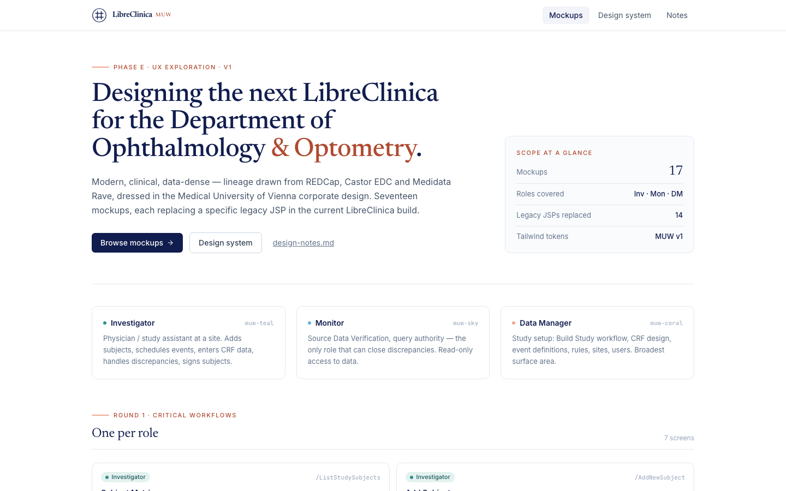
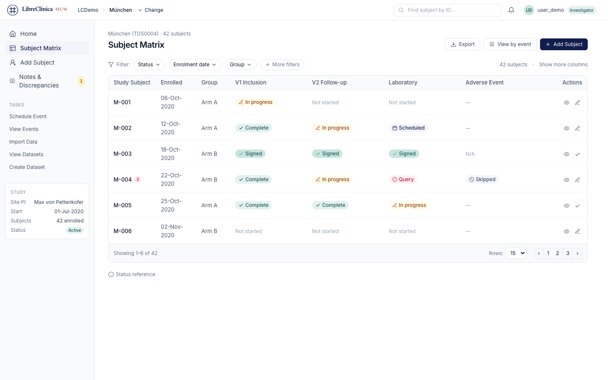
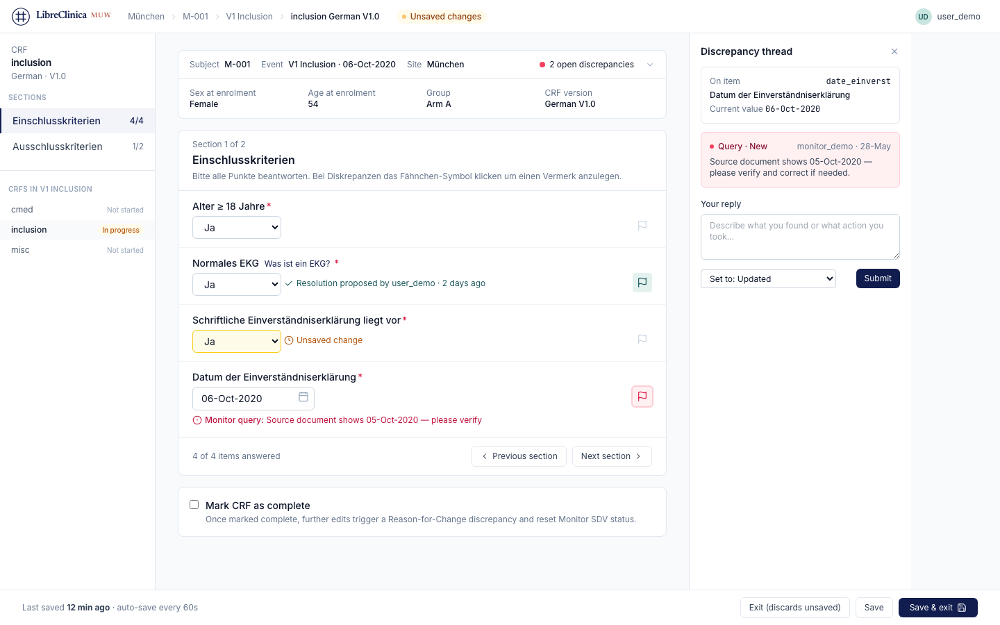
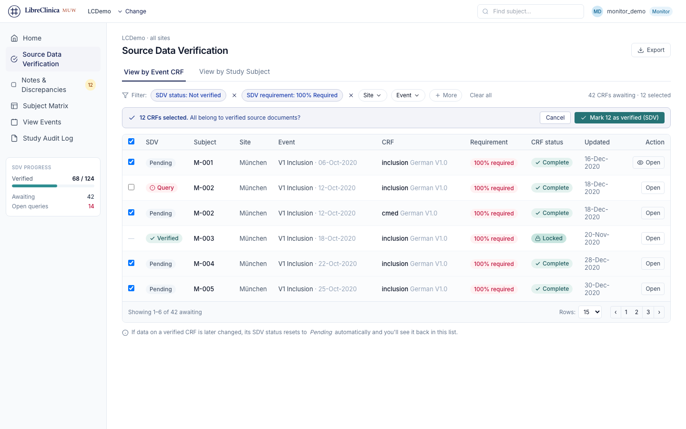
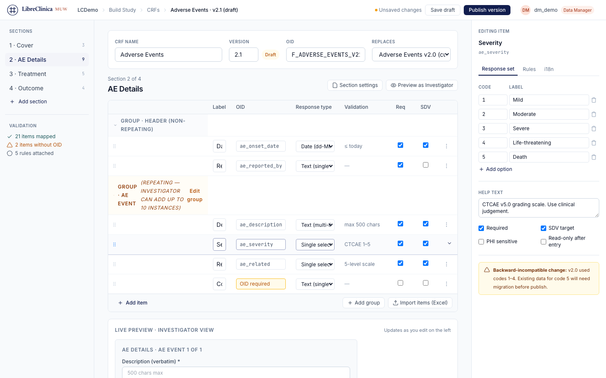
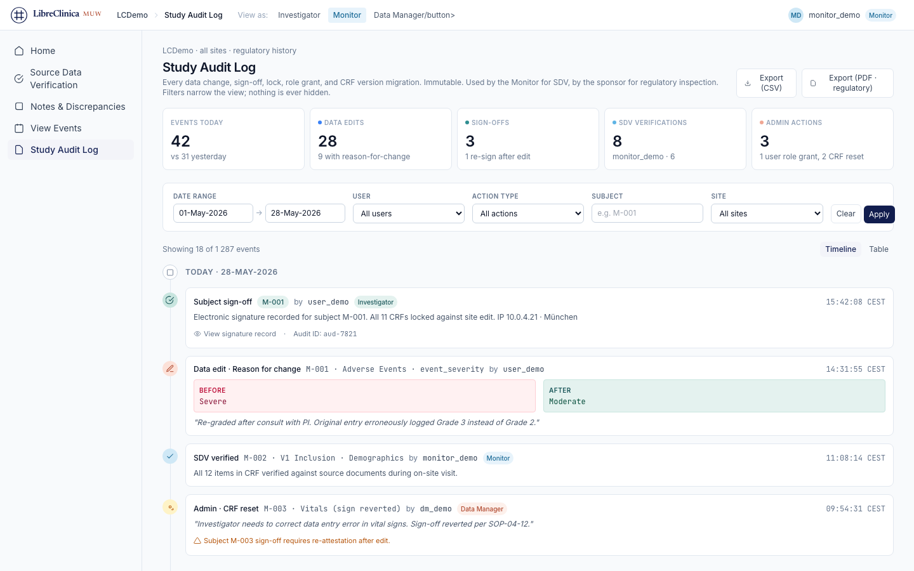
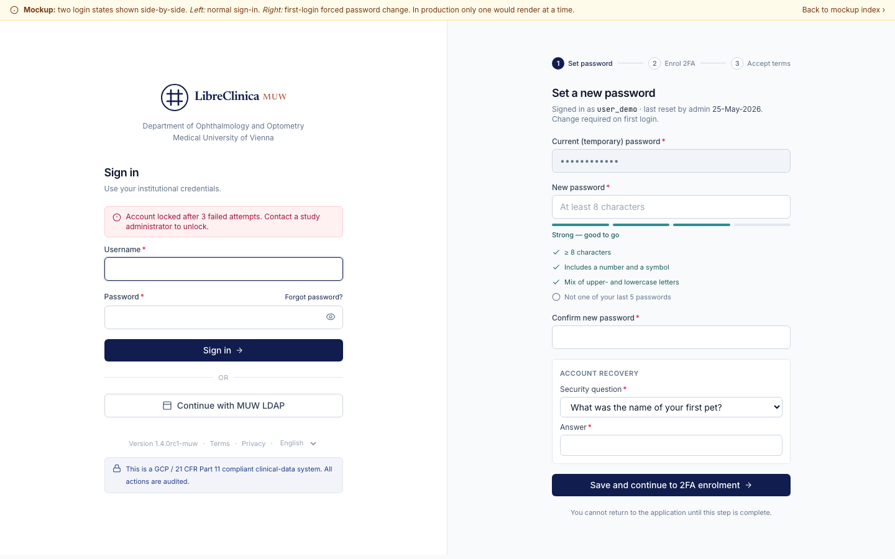

# LibreClinica MUW — Übersicht zur Oberflächen-Modernisierung (Phase E)

**Stand:** 29. Mai 2026
**Zweck:** Kurzüberblick für die Klinikleitung über den Stand der UX-Konzeption für die elektronische Forschungsdaten-Plattform der Universitätsklinik für Augenheilkunde und Optometrie.

---

## 1. Worum es geht

LibreClinica MUW ist das institutionelle System zur elektronischen Erfassung klinischer Studiendaten (eCRF) der Klinik. Es ersetzt papierbasierte Erfassungswege, dokumentiert jede Datenänderung GCP- und 21-CFR-Part-11-konform, unterstützt mehrere Studienorte und ist ein institutioneller Fork der Open-Source-Plattform LibreClinica (Nachfolger von OpenClinica 3.14, lizenziert unter LGPL).

Die Plattform wird derzeit in fünf Phasen modernisiert. Diese Übersicht behandelt **Phase E — die Modernisierung der Benutzeroberfläche**, deren Konzeptphase abgeschlossen ist. Die eigentliche Umsetzung beginnt erst nach Abschluss der Backend-Phasen (Phase B bis D), damit die neue Oberfläche auf einer modernen, gehärteten Codebasis aufsetzt.

## 2. Was bisher entworfen wurde

Für drei Hauptrollen — **Prüfarzt/-ärztin** (engl. Investigator), **Studien-Monitor** und **Datenmanager/-in** — wurden 18 klinisch relevante Bildschirme als interaktive HTML-Mockups entworfen. Jede Rolle ist mit einem typischen Arbeitsablauf abgedeckt; rollenübergreifende Funktionen (Diskrepanz-Verwaltung, Audit Trail, Studien-Zeitplan) ergänzen das Bild.

*Interne Startseite, gruppiert nach Rolle und Themenrunde. Dient als Navigationspunkt für Reviews und Stakeholder-Demos.*

### 2.1 Prüfarzt / Prüferin

Die Arbeit am Bett: Studienteilnehmer aufnehmen, Termine planen, CRF-Daten eingeben, Diskrepanzen beantworten und Studienteilnehmer unterschreiben.

*Subject Matrix. Standortbezogene Liste aller Studienteilnehmer mit Status pro Visite. Ein Klick führt zur Datenerfassung oder zur Visitenplanung.*

*CRF-Datenerfassung. Sektionsweise gegliederte Eingabe, deutliche Markierung von Pflichtfeldern, eingebettete Diskrepanz-Threads — kein Wechsel in Popup-Fenster notwendig.*

### 2.2 Monitor — Source Data Verification

Die Qualitätssicherung: ausgefüllte CRFs gegen Quelldokumente prüfen, Rückfragen stellen und schließen.

*Source Data Verification. Alle abgeschlossenen CRFs aller Studienteilnehmer in einer prüfbaren Übersicht, gefiltert nach SDV-Anforderung und Status, mit Bulk-Aktion zur Mehrfach-Verifikation.*

### 2.3 Datenmanager/-in

Der Studienaufbau: CRF-Design, Visitendefinitionen, Validierungsregeln, Nutzerverwaltung.

*Create / Edit CRF. Editor mit drei Bereichen: Sektionsnavigation links, inline-editierbares Item-Raster mittig, Eigenschafts-Panel rechts. Unten eine Live-Vorschau aus Sicht des Prüfarztes — die Iterationskosten beim Studienaufbau sinken deutlich.*

### 2.4 Rollenübergreifend: Audit Trail

*Study Audit Log. Lückenlose Zeitleiste aller regulatorisch relevanten Aktionen (Datenänderungen, SDV, Unterschriften, administrative Eingriffe). Diff-Karten zeigen Vorher/Nachher-Werte bei „Reason for Change"-Edits — entspricht den Anforderungen aus 21 CFR Part 11 §11.10.*

## 3. MUW-Integration

Zwei institutionsspezifische Aspekte sind bereits in das Design eingeflossen:

**Corporate Design.** Die Mockups verwenden die offizielle MedUni-Wien-Farbpalette (Dunkelblau, Hellblau, Grün, Coral) gemäß MedUni-Wien-Styleguide (Stand März 2022). Typografie: *Newsreader* als Antiqua für Marken-Elemente, *Inter* als Grotesk für die Arbeitsoberfläche, *JetBrains Mono* für technische Bezeichner. Das Logo greift die Siegel-Form des MedUni-Markenzeichens auf. Eine vollständige Design-System-Seite mit Farbpalette, Typografie, Statusbadges und Komponentenbibliothek liegt als eigenständige HTML-Datei vor und ist im Anhang verlinkt.

**Single Sign-on über Shibboleth.** Die Anmeldeoberfläche ist so konzipiert, dass MedUni-Wien-Mitarbeitende sich mit ihren institutionellen Credentials anmelden. Authentifizierung, 2-Faktor-Verifikation und Passwort-Verwaltung verbleiben vollständig bei der MedUni-Wien-IT. Lokale Accounts (für externe Sponsor-Monitore, Demo- und Notfallzugänge) bleiben als sekundäre Option erhalten. Die architektonische Umsetzung ist im Entscheidungs-Dokument **DR-014** beschrieben; eine institutionelle IT-Abstimmung über das konkrete Integrationsmuster (Apache `mod_shib` vs. SAML-SP in der Anwendung) steht noch aus.

*Anmeldung. Links die Anmeldeoberfläche, rechts die einmalige Profilbestätigung beim ersten Login. Hinweis: Das hier gezeigte Mockup stammt aus der Design-System-Vorlage und zeigt noch die LDAP-Variante als Sekundär-Aktion. In der aktuellen Planung wird daraus eine Shibboleth-SSO-Weiterleitung (siehe DR-014); die aktualisierte Variante existiert bereits unter `ux-mockups/login.html`.*

## 4. Stand der Arbeiten

| Phase | Inhalt | Status |
|-------|--------|--------|
| 0 | Build, CI, Smoke-Tests, kritische Integrationstests | abgeschlossen |
| A | Spring-5-Härtung, CVE-Patches, Dependabot | abgeschlossen |
| B | Jakarta-Migration, Castor → JAXB, Library-Ablösung | in Arbeit |
| C | Hibernate 6, Liquibase 4, PostgreSQL ≥ 14 | geplant |
| D | Spring Boot 3, Java 21, Shibboleth-SP | geplant |
| **E** | **SPA-Umsetzung (Inhalt dieser Übersicht)** | **Entwurfsphase abgeschlossen, Umsetzung verschoben** |

Phase E ist bewusst nach Phase D geplant. So baut die neue Oberfläche auf einer modernen, sicherheitsgehärteten Codebasis auf, und institutionelle Validierungs-Aufwände (GCP / 21 CFR Part 11) fallen einmalig am Phasenende an statt fortlaufend.

**Klinische Erstanwendung:** Vor Abschluss von Phase D ist kein Studienstart vorgesehen (Decision Record DR-004). Die Kapazitäten der nächsten 12 Monate sind durch die Backend-Modernisierung gebunden.

## 5. Nächste Schritte für Phase E

1. **Framework-Entscheidung** (React vs. Vue 3 vs. Svelte; DR-008): erfolgt beim Phase-D-Übergang.
2. **Komponentenbibliothek** aus den jetzigen statischen Mockups extrahieren (Statusbadges, Tabellen- und Formular-Primitive, Sidebar, Brotkrumen-Bar).
3. **Tailwind-Build** mit den MUW-Tokens produktiv aufsetzen (heute laufen die Mockups auf dem CDN).
4. **Erste Usability-Tests** mit klinischen Anwendern aus der Klinik nach Lieferung der ersten zwei Workflows (Subject Matrix, CRF-Erfassung).
5. **Accessibility-Audit** (ARIA-Rollen, Tastaturnavigation, Screenreader-Test) nach Layout-Fixierung.
6. **Lokalisierung Deutsch/Englisch** — heute liegen die Mockups in Englisch vor; klinisch eingesetzte CRFs nutzen sowohl deutsche als auch englische Item-Labels.

---

## Anhang — Weiterführende Dokumente

| Dokument | Pfad |
|---|---|
| Vollständiger Feature-Katalog mit allen 18 Bildschirmen | [`docs/development/modernization/phase-e/README.md`](../README.md) |
| Design-Notizen (Tokens, Komponenten, Scope) | [`docs/development/modernization/phase-e/ux-mockups/design-notes.md`](../ux-mockups/design-notes.md) |
| Design-System-Seite (Farben, Typografie, Komponenten) | [`docs/development/modernization/phase-e/design-system/project/design-system.html`](../design-system/project/design-system.html) |
| Entscheidungs-Dokument DR-014 (Shibboleth-Integration, Entwurf) | [`docs/development/modernization/decision-record.md`](../../decision-record.md) (Branch `feature/dr-014-shibboleth-draft`) |
| Modernisierungs-Roadmap (Phasen 0–E) | [`MIGRATION.md`](../../../../../MIGRATION.md) |
| MedUni-Wien-Styleguide (PDF, März 2022) | [`design-system/project/uploads/220303_MedUni_Styleguide.pdf`](../design-system/project/uploads/220303_MedUni_Styleguide.pdf) |

Alle interaktiven Mockups sind im Browser direkt aufrufbar unter [`phase-e/docs/development/modernization/phase-e/ux-mockups/index.html`](../ux-mockups/index.html) — die Klick-Wege zwischen den Bildschirmen sind funktionsfähig, Formularfelder und Filter sind jedoch optisch, ohne hinterlegte Logik.
