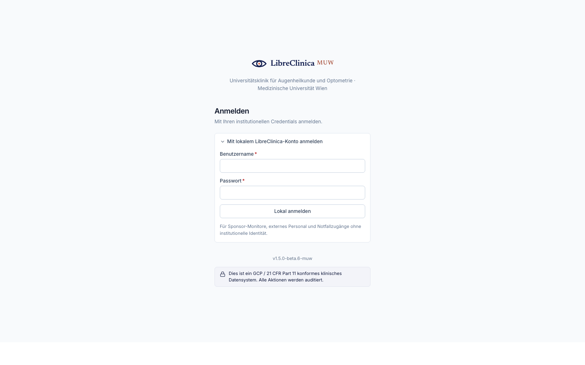
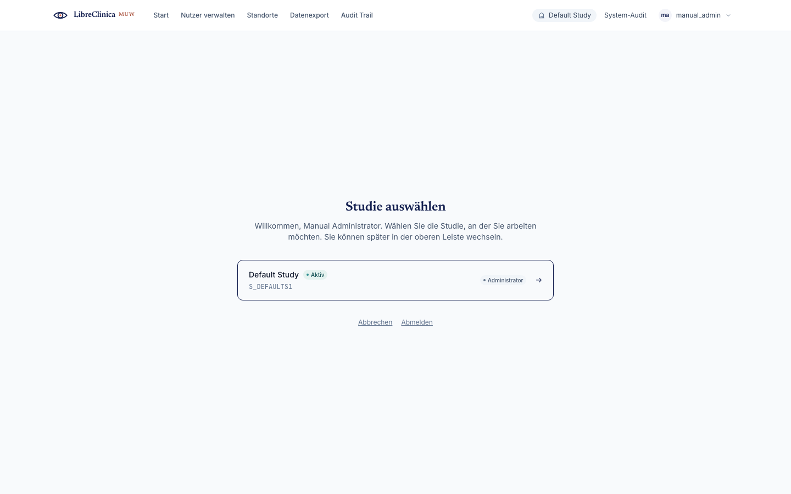

# Getting started

This chapter covers what every role shares: signing in, the first-login profile,
choosing your study/site, and the navigation chrome. Role-specific work starts in
the per-role chapters.

## 1. Signing in

The app is reached at your institution's URL (at MUW, the eCRF address provided by
IT). There are two ways to authenticate:

- **Institutional single sign-on (Shibboleth).** Click the SSO button and complete
  login at the MUW identity provider. Most clinical staff use this path.
- **Local account.** Enter your **username** and **password**. Used for sponsor
  monitors, service accounts, and break-glass access.

If your credentials are wrong the form shows *"Invalid username or password."*
After too many failed attempts the account locks — contact an Administrator.

## 2. First login & your profile

On first login (or after an administrator resets your account) you are asked to
complete your **profile** — name, email, and interface language — and, if your
account requires it, to **change your password**. You cannot reach the app until
the profile is complete; this guarantees the audit trail has a real name behind
every action.

## 3. Choosing a study (and site)

If your account is attached to more than one study, you land on the **study
picker** after login. Pick the study (and, where applicable, the site) you want
to work in. Everything you do afterwards is scoped to that selection. You can
switch later from the top bar.

## 4. The navigation chrome

Every page shares the same frame:

- **Top bar** — the brand (click it to return to **Start**), the **primary
  navigation** — your role's main destinations, e.g. *Studienteilnehmer*,
  *Rückfragen*, *Fällige Visiten*, with the current one highlighted — and on
  the right the **active study** as a chip (click it to switch study) and your
  name with a **role chip** that opens your profile menu with the manual, the
  version line and **Log out**. On narrow screens the navigation moves into
  that menu.
- **Side rail** — only where a section has several pages: in **Studienaufbau**
  it lists every build step (CRFs, visits, groups, rules, sites, modalities,
  users) with the current one highlighted; on CRF entry it lists the form's
  sections with their fill state. Every other page is single-column.
- **Trail** (breadcrumbs) — in the page header, only on pages below a section,
  naming the levels above as links (e.g. *Studienteilnehmer › M-007 › V1
  Inclusion* above a CRF). The page itself is the heading, never a crumb; flat
  pages such as *Rückfragen* have no trail — the highlighted destination and
  the heading say where you are.

The **home dashboard** (*Start*) opens with **your work**: counted queues such as
today's open visits, subjects ready to sign, open queries, files in the inbox
and CRFs awaiting verification — each a link into that list with the filter
already applied, so the number on the card is the number of rows you land on.
Below that, the destinations in the active study, and for administrators the
platform-wide ones.

## 5. Language

The interface is **German-first** for clinical staff (e.g. *Modalitäten*,
*Übernehmen*); some administrative screens remain English. Your language is set
in your profile.

## 6. Logging out

Use **Log out** in the top bar. For shared workstations always log out — the
audit trail attributes every entry to the signed-in user.

---

Next: open your role chapter from the [manual index](README.md).
