# Administrator

The **Administrator** (German role label *Administrator/-in*) is the superset role in LibreClinicaMUW. It combines the two responsibilities other chapters split between dedicated roles: **system setup** (user accounts, sites, modality catalog, password policy, scheduled jobs, system status) and **study setup** (creating studies, building event definitions and CRFs, rules, datasets, importing data). Wherever the application gates a screen on *Administrator*, you reach it; several of those screens are visible to no other role.

This chapter is the operational reference for the Administrator's day-to-day surfaces in the Vue web application. For role-specific data-entry and review workflows, see the companion chapters:

- [role-data-manager.md](role-data-manager.md) — study build, rules, datasets, import (the Administrator shares these surfaces with the Data Manager / *Studienleitung*).
- [role-investigator.md](role-investigator.md) — subject enrolment, event scheduling, CRF data entry.
- [role-monitor.md](role-monitor.md) — source-data verification, notes & queries, audit review.

> **Note on role gating.** The web app hides controls you are not allowed to use, but the *server* is the authoritative gate — every Administrator-only action is re-checked on the backend and every lifecycle action (disable, restore, reset, status change) is written to the audit trail. The Administrator role does **not** silently inherit the Data Manager or Investigator role: those study-scoped screens open to the Administrator because the screens themselves list *Administrator* as an allowed role, not through inheritance.

> **Language.** The interface is German. This chapter quotes the on-screen German labels and gives the English meaning in parentheses on first use.

## Navigation

The Administrator's home page (**Start**) presents the available workspaces as two lanes of cards:

- **Platform-wide (cross-study)** — *Nutzer verwalten* (Manage Users), *Neue Studie* (Create Study), *Modalitäten* (Modalities), *Patientenübersicht* (Patients Overview), and a study switcher when more than one study is bound.
- **Active study** — *Studienteilnehmer* (Subject Matrix), *Studienaufbau* (Build Study), *CRF-Daten importieren* (Import CRF Data), *Audit Trail*, *Datenexport* (Data Export), *Standorte* (Sites), *Regeln* (Rules), and the study-identity / parameters editors.

System-administration screens not tied to a single study — *Systemstatus*, *Passwort-Richtlinie*, *Anwendungskonfiguration*, *Geplante Jobs*, and the *System-Audit-Protokoll* — are reached by their direct addresses (listed per workflow below). Inside a study workspace a left **side-rail** links the closely related build screens (*Studienaufbau*, *Nutzer verwalten*, *CRF-Daten importieren*).

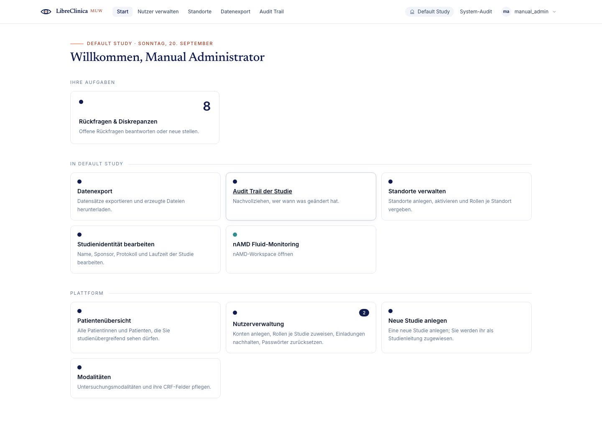

## 1. Subject Matrix

**Goal:** See every subject in the active study and their per-visit progress at a glance.

**Steps:**
1. Open **Studienteilnehmer** (Subject Matrix) from the home page or side-rail (`/subjects`).
2. Use the search box and the filter chips (*all*, *today*, *ready-to-sign*, *open-events*, *all-events-complete*, *signed*) to narrow the list; tick **Nur mit Queries** to show only subjects with open queries.
3. Read each row: the frozen left column is the **Subject ID**; scrollable columns show one status pill per visit, plus gender, study eye (OD/OS/OU), group and enrolment date.
4. Use the **V1 … VN** visit controls (First / Previous / Next / Latest) above the table to page across visits.
5. Click **Öffnen** (Open) at the right of a row to open that subject's detail page.

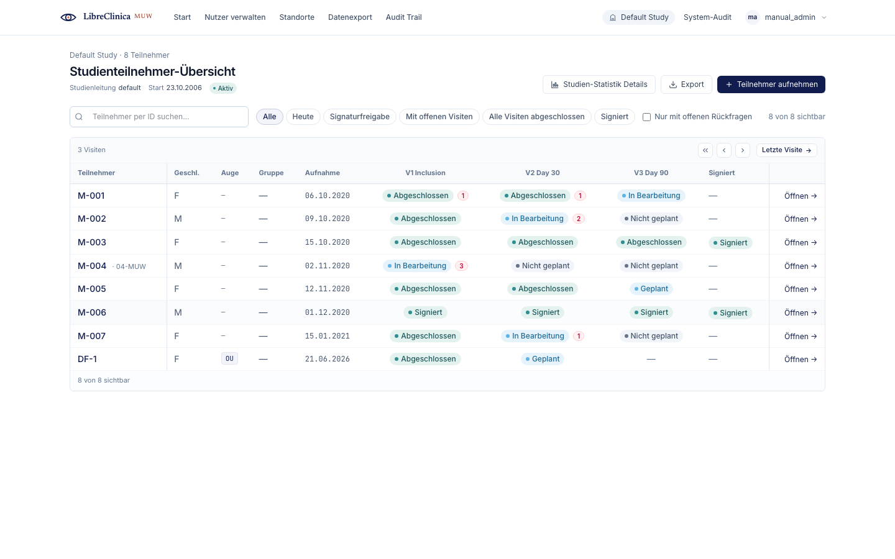

**Notes:** Open to Investigator, Monitor, Data Manager and Administrator. The **Export** button downloads the matrix; **Studienteilnehmer hinzufügen** (Add Subject) starts enrolment (see [role-investigator.md](role-investigator.md)).

## 2. Manage Users

**Goal:** Create, edit, disable/restore, unlock and password-reset user accounts, and assign per-study roles.

**Steps:**
1. Open **Nutzerverwaltung** (Manage Users) from the home page or side-rail (`/manage-users`).
2. To add a user, click **Nutzer/-in einladen** (Invite User) and complete the invite dialog; on success a one-time password is shown in an inline panel — copy it and hand it over through a secure channel.
3. Filter the table with the search box, the **Rolle** (role) and **Auth** dropdowns, and the **Nur aktive** (only active) checkbox.
4. For any row, use the inline actions: **Bearbeiten** (Edit) opens the edit dialog; **Deaktivieren** (Disable) / **Reaktivieren** (Restore) toggle the account; **Passwort zurücksetzen** (Reset Password) and **Entsperren** (Unlock) are offered only for active *Lokal* (local) accounts; **Rollen** (Roles) opens the role-assignment dialog.
5. After a restore, reset or unlock, the generated one-time password appears in the green panel below the table — copy it before dismissing.

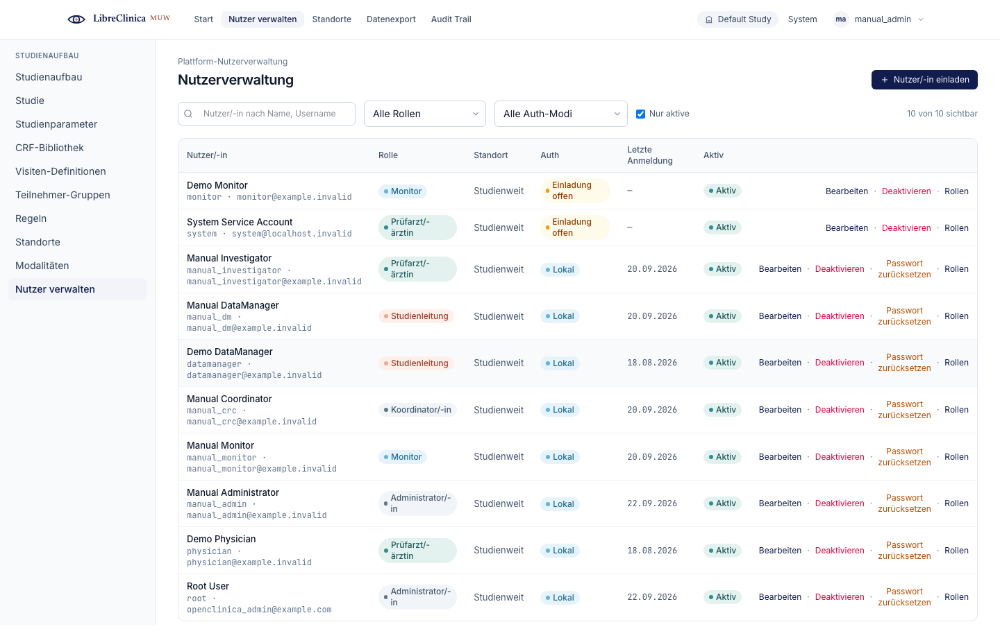

**Notes:** This screen is **Administrator-only** — the *Nutzer/-in einladen* button and every per-row action are hidden for other roles. Roles are shown with their German labels: *Prüfarzt/-ärztin* (Investigator), *Monitor*, *Studienleitung* (Data Manager), *Administrator/-in*, *Koordinator/-in* (CRC). The **Auth** column distinguishes *Lokal*, *SSO*, *LDAP (Legacy)* and *Einladung offen* (pending invite); password reset and unlock are unavailable for SSO/LDAP accounts because the identity provider or directory owns the credential. A locked local account also shows a warning badge in the **Aktiv** column. Every disable, restore, reset and unlock is documented in the audit trail (the confirmation dialogs say so), and via the multi-role dialog one user can hold several roles per study.

## 3. Sites

**Goal:** Create and manage the sites (centres) under the active study.

**Steps:**
1. Open **Standorte** (Sites) from the home page (`/sites`).
2. Click **Neuer Standort** (New Site) to open the inline create form.
3. Fill the required fields — *Name*, *Unique Protocol ID*, *Principal Investigator* — and any optional details (brief summary, facility name/city, facility contact e-mail), then click the create button.
4. For an existing site, use **Entfernen** (Disable) to soft-remove it or **Wiederherstellen** (Restore) to bring it back.

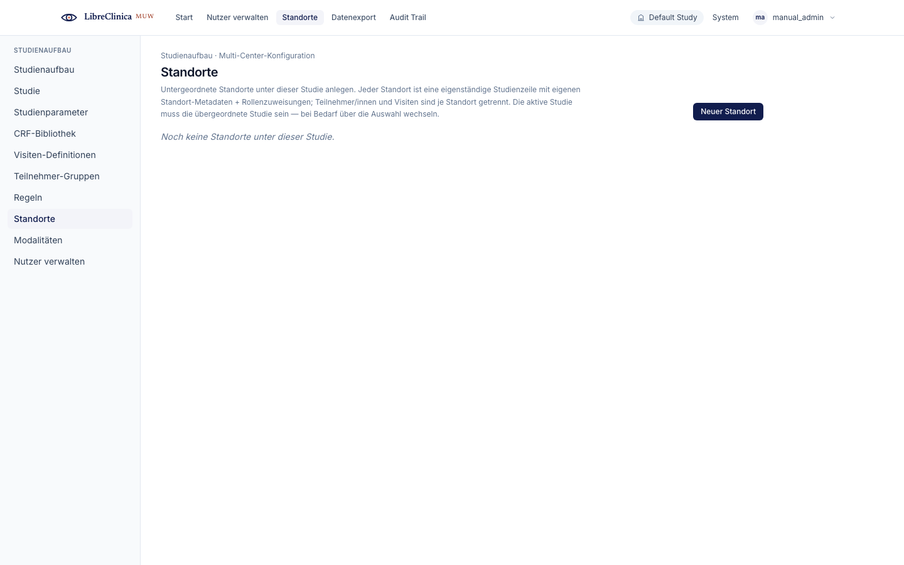

**Notes:** The active study must be the top-level parent — the screen is hidden when the active study is itself a site. Managing sites is open to Administrator and Data Manager. Disabling a site keeps its already-enrolled subjects and visits in the audit trail but makes them unreachable until the site is restored; the confirmation dialog states this.

## 4. Build Study

**Goal:** Track the study-setup checklist and drive each setup task to completion.

**Steps:**
1. Open **Studienaufbau** (Build Study) from the home page or side-rail (`/build-study`).
2. Read the progress card (tasks completed, percentage, site and enrolled-subject counts).
3. Work through the task tiles — *Create Study*, *CRF Library*, *Event Definitions*, *Sites*, *Group Classes*, *Rules*, *Manage Users* — each shows a status pill (complete / in-progress / not-started / optional). Click **→ Weiter** (Next) on a tile to jump to that task's screen.
4. For optional zero-count tasks, click **Als abgeschlossen markieren** (Mark as complete) to acknowledge them.
5. As Administrator, use the toolbar to change study status: pick a target state and confirm in the **Status wechseln zu …** (Change status to …) dialog, supplying a reason when transitioning to LOCKED or FROZEN. **Bearbeiten** (Edit) and **Parameter** open the study-identity and parameters editors; **Neue Studie** (New Study) starts study creation.

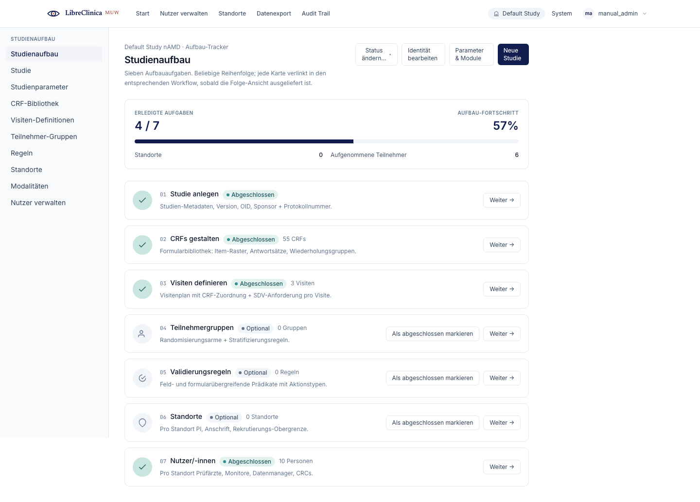

**Notes:** Build Study is open to Administrator and Data Manager, but the status dropdown, the status-change action and the *Neue Studie* button are Administrator-only. A reason is mandatory for the LOCKED and FROZEN transitions and is recorded in the audit trail.

## 5. Event Definitions

**Goal:** Define the visits (events) that make up the study schedule.

**Steps:**
1. From **Studienaufbau**, open the **Event Definitions** task, or go to `/event-definitions`.
2. Review the list of **Visiten-Definitionen** (Event Definitions).
3. Add or edit a definition, setting its name, type (e.g. scheduled vs. repeating) and the CRFs attached to it.
4. Order the definitions to match the clinical visit sequence.

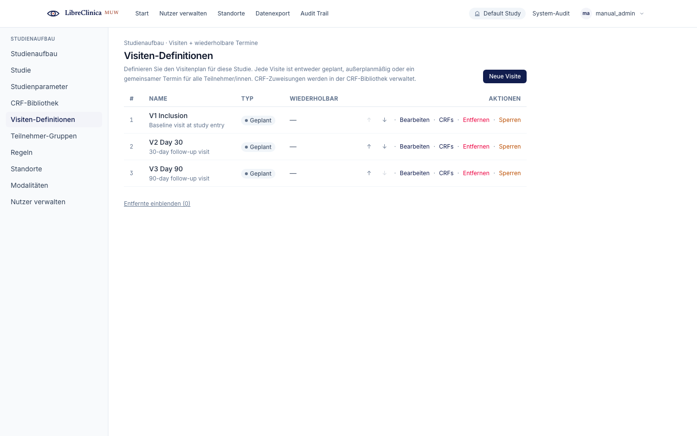

**Notes:** Open to Administrator and Data Manager. Event definitions are the backbone of the Subject Matrix columns, so changes here are reflected in every subject's visit list.

## 6. CRF Library (and CRF Builder)

**Goal:** Create case report forms, author new versions, and manage version lifecycle.

**Steps:**
1. Open **CRF-Bibliothek** (CRF Library) from Build Study or `/crf-library`.
2. Tick **Entfernte einschließen** (Include removed) to see soft-deleted CRFs.
3. Click **Neue CRF** (New CRF) and enter a name and optional description to create the form shell.
4. On a CRF card, click **Neue Version anlegen** (Create new version) to open the drag-and-drop **CRF Builder** canvas (`/crf-authoring-canvas/<oid>`), where you place sections and items, set data types and labels, then save the version.
5. Use the version sub-list to **XLS herunterladen** (Download XLS), and (as a managed user) Lock / Unlock / Restore / **Entfernen** (Disable) a version. *Hard Remove* is available only to system administrators and is blocked while any event definition or event CRF still references the version.

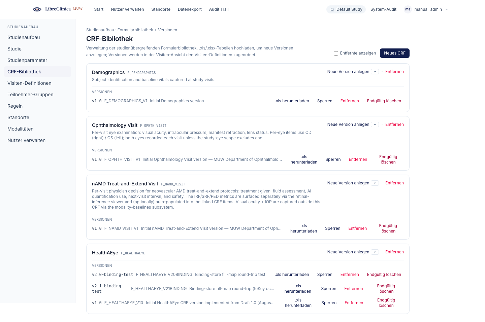

**Notes:** Open to Administrator and Data Manager. The drag-and-drop canvas is the sole CRF-authoring surface; the legacy side-rail wizard has been removed. A version that is in use cannot be hard-removed — the blocker dialog lists the event definitions and sample subjects holding it.

## 7. Rules

**Goal:** Inspect, author, test and schedule the study's edit-check and automation rules.

**Steps:**
1. Open **Regeln** (Rules) from Build Study or `/rules`.
2. In the left pane, search and select a rule set; its target, attached rules and run schedule appear on the right.
3. Click **Neue Regel** (New Rule) to open the rule wizard, or **Regeln importieren** (Import Rules) to load rules from XML.
4. For a selected rule set, edit the run schedule (tick *Schedule ausführen* and set a time), edit individual action messages, and run **Trockentest ausführen** (Dry run) to preview which subjects the rules would fire on.
5. Use **XML exportieren** (Export XML) to download all rules, and the **Test** sandbox at the bottom to evaluate an expression against sample values.

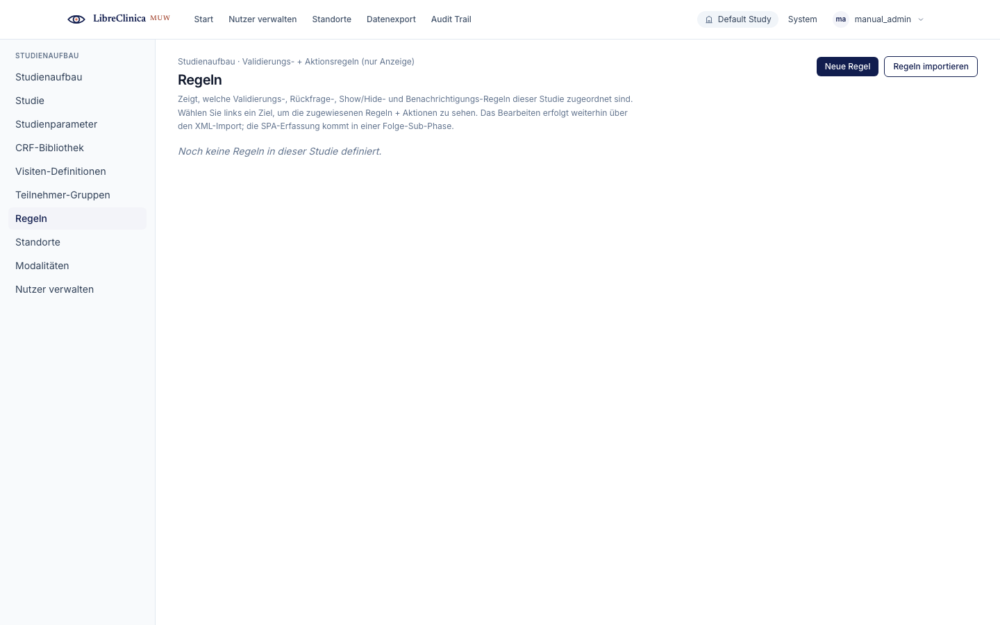

**Notes:** Open to Administrator and Data Manager; for other roles the screen is read-only. Rule actions include discrepancy notes, e-mail, notifications, show/hide, insert and randomize. The run log records each fired action with a timestamp.

## 8. Group Classes

**Goal:** Define subject groupings (arms, cohorts, families) for the study.

**Steps:**
1. Open **Teilnehmer-Gruppen** (Group Classes) from Build Study or `/group-classes`.
2. Add a group class, naming it and choosing its type.
3. Define the group values that subjects can be assigned to.

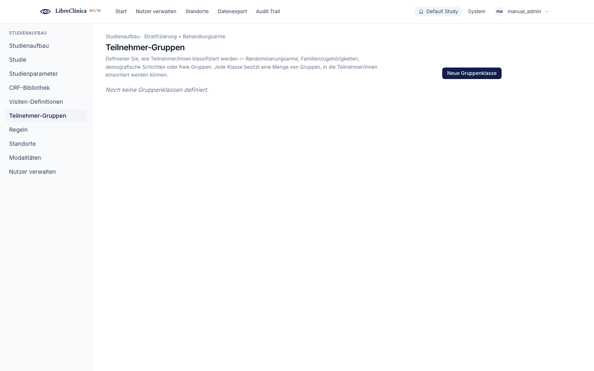

**Notes:** Open to Administrator and Data Manager. Group assignment then appears on each subject's detail page and as a column in the Subject Matrix. This is an optional setup task — it can be acknowledged as complete from Build Study even with zero groups.

## 9. Modalitäten

**Goal:** Maintain the platform-wide catalog of measurement modalities and their per-eye item bindings.

**Steps:**
1. Open **Modalitäten** (Modalities) from the home page (`/modalities`).
2. Click **Neue Modalität** (New Modality) to register one. Supply the stable **code** (fixed after creation), the German and English labels, the ordinal (its rank in picker dropdowns), the data type (numeric / categorical), an optional unit (mm, mmHg, …), and the OD and/or OS item OID(s) — at least one is required.
3. Use **Bearbeiten** (Edit) to change a modality, or **Entfernen** (Delete) to retire it.

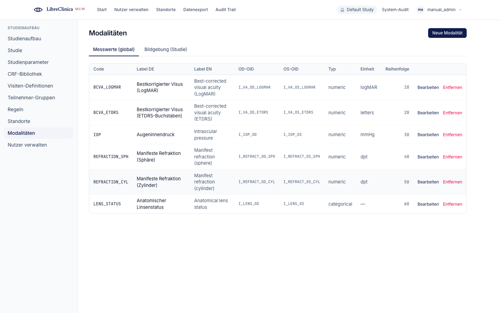

**Notes:** This is an **Administrator-only**, platform-wide catalog (not study-scoped). The table columns are *Code*, the German and English labels, the OD and OS item OIDs, type, unit and ordinal. Removing a modality keeps existing baseline measurements but drops the modality from the per-eye baseline panel; the confirmation dialog states this.

## 10. Datasets / Data Export

**Goal:** Build reusable export datasets and download study data in your chosen format.

**Steps:**
1. Open **Datenexport** (Data Export) from the home page or side-rail (`/datasets`).
2. For a quick dump, click **Schnell-ODM-Export** (Quick ODM export). For a tailored extract, click **Neuer Datensatz** (New Dataset) and complete the dataset wizard.
3. In the dataset table, expand **View files** to see generated files, **Open wizard** to edit a dataset (disabled once it has been run), or **Remove** / **Restore** to manage its lifecycle.
4. Click **Export now** and pick a format — *odm*, *csv*, *tsv*, *excel*, *sas* or *spss* — then download the generated file.

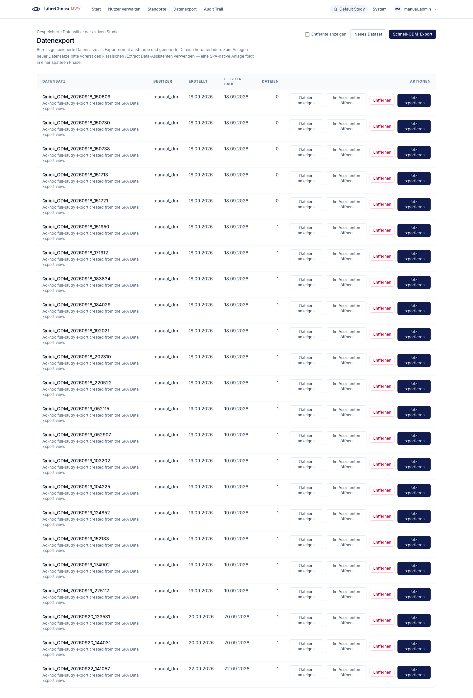

**Notes:** Open to Administrator, Data Manager and Monitor. Tick **Entfernte einschließen** (Include removed) to show soft-deleted datasets. A dataset that has already run cannot be edited — clone or create a new one instead.

## 11. Import CRF Data

**Goal:** Bulk-load CRF data from an ODM XML file through a guided, four-step wizard.

**Steps:**
1. Open **CRF-Daten importieren** (Import CRF Data) from the home page or side-rail (`/import-crf-data`).
2. **Hochladen** (Upload): drag an `.xml` file onto the drop zone (or browse), then click **Weiter** (Next).
3. **Mappen** (Map): check the detected counts of subjects, events, CRFs and rows, then continue.
4. **Vorschau & Auflösung** (Preview & Resolve): review the status cards (*Ready*, *Overwrite*, *Warning*, *Error*) and the per-row table. Resolve issues, choose an overwrite mode (replace or skip), and — if any rows will be replaced — type a **Reason for change** before continuing.
5. **Commit**: the system applies the import and shows a summary (rows inserted, overwritten, skipped, discrepancy notes). Use **Start over** to import another file.

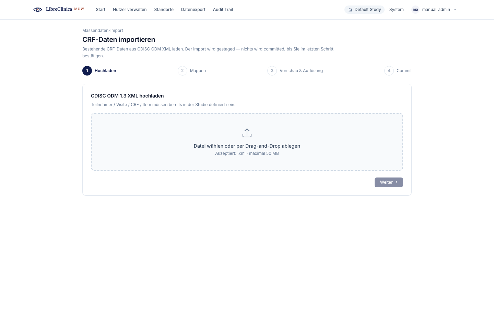

**Notes:** Open to Administrator and Data Manager. The commit step is entered by the system, not clicked. You cannot commit while any row is in error; overwriting existing data in *replace* mode requires a reason, which is recorded in the audit trail. If the upload token expires before commit, re-upload the file.

## 12. System Audit Log

**Goal:** Review the institution-wide audit trail, including operation failures and failed jobs.

**Steps:**
1. Go to **System-Audit-Protokoll** (System Audit Log) at `/system/audit-log`.
2. Filter by actor, event variant (signed, reason-for-change, sdv, admin, data, query, subject-group-change) or subject.
3. Browse the date-grouped timeline; click an entry with a chevron to expand its before/after diff and reason.

**Notes:** This system-wide log is **Administrator-only** and surfaces rows the per-study *Audit Trail der Studie* hides — notably `OPERATION_FAILED` and `JOB_FAILED` entries. It has no study scope and (unlike the per-study audit view) no XLSX export.

## 13. System Status

**Goal:** Check the health of the running application after a restart or incident.

**Steps:**
1. Go to **Systemstatus** (System Status) at `/admin/system-status`.
2. Read the three panels: **JVM** (Java version, heap used/max, threads, CPUs), **Database** (reachability, product/version, Liquibase changelog count), and **Application** (status OK/OutOfMemory, uptime).
3. Click **Aktualisieren** (Refresh) to re-poll; the last-refreshed time is shown next to the button.

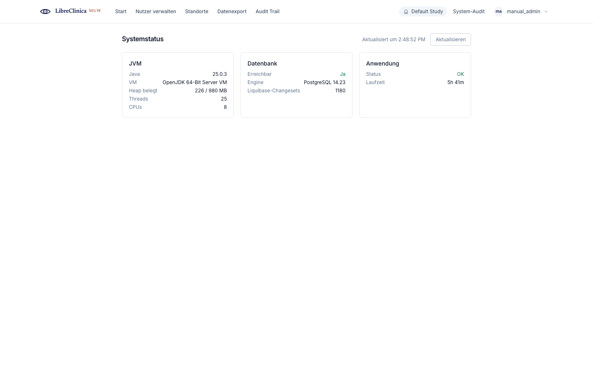

**Notes:** Administrator-only; the backend returns 403 for any other session. This is a read-only diagnostics view.

## 14. Password Policy

**Goal:** Set the password rules enforced for local accounts.

**Steps:**
1. Go to **Passwort-Richtlinie** (Password Policy) at `/admin/password-policy`.
2. Tick the required character classes (lowercase, uppercase, digits, special characters).
3. Set the length constraints — *Min Length*, *Max Length* (1–256) — and *Expiration Days* (0 = no expiration).
4. Optionally require a password change on first login, then click **Save** (or **Discard** to revert to the last-saved values).

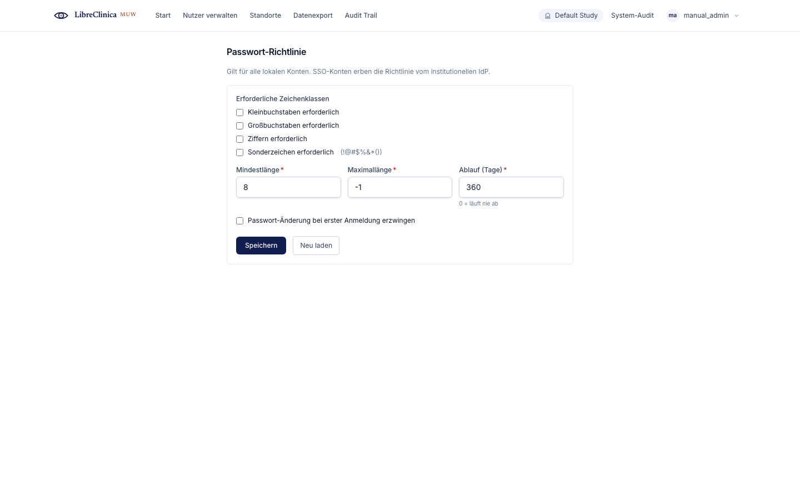

**Notes:** Administrator-only. On success a *Gespeichert* (Saved) banner appears. The policy applies to local accounts; SSO/LDAP credentials are governed by the identity provider or directory.

## 15. App Configuration

**Goal:** See what configuration the running application actually reads.

**Steps:**
1. Go to **Anwendungskonfiguration** (App Configuration) at `/admin/config`.
2. Read the values: default timezone, user language/country, file encoding, OS name/architecture, JVM options, the retinal-inference remote-push URL, and whether SSO is enabled.
3. Click **Aktualisieren** (Refresh) to re-read after a restart.

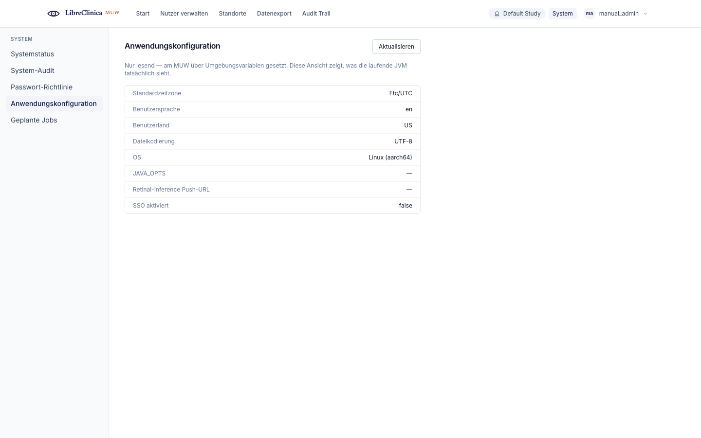

**Notes:** Administrator-only and **read-only** — deployment configuration lives in environment variables, not here. This screen simply surfaces what the running JVM sees, which is useful for diagnostics after a restart.

## 16. Scheduled Jobs

**Goal:** Inspect the background (Quartz) jobs the platform runs.

**Steps:**
1. Go to **Geplante Jobs** (Scheduled Jobs) at `/admin/jobs`.
2. Review the scheduler status bar (name, started/standby) and the jobs table: name, group, state, previous and next fire times, description.
3. Click **Aktualisieren** (Refresh) to re-poll.

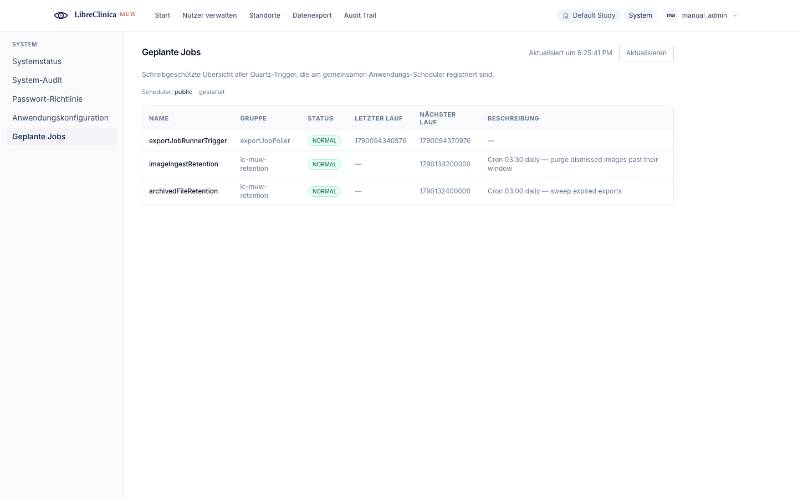

**Notes:** Administrator-only and read-only. The state pill is colour-coded (NORMAL green, PAUSED amber, ERROR/BLOCKED red). An empty list shows *Keine Jobs* (No jobs).

## 17. Subject Detail, Study Identity and Parameters

**Goal:** Inspect a single subject, and edit the active study's identity and parameters.

**Steps:**
1. From the Subject Matrix, click **Öffnen** on a row to open the subject detail page (`/subjects/<id>`).
2. Review the **IDENTITÄT** (Identity) block (Subject ID, secondary ID, gender, year of birth, group, study eye OD/OS, enrolment/screening dates, open-query count, signed status) and the **BESUCHE** (Visits) table. Use **Bearbeiten** (Edit) to amend identity fields, **CRFs öffnen** (Open CRFs) to enter data, and the row kebab menu (⋮) for *Stornieren* (Cancel) or *Signieren* (Sign).
3. To create a study, open **Neue Studie** from Build Study or go to `/studies/new` and complete the create form.
4. To change a study's identity, open **Bearbeiten** from Build Study (`/studies/<oid>/edit`) — the **Studien-Identität bearbeiten** form covers name, secondary protocol ID, phase, brief summary, principal investigator, sponsor, official title and protocol type. Click **Save**.
5. To change behaviour, open **Parameter** (`/studies/<oid>/parameters`) — the **Studienparameter** form groups subject-ID generation, discrepancy management, interviewer/interview-date defaults and module toggles. Click **Save**.

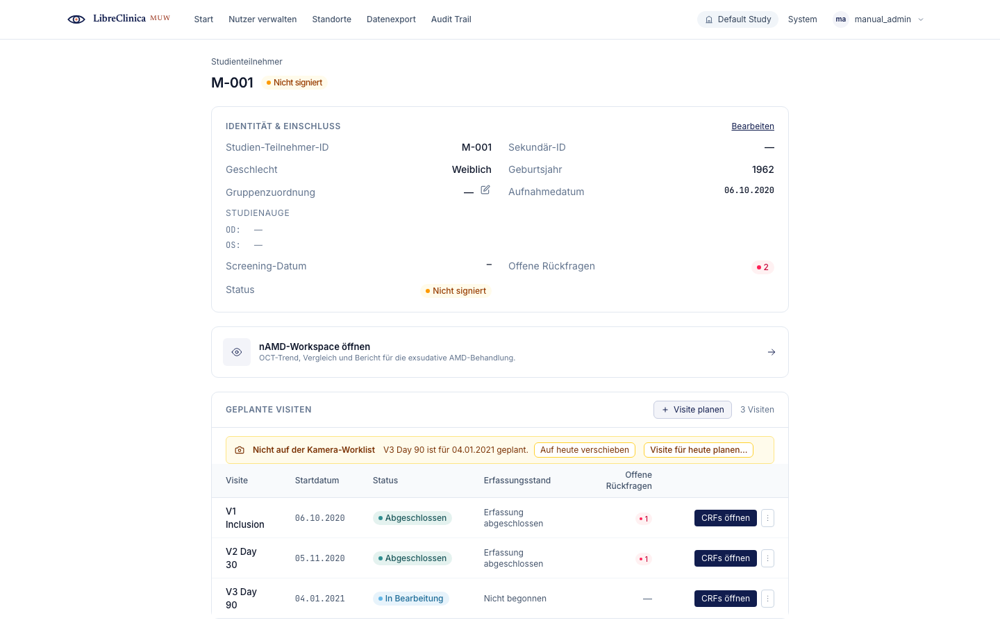

**Notes:** Subject detail is open to Investigator and Administrator. Study creation, identity edit and parameters edit are **Administrator-only** and re-checked on the backend (403 on denial). Saving the study identity refreshes the breadcrumb if the edited study is the active one. Subject identity edits, eye transitions, event cancellations and signatures are all recorded in the audit trail.
