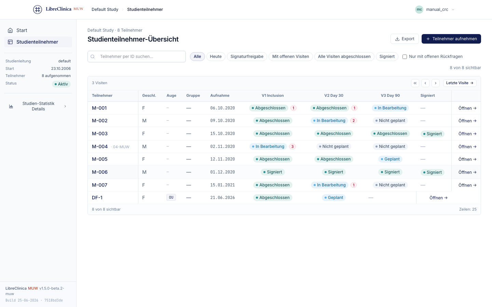
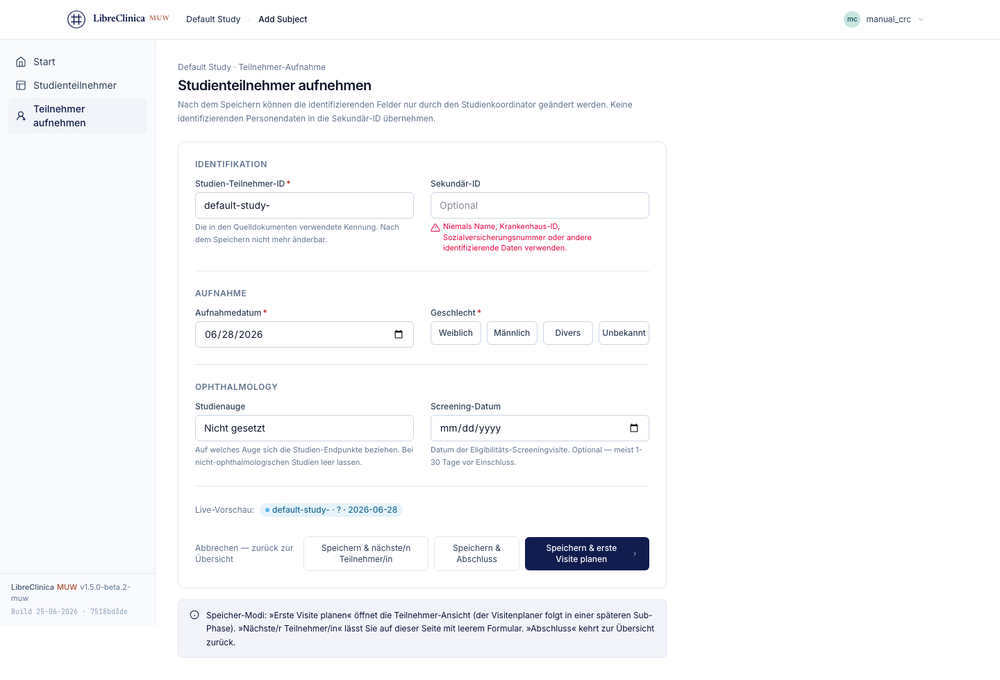
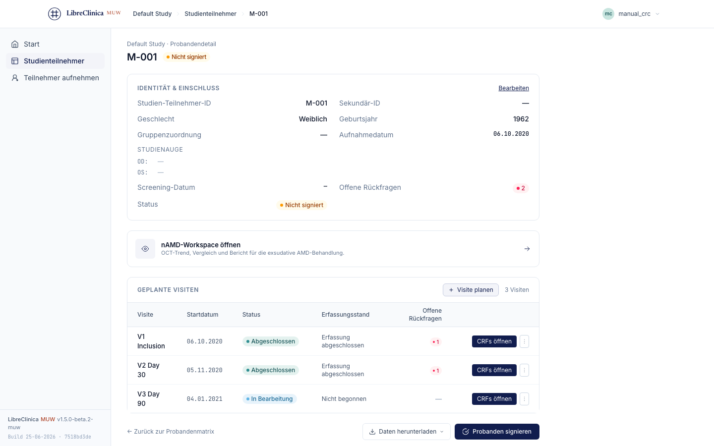

# CRC (Clinical Research Coordinator)

The **CRC** (Clinical Research Coordinator) is the day-to-day data-entry role:
enrolling new subjects, opening their scheduled visits, and keying CRF data —
including paired right/left-eye (OD/OS) ophthalmology items.

In LibreClinicaMUW the CRC **inherits the Investigator surface**. There is no
separate, large CRC menu: the screens you use are the Investigator screens —
the Subject Matrix, Add Subject, the subject casebook, the event detail, and the
CRF entry form — and the app grants you access to them on that basis.

One thing the CRC does **not** do: **sign casebooks**. Applying the electronic
signature to a subject's casebook is the investigator's attestation and is keyed
with the signing investigator's own password. You prepare the data so it is
complete and ready; the investigator signs. See
[role-investigator.md](role-investigator.md) for the signing workflow and for
the shared detail this chapter only summarises.

## Navigation

Your side navigation centres on subject work:

- **Home** (`/`) — what needs your attention today, with quick links into your
  common tasks.
- **Studienteilnehmer / Subject Matrix** (`/subjects`) — every enrolled subject
  and the status of each visit.
- **Add Subject** (`/subjects/new`) — enrol a new subject into the active study.

From the matrix you drill into a subject, then into a visit (event), then into an
individual CRF. The **breadcrumbs** at the top of each page show that trail
(Studienteilnehmer → subject → event → CRF) so you can step back up at any point.

Everything you do is scoped to the **study (and site)** you picked at login. If you
work in more than one study, switch from the top bar.

## 1. Find a subject (Subject Matrix)

**Goal:** locate a subject and see, at a glance, which of their visits are open,
complete, or signed.

**Steps**

1. Open **Studienteilnehmer** from the side navigation (`/subjects`).
2. Use the **search box** to filter by subject ID, or use the filter chips —
   **Alle**, **Heute** (today), **Bereit zum Signieren** (ready to sign),
   **Offene Visiten** (open events), **Alle abgeschlossen** (all complete) and
   **Signiert** (signed).
3. Read the row: the **Eye** column shows the study eye (OD / OS / OU), and each
   visit column shows a status pill, with a red count when that visit has open
   queries.
4. Click the subject ID, or **Öffnen** on the right, to open the subject.

**Notes**

- The visit columns scroll **inside** the table — use the chevron buttons or
  **Zur letzten Visite springen** (jump to latest) to slide through a long visit
  timeline. The **Studienteilnehmer** and **Öffnen** columns stay pinned.
- The matrix opens scrolled to the left so you see identity first (ID, gender,
  eye, group, enrolment date), then the visits.

## 2. Enrol a subject (Add Subject)

**Goal:** add a new subject to the active study.

**Steps**

1. Click **Add Subject** in the side navigation, or **+** on the matrix
   (`/subjects/new`).
2. Enter the **Subject ID**. When the study has a protocol short-code the field is
   pre-filled (e.g. `GA-`); finish or edit it as needed. The app checks
   availability as you type and flags an ID that is already taken.
3. Optionally add a **Secondary ID**. Do **not** put direct patient identifiers
   here — the form warns against personally identifying data.
4. Set the **enrolment date** (cannot be in the future) and pick the **gender**.
5. Under **Ophthalmology**, optionally set the **study eye** (OD = right, OS =
   left, OU = both) and a **screening date**. Leave these blank for non-ophthalmology
   studies.
6. Save with one of the three buttons:
   - **Save & add next** — clears the form for another enrolment, keeping study
     context and the ID prefix.
   - **Save & finish** — returns to the Subject Matrix.
   - **Save & schedule** (primary) — saves and opens the new subject so you can
     schedule the first visit straight away.

**Notes**

- The site is taken from your active study/site selection — you do not pick it on
  this form.
- If the server rejects the submit (for example a duplicate ID at this site), the
  exact field error is shown inline; correct it and save again.

## 3. Open a visit and enter CRF data

**Goal:** record data for one of a subject's scheduled visits, including paired
OD/OS items, then save and mark the CRF complete.

**Steps**

1. From the subject's casebook, open the visit (event) you want to work on — this
   is the **Event detail** screen, which lists the CRFs that belong to that visit.
2. For each CRF row, choose the action on the right:
   - **Öffnen** if data entry has already started, or
   - **Datenerfassung starten** to begin a fresh CRF — both open the **CRF entry**
     form.
3. Fill in the items. For **bilateral** items the form shows two columns: **OD on
   the LEFT** (badge **R**), **OS on the right** (badge **L**) — matching the
   examiner's face-to-face view of the patient. Items marked for both eyes (OU)
   span a single field across both columns.
4. Click **Entwurf speichern** (save draft) at any time to persist your work in
   progress; the header shows when it was last saved and warns of unsaved changes.
5. When the CRF is finished, click **Abschließen** (mark complete). Required
   fields are validated; anything missing is highlighted so you can fix it before
   the CRF is accepted. After completion you return to the visit so you can move on
   to the next CRF.
6. Back on the Event detail screen, when all CRFs for the visit are done, click
   **Visite abschließen** to mark the whole visit complete. (Visits no longer
   complete automatically — you drive this step.)

**Notes**

- A CRF that is **complete** becomes read-only. To edit it again, click
  **Erneut öffnen** (reopen) — as a CRC you are permitted to reopen a completed
  CRF; this re-enables the fields and is recorded in the audit trail.
- A CRF that is **locked** (because the subject's casebook has been signed) cannot
  be reopened from here — that needs the study lead.
- Use **+ Frage** on an item to raise a discrepancy note when a value needs
  clarification, and **Vom letzten Besuch übernehmen** to pre-fill carried-forward
  values from the previous visit (you still review and **save** them deliberately).
- Every entry is attributed to you in the audit trail — on a shared workstation,
  always log out when you step away.

## See also

- [role-investigator.md](role-investigator.md) — the full Investigator surface
  the CRC inherits, and the **casebook signing** workflow (which the CRC does not
  perform).
- [00-getting-started.md](00-getting-started.md) — signing in, your profile,
  choosing a study, and the shared navigation chrome.
</content>
</invoke>
