# Data Manager

The **Data Manager** builds the study and keeps its data clean. This is the
broadest study-level role: you assemble the case report forms (CRFs), define the
visits, attach validation rules, group subjects for analysis, oversee
discrepancies, and export the data. Day-to-day data *entry* is the Investigator's
job — as a Data Manager you set the study up, supervise it, and pull the data out.

Everything you do is scoped to the **study (and site)** you picked at login. See
[Getting started](00-getting-started.md) for sign-in, the study picker, and the
shared navigation chrome.

> **What you can and cannot reach.** You can open the **Subject Matrix** to see
> enrolment and visit progress, but the per-subject detail screen and direct CRF
> data entry are Investigator/Administrator screens — clicking a subject from the
> matrix will not open the casebook for you. Creating users, editing the study's
> core identity, and locking/unlocking individual visits or CRF versions are
> Administrator actions. Your supervision powers — discrepancies, audit log, rules,
> export, double-data-entry reconciliation — are all available.

## Navigation

Your side navigation centres on **Build Study** and the screens it links into.
The set of links is role-gated, so what you see is narrower than an
Administrator's and wider than a Monitor's. Common entry points:

- **Home** (`/`) — what needs your attention.
- **Subject Matrix** (`/subjects`) — enrolment and visit grid (read-oriented).
- **Build Study** (`/build-study`) — the study-setup task tracker; your hub.
- **Event Definitions** (`/event-definitions`), **CRF Library** (`/crf-library`),
  **Rules** (`/rules`), **Group Classes** (`/group-classes`) — the build tasks.
- **Notes & Discrepancies** (`/notes`) and **Study Audit Log** (`/audit-log`) —
  data-quality oversight.
- **Datasets / Data Export** (`/datasets`) and **Import CRF Data**
  (`/import-crf-data`) — getting data out and (re-)loading it in.

---

## 1. Home

**Goal:** see open discrepancies and jump to your common tasks.

**Steps**

1. After login (and picking a study) you land on the home dashboard.
2. Review the summary of notes and discrepancies assigned to you.
3. Use the side navigation or the dashboard links to start a task — most build
   work begins at **Build Study**.

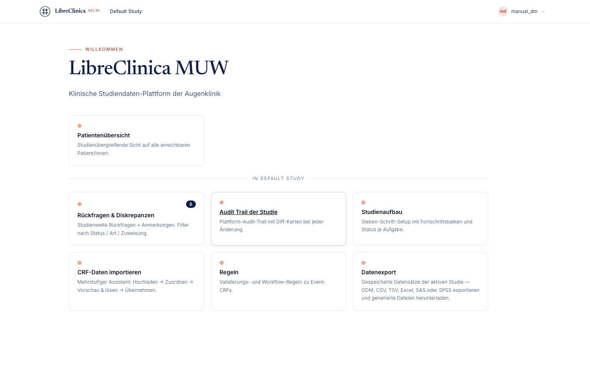

**Notes**

- The top bar shows the active study/site, your name with a colour-coded **role
  chip**, the language indicator, and **Log out**.
- The interface is German-first for clinical staff (e.g. *Modalitäten*,
  *Übernehmen*); some administrative screens remain English.

---

## 2. Subject Matrix

**Goal:** review enrolment and per-visit status across all subjects in the study.

**Steps**

1. Open **Subject Matrix** from the side navigation.
2. Each row is a subject; columns show **Gender**, study **Eye** (OD/OS/OU),
   **Group**, **Enrolled** date, one cell per visit, and a **signed** indicator.
3. Filter with the search box or the status chips (*all*, *today*, *ready to
   sign*, *open events*, *all complete*, *signed*), or tick **only with queries**
   to find subjects carrying open discrepancies.
4. For studies with many visits, use the chevron buttons or **Jump to latest**
   to scroll the visit columns; the Subject column stays frozen on the left.
5. Open **Studien-Statistik** (study metrics) from the side rail for aggregate
   counts.

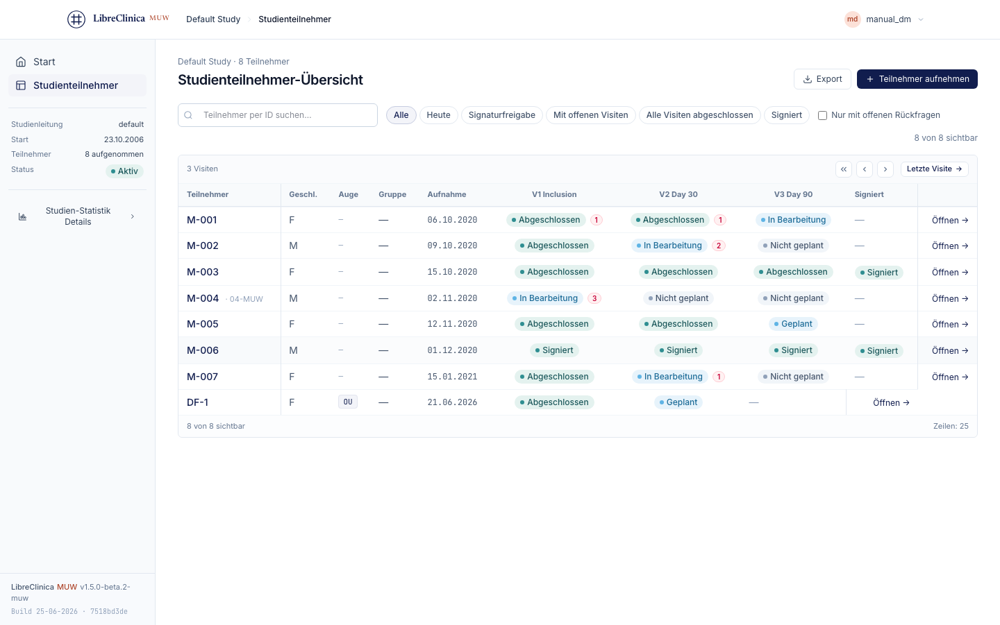

**Notes**

- A red badge on a visit cell is the count of **open queries** on that visit —
  your cue to follow up in Notes & Discrepancies.
- The subject link and **Öffnen** action point at the per-subject casebook, which
  is an **Investigator/Administrator** screen. As a Data Manager you use the matrix
  to *monitor* progress; you do not enter or sign data here.

---

## 3. Build Study

**Goal:** track and complete the tasks that make a study usable.

**Steps**

1. Open **Build Study**. The header shows a **progress** card (completed / total
   tasks and a percent bar) plus **Sites** and **enrolled subjects** counts.
2. Work down the numbered task list — **CRFs**, **Event Definitions**, **Group
   Classes**, **Rules** (and, for Administrators, Create Study / Sites / Users).
   Each card shows a status pill and a one-line summary with its current count.
3. Click **Next →** on a task to jump to the screen that completes it (e.g. CRFs →
   CRF Library, Event Definitions → Event Definitions view).
4. For the optional tasks (**Group Classes**, **Rules**, **Sites**) that legitimately
   have nothing to add, use **Als abgeschlossen markieren** (mark complete) to
   acknowledge the task so the tracker reflects reality.

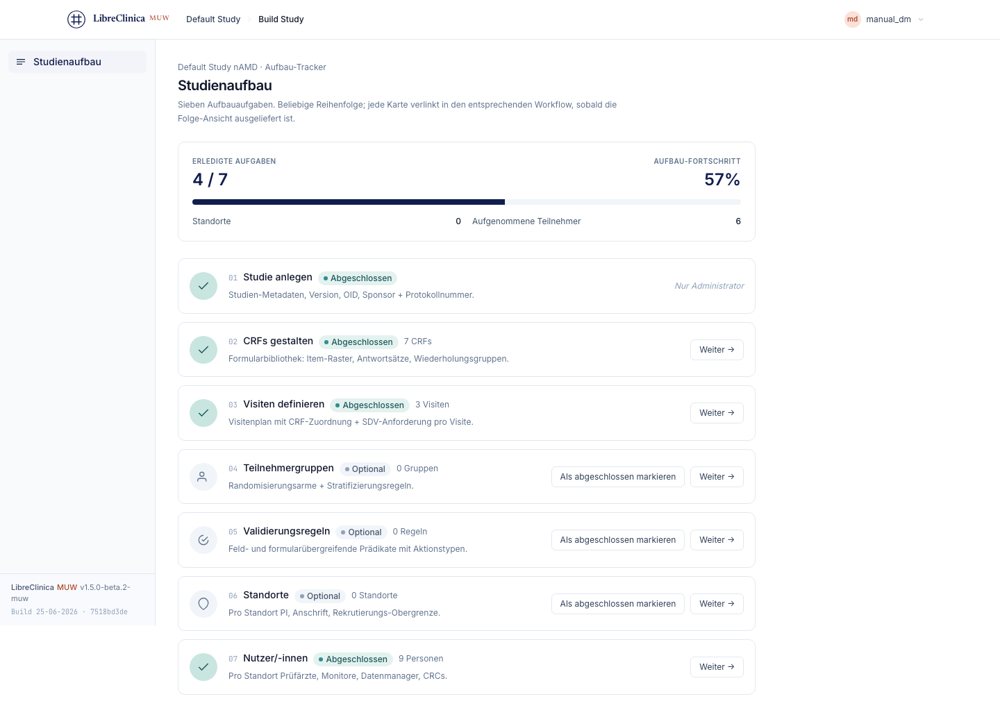

**Notes**

- The **Set Study Status** dropdown (Available / Pending / Locked / Frozen) and
  the **Edit study** / **Study parameters** / **Create study** buttons are
  **Administrator-only**. A locking/freezing transition prompts for a reason
  (captured in the audit trail).
- The "Create Study" task shows a view-only hint for non-Administrators; the rest
  of the tracker is yours.

---

## 4. Event Definitions

**Goal:** define the study's visits and what each visit collects.

**Steps**

1. Open **Event Definitions** (or **Next →** from the Build Study events task).
2. Click **Create** to add a visit: enter a **name**, choose a **type**
   (*scheduled* / *unscheduled* / *common*), optionally a **category** and
   **description**, and tick **repeating** if the visit can occur more than once.
3. Reorder visits with the **↑ / ↓** arrows; the order sets how visits appear to
   data-entry staff.
4. Use **Manage CRFs** (Bearbeiten/Edit on the row opens core fields) to attach
   CRFs to the visit. The CRF-assignment dialog is where the **SDV requirement**
   per CRF is set — the value Monitors later act on.
5. For OCT-imaging visits, the edit form exposes a **retinal-inference task** panel
   (*fluid*, *ga*, *onl*, *pr*, *layers*) — pick which automated jobs run when a
   scan is committed against that visit.
6. **Disable** removes a visit; toggle **show removed** to **restore** one.

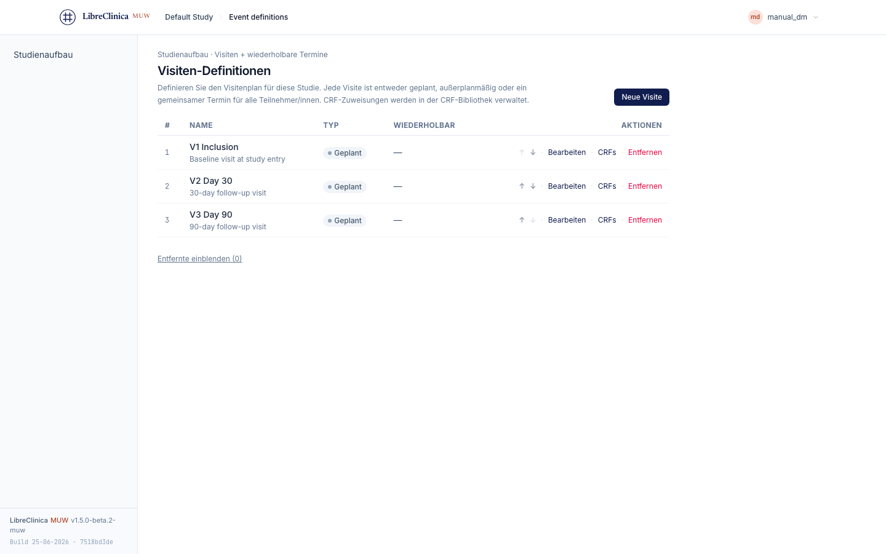

**Notes**

- Create, edit, reorder, disable, restore, and CRF assignment are available to
  Data Managers. **Lock / Unlock** of a visit definition is Administrator-only.
- Repeating + type semantics drive how the Subject Matrix and scheduling behave —
  set them deliberately.

---

## 5. CRF Library + CRF Builder

**Goal:** create case report forms and author their versions.

**Steps**

1. Open **CRF Library**. Each card is a CRF with its versions listed inline (name,
   OID, status).
2. Click **Neuen CRF anlegen** (create) to add a CRF shell — give it a **name** and
   optional **description**.
3. To author a form version, use **manuell anlegen** on the CRF card. This opens
   the **CRF Builder** canvas (`/crf-authoring-canvas/:crfOid`): a three-column
   drag-and-drop editor — item palette on the left, section canvas in the middle,
   per-item properties on the right. **Vorschau** (preview) renders the form as
   data-entry staff will see it; save writes a new version.
4. To start from an earlier version, use the chevron beside **manuell anlegen** and
   pick **fork from** that version — the canvas seeds with its sections and items.
5. Per version you can **Download** the Excel (.xls) round-trip, and **lock /
   unlock**, **disable / restore** the version.
6. Tick **entfernte anzeigen** (include removed) to see and restore disabled CRFs.

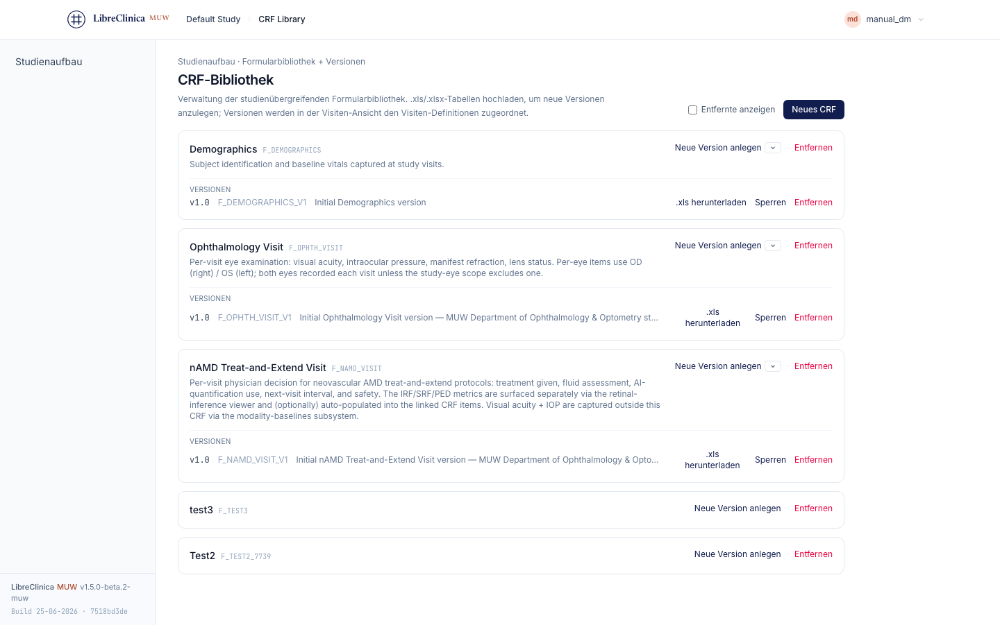

**Notes**

- The drag-and-drop **canvas** is the primary authoring surface; the legacy Excel
  upload still exists behind the scenes for sponsor-workbook round-trips but is no
  longer the front-line path.
- **Hard-remove** of a version (permanent) is **Administrator-only**; if a version
  is still referenced by event definitions or entered data, the SPA shows a blocker
  report instead of deleting.

---

## 6. Rules

**Goal:** attach validation and automation rules, and test them before they run.

**Steps**

1. Open **Rules**. The left list shows each rule target; selecting one opens its
   detail pane (target, event definition, CRF/version, attached rules, run log).
2. Click **Neue Regel** to author a rule with the 3-step wizard (rule body →
   target + scope → action), or **Regeln importieren** to upload a rule-definition
   XML.
3. In the detail pane, edit a rule or its action inline (e.g. discrepancy note,
   e-mail, show/hide), and set the **run schedule** (a daily batch time) via the
   schedule editor.
4. Use **Probelauf** (dry run) to preview which subjects/actions a rule would hit
   without persisting anything, and **als XML exportieren** to download the
   selected rules.
5. Use the **Test** panel to evaluate a raw expression against ad-hoc key/value
   test inputs — a quick sanity check that returns TRUE/FALSE or a parse error.

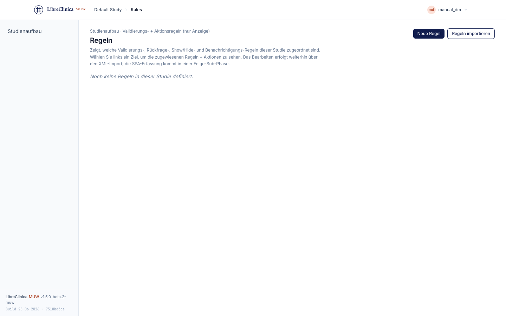

**Notes**

- Create / import / edit / disable / restore / schedule / dry-run / export are
  available to Data Managers and Administrators.
- Rules can file discrepancy notes automatically — those then show up in **Notes &
  Discrepancies** for follow-up.

---

## 7. Group Classes

**Goal:** group subjects for analysis (arms, cohorts, families).

**Steps**

1. Open **Group Classes**. Each row is a group class with its child groups shown
   as chips.
2. Click **Create** to add one: enter a **name**, pick a **type** (*Arm* / *Family*
   / *Demographic* / *Other*) and a **subject assignment** (*required* /
   *optional*).
3. Add child **groups** (e.g. the individual arms) in the rows beneath; add more
   with **Gruppe hinzufügen** and remove blank rows with **×**.
4. **Disable** removes a group class; **restore** brings it back.

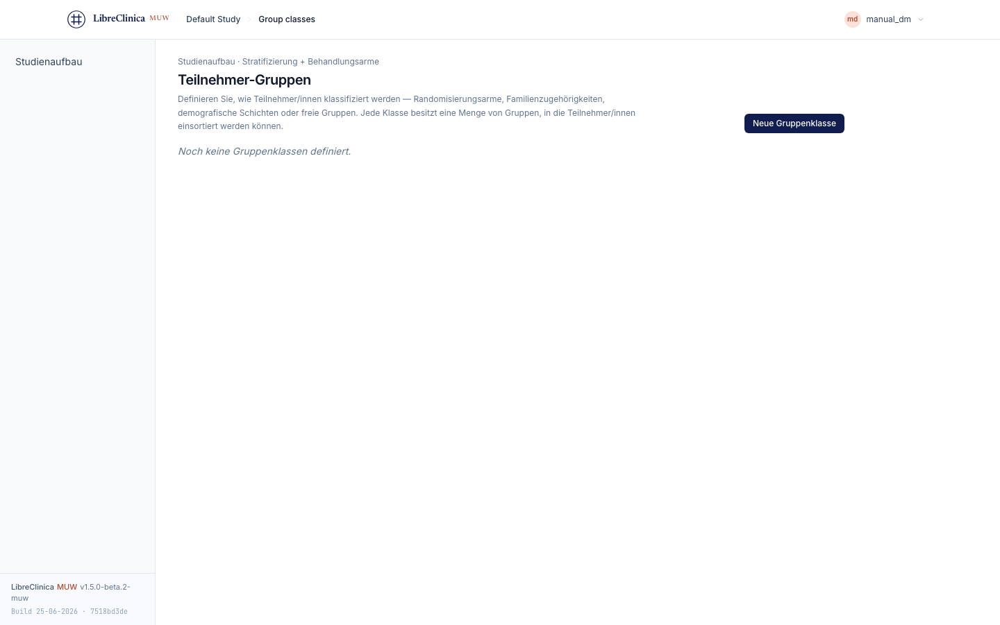

**Notes**

- When a **required** group class exists, enrolment must assign each subject to a
  group, and the Subject Matrix can be read by group.
- Create / disable / restore are available to Data Managers and Administrators.

---

## 8. Notes & Discrepancies

**Goal:** oversee and resolve data queries across the study.

**Steps**

1. Open **Notes & Discrepancies**. Summary cards count open notes by type:
   **query**, **failed validation**, **annotation**, and **reason for change**.
2. Filter by status (default **open only**), by type, by free text, or tick
   **assigned to me**.
3. Expand a row (chevron) to read the full thread; the **item** link deep-links to
   the CRF row, and the row shows the current value in context.
4. Act on a note with **Respond**, **Mark resolved**, or **Close** — each opens an
   inline composer for the required comment (Close may be wordless).
5. **Export CSV** writes the currently filtered list for offline review.

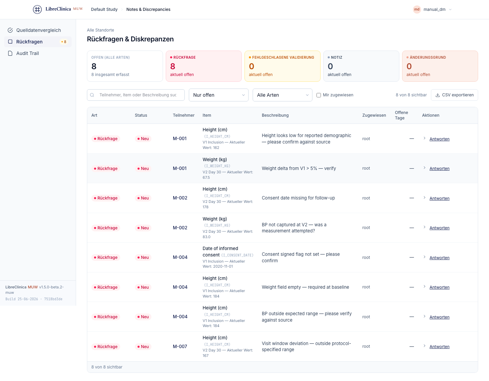

**Notes**

- Which actions you see depends on the note's status and your role; as a Data
  Manager you have broad close/resolve authority for oversight.
- Every response and status change is recorded in the audit trail.

---

## 9. Study Audit Log

**Goal:** review who changed what, when, and why.

**Steps**

1. Open **Study Audit Log**. Events are grouped by date (Today / Yesterday /
   DD.MM.YYYY) on a timeline.
2. Filter by **actor**, by **type** (signed, reason-for-change, SDV, admin, data,
   query, subject-group-change), or by **subject**.
3. Expand an event to see the **before / after** diff and any reason-for-change
   note.
4. **Export XLSX** writes the filtered view for a compliance file.

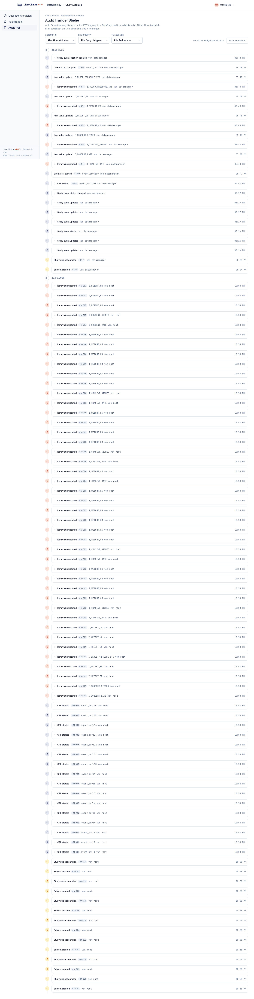

**Notes**

- Actor role chips are colour-coded (Investigator / Monitor / Data Manager) so you
  can scan who acted at a glance.
- The audit log is read-only — it is the system of record, not an editing surface.

---

## 10. Datasets / Data Export

**Goal:** extract the study's data in the format your analysis needs.

**Steps**

1. Open **Datasets** (Data Export). The table lists saved datasets with owner,
   created date, last run, and file count.
2. For a quick full export, use **Schnell-ODM** (Quick ODM) in the header — it
   generates an ODM file and downloads it.
3. For a saved dataset, **Export now** opens a format picker — **ODM**, **CSV**,
   **TSV**, **Excel**, **SAS**, or **SPSS** — and downloads the result.
4. **View files** expands a sub-row listing every generated file with size,
   timestamp, and a **download** link.
5. **Remove** soft-deletes a dataset; tick **show removed** to **restore** it.

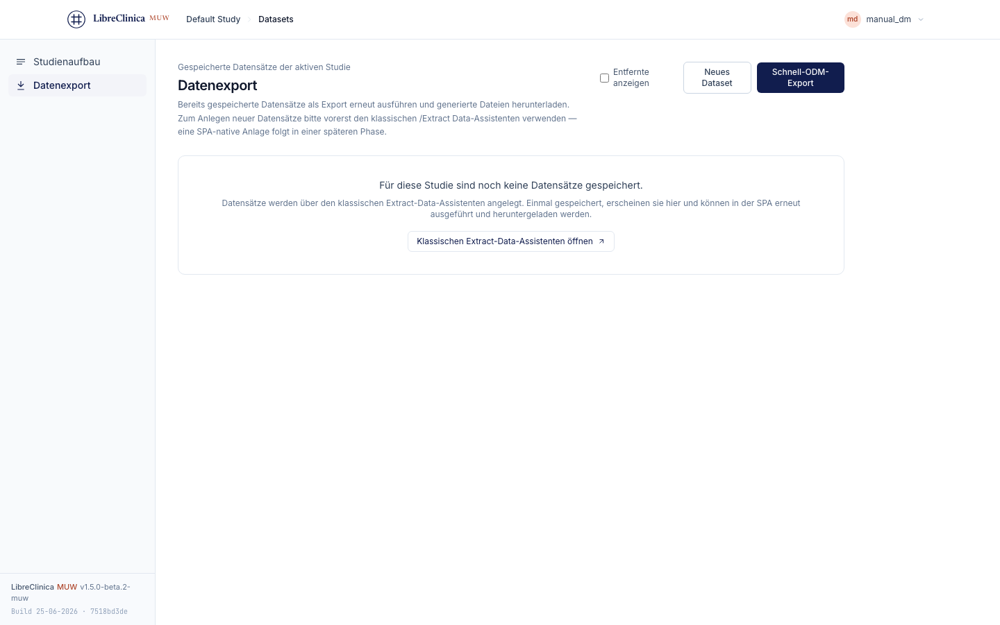

**Notes**

- Editing a dataset is blocked once it has been run (to preserve a reproducible
  extract); create a new one instead.
- Export is available to Data Managers, Monitors, and Administrators.

---

## 11. Create Dataset (wizard)

**Goal:** define exactly which events, CRFs, and items an export contains.

**Steps**

1. From **Datasets**, click **Neues Dataset** (new) to open the create wizard at
   `/datasets/new`.
2. Step through the wizard to name the dataset and choose its scope — the events,
   CRFs, and items to include, plus any date/status filters.
3. Save the dataset; it then appears in the Datasets table, where you run it in
   whichever format you need (see §10).

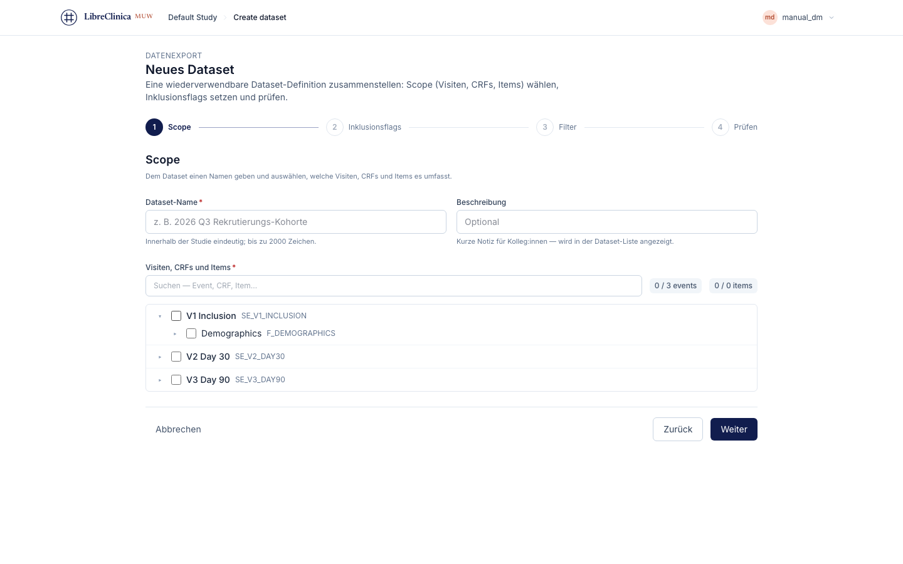

**Notes**

- A saved dataset is reusable — define the scope once, export it repeatedly as the
  study accrues data.
- Editing is only possible before the dataset's first run.

---

## 12. Import CRF Data

**Goal:** load data into the study from a CDISC ODM XML file.

**Steps**

1. Open **Import CRF Data**. The wizard has four steps: **Upload → Map → Preview →
   Commit**.
2. **Upload** the ODM `.xml` file (drag-and-drop or pick).
3. **Map** shows the detected counts — subjects, events, CRFs, and rows.
4. **Preview** classifies every row as **ready**, **overwrite**, **warning**, or
   **error**, with a before/after diff. Choose how to handle existing values
   (**replace** or **skip**); if you replace existing data, a **reason for change**
   is required.
5. You cannot commit while any row is in **error**. **Commit** writes the import
   and reports rows inserted / overwritten / skipped and discrepancy notes created.

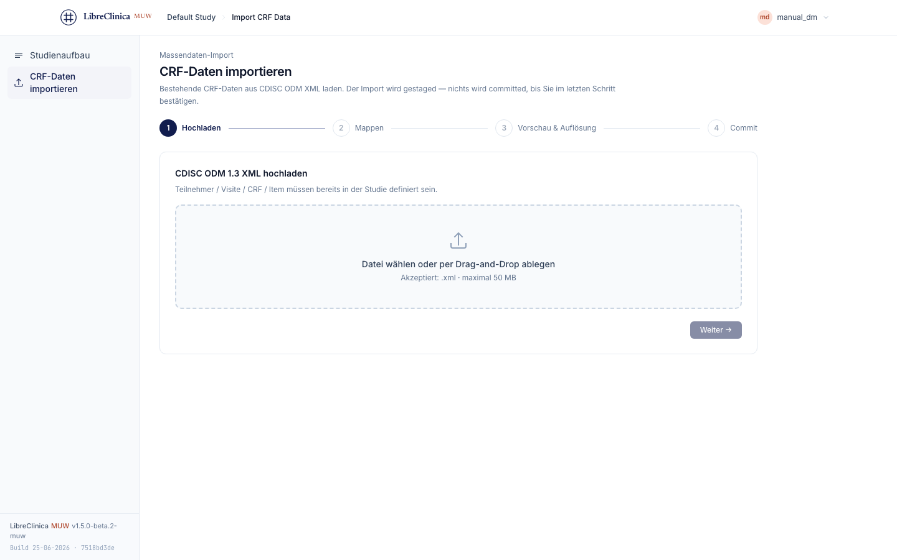

**Notes**

- Overwriting values via import is audited like any other change — the reason you
  enter is stored with each overwrite.
- The upload token can expire; if it does, the wizard asks you to re-upload and
  start over.

---

## 13. Double-Data-Entry (DDE) Reconciliation

**Goal:** reconcile a CRF that was entered twice, picking the canonical value per
item.

**Steps**

1. DDE reconciliation opens for a specific event CRF at
   `/event-crfs/:eventCrfOid/dde-reconcile`.
2. The screen lists each conflicting item side by side — the **initial** entry
   versus the **double** entry.
3. For each conflict, select the **winning** value (or type a manual value) and
   enter a **reason for change**.
4. **Apply** the resolution per row; the running **open count** drops and a
   confirmation appears when the CRF is fully reconciled.

**Notes**

- This screen is reachable by **Data Manager**, **Administrator**, and
  **Investigator**; the backend is the authoritative gate.
- Every resolution is captured in the audit trail with its reason — DDE is a
  data-quality control, so treat the reason field as part of the record.
