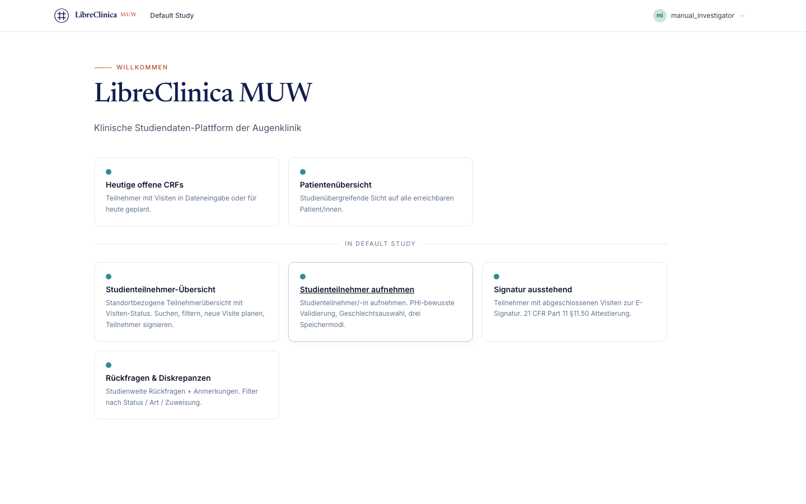
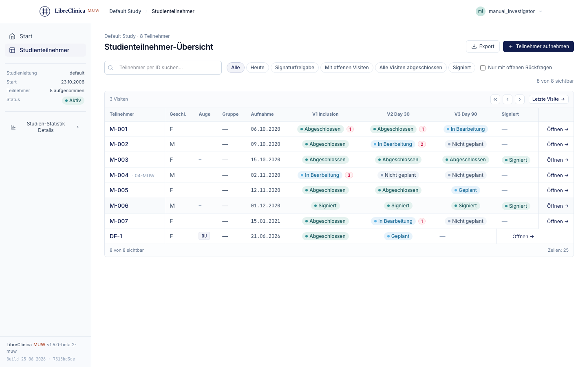
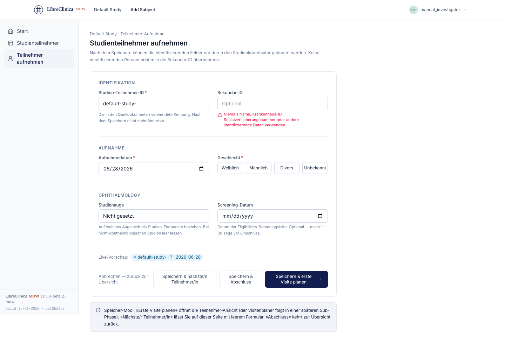
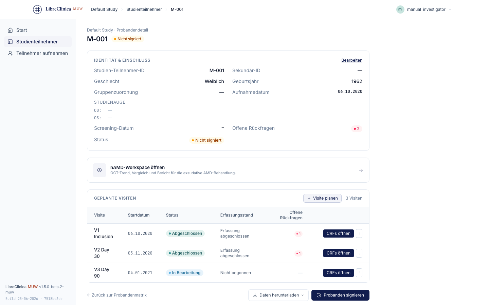

# Investigator

As an **Investigator** you are responsible for the clinical record of each study participant: you enrol subjects, schedule their visits, enter the eye-examination data on the case report forms (CRFs), review the automated retinal scan results, and finally sign the participant's casebook to confirm the record is complete and accurate.

This chapter follows the LibreClinicaMUW web application (the Vue single-page app reached under `…/LibreClinica/app/`). Screens are shown in German, the institutional default; English label equivalents are given in parentheses where helpful.

Ophthalmology shorthand used throughout: **OD** = right eye, **OS** = left eye, **OU** = both eyes. On forms that capture both eyes, the **OD (right-eye) column is on the LEFT** and the **OS (left-eye) column is on the RIGHT** — this mirrors the clinician's view when sitting face-to-face with the patient.

## Navigation

The left side-rail on every screen carries the core links:

- **Start** (Home) — `/`
- **Studienteilnehmer** (Subject Matrix) — `/subjects`
- **Teilnehmer aufnehmen** (Add Subject) — `/subjects/new`

A breadcrumb trail at the top of each page shows where you are, e.g. *Study › Studienteilnehmer › `<Subject-ID>` › `<Visit>`*. Click any crumb to step back. The active study and your role are shown in the page header; if you work in more than one study, switch the active study before you start entering data.

## 1. Home

**Goal:** get an overview of your study and jump into your daily work.

**Steps**

1. After signing in you land on the **Start** (Home) screen at `/`.
2. Use the operator cards to jump straight to filtered work lists — for example *Heute* (today's open visits) and *Signaturfreigabe* (subjects ready to sign) deep-link into the Subject Matrix with that filter pre-applied.
3. Use the side-rail to reach the Subject Matrix or the Add Subject form at any time.

## 2. Subject Matrix

**Goal:** find a participant and see, at a glance, the status of every visit.

**Steps**

1. Open **Studienteilnehmer** (`/subjects`).
2. Each row is one participant. The first columns show the **Subject-ID**, **Geschlecht** (gender), **Studienauge** (study eye — OD / OS / OU), **Group** and **Aufnahmedatum** (enrolment date). The remaining columns are one per scheduled visit, each showing a colour-coded status pill; a red badge on a visit cell counts open queries.
3. Search by ID in the *Teilnehmer per ID suchen…* box, or narrow the list with the filter chips (*Heute*, *Signaturfreigabe*, open-events, all-complete, *Signiert*). Tick *only with queries* to show participants with open discrepancies. *Export* downloads the matrix.
4. The Subject column (left) and the action column (right) stay frozen while the visit columns scroll. Use the chevron buttons or *Zur aktuellsten Visite* to slide along long visit timelines.
5. Click the **Subject-ID** link or **Öffnen** (Open) to open a participant's casebook.

**Notes**

- The matrix opens scrolled to the left so you see the participant identity columns first; scroll right (or use the navigation buttons) to reach the most recent visits.
- A green **Signiert** (Signed) pill in the last column means the casebook has already been electronically signed.

## 3. Add Subject (enrolment)

**Goal:** enrol a new study participant.

**Steps**

1. Open **Teilnehmer aufnehmen** (`/subjects/new`), from the side-rail or the **Teilnehmer aufnehmen** button on the Subject Matrix.
2. Fill in the **Identifikation** section: **Studien-Teilnehmer-ID** (required; may be pre-filled with the study's protocol short-code, e.g. `GA-…`, which you can edit) and the optional **Sekundär-ID**. *Never put identifying data — no name, no hospital ID, no social-security number — in the Secondary ID.*
3. Fill in the **Aufnahme** (enrolment) section: **Aufnahmedatum** (enrolment date; defaults to today, cannot be in the future) and **Geschlecht** (gender — pick one of the four buttons).
4. In the **Ophthalmology** section, optionally set the **Studienauge** (study eye — *nicht gesetzt* / OD / OS / OU) and a **Screening-Datum**. The study eye drives the eye column in the matrix and how the eye-examination CRFs render.
5. Save with one of the three buttons:
   - **Speichern & nächste/n Teilnehmer/in** (Save and Add Next) — saves and clears the form for the next enrolment.
   - **Speichern & Abschluss** (Save and Finish) — saves and returns to the Subject Matrix.
   - **Speichern & erste Visite planen** (Save and Schedule First Visit) — saves and opens the new participant's casebook so you can schedule a visit straight away.

**Notes**

- The Subject-ID is checked for availability as you type; an "already taken" message appears inline before you submit.
- If the server rejects the entry (e.g. a duplicate ID at this site), the specific field is flagged in red — correct it and save again.

## 4. Subject casebook (events, CRFs, retinal trends)

**Goal:** work with one participant — review and edit their identity, schedule visits, open CRFs, and review retinal results.

**Steps**

1. From the Subject Matrix, open a participant (`/subjects/:id`).
2. The header shows the Subject-ID and status pills (**Signiert** / *Nicht signiert* / *Gesperrt*).
3. The **identity / enrolment card** lists the demographics and the per-eye study assignment (OD and OS rows). Click **Bearbeiten** (Edit) to amend Secondary ID, gender, year of birth or study eye; the Subject-ID and enrolment date stay read-only.
4. The **Geplante Visiten / Events** panel (anchored at `#events`) lists every scheduled visit with its date, status, data-entry stage and open-query count.
5. To open a visit, click **CRFs öffnen** (Open) on its row. The **⋮** overflow menu offers *Bearbeiten* (edit the visit's date/location/status), *Stornieren* (cancel) and per-visit *signieren* (sign) where your role and the visit's status allow.
6. If the participant has automated scan results, a **Retinal-Verlauf** (retinal trends) section appears below the visits (see §8).

**Notes**

- Editing a previously **completed** visit requires an explicit *Bearbeiten* confirmation first — completed visits are read-only by default.
- Eye-transition banners appear here when a participant's eye has been moved to or from another study; *In andere Studie verlagern* (Transition) on an eye row starts that workflow.

### 4a. Schedule / open an event

**Goal:** add a study visit so data entry can begin.

**Steps**

1. On the subject casebook, click **Visite planen** (Schedule Event) in the events panel header (visible to Investigator and other writer roles).
2. Pick the event definition, location and start date, then confirm. The new visit appears in the events table.
3. Click **CRFs öffnen** on the visit row to open the event detail page (`/events/:id`), which lists every CRF in that visit with its version, status, whether it is required (`*`), and an action.
4. For a CRF that has not been started, click **Datenerfassung starten** (Start Data Entry); for one already in progress, click **CRF öffnen** (Open CRF).

**Notes**

- A visit must be scheduled before you can enter any CRF data for it.
- Once data entry on every required CRF is finished, use **Visite abschließen** (Mark Visit Complete) on the event page to move the whole visit to *Abgeschlossen* — this is now an explicit step you control, not an automatic cascade.

### 4b. Enter CRF data

**Goal:** record the eye-examination findings on a case report form.

**Steps**

1. Open a CRF from the event detail page (`/event-crfs/:eventCrfOid`).
2. Use the section rail on the left to move between sections; each item shows a red asterisk when it is required.
3. For **bilateral items**, the row has three columns — the **OD / Rechtes Auge** field on the **left** and the **OS / Linkes Auge** field on the **right**, with the item label in the middle. Single-eye and both-eyes (OU) items render in their own layout. Enter each eye's value in its column.
4. Click **Entwurf speichern** (Save Draft) to save your work and continue later.
5. When the form is finished and required fields are filled, click **CRF als abgeschlossen markieren** (Mark CRF Complete).

**Notes**

- **Save vs. Mark complete:** *Entwurf speichern* persists what you have entered but keeps the CRF editable; *CRF als abgeschlossen markieren* validates the form and moves it to the completed state.
- A completed CRF is **read-only**. To change a value, click **CRF erneut öffnen** (Reopen) — this re-enables editing of signed-off data and is a regulated action, so it asks for confirmation first.
- A CRF on a signed or locked subject cannot be edited.
- **Drucken** (Print) produces a print-friendly version of the form.

### 4c. Sign the casebook

**Goal:** apply your electronic signature to a participant's complete record.

**Steps**

1. Open the participant and go to **Teilnehmer … signieren** (Sign Subject) at `/subjects/:id/sign`.
2. The **Pre-Flight-Prüfungen** (pre-flight checks) panel lists conditions that must hold before signing; any blocking failure keeps the submit button disabled.
3. Review the **Casebook des Teilnehmers — zu bestätigen** (casebook to confirm) table, which lists every visit, its status and open-query count. *PDF-Vorschau* opens the casebook as a PDF.
4. Read the attestation statement, tick the acknowledgement, enter your **password**, and click **Teilnehmer `<ID>` signieren** (Sign Subject).

**Notes**

- Your electronic signature is the legally binding equivalent of your handwritten signature: it confirms that the case report forms are a full, accurate and complete record of the observations recorded.
- You must re-enter your password for each subject you sign.
- If data on a signed subject is later changed, the affected visit drops back from *Signiert* to *Completed* and must be signed again.

## 5. Review retinal scan metrics

**Goal:** review the results of the automated OCT inference pipeline (fluid volumes, GA area, retinal thickness) for one scan.

**Steps**

1. Open a retinal job — from the **Retinal-Verlauf** section of a participant (§8) or directly at `/retinal-jobs/:id` (or the per-subject deep link `/subjects/:label/jobs/:seq`).
2. The header (**Netzhaut-Auswertung** / Retinal evaluation) shows the **laterality** (OD / OS), the analysis task, the job status, the model version, the run time and a **Konfidenz** (confidence) bar.
3. Read the KPI tiles. For a fluid analysis these are **IRF**, **SRF**, **PED** and **Gesamt** (total) fluid volumes in mm³; a GA analysis shows the **GA-Fläche** (GA area); thickness tasks show **ONL** / **PR** thickness.
4. The **fundus (en-face) overlay** shows the ETDRS rings (central 1 / 3 / 6 mm) over the scan; the accompanying table breaks the metric down per ring. Hovering a B-scan in the per-B-scan trace highlights the matching line on the fundus image.
5. The **B-scan viewer** lets you scrub through the individual OCT slices with the segmentation overlay.

**Notes**

- Results come from an automated inference pipeline — treat them as a reading aid, not a substitute for clinical review.
- While a job is still running you will see a live status indicator and in-flight messages (queued / preprocessing / segmenting); the view refreshes itself as each stage completes.
- **Erneut versuchen** (Retry) re-dispatches a failed job; **Anderen Task ausführen** (Re-run with a different task) re-analyses the same scan under another task (e.g. fluid, GA, ONL, PR, layers).

## 6. Retinal trends on the casebook

**Goal:** track a participant's biomarkers across visits.

**Steps**

1. On the subject casebook, scroll to the **Retinal-Verlauf** (retinal trends) section — it appears only when the participant has at least one retinal job.
2. Pick a task with the **Aufgabe** (task) selector — *Flüssigkeit (IRF / SRF / PED)*, *GA-Fläche*, *ONL-Dicke* or *PR-Dicke* — to drive the trend chart.
3. Below the chart, the **history table** lists every scan job with its acquisition date, task, eye, status and primary metric. Click a column header to sort; click the view link on a row to open that job's full metrics (§5).
