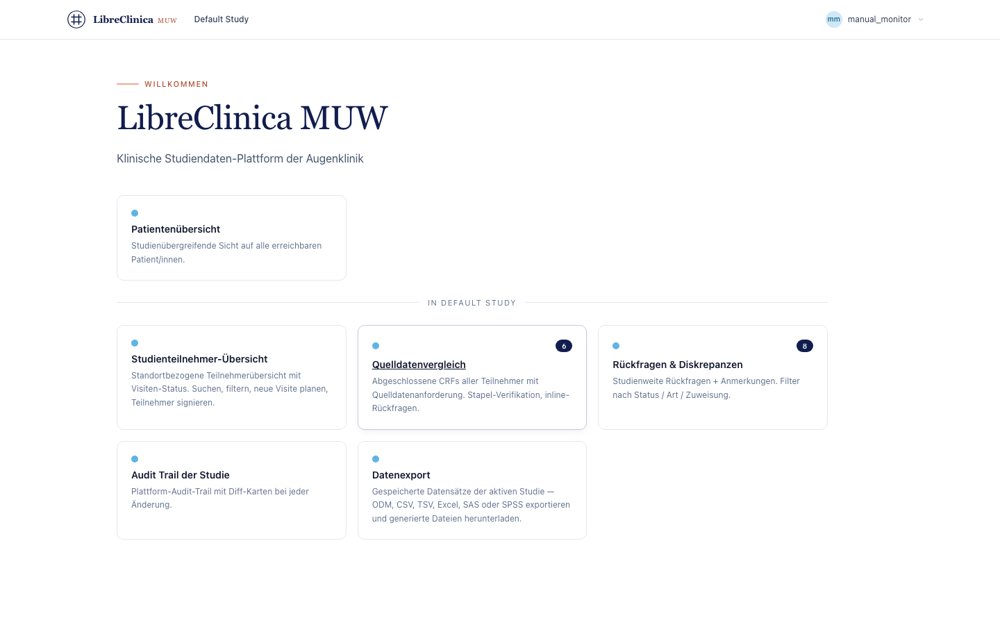
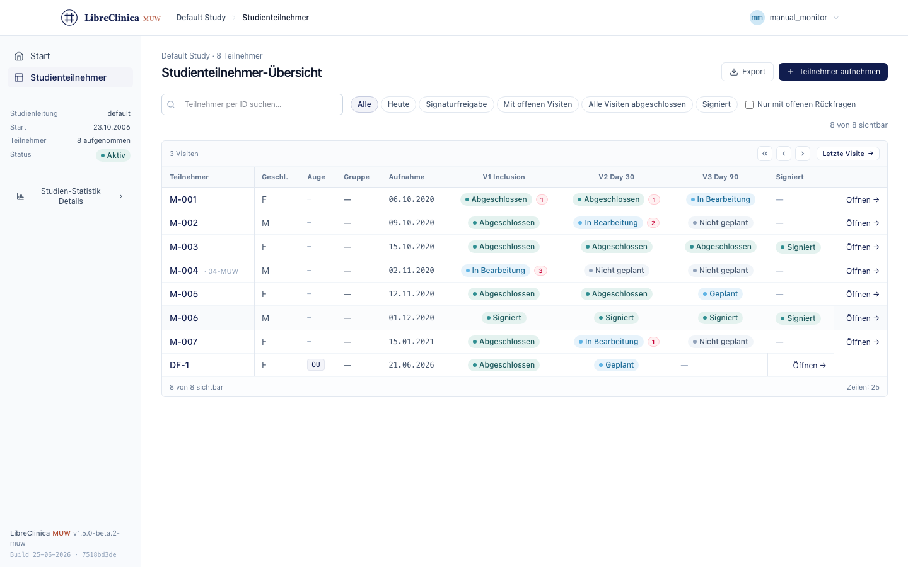
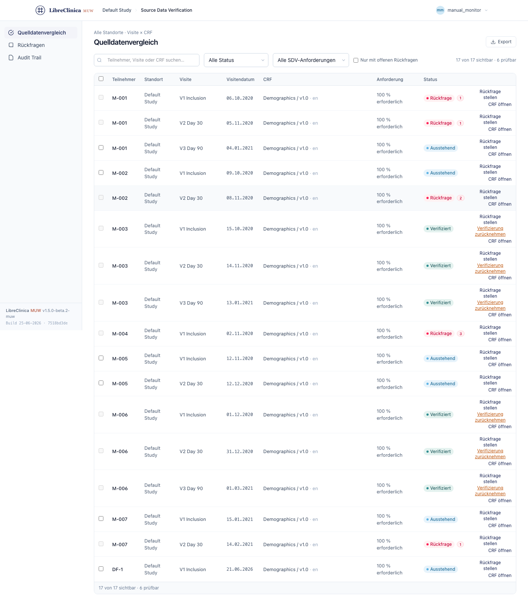
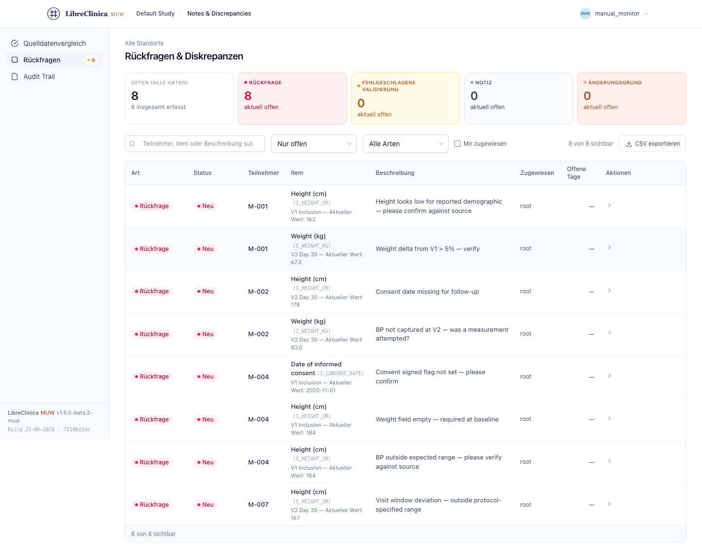
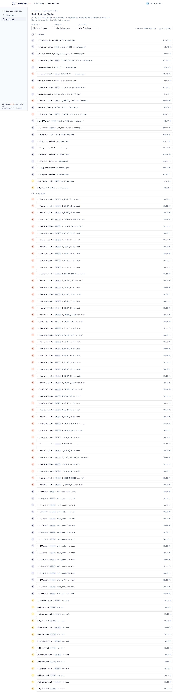
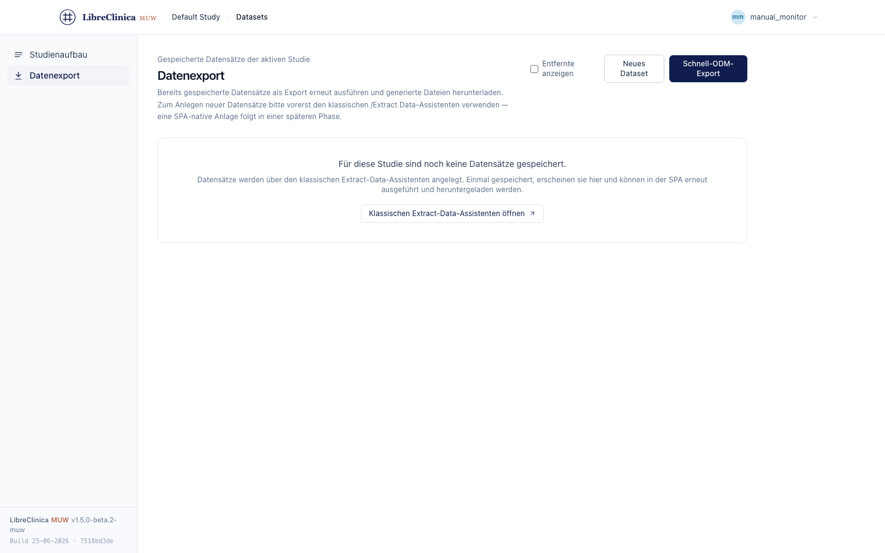

# Monitor

The **Monitor** is the study's read-only oversight role. A Monitor reviews data
that other roles have entered, verifies it against the source documents (Source
Data Verification, *Quelldatenvergleich*), raises and closes discrepancy notes
(queries / *Rückfragen*), and consults the immutable study audit trail. A
Monitor **cannot enter or change clinical data** — every CRF a Monitor opens is
read-only, and the data-entry actions (Add Subject, Schedule Event, Mark CRF
Complete, Sign) are not offered.

Two powers are the Monitor's alone in the day-to-day flow:

- **Source Data Verification** — marking CRFs as verified (SDV) and taking that
  mark back when the underlying data changes.
- **Closing a discrepancy** — only a Monitor (or a Data Manager / Administrator
  override) can move a query to its final *Geschlossen* (Closed) state.

## Navigation

The Monitor's side navigation is built around oversight, not data entry. From
the home dashboard and the side rail you can reach:

- **Quelldatenvergleich** (Source Data Verification) — `/sdv` — the Monitor's
  primary surface.
- **Rückfragen & Diskrepanzen** (Notes & Discrepancies) — `/notes` — raise,
  answer, and close queries.
- **Audit Trail** (Study Audit Log) — `/audit-log` — the immutable change
  history.
- **Studienteilnehmer** (Subject Matrix) — `/subjects` — a read-only lookup tool
  to navigate into a subject's visits and CRFs.
- **Datenexport** (Datasets / Data Export) — `/datasets` and `/export` — run and
  download saved data exports.

The active study/site, the subject-ID search box, your name with the Monitor
role chip, and **Log out** sit in the top bar on every page. Where a control is
labelled in German the English meaning is given in brackets the first time it
appears.

---

## 1. Home dashboard

**Goal:** see what needs your attention and jump into your most common Monitor
tasks.

**Steps**

1. After signing in (and picking a study, if your account is attached to more
   than one) you land on the **home dashboard**.
2. Read the attention summary — for example notes and discrepancies assigned to
   you and the count of CRFs still awaiting verification.
3. Use the side navigation or the dashboard's quick links to open
   **Quelldatenvergleich**, **Rückfragen & Diskrepanzen**, or the **Audit
   Trail**.

**Notes**

- You can return here at any time with **Start** (Home) in the side navigation.
- The dashboard is read-only; it links into the working screens rather than
  letting you act on data directly.

---

## 2. Subject Matrix

**Goal:** find a subject and open their visits and CRFs for visual review.

**Steps**

1. Open **Studienteilnehmer** (Subject Matrix) from the side navigation.
2. Use the search box (*Teilnehmer per ID suchen…*) or the filter chips —
   **Alle** (All), **Mit offenen Visiten** (With open visits), **Alle Visiten
   abgeschlossen** (All visits complete), **Signiert** (Signed), and the
   **Nur mit offenen Rückfragen** (Only with open queries) checkbox — to narrow
   the list.
3. Each row shows the subject ID, gender, study eye, group, enrolment date, and
   a status pill per visit. A small red badge next to a visit pill counts the
   open queries on it.
4. Click the subject ID, or **Öffnen** (Open) on the right, to drill into the
   subject detail and from there into individual visits and CRFs.

**Notes**

- For the Monitor this screen is a **read-only lookup tool** — there is no
  pencil / data-entry icon and no *Teilnehmer aufnehmen* (Add Subject) action
  that creates records.
- The visit columns scroll horizontally inside the table; use the chevron
  buttons or **Letzte Visite** (Jump to latest) to slide through long visit
  timelines while the Subject and action columns stay frozen.

---

## 3. Source Data Verification (SDV)

**Goal:** confirm that the data entered in the app matches the source documents,
then mark each verified CRF as **SDV'd** (*Verifiziert*). This is the core
Monitor workflow.

**Steps**

1. Open **Quelldatenvergleich** (Source Data Verification) from the side
   navigation (`/sdv`). The table lists every CRF that is ready for
   verification, one row per CRF, with its subject, site, visit, visit date,
   CRF name, **Anforderung** (SDV requirement), and **Status**.
2. Narrow the list using the controls in the filter row:
   - the search box (*Teilnehmer, Visite oder CRF suchen…*),
   - the **status** dropdown — **Alle Status** (All), **Ausstehend** (Pending,
     i.e. not yet verified), **Rückfrage** (has an open query), **Verifiziert**
     (Verified), **Gesperrt** (Locked),
   - the **requirement** dropdown — **Alle SDV-Anforderungen**, **100 %
     erforderlich** (100% required), **Teilweise erforderlich** (partially
     required), **Nicht erforderlich** (not required),
   - and the **Nur mit offenen Rückfragen** (Only with open queries) checkbox.
   Use **Zurücksetzen** (Clear) to drop all filters.
3. Open a CRF to compare it against the source: click **CRF öffnen** (Open CRF)
   on the row. The CRF opens **read-only** — inputs are shown but cannot be
   saved (see §3.1).
4. When a CRF matches the source, mark it verified:
   - **One CRF at a time** — tick the row's checkbox, then use the bulk action
     bar that appears.
   - **Several at once** — tick each row (or the header checkbox to select all
     verifiable rows in view), then click **… als verifiziert markieren (SDV)**
     (Mark *N* as verified). A confirmation dialog shows the count before the
     change is committed.
5. Confirm in the **Als verifiziert markieren?** (Mark as verified?) dialog. The
   action is recorded in the audit trail with your username and a timestamp.

**Notes**

- **Only CRFs that are *Ausstehend* (Pending) can be selected** for
  verification; the checkbox is disabled on rows that are already verified,
  locked, or carry an open query.
- **The SDV requirement is display-only here.** Whether a CRF needs no, partial,
  or 100% verification is set by the Data Manager during study build; the
  Monitor only sees the resulting label.
- **Verification can be taken back.** On a row that is already **Verifiziert**,
  use **Verifizierung zurücknehmen** (Un-verify). You must supply a
  **Begründung** (reason); the un-verify is documented in the audit trail and
  the CRF returns to the pending queue.
- **Automatic revert:** if data on a verified CRF is later changed, its SDV
  status flips back to **Ausstehend** by itself — the CRF must be verified
  again. The confirmation dialog repeats this warning.
- The bulk **Als verifiziert markieren** action is deliberately gated behind an
  explicit confirmation that names the count — review your selection before
  confirming so you do not verify CRFs you have not yet checked.

### 3.1 Read-only CRF review

While verifying, you open each CRF read-only at
`/event-crfs/:eventCrfOid/readonly` (reached from **CRF öffnen** on an SDV row,
or from a discrepancy's item link). The CRF renders exactly as it does for data
entry — header info, section tabs, and items — but there is **no Save action**;
the form cannot persist changes. This is the screen on which you compare each
item against the source document and, where you find a mismatch, raise a query
(§4).

---

## 4. Notes & Discrepancies (queries)

**Goal:** raise a query when the entered data does not match the source, follow
the back-and-forth with the data-entry user, and close the query once it is
resolved. The Monitor is the only role (besides a Data Manager / Administrator
override) that can **close** a discrepancy.

**Steps**

1. Open **Rückfragen & Diskrepanzen** (Notes & Discrepancies) from the side
   navigation (`/notes`). The summary cards at the top count open items by type:
   **Rückfrage** (Query), **Fehlgeschlagene Validierung** (Failed Validation
   Check), **Notiz** (Annotation), and **Änderungsgrund** (Reason for Change).
2. Filter the list with the search box, the **status** dropdown (**Nur offen** /
   Open only by default, plus **Neu**, **Aktualisiert**, **Lösung
   vorgeschlagen**, **Geschlossen**, **Nicht zutreffend**), the **type**
   dropdown, and the **Mir zugewiesen** (Assigned to me) checkbox.
3. **Raise a query.** During SDV review, open the CRF read-only and use
   **Rückfrage stellen** (Add query) on the relevant item (also available from
   the SDV row). In the **Anmerkung hinzufügen** (Add note) dialog the type is
   fixed to **Rückfrage** (Query) for a Monitor; enter a **Beschreibung**
   (Description) of what is wrong, then **Rückfrage absenden** (Submit query).
4. **Follow the thread.** Click the chevron on any row to expand its history.
   The data-entry user (Investigator / CRC) responds — **Antworten** (Respond)
   — and proposes a resolution — **Als gelöst markieren** (Mark resolved),
   which moves the query to **Lösung vorgeschlagen** (Resolution proposed).
5. **Close the query.** Once you have re-checked the CRF and the value is
   correct, click **Schließen** (Close) on a *Lösung vorgeschlagen* row. A
   closing comment is optional. The query moves to **Geschlossen** (Closed) —
   its final state.

**Notes**

- **Discrepancy lifecycle (Monitor's view):** **Neu** (New) → **Aktualisiert**
  (Updated, the user has answered) → **Lösung vorgeschlagen** (Resolution
  proposed) → **Geschlossen** (Closed). A note is never deleted — only its
  status changes.
- **Who does what:** the Monitor *raises* and *closes*; the **Antworten** and
  **Als gelöst markieren** buttons are shown to the Investigator / CRC, not to
  the Monitor. The **Schließen** (Close) button appears only on rows that are at
  **Lösung vorgeschlagen**.
- **Type is fixed for the Monitor.** A Monitor creates **Rückfrage** (Query)
  notes; the **Änderungsgrund** (Reason for Change) type is reserved for Data
  Managers and Administrators, and **Notiz** / **Fehlgeschlagene Validierung**
  arise from data entry and validation, not from the Monitor.
- A Monitor sees **all** discrepancies in the study, not only their own — use
  **Mir zugewiesen** (Assigned to me) to focus on the ones routed to you.
- Use **CSV exportieren** (Export CSV) to download the current, filtered list.

---

## 5. Study Audit Log

**Goal:** review the complete, immutable history of changes — for ongoing
oversight and for inspector-readiness during sponsor audits.

**Steps**

1. Open **Audit Trail** (Study Audit Log) from the side navigation
   (`/audit-log`).
2. Entries appear on a timeline grouped by date (**Heute** / Today, **Gestern** /
   Yesterday, then explicit dates). Each row names the action, the subject, the
   scope, the actor and their role, and the time.
3. Narrow the view with the filter row: **Akteur/-in** (Actor), **Ereignistyp**
   (Event type — **Signatur**, **Änderungsgrund**, **SDV**, **Administration**,
   **Datenerfassung**, **Rückfrage**, **Gruppenwechsel**), and **Teilnehmer**
   (Subject). Use **Zurücksetzen** (Clear) to reset.
4. Click a row that has a chevron to expand it and reveal the old value / new
   value side by side, plus any reason note.

**Notes**

- The audit trail is **read-only and immutable** — filters only narrow the view;
  nothing is ever hidden or removed.
- The audit log is available to the Monitor, Data Manager, and Administrator
  roles; Investigators do not see it.
- Use **XLSX exportieren** (Export XLSX) to download the filtered view for
  off-line review or to hand to a sponsor.

---

## 6. Datasets / Data Export

**Goal:** run a saved data export for the active study and download the
generated files.

**Steps**

1. Open **Datenexport** (Data Export) from the side navigation (`/datasets` or
   `/export`). The table lists the datasets already saved for the active study,
   with owner, creation date, last run, and file count.
2. For a quick, full-study export, use **Schnell-ODM-Export** (Quick ODM export)
   — the file downloads when it is ready.
3. To run a saved dataset, click **Jetzt exportieren** (Export now), pick a
   format in the dialog — **ODM (CDISC XML)**, **CSV**, **TSV**, **Excel**,
   **SAS**, or **SPSS** — and start the export. The download opens in a new tab.
4. Click **Dateien anzeigen** (View files) on a row to expand its generated
   files and download an earlier run with **Herunterladen** (Download).

**Notes**

- A Monitor can run and download exports, including datasets created by other
  users in the study (cross-user visibility is intentional for monitoring).
- New datasets are defined through the classic **Extract Data** wizard; once
  saved they appear in this list and can be re-run and downloaded from the SPA.
- If no datasets exist yet for the study, the screen links out to the classic
  **Extract-Data-Assistenten** (Extract Data wizard) to create one.
